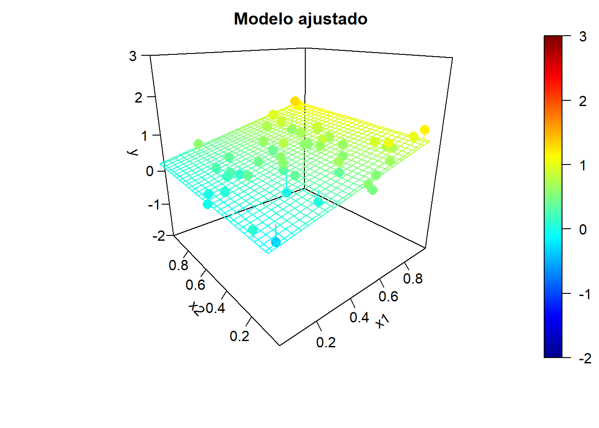

# Métodos clásicos de estadística {#clasicos} 

<!-- Capítulo \@ref(clasicos) -->

```{r global-options, include=FALSE}
source("_global_options.R")
```

<!-- 
---
title: "Métodos clásicos de estadística"
author: "Aprendizaje Estadístico (UDC)"
date: "Máster en Técnicas Estadísticas"
bibliography: "aprendizaje.bib"
link-citations: yes
output: 
  bookdown::html_document2:
    pandoc_args: ["--number-offset", "1,0"]
    toc: yes
    toc_depth: 3
    toc_float:
      collapsed: no
      smooth_scroll: no 
header-includes:
- \setcounter{section}{1}          
---

bookdown::preview_chapter("06-modelos_lineales.Rmd")
knitr::purl("02-clasicos.Rmd", documentation = 2)
knitr::spin("02-clasicos.R",knit = FALSE)

Pendiente:
- Añadir gráficos matriciales GGally: https://ggobi.github.io/ggally/articles/ggpairs.html
- Añadir/imitar gráficos caret::featurePlot https://daviddalpiaz.github.io/r4sl/generative-models.html

-->

En este capítulo se revisará el método clásico de regresión lineal múltiple (Sección \@ref(rlm)), y también el de regresión lineal generalizada (Sección \@ref(reg-glm)).
En este último caso, además de tratarlo de forma más superficial, nos centraremos únicamente en regresión logística, un método tradicional de clasificación.
Estos modelos clásicos de inferencia estadística se emplean habitualmente en aprendizaje estadístico (AE); aunque pueden ser demasiado simples en muchos casos, pueden resultar muy útiles en otros, principalmente por su interpretabilidad.
Además, como veremos más adelante (en el Capítulo \@ref(ext-glm) y siguientes), sirven como punto de partida para procedimientos más avanzados.

Se supondrá que se dispone de unos conocimientos básicos de los métodos clásicos de regresión lineal y regresión lineal generalizada, por lo que solo se repasará someramente su procedimiento tradicional. Además, trataremos estos métodos desde el punto de vista de AE (como se describe en el Capítulo \@ref(intro-AE)), es decir, con el objetivo de predecir en lugar de realizar inferencias y, preferiblemente, empleando un procedimiento automático y capaz de manejar grandes volúmenes de datos.
Para un tratamiento más completo, incluyendo detalles teóricos que no van a ser tratados aquí, se puede consultar @faraway2014linear, que incluye su aplicación en la práctica con R^[También el [Capítulo 8](https://rubenfcasal.github.io/intror/modelos-lineales.html) de @fernandez2022intror.].

Nos interesa especialmente el problema de colinealidad (Sección \@ref(colinealidad)) y los métodos tradicionales de selección de variables (Sección \@ref(seleccion-rlm)). 
Estas cuestiones pueden resultar de interés en muchos otros métodos, especialmente cuando el número de predictores es grande.
También se mostrará cómo realizar la selección del modelo mediante remuestreo (Sección \@ref(selec-ae-rlm)).

En la última sección de este capítulo (Sección \@ref(generadores)) se tratarán, también muy por encima, otros métodos tradicionales de clasificación: análisis discriminante (lineal y cuadrático, secciones \@ref(clas-lda) y \@ref(clas-qda)) y el clasificador Bayes naíf (Sección \@ref(bayes)).

<!-- Sección \@ref(rlm) -->

## Regresión lineal múltiple {#rlm}

En los modelos lineales se supone que la función de regresión es lineal^[Algunos predictores podrían corresponderse con interacciones, $X_i = X_j X_k$, o transformaciones (p.&nbsp;ej. $X_i = X_j^2$) de las variables explicativas originales. También se podría haber transformado la respuesta.]:
$$E( Y \vert \mathbf{X} ) = \beta_{0}+\beta_{1}X_{1}+\beta_{2}X_{2}+\ldots+\beta_{p}X_{p}$$
siendo $\left(  \beta_{0},\beta_{1},\ldots,\beta_{p}\right)^t$ un vector de parámetros (desconocidos).
Es decir, que el efecto de las variables explicativas sobre la respuesta es muy simple, proporcional a su valor, y por tanto la interpretación de este tipo de modelos es (en principio) muy fácil. 
El coeficiente $\beta_j$ representa el incremento medio de $Y$ al aumentar en una unidad el valor de $X_j$, manteniendo fijas el resto de las covariables.
En este contexto las variables predictoras se denominan habitualmente variables independientes, pero en la práctica es de esperar que no haya independencia entre ellas, por lo que puede no ser muy razonable pensar que al variar una de ellas el resto va a permanecer constante.

El ajuste de este tipo de modelos en la práctica se suele realizar empleando el método de mínimos cuadrados (ordinarios), asumiendo (implícita o explícitamente) que la distribución condicional de la respuesta es normal, lo que se conoce como el modelo de regresión lineal múltiple.
Concretamente, el método tradicional considera el siguiente modelo:
\begin{equation} 
  Y = \beta_{0}+\beta_{1}X_{1}+\beta_{2}X_{2}+\ldots+\beta_{p}X_{p} + \varepsilon,
  (\#eq:modelo-rlm)
\end{equation}
donde $\varepsilon$ es un error aleatorio normal, de media cero y varianza $\sigma^2$, independiente de las variables predictoras. Además, los errores de las distintas observaciones son independientes entre sí.

Por tanto las hipótesis estructurales del modelo son: linealidad (el efecto de los predictores es lineal), homocedasticidad (varianza constante del error), normalidad (y homogeneidad: ausencia de valores atípicos y/o influyentes) e independencia de los errores.
Estas son también las hipótesis del modelo de regresión lineal simple (con una única variable explicativa); en regresión múltiple tendríamos la hipótesis adicional de que ninguna de las variables explicativas es combinación lineal de las demás.
Esto está relacionado con el fenómeno de la colinealidad (o multicolinealidad), que se tratará en la Sección \@ref(colinealidad), y que es de especial interés en regresión múltiple (no solo en el caso lineal).
Además, se da por hecho que el número de observaciones disponible es como mínimo el número de parámetros del modelo, $n \geq p + 1$.

<!-- ### Ajuste: función `lm` -->

El procedimiento habitual para ajustar un modelo de regresión lineal a un conjunto de datos es emplear mínimos cuadrados (ordinarios; el método más eficiente bajo las hipótesis estructurales):

$$\mbox{min}_{\beta_{0},\beta_{1},\ldots,\beta_{p}}  \sum\limits_{i=1}^{n}\left(  y_{i} - \beta_0 - \beta_1 x_{1i} - \ldots - \beta_p x_{pi} \right)^{2} = \mbox{min}_{\beta_{0},\beta_{1},\ldots,\beta_{p}} \ RSS$$

denotando por RSS la suma de cuadrados residual (*residual sum of squares*), es decir, la suma de los residuos al cuadrado.

Para realizar este ajuste en R podemos emplear la función `r cite_fun(lm, stats)`:

```{r, eval=FALSE}
ajuste <- lm(formula, data, subset, weights, na.action, ...)
```

-   `formula`: fórmula que especifica el modelo.

-   `data`: data.frame (opcional) con las variables de la fórmula.

-   `subset`: vector (opcional) que especifica un subconjunto de observaciones.

-   `weights`: vector (opcional) de pesos (mínimos cuadrados ponderados, WLS).

-   `na.action`: opción para manejar los datos faltantes; por defecto `na.omit`.

Alternativamente, se puede emplear la función `biglm()` del paquete `r cite_cran(biglm)` para ajustar modelos lineales a grandes conjuntos de datos (especialmente cuando el número de observaciones es muy grande, incluyendo el caso de que los datos excedan la capacidad de memoria del equipo).
También se podría utilizar la función `rlm()` del paquete `r cite_cran(MASS)` para ajustar modelos lineales empleando un método robusto cuando hay datos atípicos.

<!-- 
Proxeccións demográficas de Galicia 2011-2030. Análise dos resultados. Documentos de Traballo. Análise Económica (IDEGA).  
-->

<!-- ### Ejemplo -->

Como ejemplo, consideraremos el conjunto de datos [`bodyfat`](https://rubenfcasal.github.io/mpae/reference/bodyfat.html) del paquete `r cite_github(mpae)`, que contiene observaciones de grasa corporal y mediciones corporales de una muestra de 246 hombres [@penrose1985generalized].

```{r }
library(mpae)
# data(bodyfat, package = "mpae")
as.data.frame(attr(bodyfat, "variable.labels"))
```

Consideraremos como respuesta la variable `bodyfat`, que mide la grasa corporal (en porcentaje) a partir de la densidad corporal, obtenida mediante un procedimiento costoso que requiere un pesaje subacuático. 
El objetivo es disponer de una forma más sencilla de estimar la grasa corporal a partir de medidas corporales.
En este caso todos los predictores son numéricos; para una introducción al tratamiento de variables predictoras categóricas ver, por ejemplo, la [Sección 8.5](https://rubenfcasal.github.io/intror/modelos-lineales.html#regresion-con-variables-categoricas) de @fernandez2022intror.

La regresión lineal es un método clásico de estadística y, por tanto, el procedimiento habitual es emplear toda la información disponible para construir el modelo y, posteriormente (asumiendo que es el verdadero), utilizar métodos de inferencia para evaluar su precisión.
Sin embargo, seguiremos el procedimiento habitual en AE y particionaremos los datos en una muestra de entrenamiento y en otra de test.

<!-- 
Pendiente: 
 Ejercicio repetir ejemplo con bodyfat.raw[-1]
 Emplear regresión robusta MASS::rlm() para evitar efecto de atípicos
 A mano y con caret
-->

```{r}
df <- bodyfat 
set.seed(1)
nobs <- nrow(df)
itrain <- sample(nobs, 0.8 * nobs)
train <- df[itrain, ]
test <- df[-itrain, ]
```

El primer paso antes del modelado suele ser realizar un análisis descriptivo. 
Por ejemplo, podemos generar un gráfico de dispersión matricial y calcular la matriz de correlaciones (lineales de Pearson).
Sin embargo, en muchos casos el número de variables es grande y en lugar de emplear gráficos de dispersión puede ser preferible representar gráficamente las correlaciones mediante un mapa de calor o algún gráfico similar.
En la Figura \@ref(fig:corrplot) se combinan elipses con colores para representar las correlaciones.

(ref:corrplot) Representación de las correlaciones lineales entre las variables del conjunto de datos `bodyfat`, generada con la función `corrplot::corrplot()`.

```{r corrplot, out.width="80%", fig.cap='(ref:corrplot)'}
# plot(train) # gráfico de dispersión matricial
mcor <- cor(train)
corrplot::corrplot(mcor, method = "ellipse")
print(mcor, digits = 3)
```

<!-- 
Pendiente: 
gráfico compacto de correlaciones
caret::featurePlot(x = train[-1], y = train[1])
https://plotly.com/ggplot2/splom/
https://www.statology.org/scatterplot-matrix-in-r/
https://daviddalpiaz.github.io/r4sl/generative-models.html
-->


Observamos que, aparentemente, hay una relación (lineal) entre la respuesta `bodyfat` y algunas de las variables explicativas (que en principio no parece razonable suponer que sean independientes).
Si consideramos un modelo de regresión lineal simple, el mejor ajuste se obtendría empleando `abdomen` como variable explicativa `r cite_fig(lm1)`, ya que es la variable más correlacionada con la respuesta (la proporción de variabilidad explicada en la muestra de entrenamiento por este modelo, el coeficiente de determinación $R^2$, sería $0.816^2 \approx 0.666$).

(ref:lm1) Gráfico de dispersión y recta de regresión ajustada para `bodyfat` en función de `abdomen`.

```{r lm1, fig.cap='(ref:lm1)'}
modelo <- lm(bodyfat ~ abdomen, data = train)
summary(modelo)
plot(bodyfat ~ abdomen, data = train)
abline(modelo)
```

El método `predict()` permite calcular predicciones (estimaciones de la media condicional), intervalos de confianza para la media e intervalos de predicción para nuevas observaciones (la ayuda de `r cite_fun(predict.lm)` proporciona todas las opciones disponibles). 
En la Figura \@ref(fig:lm2) se muestra su representación gráfica.

(ref:lm2) Ajuste lineal (predicciones) e intervalos de confianza y predicción (puntuales).

```{r lm2, fig.cap='(ref:lm2)'}
# Predicciones
valores <- seq(70, 130, len = 100)
newdata <- data.frame(abdomen = valores)
pred <- predict(modelo, newdata = newdata, interval = "confidence")
# Representación
plot(bodyfat ~ abdomen, data = train)
matlines(valores, pred, lty = c(1, 2, 2), col = 1)
pred2 <- predict(modelo, newdata = newdata, interval = "prediction")
matlines(valores, pred2[, -1], lty = 3, col = 1)
leyenda <- c("Ajuste", "Int. confianza", "Int. predicción")
legend("topleft", legend = leyenda, lty = 1:3)
```

Para la extracción de información se puede acceder a las componentes del modelo ajustado o emplear funciones (genéricas; muchas de ellas válidas para otro tipo de modelos: `rlm()`, `glm()`...). 
Algunas de las más utilizadas se muestran en la Tabla \@ref(tab:aux-fun-lm).

Table: (\#tab:aux-fun-lm) Listado de las principales funciones auxiliares para modelos ajustados.

Función          |   Descripción
--------------   |   ---------------------------------------------------
`fitted()`       |   valores ajustados
`coef()`         |   coeficientes estimados (y errores estándar)
`confint()`      |   intervalos de confianza para los coeficientes
`residuals()`    |   residuos
`plot()`         |   gráficos de diagnóstico
`termplot()`     |   gráfico de efectos parciales
`anova()`        |   calcula tablas de análisis de varianza (también permite comparar modelos)
`influence.measures()`  |   &nbsp;&nbsp;calcula medidas de diagnóstico ("dejando uno fuera"; LOOCV)
`update()`      |   actualiza un modelo (por ejemplo, eliminando o añadiendo variables)


::: {.exercise #aux-fun}

Después de particionar los datos y ajustar el modelo inicial anterior:
```{r eval=FALSE}
modelo <- lm(bodyfat ~ abdomen, data = train)
```
ejecuta el siguiente código:
```{r eval=FALSE}
modelo2 <- update(modelo, . ~ . + wrist)
summary(modelo2)
confint(modelo2)
anova(modelo2)
anova(modelo, modelo2)
oldpar <- par(mfrow = c(1, 2))
termplot(modelo2, partial.resid = TRUE)
par(oldpar)
```
y responde a las siguientes preguntas sobre el ajuste obtenido al añadir `wrist` como predictor:

a) ¿Se produce una mejora en la proporción de variabilidad explicada?

b) ¿Esta mejora es significativa?

c) ¿Cuáles son las estimaciones de los coeficientes?

d) Compara el intervalo de confianza para el efecto de la variable `abdomen` (rango en el que confiaríamos que variase el porcentaje de grasa al aumentar un centímetro la circunferencia del abdomen) con el del modelo de regresión lineal simple anterior.

:::

 
<!-- Sección \@ref(colinealidad) -->

### El problema de la colinealidad {#colinealidad}

Si alguna de las variables explicativas no aporta información relevante sobre la respuesta, puede aparecer el problema de la colinealidad. 
En regresión múltiple se supone que ninguna de las variables explicativas es combinación lineal de las demás.
Si una de las variables explicativas (variables independientes) es combinación lineal de las otras, no se pueden determinar los parámetros de forma única.
Sin llegar a esta situación extrema, cuando algunas variables explicativas estén altamente correlacionadas entre sí, tendremos una situación de alta colinealidad.
En este caso, las estimaciones de los parámetros pueden verse seriamente afectadas:

-   Tendrán varianzas muy altas (serán poco eficientes).

-   Habrá mucha dependencia entre ellas (al modificar ligeramente el
    modelo, añadiendo o eliminando una variable o una observación,
    se producirán grandes cambios en las estimaciones de los efectos).
 
Consideraremos un ejemplo de regresión lineal bidimensional con datos simulados en el que las dos variables explicativas están altamente correlacionadas. Además, en este ejemplo solo una de las variables explicativas tiene un efecto lineal sobre la respuesta:

```{r }
set.seed(1)
n <- 50
rand.gen <- runif
x1 <- rand.gen(n)
rho <- sqrt(0.99) # coeficiente de correlación
x2 <- rho*x1 + sqrt(1 - rho^2)*rand.gen(n)
fit.x2 <- lm(x2 ~ x1)
# plot(x1, x2); summary(fit.x2)
# Rejilla x-y para predicciones:
len.grid <- 30
x1.range <- range(x1)
x1.grid <- seq(x1.range[1], x1.range[2], len = len.grid)
x2.range <- range(x2)
x2.grid <- seq(x2.range[1], x2.range[2], len = len.grid)
xy <- expand.grid(x1 = x1.grid, x2 = x2.grid)
# Modelo teórico:
model.teor <- function(x1, x2) x1
# model.teor <- function(x1, x2) x1 - 0.5*x2
y.grid <- matrix(mapply(model.teor, xy$x1, xy$x2), nrow = len.grid)
y.mean <- mapply(model.teor, x1, x2)
```

Los valores de las variables explicativas y la tendencia teórica se muestran en la Figura \@ref(fig:lm3d): 

(ref:lm3d) Modelo teórico y valores de las variables explicativas (altamente correlacionadas, con un coeficiente de determinación de `r sprintf("%.2f", summary(fit.x2)$r.squared)`).

```{r lm3d, fig.cap='(ref:lm3d)', out.width=fowidth(5), message=FALSE, warning=FALSE}
library(plot3D)
ylim <- c(-2, 3) # range(y, y.pred)
scatter3D(z = y.mean, x = x1, y = x2, pch = 16, cex = 1, clim = ylim, 
          zlim = ylim, theta = -40, phi = 20, ticktype = "detailed", 
          xlab = "x1", ylab = "x2", zlab = "y", 
          surf = list(x = x1.grid, y = x2.grid, z = y.grid, facets = NA))
scatter3D(z = rep(ylim[1], n), x = x1, y = x2, add = TRUE, colkey = FALSE, 
           pch = 16, cex = 1, col = "black")
x2.pred <- predict(fit.x2, newdata = data.frame(x1 = x1.range))
lines3D(z = rep(ylim[1], 2), x = x1.range, y = x2.pred, add = TRUE, 
        colkey = FALSE, col = "black") 
```

Para ilustrar el efecto de la correlación en los predictores, en la Figura \@ref(fig:multicol-movie-plot) se muestran ejemplos de simulaciones bajo colinealidad y los correspondientes modelos ajustados.
Los valores de la variable respuesta, los modelos ajustados y las superficies de predicción se han obtenido aplicando, reiteradamente:

```{r, eval=FALSE}
y <- y.mean + rnorm(n, 0, 0.25)
fit <- lm(y ~ x1 + x2)
y.pred <- matrix(predict(fit, newdata = xy), nrow = length(x1.grid)) 
```


```{r multicol-movie, echo=TRUE, include=FALSE, fig.show='animate', interval=1, aniopts="loop", ffmpeg.format='gif', fig.path="images/"}
sd.err <- 0.25
nsim <- 10

for (isim in 1:nsim) {
  set.seed(isim)
  y <- y.mean + rnorm(n, 0, sd.err)
  
  # Ajuste lineal y superficie de predicción
  fit <- lm(y ~ x1 + x2)
  y.pred <- matrix(predict(fit, newdata = xy), nrow = length(x1.grid)) 
  
  # Representar
  fitpoints <- predict(fit) 
  scatter3D(z = y, x = x1, y = x2, pch = 16, cex = 1.5, clim = ylim, zlim = ylim,
            theta = -40, phi = 20, ticktype = "detailed", 
            main = "Modelo ajustado", xlab = "x1", ylab = "x2", zlab = "y", 
            surf = list(x = x1.grid, y = x2.grid, z = y.pred, 
                        facets = NA, fit = fitpoints))
}
```


```{r multicol-movie-plot, echo=FALSE, out.width="90%", fig.dim = c(10, 10), fig.cap="Ejemplo de simulaciones bajo colinelidad y correspondientes modelos ajustados."}
knitr::include_graphics("images/multicol-movie.gif")
```

Podemos observar una alta variabilidad en los modelos ajustados (puede haber grandes diferencias en las estimaciones de los coeficientes de los predictores).
Incluso puede ocurrir que el contraste de regresión sea significativo (alto coeficiente de determinación), pero los contrastes individuales sean no significativos. 
Por ejemplo, en el último ajuste obtendríamos:

```{r}
summary(fit)
```

Podemos comparar los resultados anteriores con los obtenidos, también mediante simulación, utilizando predictores incorrelados (ver Figura \@ref(fig:indep-movie-plot)).
En este caso, el único cambio es generar el segundo predictor de forma independiente:
```{r, eval=FALSE}
x2 <- rand.gen(n) 
```


```{r indep-movie, echo=TRUE, include=FALSE, fig.show='animate', interval=1, aniopts="loop", ffmpeg.format='gif', fig.path="images/"}
x2 <- rand.gen(n)
y.mean <- mapply(model.teor, x1, x2)

for (isim in 1:nsim) {
  # Simular respuesta
  set.seed(isim)
  y <- y.mean + rnorm(n, 0, sd.err)
  
  # Ajuste lineal y superficie de predicción
  fit2 <- lm(y ~ x1 + x2)
  y.pred <- matrix(predict(fit2, newdata = xy), nrow = length(x1.grid)) 
  
  # Representar
  fitpoints <- predict(fit2) 
  scatter3D(z = y, x = x1, y = x2, pch = 16, cex = 1.5, clim = ylim, zlim = ylim,
            theta = -40, phi = 20, ticktype = "detailed", 
            main = "Modelo ajustado", xlab = "x1", ylab = "x2", zlab = "y", 
            surf = list(x = x1.grid, y = x2.grid, z = y.pred, 
                        facets = NA, fit = fitpoints))
}
```


```{r indep-movie-plot, echo=FALSE, out.width="90%", fig.dim = c(10, 10), fig.cap="Ejemplo de simulaciones bajo independencia y correspondientes modelos ajustados."}

```

Por ejemplo, en el último ajuste obtendríamos:
```{r}
summary(fit2)
```

En la práctica, para la detección de colinealidad se puede emplear la función
`vif()` del paquete `r cite_cran(car)`, que calcula los factores de inflación de la varianza para las variables del modelo.
Por ejemplo, en los últimos ajustes obtendríamos:
```{r }
library(car)
vif(fit)
vif(fit2) 
```
La idea de este estadístico es que la varianza de la estimación del efecto en 
regresión simple (efecto global) es menor que en regresión múltiple (efecto parcial).
El factor de inflación de la varianza mide el incremento debido a la colinealidad.
Valores grandes, por ejemplo mayores que 10, indican la posible presencia de colinealidad.

Las tolerancias, proporciones de variabilidad no explicada por las demás covariables, se pueden calcular con `1/vif(modelo)`.
Por ejemplo, los coeficientes de tolerancia de los últimos ajustes serían:
```{r}
1/vif(fit)
1/vif(fit2) 
```

Aunque el factor de inflación de la varianza y la tolerancia son las medidas más utilizadas, son bastante simples y puede ser preferible emplear otras como el *índice de condicionamiento*, implementado en el paquete `r cite_cran(mctest)`.

Como ya se comentó en la Sección 1.4, el problema de la colinealidad se agrava al aumentar el número de dimensiones (la maldición de la dimensionalidad).
Hay que tener en cuenta también que, además de la dificultad para interpretar el efecto de los predictores, va a resultar más difícil determinar qué variables son de interés para predecir la respuesta (*i.&nbsp;e.* no son ruido). Debido a la aleatoriedad, predictores que realmente no están relacionados con la respuesta pueden incluirse en el modelo con mayor facilidad, especialmente si se recurre a los contrastes tradicionales para determinar si tienen un efecto significativo. 

<!-- Por ejemplo en el último ajuste, bajo las hipótesis del modelo de regresión lineal múltiple, se aceptaría un efecto lineal significativo de x2... -->


### Selección de variables explicativas {#seleccion-rlm}

Cuando se dispone de un conjunto grande de posibles variables explicativas, suele ser especialmente importante determinar cuáles de estas deberían ser incluidas en el modelo de regresión. 
Solo se deben incluir las variables que contienen información relevante sobre la respuesta, porque así se simplifica la interpretación del modelo, se aumenta la precisión de la estimación y se evitan los problemas de colinealidad. 
Se trataría entonces de conseguir un buen ajuste con el menor número de predictores posible.

<!-- #### Búsqueda exhaustiva -->

Para obtener el modelo "óptimo" lo ideal sería evaluar todas las posibles combinaciones de los predictores.
La función `r cite_fun(regsubsets, leaps)` del paquete `r cite_cran(leaps)` permite seleccionar los mejores modelos fijando el número máximo de variables explicativas. 
Por defecto, evalúa todos los modelos posibles con un determinado número de parámetros (variando desde 1 hasta por defecto un máximo de `nvmax = 8`) y selecciona el mejor (`nbest = 1`).
```{r}
library(leaps)
regsel <- regsubsets(bodyfat ~ . , data = train)
# summary(regsel)
```

Al representar el resultado se obtiene un gráfico con los mejores modelos ordenados según el criterio determinado por el argumento[^seleccion-rlm-1] `scale = c("bic", "Cp", "adjr2", "r2")` [para detalles sobre estas medidas, ver por ejemplo la Sección 6.1.3 de @james2021introduction].
Se representa una matriz en la que las filas se corresponden con los modelos y las columnas con predictores, indicando los incluidos en cada modelo mediante un sombreado.
En la Figura \@ref(fig:regsel) se muestra el resultado obtenido empleando el coeficiente de determinación ajustado.

[^seleccion-rlm-1]: Con los criterios habituales, el mejor modelo con un número de variables prefijado no depende del criterio empleado. 
Aunque estos criterios pueden diferir al comparar modelos con distinto número de predictores.
    
    
```{r regsel, out.width="80%", fig.dim = c(7, 6),  fig.cap="Modelos obtenidos mediante búsqueda exhaustiva ordenados según su coeficiente de determinación ajustado."}
plot(regsel, scale = "adjr2")
```

En este caso, considerando que es preferible un modelo más simple que una mejora del 1&#8239;% en la proporción de variabilidad explicada, seleccionamos como modelo final el modelo con dos predictores.
Podemos obtener fácilmente los coeficientes de este modelo:

```{r}
coef(regsel, 2)
```

pero suele ser recomendable volver a hacer el ajuste:

```{r}
modelo <- lm(bodyfat ~ abdomen + wrist, data = train)
```

<!-- #### Selección por pasos -->

Si el número de variables es grande, no resulta práctico evaluar todas las posibilidades. 
En este caso se suele utilizar alguno (o varios) de los siguientes métodos:

-   Selección progresiva (*forward*): Se parte de una situación en la
    que no hay ninguna variable y en cada paso se incluye una variable aplicando
    un criterio de entrada (hasta que ninguna de las restantes lo
    verifican).

-   Eliminación progresiva (*backward*): Se parte del modelo con todas
    las variables y en cada paso se elimina una variable aplicando un criterio
    de salida (hasta que ninguna de las incluidas lo verifican).

-   Selección paso a paso (*stepwise*): Se combina un criterio de entrada y uno 
    de salida. 
    Normalmente se empieza sin ninguna variable y en cada paso puede haber 
    una inclusión y posteriormente la exclusión de alguna de las anteriormente
    añadidas (*forward/backward*).
    Otra posibilidad es partir del modelo con todas las variables, y en cada
    paso puede haber una exclusión y posteriormente la inclusión de alguna de
    las anteriormente eliminadas (*backward/forward*).
    
Hay que tener en cuenta que se trata de algoritmos "voraces" (*greedy*, también denominados "avariciosos"), ya que en cada paso tratan de elegir la mejor opción, pero no garantizan que el resultado final sea la solución global óptima (de hecho, es bastante habitual que no coincidan los modelos finales de los distintos métodos, especialmente si el número de observaciones o de variables es grande).  

La función `r cite_fun(stepAIC, MASS)` del paquete `r cite_cran(MASS)` permite seleccionar el modelo por pasos[^seleccion-rlm-2], hacia delante o hacia atrás según el criterio AIC (*Akaike Information Criterion*) o BIC (*Bayesian Information Criterion*). 
La función `r cite_fun(stepwise, RcmdrMisc)` del paquete `r cite_cran(RcmdrMisc)` es una interfaz de `stepAIC()` que facilita su uso.
Los métodos disponibles son `"backward/forward"`, `"forward/backward"`, `"backward"` y `"forward"`. 
Normalmente, obtendremos un modelo más simple combinando el método por pasos hacia delante con el criterio BIC:

[^seleccion-rlm-2]: También está disponible la función `step()` del paquete base 
    `stats` con menos opciones.
    Además de búsqueda exhaustiva, la función `leaps::regsubsets()`
    también permite emplear un criterio por pasos, mediante el argumento 
    `method = c("backward", "forward", "seqrep")`, pero puede ser recomendable 
    usar las otras alternativas para obtener directamente el modelo final.


```{r, message=FALSE}
library(MASS)
library(RcmdrMisc)
modelo.completo <- lm(bodyfat ~ . , data = train)
modelo <- stepwise(modelo.completo, direction = "forward/backward", 
                   criterion = "BIC")
```

En la salida de texto de esta función, `"<none>"` representa el modelo actual en cada paso y se ordenan las posibles acciones dependiendo del criterio elegido (aunque siempre muestra el valor de AIC).
El algoritmo se detiene cuando ninguna de ellas mejora el modelo actual.
Como resultado devuelve el modelo ajustado final:

```{r}
summary(modelo)
```

Cuando el número de variables explicativas es muy grande (o si el tamaño de la muestra es pequeño en comparación), pueden aparecer problemas al emplear los métodos anteriores (incluso pueden no ser aplicables). 
Una alternativa son los métodos de regularización (*ridge regression*, LASSO; Sección \@ref(shrinkage)) o los de reducción de la dimensión (regresión con componentes principales o mínimos cuadrados parciales; Sección \@ref(pca-pls)).

Por otra parte, en los modelos anteriores no se consideraron interacciones entre predictores [para detalles sobre como incluir interacciones en modelos lineales ver, por ejemplo, la [Sección 8.6](https://rubenfcasal.github.io/intror/modelos-lineales.html#interacciones) de @fernandez2022intror].
Podemos considerar como modelo completo `respuesta ~ .*.` si deseamos incluir, por ejemplo, los efectos principales y las interacciones de orden 2 de todos los predictores.

En la práctica, es habitual comenzar con modelos aditivos y, posteriormente, estudiar posibles interacciones siguiendo un proceso interactivo.
Una posible alternativa consiste en considerar un nuevo modelo completo a partir de las variables seleccionadas en el modelo aditivo, incluyendo todas las posibles interacciones de orden 2, y posteriormente aplicar alguno de los métodos de selección anteriores.
Como vimos en el Capítulo \@ref(intro-AE), en AE interesan algoritmos que puedan detectar e incorporar automáticamente efectos de interacción (en los capítulos siguientes veremos extensiones en este sentido).


### Análisis e interpretación del modelo {#analisis-rlm}

Además del problema de la colinealidad, si no se verifican las otras hipótesis estructurales del modelo (Sección \@ref(rlm)), los resultados y las conclusiones basados en la teoría estadística pueden no ser fiables, o incluso totalmente erróneos:

-   La falta de linealidad "invalida" las conclusiones obtenidas
    (hay que tener especial cuidado con las extrapolaciones).

-   La falta de normalidad tiene poca influencia si el
    número de datos es suficientemente grande 
    (justificado, teóricamente, por el teorema central del límite). 
    En caso contrario, la estimación de la varianza, los intervalos de 
    confianza y los contrastes podrían verse afectados.

-   Si no hay igualdad de varianzas, los estimadores de los
    parámetros no son eficientes, pero sí son insesgados. Las varianzas, los
    intervalos de confianza y los contrastes podrían verse afectados.

-   La dependencia entre observaciones puede tener un efecto mucho
    más grave.

Con el método `r cite_method(plot, lm, stats)` se pueden generar gráficos de interés para la diagnosis del modelo `r cite_fig(lm-plot)`:

```{r lm-plot, out.width = "90%", fig.dim = c(10, 10), fig.show = "hold", fig.cap="Gráficos de diagnóstico del ajuste lineal."}
oldpar <- par(mfrow = c(2,2))
plot(modelo)
par(oldpar)
```

Por defecto se muestran cuatro gráficos (ver [`help(plot.lm)`](https://rdrr.io/r/stats/plot.lm.html) para más detalles). 
El primero representa los residuos frente a las predicciones y permite detectar falta de linealidad o heterocedasticidad (o el efecto de un factor omitido: mala especificación del modelo); lo ideal es no observar ningún patrón.
En este ejemplo se observa que el modelo podría no ser adecuado para la predicción en valores grandes de la respuesta (aproximadamente a partir de un 30&#8239;% de grasa corporal), por lo que se podría pensar en incluir un término cuadrático.
El segundo es el gráfico QQ y permite diagnosticar la normalidad; sus puntos deben estar cerca de la diagonal.
El tercero es el gráfico de dispersión-nivel y permite detectar la heterocedasticidad  y ayudar a seleccionar una transformación para corregirla; la pendiente debe ser nula (como alternativa se puede emplear la función `r cite_fun(boxcox, MASS)` del paquete `r cite_cran(MASS)`).
El último gráfico permite detectar valores atípicos o influyentes; representa los residuos estandarizados en función del valor de influencia (a priori) o *leverage*[^analisis-rlm-1] y señala las observaciones atípicas (residuos fuera del intervalo $[-2,2]$) e influyentes a posteriori (estadístico de Cook mayor que 0.5 o mayor que 1).

[^analisis-rlm-1]: La influencia a priori (*leverage*) depende de los valores de las variables explicativas, y cuando es mayor que  $2(p+1)/2$ se considera que la observación está muy alejada del centro de los datos.

Si las conclusiones obtenidas dependen en gran medida de una observación (normalmente atípica), esta se denomina influyente (a posteriori) y debe ser examinada con cuidado por el experimentador.
Se puede volver a ajustar el modelo eliminando las observaciones influyentes^[Normalmente se sigue un proceso iterativo, eliminando la más influyente cada vez, por ejemplo con `which.max(cooks.distance(modelo))` y `update()`.], pero sería recomendable repetir todo el proceso desde la selección de variables.
Hay que tener en cuenta que los casos se identifican en los gráficos mediante los nombres de fila de las observaciones, que pueden consultarse con `row.names()`. 
Salvo que se hayan definido expresamente, los nombres de fila van a coincidir con los números de fila de los datos originales, en nuestro caso `bodyfat`, pero no con los números de fila de `train`.
Otra alternativa para evitar la influencia de datos atípicos es emplear regresión lineal robusta, por ejemplo mediante la función `r cite_fun(rlm, MASS)` del paquete `r cite_cran(MASS)` (ver Ejercicio \@ref(exr:robust-rlm)).


Es recomendable utilizar gráficos parciales de residuos para analizar los efectos de las variables explicativas y detectar posibles problemas como la falta de linealidad.
Se pueden generar con:

```{r, eval=FALSE}
termplot(modelo, partial.resid = TRUE)
```

aunque puede ser preferible emplear las funciones `r cite_fun(crPlots, car)` ó `r cite_fun(avPlots, car)` del paquete `r cite_cran(car)`[^analisis-rlm-2] `r cite_fig(crPlots)`:

[^analisis-rlm-2]: Estas funciones también permitirían detectar observaciones atípicas o influyentes mediante el argumento `id` (como se muestra en la Sección \@ref(analisis-glm)).

```{r crPlots, out.width = "90%", fig.dim = c(10,10), fig.cap= "Gráficos parciales de residuos (componentes + residuos) del ajuste lineal."}
library(car)
# avPlots(modelo)
crPlots(modelo, main = "")
```


En la tabla \@ref(tab:diag-fun-lm) se incluyen algunas funciones adicionales que permiten obtener medidas de diagnosis o resúmenes numéricos de interés (ver [`help(influence.measures)`](https://rdrr.io/r/stats/influence.measures.html) para un listado más completo).

Table: (\#tab:diag-fun-lm) Principales funciones para la diagnosis del modelo ajustado.

Función        |  Descripción
-------------  |  --------------------------------------------------------------
`rstandard()`  |  residuos estandarizados (también eliminados)
`rstudent()`   |  residuos estudentizados 
`cooks.distance()`  |  valores del estadístico de Cook
`influence()`  |  valores de influencia, cambios en coeficientes y varianza residual al eliminar cada dato (LOOCV)

Hay muchas herramientas adicionales disponibles en otros paquetes, además de las que ya hemos visto de los paquetes `car` y `mctest`.
Por ejemplo, la librería `r cite_cran(lmtest)` proporciona herramientas para la diagnosis de modelos lineales, como el test de Breusch-Pagan para contrastar homocedasticidad, en la función `bptest()`, o el de Durbin-Watson para detectar si hay correlación en serie[^analisis-rlm-3], en la función `dwtest()`.

[^analisis-rlm-3]: Para diagnosticar si hay problemas de dependencia temporal sería importante mantener el orden original de recogida de los datos.
En este caso no tendría sentido hacerlo con la muestra de entrenamiento, ya que al particionar los datos se seleccionaron las observaciones aleatoriamente (habría que emplear el conjunto de datos original o generar la muestra de entrenamiento teniendo en cuenta la posible dependencia).

Cuando no se satisfacen los supuestos básicos del modelo, pueden aplicarse diversas soluciones:

-   Pueden llevarse a cabo transformaciones de los datos para tratar de 
    corregir la falta de linealidad, heterocedasticidad y/o normalidad
    (habitualmente estas últimas "suelen ocurrir en la misma escala"). 
    También se pueden utilizar modelos lineales generalizados 
    (Sección \@ref(reg-glm) y Capítulo \@ref(ext-glm)).

-   Si no se logra corregir la heterocedasticidad, puede ser adecuado
    utilizar mínimos cuadrados ponderados, para lo que habría que modelar la varianza.

-   Si hay dependencia, se puede tratar de modelarla y utilizar mínimos 
    cuadrados generalizados.

-   Si no se logra corregir la falta de linealidad, se pueden
    utilizar modelos más flexibles (Capítulo \@ref(ext-glm) y siguientes).
    
Una alternativa a las soluciones anteriores es emplear las técnicas de aprendizaje estadístico descritas en la Sección \@ref(const-eval).
Desde este punto de vista, podemos ignorar las hipótesis estructurales y pensar que los procedimientos clásicos, como por ejemplo el ajuste lineal mediante el método por pasos, son simplemente algoritmos de predicción.
En ese caso, después de ajustar el modelo en la muestra de entrenamiento, en lugar de emplear medidas como el coeficiente de determinación ajustado, emplearíamos la muestra de test para evaluar la capacidad predictiva en nuevas observaciones.

<!-- 
Trataremos en primer lugar este último paso y posteriormente, en la Sección \@ref(selec-ae-rlm), se darán algunas nociones de como se podría haber empleado remuestreo para la selección del modelo. 
-->

Una vez obtenido el ajuste final, la ventaja de emplear un modelo lineal es que resultaría muy fácil interpretar el efecto de los predictores en la respuesta a partir de las estimaciones de los coeficientes:
```{r}
coef(modelo)
```
En este caso `abdomen` tiene un efecto positivo, mientras que el de `wrist` y `height` es negativo (ver Figura \@ref(fig:crPlots)).
Por ejemplo, estimaríamos que por cada incremento de un centímetro en la circunferencia del abdomen, el porcentaje de grasa corporal aumentará un `r paste0(round(coef(modelo)["abdomen"], 2), " %")` (siempre que no varíen los valores de `wrist` y `height`).
Es importante destacar que estos coeficientes dependen de la escala de las variables y, por tanto, no deberían ser empleados como medidas de importancia de los predictores si sus unidades de medida no son comparables. 
Es preferible emplear los valores observados de los estadísticos para contrastar si su efecto es significativo (columna `t value` en el resumen del modelo ajustado):
```{r}
summary(modelo)$coefficients[-1, 3]
```
ya que son funciones del correspondiente coeficiente de correlación parcial (la correlación entre la respuesta y el predictor después de eliminar el efecto lineal del resto de predictores).
Alternativamente, se pueden emplear los denominados coeficientes estandarizados o pesos beta, por ejemplo mediante la función `r cite_fgithub(scaled.coef)` del paquete `r cite_github()`:
```{r}
scaled.coef(modelo) # scale.response = TRUE
```
Estos coeficientes serían los obtenidos al ajustar el modelo tipificando previamente todas las variables[^analisis-rlm-4]. 
Tanto el valor absoluto de estos coeficientes como el de los estadísticos de contraste se podrían considerar medidas de la importancia de los predictores.

[^analisis-rlm-4]: Por tanto, no tienen unidades y se interpretarían como el cambio en desviaciones estándar de la variable dependiente al aumentar el correspondiente predictor en una desviación estándar.


### Evaluación de la precisión {#eval-rlm}

Para evaluar la precisión de las predicciones se puede utilizar el coeficiente de determinación ajustado:

```{r}
summary(modelo)$adj.r.squared
```

que estima la proporción de variabilidad explicada en una nueva muestra. 
Sin embargo, hay que tener en cuenta que su validez depende de las hipótesis estructurales (especialmente de la linealidad, homocedasticidad e independencia), ya que se obtiene a partir de estimaciones de las varianzas residual y total:

$$R_{ajus}^{2} = 1 - \frac{\hat{S}_{R}^{2}}{\hat{S}_{Y}^{2}} 
= 1 - \left( \frac{n-1}{n-p-1} \right) (1-R^{2})$$

siendo $\hat{S}_{R}^{2}=\sum_{i=1}^{n}(y_{i}-\hat{y}_{i})^{2}/(n - p - 1)$. 
Algo similar ocurre con otras medidas de bondad de ajuste, como por ejemplo BIC o AIC.

Alternativamente, si no es razonable asumir estas hipótesis, se puede emplear el procedimiento tradicional en AE (o alguno de los otros descritos en la Sección \@ref(const-eval)).

Podemos evaluar el modelo ajustado en el conjunto de datos de test y comparar las predicciones frente a los valores reales (como se mostró en la Sección \@ref(eval-reg); ver Figura \@ref(fig:lm-test)).
En este caso, se observa una infrapredicción en valores grandes de la respuesta, especialmente en torno al 20&#8239;% de grasa corporal (como ya se ha visto en la diagnosis realizada en la sección anterior, aparentemente se debería haber incluido un término cuadrático).

```{r lm-test, fig.cap="Gráfico de dispersión de observaciones frente a predicciones, del ajuste lineal en la muestra de test."}
obs <- test$bodyfat
pred <- predict(modelo, newdata = test)
pred.plot(pred, obs, xlab = "Predicción", ylab = "Observado")
```

También podemos obtener medidas de error:

```{r }
accuracy(pred, obs)
```


::: {.exercise #robust-rlm}

El conjunto de datos [`mpae::bodyfat.raw`](https://rubenfcasal.github.io/mpae/reference/bodyfat.raw.html) contiene observaciones adicionales en las que se sospecha que hubo errores en las mediciones o en la introducción de datos.
Particiona estos datos en una muestra de entrenamiento y una de test, ajusta el modelo anterior mediante regresión robusta con la función `MASS::rlm()`:

```{r eval = FALSE}
rlm(bodyfat ~ abdomen + wrist + height, data = train)
```
evalúa las predicciones en la muestra de test y compara los resultados con los del ejemplo anterior.

:::


### Selección del modelo mediante remuestreo {#selec-ae-rlm}

Los métodos de selección de variables descritos en la Sección \@ref(seleccion-rlm) también dependen, en mayor o menor medida, de la validez de las hipótesis estructurales. 
Por este motivo se podría pensar en emplear alguno de los procedimientos descritos en la Sección \@ref(const-eval).
Por ejemplo, podríamos considerar como hiperparámetros la inclusión, o no, de cada una de las posibles variables explicativas y realizar la selección de variables (la complejidad del modelo) mediante remuestreo (ver `bestglm::bestglm(..., IC = c("LOOCV", "CV"))`).
Sin embargo, esto puede presentar dificultades computacionales.


<!-- 
`bestglm::bestglm()` con argumento `IC = c("LOOCV", "CV")` y opciones adicionales en `CVArgs`
algo equivalente a regsubsets mediante cv
 
Para ello se podría intentar adaptar el algoritmo de validación cruzada empleado en la Sección \@ref(cv).

ejercicios: 

- más adelante se podría hacer bagging.

- Implementar una función stepCV
-->

Otra posibilidad es emplear remuestreo para escoger entre distintos procedimientos de selección o para escoger el número de predictores incluidos en el modelo.
En este caso, el procedimiento de selección debería realizarse también en cada uno de los conjuntos de entrenamiento utilizados en la validación.
Esto último puede hacerse fácilmente con el paquete `caret`.
Este paquete implementa métodos de selección basados en el paquete `leaps`, considerando el número máximo de predictores `nvmax` como hiperparámetro y empleando búsqueda: hacia atrás (`"leapBackward"`), hacia delante (`"leapForward"`) y por pasos (`"leapSeq"`).

```{r}
library(caret)
modelLookup("leapSeq")
caret.leapSeq <- train(bodyfat ~ ., data = train, method = "leapSeq",
                       trControl = trainControl(method = "cv", number = 10),
                       tuneGrid = data.frame(nvmax = 1:6))
caret.leapSeq
# summary(caret.leapSeq$finalModel)
with(caret.leapSeq, coef(finalModel, bestTune$nvmax))
```

Una vez seleccionado el modelo final^[Se podrían haber entrenado distintos métodos de selección de predictores y comparar los resultados (en las mismas muestras de validación) para escoger el modelo final.], estudiaríamos la eficiencia de las predicciones en la muestra de test:
```{r}
pred <- predict(caret.leapSeq, newdata = test)
accuracy(pred, obs)
```

Además, en el caso de ajustes de modelos de este tipo, puede resultar de interés realizar un preprocesado de los datos para eliminar predictores correlados o con varianza próxima a cero,
estableciendo por ejemplo `preProc = c("nzv", "corr")` en la llamada a la función `train()`.


<!-- 
Ejercicio: 
Datos atípicos
cambiar criterio de error a MAE 
-->


<!-- Sección \@ref(reg-glm) -->

## Modelos lineales generalizados {#reg-glm}

Los modelos lineales generalizados son una extensión de los modelos lineales para el caso de que la distribución condicional de la variable respuesta no sea normal (por ejemplo, discreta: Bernoulli, Binomial, Poisson...).
En los modelos lineales generalizados se introduce una función invertible *g*, denominada función enlace (o *link*) de forma que:
$$g\left(E(Y | \mathbf{X} )\right) = \beta_{0}+\beta_{1}X_{1}+\beta_{2}X_{2}+\ldots+\beta_{p}X_{p}$$
y su ajuste, en la práctica, se realiza empleando el método de máxima verosimilitud (habrá que especificar también una familia de distribuciones para la respuesta).

La función de enlace debe ser invertible, de forma que se pueda volver a transformar el modelo ajustado (en la escala lineal de las puntuaciones) a la escala original.
Por ejemplo, como se comentó al final de la Sección \@ref(notacion), para modelar una variable indicadora, con distribución de Bernoulli (caso particular de la Binomial) donde $E(Y | \mathbf{X} ) = p(\mathbf{X})$ es la probabilidad de éxito, podemos considerar la función logit
$$\operatorname{logit}(p(\mathbf{X}))=\log\left( \frac{p(\mathbf{X})}{1-p(\mathbf{X})} \right) = \beta_{0}+\beta_{1}X_{1}+\beta_{2}X_{2}+\ldots+\beta_{p}X_{p}$$
(que proyecta el intervalo $[0, 1]$ en $\mathbb{R}$), siendo su inversa la función logística
$$p(\mathbf{X}) = \frac{e^{\beta_{0}+\beta_{1}X_{1}+\beta_{2}X_{2}+\ldots+\beta_{p}X_{p}}}{1 + e^{\beta_{0}+\beta_{1}X_{1}+\beta_{2}X_{2}+\ldots+\beta_{p}X_{p}}}$$
Esto da lugar al modelo de regresión logística (múltiple), que será el que utilizaremos como ejemplo en esta sección.
Para un tratamiento más completo de los métodos de regresión lineal generalizada, se recomienda consultar alguno de los libros de referencia, como @faraway2014linear, @hastie2017generalized, @dunn2018generalized o @mccullagh2019generalized.

<!-- ### Ajuste: función `glm` -->

Para el ajuste (estimación de los parámetros) de un modelo lineal generalizado a un conjunto de datos (por máxima verosimilitud) se emplea la función `r cite_fun(glm, stats)`:

```{r eval=FALSE}
ajuste <- glm(formula, family = gaussian, data, weights, subset, ...)
```

<!--
ajuste <- glm(formula, family = gaussian, data, weights, subset, na.action, ...)
-->

La mayoría de los principales parámetros coinciden con los de la función `lm()`. 
El parámetro `family` especifica la distribución y, opcionalmente, la función de enlace. 
Por ejemplo:

-   `gaussian(link = "identity")`, `gaussian(link = "log")`

-   `binomial(link = "logit")`, `binomial(link = "probit")`

-   `poisson(link = "log")`

-   `Gamma(link = "inverse")`

Para cada distribución se toma por defecto una función de enlace (el denominado *enlace canónico*, mostrado en primer lugar en la lista anterior; ver [`help(family)`](https://rdrr.io/r/stats/family.html) para más detalles).
Así, en el caso del modelo logístico bastará con establecer `family = binomial`.
También se puede emplear la función `bigglm()` del paquete `r cite_cran(biglm)` para ajustar modelos lineales generalizados a grandes conjuntos de datos, aunque en este caso los requerimientos computacionales pueden ser mayores.

Como se comentó en la Sección \@ref(rlm), muchas de las herramientas y funciones genéricas disponibles para los modelos lineales son válidas también para este tipo de modelos, como por ejemplo las mostradas en las tablas \@ref(tab:aux-fun-lm) y \@ref(tab:diag-fun-lm).

<!-- ### Ejemplo: Regresión logística -->

Como ejemplo, continuaremos con los datos de grasa corporal, pero utilizando como respuesta una nueva variable `bfan` indicadora de un porcentaje de grasa corporal superior al rango considerado normal.
Además, añadimos el índice de masa corporal como predictor, empleado habitualmente para establecer el grado de obesidad de un individuo (este conjunto de datos está disponible en [`mpae::bfan`](https://rubenfcasal.github.io/mpae/reference/bfan.html)).

<!-- 
load("data/bodyfat.RData") 
as.data.frame(attr(bodyfat, "variable.labels"))
-->

```{r }
df <- bodyfat
# Grasa corporal superior al rango normal
df[1] <- factor(df$bodyfat > 24 , # levels = c('FALSE', 'TRUE'),
                labels = c('No', 'Yes')) 
names(df)[1] <- "bfan"
# Indice de masa corporal (kg/m2)
df$bmi <- with(df, weight/(height/100)^2)
set.seed(1)
nobs <- nrow(df)
itrain <- sample(nobs, 0.8 * nobs)
train <- df[itrain, ]
test <- df[-itrain, ]
```

Es habitual empezar realizando un análisis descriptivo. 
Si el número de variables no es muy grande, podemos generar un gráfico de dispersión matricial, diferenciando las observaciones pertenecientes a las distintas clases `r cite_fig(plot-df-class)`.

(ref:plot-df-class) Gráfico de dispersión matricial, con colores y símbolos dependiendo de `bfan`.

```{r plot-df-class, out.width = "100%", fig.dim = c(12, 12), fig.cap="(ref:plot-df-class)"}
plot(train[-1], pch = as.numeric(train$bfan), col = as.numeric(train$bfan))
```

<!-- 
https://plotly.com/ggplot2/splom/
https://www.statology.org/scatterplot-matrix-in-r/
https://daviddalpiaz.github.io/r4sl/generative-models.html
-->

Para ajustar un modelo de regresión logística bastaría con establecer el argumento `family = binomial` en la llamada a `glm()` (por defecto utiliza `link = "logit"`).
Por ejemplo, podríamos considerar como punto de partida los predictores seleccionados para regresión en el apartado anterior:

```{r }
modelo <- glm(bfan ~ abdomen + wrist + height, family = binomial, 
              data = train)
modelo
```

La razón de ventajas (*odds ratio*; OR) permite cuantificar el efecto de las variables explicativas en la respuesta (incremento proporcional en la razón entre la probabilidad de éxito y la de fracaso, al aumentar una unidad la variable manteniendo las demás fijas):

```{r }
exp(coef(modelo))  # Razones de ventajas ("odds ratios")
```

<!-- 
exp(confint(modelo)) 
-->

Para obtener un resumen más completo del ajuste se puede utilizar `summary()`:

```{r }
summary(modelo)
```

La desvianza (*deviance*) es una medida de la bondad del ajuste de un modelo lineal generalizado (sería equivalente a la suma de cuadrados residual de un modelo lineal; valores más altos indican peor ajuste). 
La *null deviance* se correspondería con un modelo solo con la constante, y la *residual deviance*, con el modelo ajustado.
En este caso hay una reducción de `r with(summary(modelo), round(null.deviance - deviance , 2))` con una pérdida de `r with(summary(modelo), df.null - df.residual)` grados de libertad (una reducción significativa).

Para contrastar globalmente el efecto de las covariables también podemos emplear:

```{r }
modelo.null <- glm(bfan ~ 1, binomial, data = train)
anova(modelo.null, modelo, test = "Chi")
```


### Selección de variables explicativas {#seleccion-glm}

El objetivo es conseguir un buen ajuste con el menor número de variables explicativas posible.
Al igual que en el caso del modelo de regresión lineal múltiple, se puede seguir un proceso interactivo, eliminando o añadiendo variables con la función `update()`, aunque también están disponibles métodos automáticos de selección de variables.

Para obtener el modelo "óptimo" lo ideal sería evaluar todos los modelos posibles.
En este caso no se puede emplear la función `regsubsets()` del paquete `leaps` (solo disponible para modelos lineales),
pero el paquete
[`bestglm`](https://cran.r-project.org/web/packages/bestglm/vignettes/bestglm.pdf)
proporciona una herramienta equivalente, `bestglm()`.
También se puede emplear la función `r cite_fun(stepwise, RcmdrMisc)` del paquete `r cite_cran(RcmdrMisc)` para seleccionar un modelo por pasos según criterio AIC o BIC:

```{r }
# library(RcmdrMisc)
modelo.completo <- glm(bfan ~ ., family = binomial, data = train)
modelo <- stepwise(modelo.completo, direction = "forward/backward",
                   criterion = "BIC")
summary(modelo)
```

### Análisis e interpretación del modelo {#analisis-glm}

Las hipótesis estructurales del modelo son similares al caso de regresión lineal (aunque algunas como la linealidad se suponen en la escala transformada).
Si no se verifican, los resultados basados en la teoría estadística pueden no ser fiables o ser totalmente erróneos.

Con el método `r cite_method(plot, lm, stats)` se pueden generar gráficos de interés para la diagnosis del modelo `r cite_fig(glm-plot)`:

```{r eval = FALSE}
plot(modelo)
```

```{r glm-plot,out.width = "90%", echo = FALSE, fig.dim = c(10, 10), fig.show = "hold", fig.cap="Gráficos de diagnóstico del ajuste lineal generalizado."}
oldpar <- par(mfrow=c(2,2))
plot(modelo)
par(oldpar)
```

Su interpretación es similar a la de los modelos lineales (consultar las referencias incluidas al principio de la sección para más detalles).
En este caso destacan dos posibles datos atípicos, aunque aparentemente no son muy influyentes a posteriori (en el modelo ajustado).
Adicionalmente, se pueden generar gráficos parciales de residuos, por ejemplo con la función `r cite_fun(crPlots, car)` del paquete `r cite_cran(car)` `r cite_fig(crPlots-glm)`:

<!-- 
library(car) 
train[outliers, ] # train[c(60, 137), ]
-->

```{r crPlots-glm, out.width = "90%", fig.dim = c(12, 6), fig.cap= "Gráficos parciales de residuos del ajuste generalizado."}
outliers <- which(abs(residuals(modelo, type = "pearson")) > 3)
crPlots(modelo, id = list(method = outliers, col = 2), main = "")
```

Se pueden emplear las mismas funciones vistas en los modelos lineales para obtener medidas de diagnosis de interés (tablas \@ref(tab:aux-fun-lm) y \@ref(tab:diag-fun-lm)). Por ejemplo, `residuals(model, type = "deviance")` proporcionará los residuos *deviance*.
Por supuesto, también pueden aparecer problemas de colinealidad, y podemos emplear las mismas herramientas para detectarla:

```{r }
vif(modelo)
```

Si no se satisfacen los supuestos básicos, también se pueden intentar distintas alternativas (se puede cambiar la función de enlace y la familia de distribuciones, que puede incluir parámetros para modelar dispersión, además de las descritas en la Sección \@ref(analisis-rlm)), incluyendo emplear modelos más flexibles o técnicas de aprendizaje estadístico que no dependan de ellas (sustancialmente).
En el Capítulo \@ref(ext-glm) (y siguientes) se tratarán extensiones de este modelo.

::: {.exercise #outliers-glm}

Vuelve a ajustar el modelo anterior eliminando las observaciones atípicas determinadas por `outliers <- which(abs(residuals(modelo, type = "pearson")) > 3)` y estudia si hay grandes cambios en las estimaciones de los coeficientes.
Repite también el proceso de selección de variables para confirmar que estas observaciones no influyen en el resultado[^analisis-glm-1].

[^analisis-glm-1]: Normalmente se sigue un proceso iterativo, eliminando la más atípica (o influyente) en cada paso, hasta que ninguna observación se identifique como atípica (o influyente).
En este caso podríamos emplear `which.max(abs(residuals(modelo, type = "pearson")))`.

:::


### Evaluación de la precisión {#glm-bfan}

Para evaluar la calidad de la predicción en nuevas observaciones podemos seguir los pasos mostrados en la Sección \@ref(eval-class).
Las estimaciones de la probabilidad (de la segunda categoría) se obtienen empleando `predict()` con `type = "response"`:

```{r }
p.est <- predict(modelo, type = "response", newdata = test)
pred.glm <- factor(p.est > 0.5, labels = c("No", "Yes"))
```

y las medidas de precisión de la predicción (además de los criterios AIC o BIC tradicionales):

```{r }
caret::confusionMatrix(pred.glm, test$bfan, positive = "Yes", 
                       mode = "everything")
```

o de las estimaciones de las probabilidades (como el AUC).

<!-- 
También podemos emplear `caret`: 
```{r }
# library(caret)
names(getModelInfo("glm")) # 11 métodos
```
-->

<!-- 
Ejercicio 
considerando como respuesta la variable `taste` del conjunto de datos `wintaste`. 
-->


::: {.exercise #winetaste-glm}

En este ejercicio se empleará el conjunto de datos [`winetaste`](https://rubenfcasal.github.io/mpae/reference/winetaste.html) del paquete `r cite_github(mpae)` [@cortez2009modeling] que contiene información fisico-química y sensorial de una muestra de 1250 vinos portugueses de la variedad *vinho verde* (para más detalles, consultar las secciones \@ref(reg-rpart) y \@ref(class-rpart)).
Considerando como respuesta la variable `taste`, que clasifica los vinos en "good" o "bad" a partir de evaluaciones realizadas por expertos:

a) Particiona los datos, considerando un 80&#8239;% de las observaciones como muestra de entrenamiento y el resto como muestra de test.

b) Ajusta dos modelos de regresión logística empleando los datos de entrenamiento, uno seleccionando las variables por pasos hacia delante (`forward`) y otro hacia atrás (`backward`).  

c) Estudia si hay problemas de colinealidad en los modelos.

d) Evalúa la capacidad predictiva de ambos modelos en la muestra `test`.

:::

<!-- 
Sección \@ref(generadores)
-->

## Otros métodos de clasificación {#generadores}

En regresión logística, y en la mayoría de los métodos de clasificación (por ejemplo, en los que veremos en capítulos siguientes), un objetivo fundamental es estimar la probabilidad a posteriori 
$$P(Y = k \vert \mathbf{X}=\mathbf{x})$$
de que una observación correspondiente a $\mathbf{x}$ pertenezca a la categoría $k$, sin preocuparse por la distribución de las variables predictoras. Estos métodos son conocidos en la terminología de *machine learning* como métodos discriminadores [*discriminative methods*, p.&nbsp;ej. @NIPS2001_ng] y en la estadística como modelos de diseño fijo.

[^metodos-generadores-1]: @NIPS2001_ng afirman, ya en la introducción del artículo, que: "Se debe resolver el problema (de clasificación) directamente y nunca resolver un problema más general como un paso intermedio (como modelar, también, $P(\mathbf{X}=\mathbf{x} \vert Y = k)$).
De hecho, dejando a un lado detalles computacionales y cuestiones como la gestión de los datos faltantes, el consenso predominante parece ser que los clasificadores discriminadores son casi siempre preferibles a los generadores".

En esta sección vamos a ver métodos que reciben el nombre genérico de métodos generadores (*generative methods*)[^metodos-generadores-1].
Se caracterizan porque calculan las probabilidades a posteriori utilizando la distribución conjunta de $(\mathbf{X}, Y)$ y el teorema de Bayes:
$$P(Y = k \vert \mathbf{X}=\mathbf{x}) = \frac{P(Y = k) f_k(\mathbf{x})}{\sum_{l=1}^K P(Y = l) f_l(\mathbf{x})}$$
donde $f_k(\mathbf{x})$ es la función de densidad del vector aleatorio $\mathbf{X}=(X_1, X_2, \ldots, X_p)$ para una observación perteneciente a la clase $k$, es decir, es una forma abreviada de escribir $f(\mathbf{X}=\mathbf{x} \vert Y = k)$. 
En la jerga bayesiana a esta función se la conoce como *verosimilitud* (es la función de verosimilitud sin más que considerar que la observación muestral $\mathbf{x}$ es fija y la variable es $k$) y se resume la fórmula anterior como[^class-otros-1]
$$posterior \propto prior \times verosimilitud$$

[^class-otros-1]: Donde $\propto$ indica "proporcional a", igual salvo una constante multiplicadora; en este caso  $1/c$, donde $c = f(\mathbf{X}=\mathbf{x})$ es la denominada *constante normalizadora*. 

<!-- $\tfrac{1}{P(\mathbf{X}=\mathbf{x})}$ -->

Una vez estimadas las probabilidades a priori $P(Y = k)$ y las densidades (verosimilitudes) $f_k(\mathbf{x})$, tenemos las probabilidades a posteriori. Para estimar las funciones de densidad se puede utilizar un método paramétrico o uno no paramétrico. En el primer caso, lo más habitual es modelizar la distribución del vector de variables predictoras como normales multivariantes.

A continuación vamos a ver, desde el punto de vista aplicado, tres casos particulares de este enfoque, siempre suponiendo normalidad [para más detalles ver, por ejemplo, el [Capítulo 11](https://daviddalpiaz.github.io/r4sl/generative-models.html) de @dalpiaz2020statlearn].

<!-- Sección \@ref(clas-lda) -->

### Análisis discriminante lineal {#clas-lda}

El análisis discriminante lineal (LDA) se inicia en @fisher1936use, pero es @welch1939note quien lo enfoca utilizando el teorema de Bayes. Asumiendo que $X \vert Y = k \sim N(\mu_k, \Sigma)$, es decir, que todas las categorías comparten la misma matriz $\Sigma$, se obtienen las funciones discriminantes, lineales en $\mathbf{x}$,
$$\mathbf{x}^t \Sigma^{-1} \mu_k - \frac{1}{2} \mu_k^t \Sigma^{-1} \mu_k + \mbox{log}(P(Y = k))$$

La dificultad técnica del método LDA reside en el cálculo de $\Sigma^{-1}$. Cuando hay más variables predictoras que datos, o cuando las variables predictoras están fuertemente correlacionadas, hay un problema. 
Una solución pasa por aplicar análisis de componentes principales (PCA) para reducir la dimensión y tener predictores incorrelados antes de utilizar LDA. 
Aunque la solución anterior se utiliza mucho, hay que tener en cuenta que la reducción de la dimensión se lleva a cabo sin tener en cuenta la información de las categorías, es decir, la estructura de los datos en categorías. 
Una alternativa consiste en utilizar *partial least squares discriminant analysis* (PLSDA, Berntsson y Wold, 1986). 
La idea consiste en realizar una regresión por mínimos cuadrados parciales (PLSR), que se tratará en la Sección \@ref(pca-pls), siendo las categorías la respuesta, con el objetivo de reducir la dimensión a la vez que se maximiza la correlación con las respuestas.

Una generalización de LDA es el *mixture discriminant analysis* [@hastie1996fisher], en el que, siempre con la misma matriz $\Sigma$, se contempla la posibilidad de que dentro de cada categoría haya múltiples subcategorías que únicamente difieren en la media. Las distribuciones dentro de cada clase se agregan mediante una mixtura de las distribuciones multivariantes.

A continuación se muestra un ejemplo de análisis discriminante lineal empleando la función `r cite_fun(MASS::lda)`, considerando el problema de clasificación empleado en la Sección \@ref(reg-glm) anterior, en el que la respuesta es `bfan`, con la misma partición y los mismos predictores (para comparar los resultados). 

<!-- 
data(bfan, package = "mpae") 
-->

```{r}
library(MASS)
ld <- lda(bfan ~ abdomen + weight, data = train)
ld
```

En este caso, al haber solo dos categorías se construye una única función discriminante lineal.
Podemos examinar la distribución de los valores que toma esta función en la muestra de entrenamiento mediante el método `r cite_fun(plot.lda, MASS)` `r cite_fig(lda)`:

(ref:lda) Distribución de los valores de la función discriminante lineal en cada clase. 
 
```{r lda, fig.cap='(ref:lda)'}
plot(ld)
```

Podemos evaluar la precisión en la muestra de test empleando la matriz de confusión:

```{r}
pred <- predict(ld, newdata = test)
pred.ld <- pred$class
caret::confusionMatrix(pred.ld, test$bfan, positive = "Yes")
```

También podríamos examinar las probabilidades estimadas:

```{r}
p.est <- pred$posterior
```


<!-- Sección \@ref(clas-qda) -->


### Análisis discriminante cuadrático {#clas-qda}

El análisis discriminante cuadrático (QDA) relaja la suposición de que todas las categorías tengan la misma estructura de covarianzas, es decir, $X \vert Y = k \sim N(\mu_k, \Sigma_k)$, obteniendo como solución
$$-\frac{1}{2} (\mathbf{x} - \mu_k)^t \Sigma^{-1}_k (\mathbf{x} - \mu_k) - \frac{1}{2} \mbox{log}(|\Sigma_k|) + \mbox{log}(P(Y = k))$$

Vemos que este método da lugar a fronteras discriminantes cuadráticas. 

Si el número de variables predictoras es próximo al tamaño muestral, en la práctica QDA se vuelve impracticable, ya que el número de variables predictoras tiene que ser menor que el número de datos en cada una de las categorías. Una recomendación básica es utilizar LDA y QDA únicamente cuando hay muchos más datos que predictores. Y al igual que en LDA, si dentro de las clases los predictores presentan mucha colinealidad el modelo va a funcionar mal.

Al ser QDA una generalización de LDA podemos pensar que siempre va a ser preferible, pero eso no es cierto, ya que QDA requiere estimar muchos más parámetros que LDA y por tanto tiene más riesgo de sobreajustar. Al ser menos flexible, LDA da lugar a modelos más simples: menos varianza pero más sesgo. LDA suele funcionar mejor que QDA cuando hay pocos datos y es por tanto muy importante reducir la varianza. Por el contrario, QDA es recomendable cuando hay muchos datos. 

Una solución intermedia entre LDA y QDA es el análisis discriminante regularizado [RDA, @friedman1989regularized], que utiliza el hiperparámetro $\lambda$ para definir la matriz
$$\Sigma_{k,\lambda}' = \lambda\Sigma_k + (1 - \lambda) \Sigma$$

También hay una versión con dos hiperparámetros, $\lambda$ y $\gamma$,
$$\Sigma_{k,\lambda,\gamma}' = (1 - \gamma) \Sigma_{k,\lambda}' + \gamma \frac{1}{p} \mbox{tr} (\Sigma_{k,\lambda}')I$$

De modo análogo al caso lineal, podemos realizar un análisis discriminante cuadrático empleando la función `r cite_fun(MASS::qda)`:

```{r}
qd <- qda(bfan ~ abdomen + weight, data = train)
qd
```

y evaluar la precisión en la muestra de test:

```{r}
pred <- predict(qd, newdata = test)
pred.qd <- pred$class
# p.est <- pred$posterior
caret::confusionMatrix(pred.qd, test$bfan, positive = "Yes")
```

En este caso vemos que se obtiene el mismo resultado que con el discriminante lineal del ejemplo anterior.


<!-- Sección \@ref(bayes) -->


### Bayes naíf {#bayes}

El método Bayes naíf (*naive Bayes*, Bayes ingenuo) es una simplificación de los métodos discriminantes anteriores en la que se asume que las variables explicativas son independientes. 
Esta es una suposición extremadamente fuerte y en la práctica difícilmente nos encontraremos con un problema en el que los predictores sean independientes, pero a cambio se va a reducir mucho la complejidad del modelo. 
Esta simplicidad del modelo le va a permitir manejar un gran número de predictores, incluso con un tamaño muestral moderado, en situaciones en las que puede ser imposible utilizar LDA o QDA. 
Otra ventaja asociada con su simplicidad es que el cálculo de las predicciones va a poder hacerse muy rápido incluso para tamaños muestrales muy grandes. 
Además, y quizás esto sea lo más sorprendente, en ocasiones su rendimiento es muy competitivo.

Asumiendo normalidad, este modelo no es más que un caso particular de QDA con matrices $\Sigma_k$ diagonales. 
Cuando las variables predictoras son categóricas, lo más habitual es modelizar su distribución utilizando distribuciones multinomiales.
Siguiendo con los ejemplos anteriores, empleamos la función `r cite_fun(e1071::naiveBayes)` para realizar la clasificación:

```{r}
library(e1071)
nb <- naiveBayes(bfan ~ abdomen + weight, data = train)
nb
```

[^nota-bayes-1]: Aunque al imprimir los resultados aparece `Naive Bayes Classifier for Discrete Predictors`, se trata de un error. En este caso, todos los predictores son continuos.   

En las tablas correspondientes a los predictores[^nota-bayes-1], se muestran la media y la desviación típica de sus distribuciones condicionadas a las distintas clases.

En este caso los resultados obtenidos en la muestra de test son peores:

```{r}
pred.nb <- predict(nb, newdata = test)
# p.est <- predict(nb, newdata = test, type = "raw")
caret::confusionMatrix(pred.nb, test$bfan, positive = "Yes")
```

Para finalizar, utilizamos `r cite_fgithub(pred.plot, mpae, full = TRUE)` para comparar los resultados de los distintos métodos empleados en este capítulo `r cite_fig(comp-bfan)`.
Los mejores (globalmente) se obtuvieron con el modelo de regresión logística de la Sección \@ref(reg-glm).

```{r comp-bfan, echo = FALSE, small.mar = FALSE, out.width = "100%", fig.dim = c(9, 4), fig.cap="Resultados de la clasificación en la muestra de test obtenidos con los distintos métodos (distribuciones de las predicciones condicionadas a los valores observados)."}
old.par <- par(mfrow = c(1, 3), mar = c(bottom = 4, left = 4, top = 4, right = 2))
pred.plot(pred.glm, test$bfan, type = "cperc", main = "Regresión logística")
pred.plot(pred.ld, test$bfan, type = "cperc", main = "Análisis discriminante")
pred.plot(pred.nb, test$bfan, type = "cperc", main = "Bayes naíf")
par(old.par)
```


<!-- 
Ejercicio: 
datos de clientes de la compañía de distribución industrial HBAT, pero consideraremos como respuesta la variable *alianza* y como predictores las percepciones de HBAT (al igual que en las secciones anteriores consideraremos únicamente variables explicativas continuas, sin interacciones, por comodidad)
-->


::: {.exercise #winetaste-generadores}

Continuando el Ejercicio \@ref(exr:winetaste-glm), con los datos de calidad del vino `winetaste`, clasifica la calidad `taste` de los vinos mediante análisis discriminante lineal, análisis discriminante cuadrático y Bayes naíf.
Compara los resultados de los distintos métodos, empleando la misma partición de los datos.

:::
