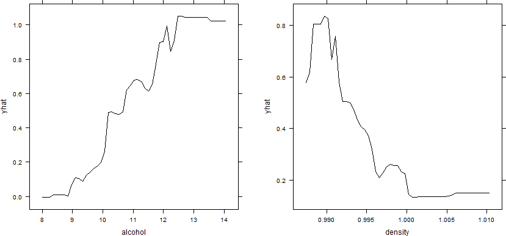
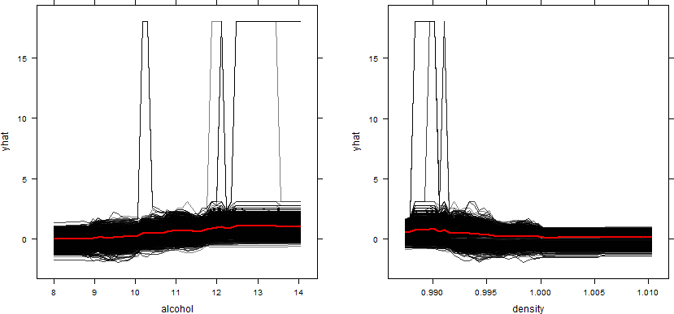
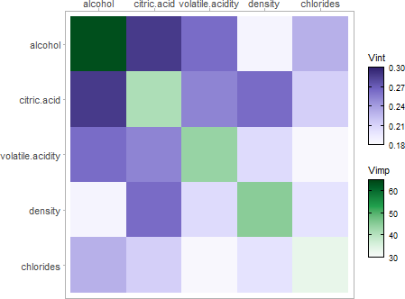
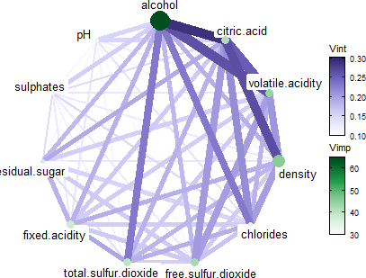
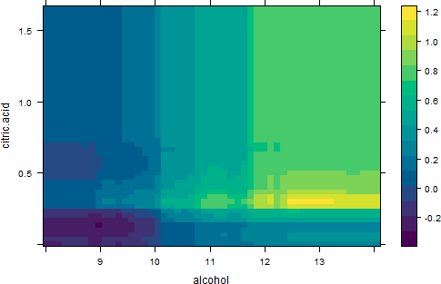
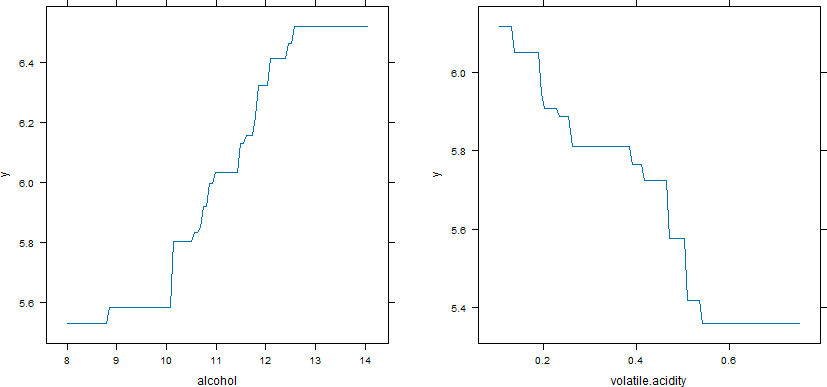

# Bagging y boosting {#bagging-boosting}

<!-- Capítulo \@ref(bagging-boosting) -->

```{r global-options, include=FALSE}
source("_global_options.R")
library(mpae)
```

<!-- 
---
title: "Bagging y boosting"
author: "Aprendizaje estadístico (UDC)"
date: "Máster en Técnicas Estadísticas"
bibliography: "aprendizaje.bib"
link-citations: yes
output: 
  bookdown::html_document2:
    pandoc_args: ["--number-offset", "3,0"]
    toc: yes 
    # mathjax: local            # copia local de MathJax, hay que establecer:
    # self_contained: false     # las dependencias se guardan en ficheros externos 
---

bookdown::preview_chapter("03-bagging_boosting.Rmd")
knitr::purl("03-bagging_boosting.Rmd", documentation = 2)
knitr::spin("03-bagging_boosting.R",knit = FALSE)
-->

Tanto el *bagging* como el *boosting* son procedimientos generales para la reducción de la varianza de un método estadístico de aprendizaje.

La idea básica consiste en combinar métodos de predicción sencillos (métodos débiles, que poseen una capacidad predictiva limitada), para obtener un método de predicción muy potente (y robusto). 
Estas ideas se pueden aplicar tanto a problemas de regresión como de clasificación.

Estos procedimientos son muy empleados con árboles de decisión, ya que estos son predictores débiles y se generan de forma rápida. 
Lo que se hace es construir muchos modelos (crecer muchos árboles) que luego se combinan para producir predicciones (o bien promediando o por consenso).


## Bagging {#bagging}

En la década de 1990 empiezan a utilizarse los métodos *ensemble* (métodos combinados), esto es, métodos predictivos que se basan en combinar las predicciones de un gran número de modelos. 
Uno de los primeros métodos combinados que se utilizó fue el  bagging (nombre que viene de *bootstrap aggregation*), propuesto en @breiman1996bagging. 
Es un método general de reducción de la varianza que se basa en la utilización del remuestreo bootstrap junto con un modelo de regresión o de clasificación, como puede ser un árbol de decisión.

La idea es muy sencilla. 
Si disponemos de muchas muestras de entrenamiento, podemos utilizar cada una de ellas para entrenar un modelo que después nos servirá para hacer una predicción. 
De este modo tendremos tantas predicciones como modelos y, por tanto, tantas predicciones como muestras de entrenamiento. 
El procedimiento consistente en promediar todas las predicciones anteriores tiene dos ventajas importantes: simplifica la solución y reduce mucho la varianza.

El problema es que en la práctica no suele disponerse más que de una única muestra de entrenamiento. 
Aquí es donde entra en juego el bootstrap, técnica especialmente útil para estimar varianzas, pero que en esta aplicación se utiliza para reducir la varianza. 
Lo que se hace es generar cientos o miles de muestras bootstrap a partir de la muestra de entrenamiento, y después utilizar cada una de estas muestras bootstrap como una muestra de entrenamiento (*bootstrapped training data set*). 

Para un modelo que tenga intrínsecamente poca variabilidad, como puede ser una regresión lineal, aplicar bagging puede ser poco interesante, ya que hay poco margen para mejorar el rendimiento. 
Por contra, es un método muy importante para los árboles de decisión, porque un árbol con mucha profundidad (sin podar) tiene mucha variabilidad: si modificamos ligeramente los datos de entrenamiento, es muy posible que se obtenga un nuevo árbol completamente distinto al anterior; y esto se ve como un inconveniente. 
Por esa razón, en este contexto encaja perfectamente la metodología bagging.

Así, para árboles de regresión se hacen crecer muchos árboles (sin poda) y se calcula la media de las predicciones. 
En el caso de los árboles de clasificación, lo más sencillo es sustituir la media por la moda y utilizar el criterio del voto mayoritario; cada modelo tiene el mismo peso y por tanto cada modelo aporta un voto. 
Además, la proporción de votos de cada categoría es una estimación de su probabilidad. 

<!-- 
Breiman (Using_random_forests_V3.1.pdf): "By a stretch of terminology, we call these class probability estimates. These should not be interpreted as the underlying distributional probabilities. But they contain useful information about the case".
Algunos algoritmos promedian las estimaciones de las probabilidades.
Breiman (1996, Sección 6.1): "For such methods, a natural competitor to bagging by voting is to average the -estimated probabilities-  over all bootstrap replications. This estimate was computed in every classification example we worked on. The resulting misclassification rate was always virtually identical to the voting misclassification rate".
-->

Una ventaja adicional del bagging es que permite estimar el error de la predicción de forma directa, sin necesidad de utilizar una muestra de test o de aplicar validación cruzada u, otra vez, remuestreo, y se obtiene un resultado similar al que obtendríamos con estos métodos. 
Es bien sabido que una muestra bootstrap va a contener muchas observaciones repetidas y que, en promedio, solo utiliza aproximadamente dos tercios de los datos (para ser más precisos, $1 - (1 - 1/n)^n$ que, a medida que el tamaño del conjunto de datos de entrenamiento aumenta, es aproximadamente $1 - e^{-1} = 0.6321$). 
Un dato que no es utilizado para construir un árbol se denomina un dato *out-of-bag* (OOB). 
De este modo, para cada observación se pueden utilizar los árboles para los que esa observación es out-of-bag (aproximadamente una tercera parte de los árboles construidos) para generar una única predicción para ella. 
Repitiendo el proceso para todas las observaciones se obtiene una medida del error.

Una decisión que hay que adoptar es cuántas muestras bootstrap se toman (o lo que es lo mismo, cuántos árboles se construyen). 
En la práctica, es habitual realizar un estudio gráfico de la convergencia del error OOB a medida que se incrementa el número de árboles [para más detalles, véase por ejemplo @fernandez2023simbook, [Sección 4.1](https://rubenfcasal.github.io/simbook/convergencia.html)].
Si aparentemente hay convergencia con unos pocos cientos de árboles, no va a variar mucho el nivel de error al aumentar el número de remuestras. 
Por tanto, aumentar mucho el número de árboles no mejora las predicciones, aunque tampoco aumenta el riesgo de sobreajuste.
Los costes computacionales aumentan con el número de árboles, pero la construcción y evaluación del modelo son fácilmente paralelizables (aunque pueden llegar a requerir mucha memoria si el conjunto de datos es muy grande).
Por otra parte, si el número de árboles es demasiado pequeño puede que se obtengan pocas (o incluso ninguna) predicciones OOB para alguna de las observaciones de la muestra de entrenamiento. 

Una ventaja bien conocida de los árboles de decisión es su fácil interpretabilidad. 
En un árbol resulta evidente cuáles son los predictores más influyentes. 
Al utilizar bagging se mejora (mucho) la predicción, pero se pierde la interpretabilidad. 
Aun así, hay formas de calcular la importancia de las covariables. 
Por ejemplo, si fijamos un predictor y una medida del error, podemos, para cada uno de los árboles, medir la reducción del error que se consigue cada vez que hay un corte que utilice ese predictor particular. 
Promediando sobre todos los árboles generados se obtiene una medida global de la importancia: un valor alto en la reducción del error sugiere que el predictor es importante.

En resumen:

- Se remuestrea repetidamente el conjunto de datos de entrenamiento.

- Con cada conjunto de datos se entrena un modelo.

- Las predicciones finales se obtienen promediando las predicciones de los
  modelos (en el caso de clasificación, utilizando la decisión mayoritaria).

- Se puede estimar la precisión de las predicciones con el error OOB (out-of-bag).


## Bosques aleatorios {#rf}

Los bosques aleatorios (*random forest*) son una variante de bagging específicamente diseñados para trabajar con árboles de decisión. 
Las muestras bootstrap que se generan al hacer bagging introducen un elemento de aleatoriedad que en la práctica provoca que todos los árboles sean distintos, pero en ocasiones no son lo *suficientemente* distintos. 
Es decir, suele ocurrir que los árboles tengan estructuras muy similares, especialmente en la parte alta, aunque después se vayan diferenciando según se desciende por ellos. 
Esta característica se conoce como correlación entre árboles y se da cuando el árbol es un modelo adecuado para describir la relación entre los predictores y la respuesta, y también cuando uno de los predictores es muy fuerte, es decir, es especialmente relevante, con lo cual casi siempre va a estar en el primer corte. 
Esta correlación entre árboles se va a traducir en una correlación entre sus predicciones (más formalmente, entre los predictores).

Promediar variables altamente correladas produce una reducción de la varianza mucho menor que si promediamos variables incorreladas. 
La solución pasa por añadir aleatoriedad al proceso de construcción de los árboles, para que estos dejen de estar correlados. 
Hubo varios intentos, entre los que destaca @dietterich2000experimental al proponer la idea de introducir aleatorieadad en la selección de las variables de cada corte. 
Posteriormente, @breiman2001statistical propuso un algoritmo unificado al que llamó bosques aleatorios. 
En la construcción de cada uno de los árboles que finalmente constituirán el bosque, se van haciendo cortes binarios, y para cada corte hay que seleccionar una variable predictora.
La modificación introducida fue que antes de hacer cada uno de los cortes, de todas las $p$ variables predictoras, se seleccionan al azar $m < p$ predictores que van a ser los candidatos para el corte.

El hiperparámetro de los bosques aleatorios es $m$, y se puede seleccionar mediante las técnicas habituales. 
Como puntos de partida razonables se pueden considerar $m = \sqrt{p}$ (para problemas de clasificación) y $m = p/3$ (para problemas de regresión). 
El número de árboles que van a constituir el bosque también puede tratarse como un hiperparámetro, aunque es más frecuente tratarlo como un problema de convergencia. 
En general, van a hacer falta más árboles que en bagging.
En ocasiones, también se trata como hiperparámetro la selección del tamaño mínimo de los nodos terminales de los árboles.

Los bosques aleatorios son computacionalmente más eficientes que el bagging porque, aunque como acabamos de decir requieren más árboles, la construcción de cada árbol es mucho más rápida al evaluarse solo unos pocos predictores en cada corte.

Este método también se puede emplear en aprendizaje no supervisado. Por ejemplo, se puede construir una matriz de proximidad entre observaciones a partir de la proporción de veces que están en un mismo nodo terminal [para más detalles ver @liaw2002classification].  

En resumen:

- Los bosques aleatorios son una modificación del bagging para el caso de árboles de decisión.

- También se introduce aleatoriedad en las variables, no solo en las observaciones.

- Para evitar dependencias, los posibles predictores se seleccionan al azar en cada nodo (p.&nbsp;ej. $m=\sqrt{p}$).

- Se utilizan árboles sin podar.

- La interpretación del modelo es difícil.

- Se puede medir la importancia de las variables (índices de importancia).

    -   Por ejemplo, para cada árbol se suman las reducciones en el
        índice de Gini correspondientes a las divisiones de un
        predictor y posteriormente se promedian los valores de todos
        los árboles.
        
    -   Alternativamente, se puede medir el incremento en el error de 
        predicción OOB al permutar aleatoriamente los valores de la
        variable explicativa en las muestras OOB, manteniendo el resto
        sin cambios [@breiman2001statistical].
        
<!-- 
Breiman (2001): "My approach is that each time a categorical variable is selected to split on at a node, to select a random subset of the categories of the variable, and define a substitute variable that is one when the categorical value of the variable is in the subset and zero outside".
-->


## Bagging y bosques aleatorios en R {#bagging-rf-r}

<!-- 
Búsquedas en caret: bag, forest 
Ver [CRAN Task View: Machine Learning & Statistical Learning](https://cran.r-project.org/web/views/MachineLearning.html))
-->

Estos algoritmos son de los más populares en AE y están implementados en numerosos paquetes de R, aunque la referencia es el paquete `r cite_cran(randomForest)` [@liaw2002classification], que emplea el código Fortran desarrollado por Leo Breiman y Adele Cutler.
La función principal es `r cite_fun(randomForest, randomForest)` y se suele emplear de la forma:

`randomForest(formula, data, ntree, mtry, nodesize, ...)`  

* `formula` y `data` (opcional): permiten especificar la respuesta y las variables predictoras de la forma habitual (típicamente `respuesta ~ .`), aunque si el conjunto de datos es muy grande puede ser preferible emplear una matriz o un data.frame para establecer los predictores y un vector para la respuesta (sustituyendo estos argumentos por `x` e `y`). 
Si la variable respuesta es un factor asumirá que se trata de un problema de clasificación, y en caso contrario de regresión.

* `ntree`: número de árboles que se crecerán; por defecto 500.

* `mtry`: número de predictores seleccionados al azar en cada división; por defecto  `max(floor(p/3), 1)` en el caso de regresión y  `floor(sqrt(p))` en clasificación, siendo `p = ncol(x) = ncol(data) - 1` el número de predictores.

* `nodesize`: número mínimo de observaciones en un nodo terminal; por defecto 1 en clasificación y 5 en regresión. Si el conjunto de datos es muy grande, es recomendable incrementarlo para evitar problemas de sobreajuste, disminuir el tiempo de computación y los requerimientos de memoria. Puede ser tratado como un hiperparámetro.

Otros argumentos que pueden ser de interés^[Si se quiere minimizar el uso de memoria, por ejemplo mientras se seleccionan hiperparámetros, se puede establecer `keep.forest=FALSE`.] son:

* `maxnodes`: número máximo de nodos terminales. Puede utilizarse como alternativa para controlar la complejidad del modelo.

* `importance = TRUE`: permite obtener medidas adicionales de la importancia de las variables predictoras.

* `proximity = TRUE`: permite obtener una matriz de proximidades (componente `$proximity`) entre las observaciones (frecuencia con la que los pares de observaciones están en el mismo nodo terminal).

* `na.action = na.fail`: por defecto, no admite datos faltantes con la interfaz de fórmulas. Si los hubiese, se podrían imputar estableciendo `na.action = na.roughfix` (empleando medias o modas) o llamando previamente a `rfImpute()` (que emplea proximidades obtenidas con un bosque aleatorio).

Para obtener más información, puede consultarse la documentación de la función y [Liaw y Wiener (2002)](https://www.r-project.org/doc/Rnews/Rnews_2002-3.pdf).


Entre las numerosas alternativas disponibles, además de las implementadas en paquetes que integran colecciones de métodos como `h2o` o `RWeka`, una de las más utilizadas son los bosques aleatorios con *conditional inference trees*, implementada en la función `cforest()` del paquete `r cite_cran(party)`. 


### Ejemplo: clasificación con bagging

Como ejemplo consideraremos el conjunto de datos de calidad de vino empleado previamente en la Sección \@ref(class-rpart), y haremos comparaciones con el ajuste de un único árbol.

```{r bagging-data}
data(winetaste, package = "mpae")
set.seed(1)
df <- winetaste
nobs <- nrow(df)
itrain <- sample(nobs, 0.8 * nobs)
train <- df[itrain, ]
test <- df[-itrain, ]
```

Al ser bagging con árboles un caso particular de bosques aleatorios, cuando $m = p$, también podemos emplear `randomForest`:

<!-- 
Pendiente: establecer nodesize=5 para reducir tiempos de computación? 
-->

```{r randomForest-bagging}
library(randomForest)
set.seed(4) # NOTA: Fijamos esta semilla para ilustrar dependencia
bagtrees <- randomForest(taste ~ ., data = train, mtry = ncol(train) - 1)
bagtrees
```

Con el método `plot()` podemos examinar la convergencia del error en las muestras OOB. 
Este método emplea `matplot()` para representar la componente `$err.rate`, como se muestra en la Figura \@ref(fig:bagging-conv):

(ref:bagging-conv) Evolución de las tasas de error OOB al emplear bagging para la predicción de `winetaste$taste`.

```{r bagging-conv, fig.cap='(ref:bagging-conv)'}
plot(bagtrees, main = "")
legend("right", colnames(bagtrees$err.rate), lty = 1:5, col = 1:6)
```

Como se observa, los errores tienden a estabilizarse, lo que sugiere que hay convergencia en el proceso (aunque situaciones de alta dependencia entre los árboles dificultarían su interpretación).

Con la función `getTree()` podemos extraer los árboles individuales.
Por ejemplo, el siguiente código permite extraer la variable seleccionada para la primera división:

<!--
View(getTree(bagtrees, 1, labelVar=TRUE))
-->

```{r bagging-split1}
split_var_1 <- sapply(seq_len(bagtrees$ntree), function(i) 
                       getTree(bagtrees, i, labelVar = TRUE)[1, "split var"])
```

En este caso concreto, podemos observar que la variable seleccionada para la primera división es siempre la misma, lo que indicaría una alta dependencia entre los distintos árboles:

```{r bagging-split1-table}
table(split_var_1)
```

Por último, evaluamos la precisión en la muestra de test:

```{r bagging-pred}
pred <- predict(bagtrees, newdata = test)
caret::confusionMatrix(pred, test$taste)
```


### Ejemplo: clasificación con bosques aleatorios {#ejemplo-clasif-rf}

Continuando con el ejemplo anterior, empleamos la función `randomForest()` con las opciones por defecto para ajustar un bosque aleatorio a la muestra de entrenamiento:

<!-- 
data(winetaste, package = "mpae")
set.seed(1)
df <- winetaste
nobs <- nrow(df)
itrain <- sample(nobs, 0.8 * nobs)
train <- df[itrain, ]
test <- df[-itrain, ]
-->


```{r randomForest}
set.seed(1)
rf <- randomForest(taste ~ ., data = train)
rf
```

En la Figura \@ref(fig:rf-plot) podemos observar que aparentemente hay convergencia, igual que sucedía en el ejemplo anterior, y por tanto tampoco sería necesario aumentar el número de árboles.

(ref:rf-plot) Evolución de las tasas de error OOB al usar bosques aleatorios para la predicción de `winetaste$taste` (empleando `randomForest()` con las opciones por defecto).

```{r rf-plot, fig.cap='(ref:rf-plot)'}
plot(rf, main = "")
legend("right", colnames(rf$err.rate), lty = 1:5, col = 1:6)
```

Podemos mostrar la importancia de las variables predictoras (utilizadas en el bosque aleatorio y sus sustitutas) con la función `importance()` o representarlas con `varImpPlot()` `r cite_fig(rf-importance)`:

(ref:rf-importance) Importancia de las variables predictoras al emplear bosques aleatorios para la predicción de `winetaste$taste`.

```{r rf-importance, fig.cap='(ref:rf-importance)'}
importance(rf)
varImpPlot(rf)
```

Si evaluamos la precisión en la muestra de test podemos observar un ligero incremento en la precisión en comparación con el método anterior:

```{r rf-pred}
pred <- predict(rf, newdata = test)
caret::confusionMatrix(pred, test$taste)
```

Esta mejora sería debida a que en este caso la dependencia entre los árboles es menor:

```{r rf-split1}
split_var_1 <- sapply(seq_len(bagtrees$ntree), function(i) 
                       getTree(bagtrees, i, labelVar = TRUE)[1, "split var"])
table(split_var_1)
```

El análisis e interpretación del modelo puede resultar más complicado en este tipo de métodos.
Para estudiar el efecto de los predictores en la respuesta se suelen emplear algunas de las herramientas descritas en la Sección \@ref(analisis-modelos).
Por ejemplo, empleando la función `pdp::partial()` [@R-pdp] podemos generar gráficos PDP con las estimaciones de los efectos individuales de los principales predictores `r cite_fig(rf-pdp-uni-plot)`:


```{r rf-pdp-uni, eval=.regerar, fig.dim = c(12, 6), fig.path="images/", dev="png"}
library(pdp)
library(gridExtra)
pdp1 <- partial(rf, "alcohol")
p1 <- plotPartial(pdp1)
pdp2 <- partial(rf, c("density"))
p2 <- plotPartial(pdp2)
grid.arrange(p1, p2, ncol = 2)
```


```{r rf-pdp-uni-plot, echo=FALSE, out.width="95%", fig.path="images/", dev="png", fig.cap="Efecto parcial del alcohol (panel izquierdo) y la densidad (panel derecho) sobre la respuesta."}
library(pdp) # por si no se ejecuta el código anterior

```

Adicionalmente, estableciendo `ice = TRUE` se calculan las curvas de expectativa condicional individual (ICE). Estos gráficos ICE extienden los PDP, ya que, además de mostrar la variación del promedio (línea roja en Figura \@ref(fig:rf-ice-plot)), también muestra la variación de los valores predichos para cada observación  (líneas negras en Figura \@ref(fig:rf-ice-plot)).

```{r rf-ice, eval=.regerar, fig.dim = c(12, 6), fig.path="images/", dev="png"}
ice1 <- partial(rf, pred.var = "alcohol", ice = TRUE)
ice2 <- partial(rf, pred.var = "density", ice = TRUE)
p1 <- plotPartial(ice1, alpha = 0.5)
p2 <- plotPartial(ice2, alpha = 0.5)
gridExtra:::grid.arrange(p1, p2, ncol = 2)
```

```{r rf-ice-plot, echo=FALSE, out.width="95%", fig.cap="Efecto individual de cada observación de alcohol (panel izquierdo) y densidad (panel derecho) sobre la respuesta."}

```

Se pueden crear gráficos similares utilizando los otros paquetes indicados en la Sección \@ref(analisis-modelos).
Por ejemplo, la Figura \@ref(fig:rf-vivid-plot), generada con el paquete `r cite_pkg_("vivid", "https://alaninglis.github.io/vivid")` [@R-vivid], muestra medidas de la importancia de los predictores (*Vimp*) en la diagonal y de la fuerza de las interacciones (*Vint*) fuera de la diagonal. 

```{r rf-vivid, eval=.regerar, fig.path="images/", dev="png"}
library(vivid)
fit_rf <- vivi(data = train, fit = rf, response = "taste", 
               importanceType = "%IncMSE")
viviHeatmap(mat = fit_rf[1:5,1:5])
```

```{r rf-vivid-plot, echo=FALSE, out.width=fowidth(5), fig.cap="Mapa de calor de la importancia e interaciones de los predictores del ajuste mediante bosques aleatorios."}

```

Alternativamente, también se pueden visualizar las relaciones mediante un gráfico de red (ver Figura \@ref(fig:rf-vivid2-plot)).

```{r rf-vivid2, eval=.regerar, fig.path="images/", dev="png"}
require(igraph)
viviNetwork(mat = fit_rf)
```

```{r rf-vivid2-plot, echo=FALSE, out.width=fowidth(5), fig.cap="Gráfico de red para la importancia e interaciones del ajuste mediante bosques aleatorios."}

```


En este caso, la interación entre `alcohol` y `citric.acid` es aparentemente la más importante.
Podemos representarla mediante un gráfico PDP `r cite_fig(rf-pdp-plot)`. 
La generación de este gráfico puede requerir mucho tiempo de computación.

```{r rf-pdp, eval=.regerar, fig.path="images/", dev="png"}
pdp12 <- partial(rf, c("alcohol", "citric.acid"))
plotPartial(pdp12)
```

```{r rf-pdp-plot, echo=FALSE, out.width="75%", fig.cap="Efecto parcial de la interacción del alcohol y el ácido cítrico sobre la respuesta."}

```

<!-- 
Pendiente: 
En este caso también puede ser de utilidad el paquete `r cite_pkg_("randomForestExplainer", "https://modeloriented.github.io/randomForestExplainer")`, 
Pendiente: Análisis e interpretación del modelo
# install.packages("randomForestExplainer")
library(randomForestExplainer)
plot_min_depth_distribution(rf)
plot_min_depth_interactions(rf, k = 5) # solo 5 mejores iteraciones
-->

### Ejemplo: bosques aleatorios con `caret`

En el paquete `caret` hay varias implementaciones de bagging y bosques aleatorios^[Se puede hacer una búsqueda en la tabla del [Capítulo 6: Available Models](https://topepo.github.io/caret/available-models.html) del manual.], incluyendo el algoritmo del paquete `randomForest` considerando como hiperparámetro el número de predictores seleccionados al azar en cada división, `mtry`.
Para ajustar este modelo a una muestra de entrenamiento hay que establecer `method = "rf"` en la llamada a `train()`.

```{r rf-caret}
library(caret)
# str(getModelInfo("rf", regex = FALSE))
modelLookup("rf")
```

<!-- 
data(winetaste, package = "mpae")
set.seed(1)
df <- winetaste
nobs <- nrow(df)
itrain <- sample(nobs, 0.8 * nobs)
train <- df[itrain, ]
test <- df[-itrain, ]
-->
 
Con las opciones por defecto únicamente evalúa tres valores posibles del hiperparámetro `r cite_fig(rf-caret-train)`.
Opcionalmente se podría aumentar el número de valores a evaluar con `tuneLength` o especificarlos directamente con `tuneGrid`.
Sin embargo, el tiempo de computación puede ser demasiado alto, por lo que es recomendable reducir el valor de `nodesize`, paralelizar los cálculos o emplear otros paquetes con implementaciones más eficientes.
Además, en este caso es preferible emplear el método por defecto para la selección de hiperparámetros, el remuestreo (que sería equivalente a `trainControl(method = "oob")`), para aprovechar los cálculos realizados durante la construcción de los modelos.


```{r rf-caret-train, out.width=fowidth(5), fig.cap="Evolución de la precisión de un bosque aleatorio dependiendo del número de predictores seleccionados."}
set.seed(1)
rf.caret <- train(taste ~ ., data = train, method = "rf")
ggplot(rf.caret, highlight = TRUE)
```

@breiman2001random sugiere emplear el valor por defecto para `mtry`, así como la mitad y el doble de este valor `r cite_fig(rf-caret-grid)`.

(ref:rf-caret-grid) Evolución de la precisión de un bosque aleatorio con `caret` usando el argumento `tuneGrid`.

```{r rf-caret-grid, out.width=fowidth(5), fig.cap='(ref:rf-caret-grid)'}
mtry.class <- sqrt(ncol(train) - 1)
tuneGrid <- data.frame(mtry = 
                         floor(c(mtry.class/2, mtry.class, 2*mtry.class)))
set.seed(1)
rf.caret <- train(taste ~ ., data = train,
                  method = "rf", tuneGrid = tuneGrid)
ggplot(rf.caret, highlight = TRUE)
```

<!-- 
Pendiente: 
crear un método "rf2" en `caret` que incluya `nodesize` como hiperparámetro (para evitar posibles problemas de sobreajuste, disminuir el tiempo de computación en la evaluación y los requerimientos de memoria cuando el conjunto de datos es muy grande). Puede ser más cómodo hacerlo al margen de `caret`... 
-->

::: {.exercise #rf-tunegrid}

Como acabamos de ver, `caret` permite ajustar un bosque aleatorio considerando `mtry` como único hiperparámetro, pero también nos podría interesar buscar valores adecuados para otros parámetros, como por ejemplo `nodesize`. 
Esto se puede realizar fácilmente empleando directamente la función `randomForest()`. 
En primer lugar, habría que construir la rejilla de búsqueda con las combinaciones de los valores de los hiperparámetros que se quieren evaluar (para ello se puede utilizar la función `expand.grid()`).
Posteriormente, se ajustaría un bosque aleatorio en la muestra de entrenamiento con cada una de las combinaciones (por ejemplo utilizando un bucle `for`) y se emplearía el error OOB para seleccionar la combinación óptima (al que podemos acceder empleando `with(fit, err.rate[ntree, "OOB"])`, suponiendo que `fit` contiene el bosque aleatorio ajustado).

Continuando con el mismo conjunto de datos de calidad de vino, emplea la función `randomForest()` para ajustar un bosque aleatorio con el fin de clasificar la calidad del vino (`taste`), considerando 500 árboles  y empleando el error OOB para seleccionar los valores "óptimos" de los hiperparámetros. Para ello, utiliza las posibles combinaciones de `mtry = floor(c(mtry.class/2, mtry.class, 2*mtry.class))` (siendo `mtry.class <- sqrt(ncol(train) - 1)`) y `nodesize = c(1, 3, 5, 10)`.

:::

<!-- 
Ejercicio: buscar hiperparámetros mediante algoritmo genético en lugar de rejilla (después de primera búsqueda en rejilla)
-->


::: {.exercise #bfan-rf-caret}

Utilizando el conjunto de datos [`mpae::bfan`](https://rubenfcasal.github.io/mpae/reference/bfan.html), emplea el método `"rf"` del paquete `caret` para clasificar los individuos según su nivel de grasa corporal (`bfan`):

a) Particiona los datos, considerando un 80&#8239;% de las observaciones como muestra de aprendizaje y el 20&#8239;% restante como muestra de test.

b) Ajusta un bosque aleatorio con 300 árboles a los datos de entrenamiento, seleccionando el número de predictores empleados en cada división `mtry = c(1, 2, 4, 6)` mediante validación cruzada con 10 grupos y empleando el criterio de un error estándar de Breiman.

c) Estudia la convergencia del error en las muestras OOB.
    
d) Estudia la importancia de las variables. Estima el efecto individual del predictor más importante mediante un gráfico PDP e interpreta el resultado.

e) Evalúa la precisión de las predicciones en la muestra de test.

:::


## Boosting {#boosting}

La metodología boosting es una metodología general de aprendizaje lento en la que se combinan muchos modelos obtenidos mediante un método con poca capacidad predictiva para, *impulsados*, dar lugar a un mejor predictor. Los árboles de decisión pequeños (construidos con poca profundidad) resultan perfectos para esta tarea, al ser realmente malos predictores (*weak learners*), fáciles de combinar y generarse de forma muy rápida.

El boosting nació en el contexto de los problemas de clasificación y tardó varios años en poderse extender a los problemas de regresión. Por ese motivo vamos a empezar viendo el boosting en clasificación.

La idea del boosting la desarrollaron @valiant1984theory y @kearns_cryptographic_1994, pero encontrar una implementación efectiva fue una tarea difícil que no se resolvió satisfactoriamente hasta que @freund1996schapire presentaron el algoritmo *AdaBoost*, que rápidamente se convirtió en un éxito. 

Veamos, de forma muy esquemática, en que consiste el algoritmo AdaBoost para un problema de clasificación en el que solo hay dos categorías y en el que se utiliza como clasificador débil un árbol de decisión con pocos nodos terminales, solo marginalmente superior a un clasificador aleatorio.
En este caso, resulta más cómodo recodificar la variable indicadora $Y$ como $1$ si éxito y $-1$ si fracaso.

<!-- OJO: Estamos empleando \hat Y_b = +1/-1 como si fuese \hat G en Sección 1.2.1 -->

1. Seleccionar $B$, número de iteraciones.

1. Se les asigna el mismo peso a todas las observaciones de la muestra de entrenamiento ($1/n$).

1. Para $b = 1, 2,\ldots, B$, repetir:

    a. Ajustar el árbol utilizando las observaciones ponderadas.
    
    a. Calcular la proporción de errores en la clasificación $e_b$.
    
    a. Calcular $s_b = \text{log}((1 - e_b)/e_b)$.
    
    a. Actualizar los pesos de las observaciones. Los pesos de las observaciones correctamente clasificadas no cambian; se les da más peso a las observaciones incorrectamente clasificadas, multiplicando su peso anterior por $(1 - e_b)/e_b$.
    
1. Dada una observación $\mathbf{x}$, si denotamos por $\hat y_b ( \mathbf{x} )$ su clasificación utilizando el árbol $b$-ésimo, entonces $\hat y( \mathbf{x} ) = signo \left( \sum_b s_b \hat y_b ( \mathbf{x} ) \right)$ (si la suma es positiva, se clasifica la observación como perteneciente a la clase $+1$; en caso contrario, a la clase $-1$).

<!-- 
Pendiente: 
Añadir referencia: https://projecteuclid.org/euclid.aos/1016218223
Aproximación de las probabilidades: Real AdaBoost -->

Vemos que el algoritmo AdaBoost no combina árboles independientes (como sería el caso de los bosques aleatorios, por ejemplo), sino que estos se van generando en una secuencia en la que cada árbol depende del anterior. Se utiliza siempre el mismo conjunto de datos (de entrenamiento), pero a estos datos se les van poniendo unos pesos en cada iteración que dependen de lo que ha ocurrido en la iteración anterior: se les da más peso a las observaciones mal clasificadas para que en sucesivas iteraciones se clasifiquen bien. Finalmente, la combinación de los árboles se hace mediante una suma ponderada de las $B$ clasificaciones realizadas. Los pesos de esta suma son los valores $s_b$. Un árbol que clasifique de forma aleatoria $e_b = 0.5$ va a tener un peso $s_b = 0$ y cuanto mejor clasifique el árbol mayor será su peso. Al estar utilizando clasificadores débiles (árboles pequeños) es de esperar que los pesos sean en general próximos a cero.

El siguiente hito fue la aparición del método *gradient boosting machine* [@friedman2001greedy], perteneciente a la familia de los métodos iterativos de descenso de gradientes. 
Entre otras muchas ventajas, este método permitió resolver no solo problemas de clasificación, sino también de regresión; y permitió la conexión con lo que se estaba haciendo en otros campos próximos como pueden ser los modelos aditivos o la regresión logística. 
La idea es encontrar un modelo aditivo que minimice una función de pérdida utilizando predictores débiles (por ejemplo árboles). 

Se desea minimizar la función de pérdidas mediante el método de los gradientes, algo fácil de hacer si esta función es diferenciable. 
Si se utiliza RSS, entonces la pérdida de emplear $m(x)$ para predecir $y$ en los datos de entrenamiento es 
$$L(m) = \sum_{i=1}^n L(y_i, m(x_i)) = \sum_{i=1}^n \frac{1}{2} (y_i - m(x_i))^2$$
y los gradientes serían precisamente los residuos, ya que 
$$- \frac{\partial L(y_i, m(x_i))} {\partial m(x_i)} = y_i - m(x_i) = r_i$$
Una ventaja de esta aproximación es que puede extenderse a otras funciones de pérdida; por ejemplo, si hay valores atípicos se puede considerar como función de pérdida el error absoluto.

Veamos a continuación el algoritmo para un problema de regresión utilizando árboles de decisión. Es un proceso iterativo en el que lo que se *ataca* no son los datos directamente, sino los residuos (gradientes) que van quedando con los sucesivos ajustes, siguiendo una idea *greedy* (la optimización se resuelve en cada iteración, no globalmente).

1. Seleccionar el número de iteraciones $B$, el parámetro de regularización $\lambda$ y el número de cortes de cada árbol $d$.

1. Establecer una predicción inicial constante y calcular los residuos de los datos $i$ de la muestra de entrenamiento: $$\hat m (x) = 0, \ r_i = y_i$$

<!-- Pendiente:  $$\hat m (x) = \bar y, \ r_i = y_i - \bar y$$-->

1. Para $b = 1, 2,\ldots, B$, repetir:

    a. Ajustar un árbol de regresión $\hat m^b$ con $d$ cortes utilizando los residuos como respuesta: $(X, r)$.
    
    a. Calcular la versión regularizada del árbol: 
    $$\lambda \hat m^b (x)$$
    
    b. Actualizar los residuos:
    $$r_i \leftarrow r_i - \lambda \hat m^b (x_i)$$
    
1. Calcular el modelo boosting:
$$\hat m (x) = \sum_{b=1}^{B} \lambda \hat m^b (x)$$

Comprobamos que este método depende de tres hiperparámetros: $B$, $d$ y $\lambda$, susceptibles de ser seleccionados de forma *óptima*:

- $B$ es el número de árboles. Un valor muy grande podría llegar a provocar un sobreajuste (algo que no ocurre ni con bagging ni con bosques aleatorios, ya que estos son métodos en los que se construyen árboles independientes). En cada iteración, el objetivo es ajustar de forma óptima el gradiente (en nuestro caso, los residuos), pero este enfoque *greedy* no garantiza el óptimo global y puede dar lugar a sobreajustes.

- Al ser necesario que el aprendizaje sea lento, se utilizan árboles muy pequeños. Esto consigue que poco a poco se vayan cubriendo las zonas en las que es más difícil predecir bien. En muchas situaciones funciona bien utilizar $d = 1$, es decir, con un único corte. En este caso, en cada $\hat m^b$ interviene una única variable y por tanto $\hat m$ es un ajuste de un modelo aditivo. Si $d>1$ se puede interpretar como un parámetro que mide el orden de interacción entre las variables.

- $\lambda$ es el parámetro de regularización, $0 < \lambda < 1$. Las primeras versiones del algoritmo utilizaban $\lambda = 1$, pero no funcionaba bien del todo. Se mejoró mucho el rendimiento *ralentizando* aún más el aprendizaje al incorporar al modelo el parámetro $\lambda$, que se puede interpretar como una proporción de aprendizaje (la velocidad a la que aprende, *learning rate*). Valores pequeños de $\lambda$ evitan el problema del sobreajuste, siendo habitual utilizar $\lambda = 0.01$ o $\lambda = 0.001$. Como ya se ha dicho, lo ideal es seleccionar su valor utilizando, por ejemplo, validación cruzada. Por supuesto, cuanto más pequeño sea el valor de $\lambda$, más lento va a ser el proceso de aprendizaje y serán necesarias más iteraciones, lo cual incrementa los tiempos de cómputo.

El propio Friedman propuso una mejora de su algoritmo [@friedman2002stochastic], inspirado por la técnica bagging de Breiman. Esta variante, conocida como *stochastic gradient boosting* (SGB), es a día de hoy una de las más utilizadas. 
La única diferencia respecto al algoritmo anterior se encuentra en la primera línea dentro del bucle: al hacer el ajuste de $(X, r)$, no se considera toda la muestra de entrenamiento, sino que se selecciona al azar un subconjunto. 
Esto incorpora un nuevo hiperparámetro a la metodología, la fracción de datos utilizada. 
Lo ideal es seleccionar un valor por algún método automático (*tunearlo*) tipo validación cruzada; una selección manual típica es 0.5.
Hay otras variantes, como por ejemplo la selección aleatoria de predictores antes de crecer cada árbol o antes de cada corte (ver por ejemplo la documentación de [`h2o::gbm`](http://docs.h2o.ai/h2o/latest-stable/h2o-docs/data-science/gbm.html)).

Este sería un ejemplo de un método con muchos hiperparámetros y diseñar una buena estrategia para ajustarlos (*tunearlos*) puede resultar mucho más complicado (puede haber problemas de mínimos locales, problemas computacionales, etc.).

SGB ofrece dos ventajas importantes: reduce la varianza y reduce los tiempos de cómputo.
En terminos de rendimiento, tanto el método SGB como *random forest* son muy competitivos y, por tanto, son muy utilizados en la práctica. 
Los bosques aleatorios tienen la ventaja de que, al construir árboles de forma independiente, es paralelizable y eso puede reducir los tiempos de cómputo.

Otro método reciente que está ganando popularidad es *extreme gradient boosting*, también conocido como *XGBoost* [@chen2016xgboost]. 
Es un método más complejo que el anterior; entre otras modificaciones, utiliza una función de pérdida con una penalización por complejidad y, para evitar el sobreajuste, regulariza utilizando la hessiana de la función de pérdida (necesita calcular las derivadas parciales de primer y de segundo orden), e incorpora parámetros de regularización adicionales para evitar el sobreajuste.

Por último, la importancia de las variables se puede medir de forma similar a lo que ya hemos visto en otros métodos: dentro de cada árbol se suman las reducciones del error que consigue cada predictor, y se promedia entre todos los árboles utilizados.

En resumen:

-   La idea es hacer un aprendizaje lento (gradual).

-   Los arboles se crecen de forma secuencial: se trata de mejorar la
    clasificación anterior.

-   Se utilizan arboles pequeños.

-   A diferencia de bagging y bosques aleatorios, puede haber problemas de sobreajuste, especialmente si el número de árboles es grande y la tasa de aprendizaje es alta.

-   Se puede pensar como una ponderación iterativa de las observaciones, asignando más peso a aquellas que resultaron más difíciles de clasificar.

-   El modelo final es un modelo aditivo: es la media ponderada de los árboles.


## Boosting en R {#boosting-r}

<!-- 
Búsquedas en caret: boost 
Ver [CRAN Task View: Machine Learning & Statistical Learning](https://cran.r-project.org/web/views/MachineLearning.html))
-->


Los métodos boosting están entre los más populares en aprendizaje estadístico. Están implementados en numerosos paquetes de R, por ejemplo: `r cite_cran(ada)`, `r cite_cran(adabag)`, `r cite_cran(mboost)`, `r cite_cran(gbm)`, `r cite_pkg_("xgboost", "https://github.com/dmlc/xgboost/tree/master/R-package")`.


### Ejemplo: clasificación con el paquete `ada`

La función `ada()` del paquete `r cite_cran(ada)` [@culp2006ada] implementa diversos métodos boosting, incluyendo el algoritmo original AdaBoost. 
Emplea `rpart` para la construcción de los árboles, aunque solo admite respuestas dicotómicas y dos funciones de pérdida (exponencial y logística).
Además, un posible problema al emplear esta función es que ordena alfabéticamente los niveles del factor, lo que puede llevar a una mala interpretación de los resultados.

Los principales parámetros son los siguientes:
```{r, eval=FALSE}
ada(formula, data, loss = c("exponential", "logistic"),
    type = c("discrete", "real", "gentle"), iter = 50, 
    nu = 0.1, bag.frac = 0.5, ...)
```

* `formula` y `data` (opcional): permiten especificar la respuesta y las variables predictoras de la forma habitual (típicamente `respuesta ~ .`; también admite matrices `x` e `y` en lugar de fórmulas).

* `loss`: función de pérdida; por defecto `"exponential"` (algoritmo AdaBoost).

* `type`: algoritmo boosting; por defecto `"discrete"` que implementa el algoritmo AdaBoost original que predice la variable respuesta. Otras alternativas son `"real"`, que implementa el algoritmo *Real AdaBoost* [@friedman2000additive] que permite estimar las probabilidades, y `"gentle"`, una versión modificada del anterior que emplea un método Newton de optimización por pasos (en lugar de optimización exacta).

* `iter`: número de iteraciones boosting; por defecto 50.

* `nu`: parámetro de regularización $\lambda$; por defecto 0.1. Disminuyendo este parámetro es de esperar que se obtenga una mejora en la precisión de las predicciones, pero requeriría aumentar `iter,` aumentando notablemente el tiempo de computación y los requerimientos de memoria.

* `bag.frac`: proporción de observaciones seleccionadas al azar para crecer cada árbol; 0.5 por defecto.

* `...`: argumentos adicionales para `rpart.control`; por defecto `rpart.control(maxdepth = 1, cp = -1, minsplit = 0, xval = 0)`.

A modo de ejemplo consideraremos el conjunto de datos de calidad de vino empleado en las secciones \@ref(class-rpart) y \@ref(bagging-rf-r). Para evitar problemas reordenamos alfabéticamente los niveles de la respuesta.

```{r ada-data}
# data(winetaste, package = "mpae")
# Reordenar alfabéticamente los niveles de winetaste$taste
winetaste$taste <- factor(as.character(winetaste$taste))
# Partición de los datos
set.seed(1)
df <- winetaste
nobs <- nrow(df)
itrain <- sample(nobs, 0.8 * nobs)
train <- df[itrain, ]
test <- df[-itrain, ]
```

El siguiente código llama a la función `ada()` con la opción para estimar probabilidades (`type = "real"`, *Real AdaBoost*), considerando interacciones de segundo orden entre los predictores (`maxdepth = 2`), disminuyendo ligeramente el valor del parámetro de aprendizaje y aumentando el número de iteraciones:

```{r ada}
library(ada)
control <- rpart.control(maxdepth = 2, cp = 0, minsplit = 10, xval = 0)
ada.boost <- ada(taste ~ ., data = train, type = "real",
             control = control, iter = 100, nu = 0.05)
ada.boost
```

Con el método `plot()` podemos representar la evolución del error de clasificación al aumentar el número de iteraciones `r cite_fig(ada-plot)`:

(ref:ada-plot) Evolución de la tasa de error utilizando `ada()`.

```{r  ada-plot, fig.cap='(ref:ada-plot)'}
plot(ada.boost)
```

<!-- 
Con la función `varplot()` podemos representar la importancia de las variables (y almacenarla empleando `type = "scores"`): 

```{r}
res <- varplot(ada.boost, type = "scores")
res
``` 
-->

Podemos evaluar la precisión en la muestra de test empleando el procedimiento habitual:

```{r ada-pred}
pred <- predict(ada.boost, newdata = test)
caret::confusionMatrix(pred, test$taste, positive = "good")
```

Para obtener las estimaciones de las probabilidades, habría que establecer `type = "probs"` al predecir (devolverá una matriz en la que cada columna se corresponde con un nivel):

```{r ada-pest}
p.est <- predict(ada.boost, newdata = test, type = "probs")
head(p.est)
```

Este procedimiento también está implementado en el paquete `caret` seleccionando el método `"ada"`, que considera como hiperparámetros:
```{r ada-caret}
library(caret)
modelLookup("ada")
```

Por defecto la función `train()` solo considera nueve combinaciones de hiperparámetros (en lugar de las 27 que cabría esperar):

```{r caret-ada0}
set.seed(1)
trControl <- trainControl(method = "cv", number = 5)
caret.ada0 <- train(taste ~ ., method = "ada", data = train, 
                    trControl = trControl)
caret.ada0
```

En la salida anterior, se observa que el parámetro `nu` se ha fijado en 0.1, por lo que solo se tienen los resultados para las combinaciones de `maxdepth` e `iter`. 
Se puede aumentar el número de combinaciones empleando `tuneLength` o `tuneGrid`, pero la búsqueda en una rejilla completa puede incrementar considerablemente el tiempo de computación. 
Por este motivo, se suelen seguir procedimientos alternativos de búsqueda. Por ejemplo, fijar la tasa de aprendizaje (inicialmente a un valor alto) para seleccionar primero un número de interaciones y la complejidad del árbol, y posteriormente fijar estos valores para seleccionar una nueva tasa de aprendizaje (repitiendo el proceso, si es necesario, hasta conseguir convergencia).

```{r caret-ada1}
set.seed(1)
tuneGrid <- data.frame(iter = 150, maxdepth = 3,
                       nu = c(0.3, 0.1, 0.05, 0.01, 0.005))
caret.ada1 <- train(taste ~ ., method = "ada", data = train,
                    tuneGrid = tuneGrid, trControl = trControl)
caret.ada1
```

Por último, podemos evaluar la precisión del modelo en la muestra de test:

```{r caret-ada2}
confusionMatrix(predict(caret.ada1, newdata = test), 
                test$taste, positive = "good")
```

::: {.exercise #bfan-ada-caret}

Continuando con el Ejercicio \@ref(exr:bfan-rf-caret) y utilizando la misma partición, vuelve a clasificar los individuos según su nivel de grasa corporal (`bfan`), pero ahora empleando boosting mediante el método `"ada"` del paquete `caret`:

a) Selecciona los valores "óptimos" de los hiperparámetros considerando las posibles combinaciones de `iter =  c(75, 150)`, `maxdepth = 1:2` y `nu = c(0.5, 0.25, 0.1)`, mediante validación cruzada con 5 grupos. Representa la precisión de CV dependiendo de los valores de los hiperparámetros.

b) Representa la evolución del error de clasificación al aumentar el número de iteraciones del algoritmo.

c) Estudia la importancia de los predictores y el efecto del más importante.

d) Evalúa la precisión de las predicciones en la muestra de test y compara los resultados con los obtenidos en el Ejercicio \@ref(exr:bfan-rf-caret). 
      
:::

### Ejemplo: regresión con el paquete `gbm`

El paquete `r cite_cran(gbm)` [@R-gbm] implementa el algoritmo SGB de @friedman2002stochastic y admite varios tipos de respuesta considerando distintas funciones de pérdida (aunque en el caso de variables dicotómicas estas deben^[Se puede evitar este inconveniente empleando la interfaz de `caret`.] tomar valores en $\{0, 1\}$).
La función principal es `r cite_fun(gbm, gbm)` y se suelen considerar los siguientes argumentos:
```{r, eval=FALSE}
gbm( formula, distribution = "bernoulli", data, n.trees = 100, 
     interaction.depth = 1, n.minobsinnode = 10, shrinkage = 0.1, 
     bag.fraction = 0.5, cv.folds = 0, n.cores = NULL)
```

* `formula` y `data` (opcional): permiten especificar la respuesta y las variables predictoras de la forma habitual (típicamente `respuesta ~ .`; también está disponible una interfaz con matrices `gbm.fit()`).

* `distribution` (opcional): texto con el nombre de la distribución (o lista con el nombre en `name` y parámetros adicionales en los demás componentes) que determina la función de pérdida.
Si se omite, se establecerá a partir del tipo de la respuesta: `"bernouilli"` (regresión logística) si es una variable dicotómica 0/1, `"multinomial"` (regresión multinomial) si es un factor (no se recomienda) y `"gaussian"` (error cuadrático) en caso contrario.
Otras opciones que pueden ser de interés son: `"laplace"` (error absoluto), `"adaboost"` (pérdida exponencial para respuestas dicotómicas 0/1), `"huberized"` (pérdida de Huber para respuestas dicotómicas 0/1), `"poisson"` (regresión de Poisson) y `"quantile"` (regresión cuantil).

* `ntrees`: iteraciones/número de árboles que se crecerán; por defecto 100 (se puede emplear la función `gbm.perf()` para seleccionar un valor "óptimo").

* `interaction.depth`: profundidad de los árboles; por defecto 1 (modelo aditivo).

* `n.minobsinnode`: número mínimo de observaciones en un nodo terminal; por defecto 10.

* `shrinkage`: parámetro de regularización $\lambda$; por defecto 0.1.

* `bag.fraction`: proporción de observaciones seleccionadas al azar para crecer cada árbol; por defecto 0.5.

* `cv.folds`: número de grupos para validación cruzada; por defecto 0 (no se hace validación cruzada). Si se asigna un valor mayor que 1, se realizará validación cruzada y se devolverá el error en la componente `$cv.error` (se puede emplear para seleccionar hiperparámetros).

* `n.cores`: número de núcleos para el procesamiento en paralelo.


Como ejemplo emplearemos el conjunto de datos [`winequality`](https://rubenfcasal.github.io/mpae/reference/winequality.html), considerando la variable `quality` como respuesta:

```{r gbm}
data(winequality, package = "mpae")
set.seed(1)
df <- winequality
nobs <- nrow(df)
itrain <- sample(nobs, 0.8 * nobs)
train <- df[itrain, ]
test <- df[-itrain, ]
```

Ajustamos el modelo SGB:

```{r}
library(gbm)
gbm.fit <- gbm(quality ~ ., data = train) #  distribution = "gaussian"
gbm.fit
```

El método `summary()` calcula las medidas de influencia de los predictores y las representa gráficamente `r cite_fig(gbm-summary)`:

(ref:gbm-summary) Importancia de las variables predictoras (con los valores por defecto de `gbm()`).

```{r  gbm-summary, fig.cap='(ref:gbm-summary)'}
summary(gbm.fit)
```

Para estudiar el efecto de un predictor se pueden generar gráficos de los efectos parciales mediante el método `plot()`, que llama internamente a las herramientas del paquete `pdp`.
Por ejemplo, en la Figura \@ref(fig:gbm-plot) se representan los efectos parciales de los dos predictores más importantes:

<!-- 
Pendiente: 
mejorar la resolución 
-->

```{r gbm-plot-uni, eval=.regerar, fig.dim = c(12, 6), fig.path="images/", dev="png"}
p1 <- plot(gbm.fit, i = "alcohol")
p2 <- plot(gbm.fit, i = "volatile.acidity")
gridExtra::grid.arrange(p1, p2, ncol = 2)
```

(ref:gbm-plot) Efecto parcial del alcohol (panel izquierdo) y la acidez volátil (panel derecho) sobre la respuesta, en el modelo SGB ajustado.

```{r  gbm-plot, echo=FALSE, out.width = "95%", fig.cap='(ref:gbm-plot)'}

```

Finalmente, podemos evaluar la precisión en la muestra de test empleando el código habitual:

```{r gbm-accuracy, echo=FALSE}
library(mpae)
```


```{r gbm-pred}
pred <- predict(gbm.fit, newdata = test)
obs <- test$quality
accuracy(pred, obs)
```

Este procedimiento también está implementado en el paquete `caret` seleccionando el método `"gbm"`, que considera 4 hiperparámetros:
```{r gbm-caret}
library(caret)
modelLookup("gbm")
```

Aunque por defecto la función `train()` solo considera nueve combinaciones de hiperparámetros. 
Para hacer una búsqueda más completa se podría seguir un procedimiento análogo al empleado con el método anterior.
Primero, seleccionamos los hiperparámetros `interaction.depth` y `n.trees` (con las opciones por defecto, manteniendo `shrinkage` y `n.minobsinnode` fijos, aunque sin imprimir el progreso durante la búsqueda):

```{r caret-gbm0}
set.seed(1)
trControl <- trainControl(method = "cv", number = 5)
caret.gbm0 <- train(quality ~ ., method = "gbm", data = train,
                   trControl = trControl, verbose = FALSE)
caret.gbm0
```

A continuación elegimos `shrinkage`, fijando la selección previa de `interaction.depth` y `n.trees` (también se podría incluir `n.minobsinnode` en la búsqueda, pero lo mantenemos fijo para reducir el tiempo de computación):

```{r caret-gbm1}
tuneGrid <- data.frame(n.trees =  100, interaction.depth = 2, 
              n.minobsinnode = 10, shrinkage = c(0.3, 0.1, 0.05, 0.01, 0.005))
caret.gbm1 <- train(quality ~ ., method = "gbm", data = train,
                  tuneGrid = tuneGrid, trControl = trControl, verbose = FALSE)
caret.gbm1
```

<!-- varImp(caret.gbm1) -->

Por último, evaluamos el modelo resultante en la muestra de test:

```{r caret-gbm1-res}
pred <- predict(caret.gbm1, newdata = test)
accuracy(pred, obs)
```

<!-- 
Pendiente: ejercicio regresión con el conjunto de datos Boston empleando error absoluto para evitar la influencia de datos atípicos. 
-->

::: {.exercise #bfan-gbm}

Repite los pasos del ejemplo anterior (empleando el método `gbm` del paquete `caret`, seleccionando primero los hiperparámetros `interaction.depth` y `n.trees` con las opciones por defecto, y posteriormente `shrinkage` fijando la selección previa de los otros parámetros), empleando el conjunto de datos [`bodyfat`](https://rubenfcasal.github.io/mpae/reference/bodyfat.html) del paquete `r cite_cran(mpae)` y considerando como respuesta la variable `bodyfat` (porcentaje de grasa corporal).

:::


### Ejemplo: XGBoost con el paquete `caret` {#xgb-caret}

El método boosting implementado en el paquete `r cite_pkg_("xgboost", "https://github.com/dmlc/xgboost/tree/master/R-package")` [@R-xgboost] es uno de los más populares hoy en día. 
Esta implementación proporciona parámetros adicionales de regularización para controlar la complejidad del modelo y tratar de evitar el sobreajuste. 
También incluye criterios de parada para detener la evaluación del modelo cuando los árboles adicionales no ofrecen ninguna mejora.
El paquete dispone de una interfaz simple, `xgboost()`, y otra más avanzada, `xgb.train()`, que admite funciones de pérdida y evaluación personalizadas.
Normalmente es necesario un preprocesado de los datos antes de llamar a estas funciones, ya que requieren de una matriz para los predictores y de un vector para la respuesta; además, en el caso de que la respuesta sea dicotómica debe tomar valores en $\{0, 1\}$). Por tanto, es necesario recodificar las variables categóricas como numéricas. 
Por este motivo, puede ser preferible emplear la interfaz de `caret`.

El algoritmo estándar *XGBoost*, que emplea árboles como modelo base, está implementado en el método `"xgbTree"` de `caret`[^xgb-caret-1]:

[^xgb-caret-1]: Otras alternativas son: `"xgbDART"` que también emplean árboles como modelo base, pero incluye el método DART [@vinayak2015dart] para evitar sobreajuste (básicamente descarta árboles al azar en la secuencia), y `"xgbLinear"` que emplea modelos lineales.

```{r xgb-caret}
library(caret)
# names(getModelInfo("xgb"))
modelLookup("xgbTree")
```

Este método considera los siguientes hiperparámetros:

* `"nrounds"`: número de iteraciones boosting.

* `"max_depth"`: profundidad máxima del árbol; por defecto 6.

* `"eta"`: parámetro de regularización $\lambda$; por defecto 0.3.

* `"gamma"`: mínima reducción de la pérdida para hacer una partición adicional en un nodo del árbol; por defecto 0.

* `"colsample_bytree"`: proporción de predictores seleccionados al azar para crecer cada árbol; por defecto 1.

* `"min_child_weight"`: suma mínima de peso (hessiana) para hacer una partición adicional en un nodo del árbol; por defecto 1.

* `"subsample"`: proporción de observaciones seleccionadas al azar en cada iteración boosting; por defecto 1.

Para más información sobre parámetros adicionales, se puede consultar la ayuda de `r cite_fun(xgboost::xgboost)` o la lista detallada disponible en la Sección [XGBoost Parameters](https://xgboost.readthedocs.io/en/latest/parameter.html) del [manual de XGBoost](https://xgboost.readthedocs.io).

A modo de ejemplo, consideraremos un problema de clasificación empleando de nuevo el conjunto de datos de calidad de vino:

```{r xgb-caret-data}
# data(winetaste, package = "mpae")
set.seed(1)
df <- winetaste
nobs <- nrow(df)
itrain <- sample(nobs, 0.8 * nobs)
train <- df[itrain, ]
test <- df[-itrain, ]
```

En este caso, la función `train()` considera por defecto 108 combinaciones de hiperparámetros y el tiempo de computación puede ser excesivo[^xgb-caret-2] (en este caso sería recomendable emplear computación en paralelo, ver por ejemplo el [Capítulo 9](https://topepo.github.io/caret/parallel-processing.html) del [manual de caret](https://topepo.github.io/caret/), e incluso con búsqueda aleatoria en lugar de evaluar en una rejilla completa, incluyendo `search = "random"` en `trainControl()`[^xgb-caret-3]): 

[^xgb-caret-2]: Además, se establece `verbosity = 0` para evitar (cientos de) mensajes de advertencia: 
`WARNING: src/c_api/c_api.cc:935: "ntree_limit" is deprecated, use "iteration_range" instead`.

[^xgb-caret-3]: El parámetro `tuneLength` especificaría el número total de combinaciones de parámetros que se evaluarían.

```{r xgb-caret-train, warning=FALSE, message=FALSE}
caret.xgb <- train(taste ~ ., method = "xgbTree", data = train,
                   trControl = trControl, verbosity = 0)
caret.xgb
```
Al imprimir el resultado del ajuste, observamos que fija los valores de los hiperparámetros `gamma` y `min_child_weight`.
Adicionalmente, se podría seguir una estrategia de selección de los hiperparámetros similar a la empleada en los métodos anteriores, alternando la búsqueda de los valores óptimos de distintos grupos de hiperparámetros.

```{r}
caret.xgb$bestTune
```

En este caso, en un siguiente paso, podríamos seleccionar `gamma` y `min_child_weight` manteniendo fijos `nrounds = 100`, `max_depth = 2`, `eta = 0.4`, `colsample_bytree = 0.8` y `subsample = 1`.

Al finalizar, evaluaríamos el modelo resultante en la muestra de test:

```{r}
confusionMatrix(predict(caret.xgb, newdata = test), test$taste)
```

::: {.exercise #xgb-tune-iter}

Considera el ajuste anterior `caret.xgb` como un paso inicial en la selección de hiperparámetros y busca valores óptimos para todos ellos de forma iterativa hasta convergencia. 

:::
