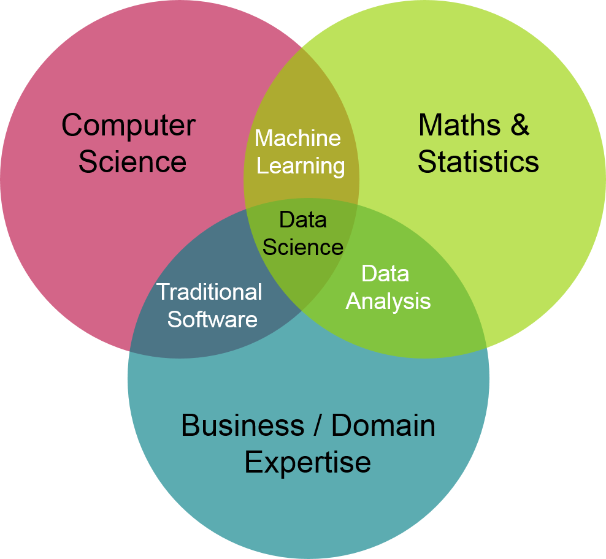
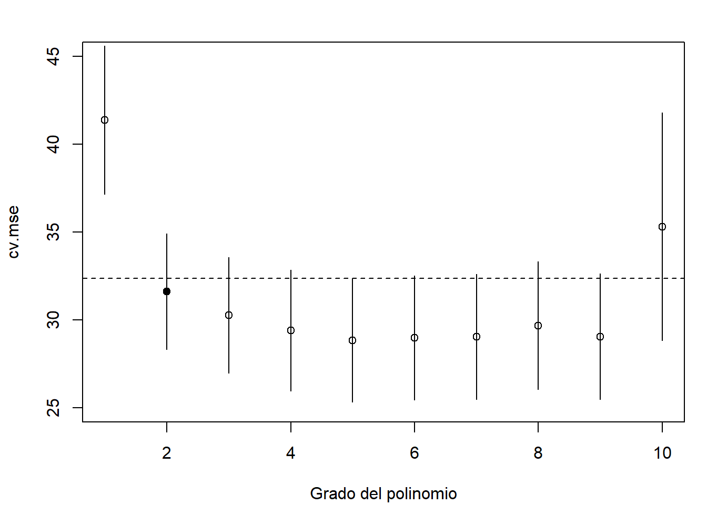
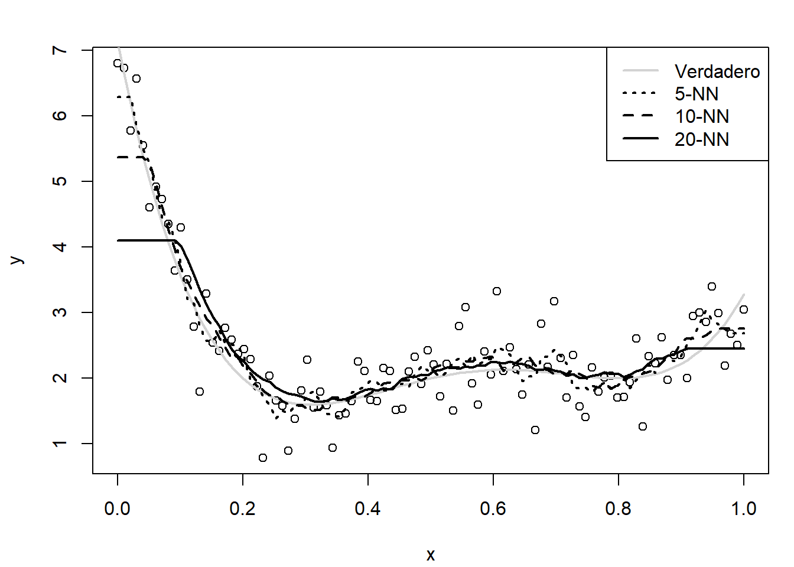
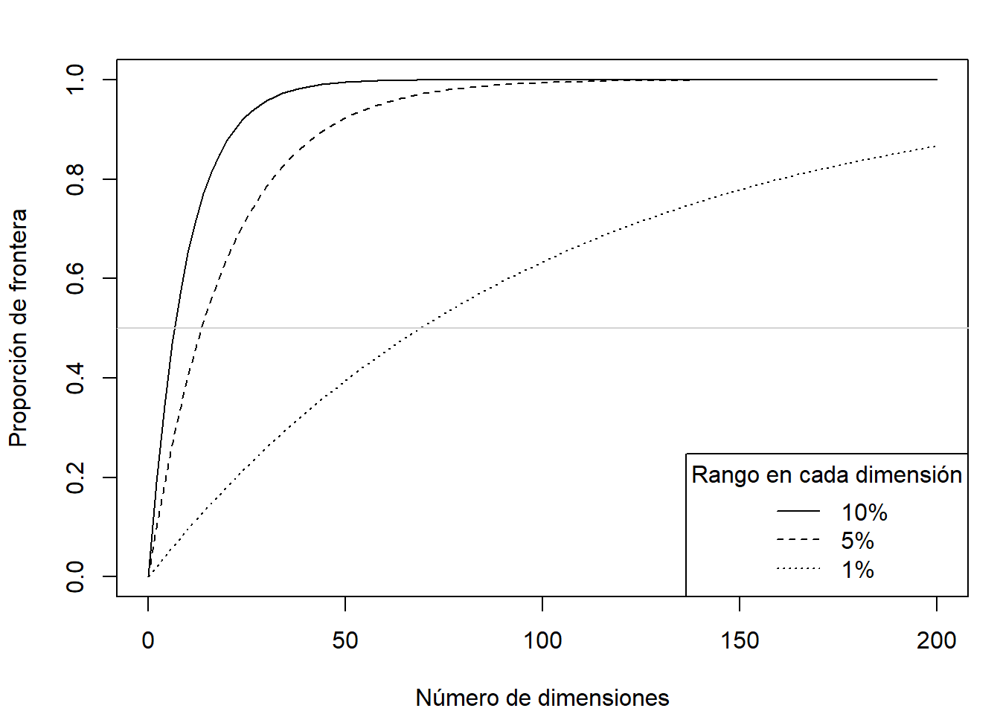

# Introducción al aprendizaje estadístico {#intro-AE}

<!-- Capítulo @ref(intro-AE) -->


<!-- 
---
title: "Introducción al Aprendizaje estadístico"
author: "Aprendizaje estadístico (UDC)"
date: "Máster en Técnicas Estadísticas"
bibliography: "aprendizaje.bib"
link-citations: yes
output: 
  bookdown::html_document2:
    pandoc_args: ["--number-offset", "0,0"]
    toc: yes 
    # mathjax: local            # copia local de MathJax, hay que establecer:
    # self_contained: false     # las dependencias se guardan en ficheros externos 
---

bookdown::preview_chapter("01-introduccion.Rmd")
knitr::purl("01-introduccion.Rmd", documentation = 2)
knitr::spin("01-introduccion.R", knit = FALSE)
-->

La denominada *ciencia de datos* (*data science*; también denominada *science of learning*) se ha vuelto muy popular hoy en día. Se trata de un campo multidisciplinar, con importantes aportaciones estadísticas e informáticas, dentro del que se incluyen disciplinas como *minería de datos* (*data mining*), *aprendizaje automático* (*machine learning*), *aprendizaje profundo* (*deep learning*), *modelado predictivo* (*predictive modeling*), *extracción de conocimiento* (*knowlegde discovery*) y también el *aprendizaje estadístico* [*statistical learning*, p.&nbsp;ej. @vapnik1998statistical; @vapnik2000nature].

<!-- 
(ref:diagrama-venn) Diagrama de Venn de la ciencia de datos (de [Drew Conway](http://drewconway.com/zia/2013/3/26/the-data-science-venn-diagram) modificado; ver también la versión 2.0 de [Steve's Machine Learning Blog ](http://www.anlytcs.com/2014/01/data-science-venn-diagram-v20.html)).

<div class="figure" style="text-align: center">

<p class="caption">(\#fig:diagrama-venn)(ref:diagrama-venn)</p>
</div>
-->

Podemos definir la ciencia de datos como el conjunto de conocimientos y herramientas utilizados en las distintas etapas del análisis de datos (ver Figura \@ref(fig:esquema)). Otras definiciones podrían ser:

-   El arte y la ciencia del análisis inteligente de los datos.

-   El conjunto de herramientas para entender y modelizar conjuntos (complejos) de datos.

-   El proceso de descubrir patrones y obtener conocimiento a partir de grandes conjuntos de datos (*big data*).

Además, esta ciencia incluye también la gestión (sin olvidarnos del proceso de obtención) y la manipulación de los datos.

<div class="figure" style="text-align: center">

<p class="caption">(\#fig:esquema)Etapas en el análisis de datos.</p>
</div>

Una de estas etapas (que están interrelacionadas) es la construcción de modelos, a partir de los datos, para aprender y predecir. Podríamos decir que el aprendizaje estadístico (AE) se encarga de este problema desde un punto de vista estadístico.

En *estadística* se consideran modelos estocásticos (con componente aleatoria), para tratar de tener en cuenta la incertidumbre debida a que no se disponga de toda la información sobre las variables que influyen en el fenómeno de interés. Esto es lo que se conoce como *aleatoriedad aparente*:

> "Nothing in Nature is random... a thing appears random only through the incompleteness of our knowledge."
>
> --- Spinoza, Baruch (*Ethics*, 1677).

Aunque hoy en día gana peso la idea de la física cuántica de que en el fondo hay una *aleatoriedad intrínseca*:

> "To my mind, although Spinoza lived and thought long before Darwin, Freud, Einstein, and the startling implications of quantum theory, he had a vision of truth beyond what is normally granted to human beings."
>
> --- Shirley, Samuel (*Complete Works*, 2002). Traductor de la obra completa de Spinoza al inglés.

La *inferencia estadística* proporciona herramientas para ajustar este tipo de modelos a los datos observados (seleccionar un modelo adecuado, estimar sus parámetros y contrastar su validez). Sin embargo, en la aproximación estadística clásica, como primer objetivo se trata de explicar por completo lo que ocurre en la población y, suponiendo que esto se puede hacer con modelos tratables analíticamente, emplear resultados teóricos (típicamente resultados asintóticos) para realizar inferencias (entre ellas la predicción). Los avances en computación han permitido el uso de modelos estadísticos más avanzados, principalmente métodos no paramétricos, muchos de los cuales no pueden ser tratados analíticamente (o no por completo). Este es el campo de la *estadística computacional*[^01-introduccion-1]. Desde este punto de vista, el AE se enmarcaría en este campo.

[^01-introduccion-1]: @lauro1996computational definió la estadística computacional como la disciplina que tiene como objetivo "diseñar algoritmos para implementar métodos estadísticos en computadoras, incluidos los impensables antes de la era de las computadoras (por ejemplo, *bootstrap*, simulación), así como hacer frente a problemas analíticamente intratables".

Cuando pensamos en AE, pensamos en:

-   Flexibilidad: se tratan de obtener las conclusiones basándose únicamente en los datos, evitando asumir hipótesis para poder emplear resultados teóricos. La idea es "dejar hablar" a los datos, no "encorsetarlos" a priori, dándoles mayor peso que a los modelos ([*power to the data*](https://insidebigdata.com/2016/01/13/machine-learning-manifesto) es un manifiesto del ML/AE).

<!--; ver Figura @ref(fig:powertothedata)). -->

-   Procesamiento automático de datos: de forma que el proceso de aprendizaje pueda realizarse con la menor intervención interactiva por parte del analista.

-   *Big data*: en el sentido amplio. Además de tamaño muestral o número de características, "*big*" puede hacer referencia a datos complejos o con necesidad de alta velocidad de proceso.

-   Predicción: el objetivo (inicial) suele ser únicamente la predicción de nuevas observaciones, los métodos son simples algoritmos.

<!--
(ref:powertothedata) Logo (ligeramente modificado para hacerlo más general) del manifiesto de ML [*Power to the Data!*](https://insidebigdata.com/2016/01/13/machine-learning-manifesto) de [Daniel Gutierrez](https://insidebigdata.com/author/dangutierrez).

<div class="figure" style="text-align: center">

<p class="caption">(\#fig:powertothedata)(ref:powertothedata)</p>
</div>
-->


Por el contrario, muchos de los métodos del AE no se preocupan (o se preocupan poco) por:

-   Reproducibilidad o repetibilidad: pequeños cambios en los datos pueden producir cambios notables en el modelo ajustado, aunque no deberían influir mucho en las predicciones. Además, muchas de las técnicas son aleatorias y el resultado puede depender de la semilla empleada (principalmente del tamaño muestral).

-   Cuantificación de la incertidumbre (en términos de probabilidad): se obtienen medidas globales de la eficiencia del algoritmo, pero resulta complicado cuantificar la precisión de una predicción concreta (en principio no se pueden obtener intervalos de predicción).

-   Inferencia: aparte de la predicción, la mayoría de los métodos no permiten realizan inferencias sobre características de la población (como contrastes de hipótesis).

Además, esta aproximación puede presentar diversos inconvenientes:

-   Algunos métodos son poco interpretables (se sacrifica la interpretabilidad por la precisión de las predicciones). Algunos son auténticas "cajas negras" y resulta complicado conocer los detalles del proceso interno utilizado para obtener las predicciones, incluyendo las interacciones y los efectos de los distintos predictores. Esto puede ser un problema tan complejo como su ajuste. En la Sección \@ref(analisis-modelos) se comentan, muy por encima, algunas herramientas que pueden ayudar a hacerlo.

-   Pueden aparecer problemas de sobreajuste (*overfitting*). Muchos métodos son tan flexibles que pueden llegar a ajustar "demasiado bien" los datos, pero pueden ser poco eficientes para predecir nuevas observaciones. En la Sección \@ref(const-eval) se describe con detalle este problema (y a continuación el procedimiento habitual para tratar de solventarlo). En los métodos estadísticos clásicos es más habitual que aparezcan problemas de infraajuste (*underfitting*).

-   Pueden presentar más problemas al extrapolar o interpolar (en comparación con los métodos clásicos). En general, se aplica el dicho *solo viste donde estuviste*. Cuanto más flexible sea el algoritmo, más cuidado habría que tener al predecir en nuevas observaciones alejadas de los valores de la muestra en la que se realizó el ajuste.

## Aprendizaje estadístico vs. aprendizaje automático

El término *machine learning* (ML; aprendizaje automático) se utiliza en el campo de la *inteligencia artificial* desde 1959 para hacer referencia, fundamentalmente, a algoritmos de predicción (inicialmente para reconocimiento de patrones). Muchas de las herramientas que utilizan provienen del campo de la estadística y, en cualquier caso, la estadística (y por tanto las matemáticas) es la base de todos estos enfoques para analizar datos (y no conviene perder la base formal). Por este motivo, desde la estadística computacional se introdujo el término *statistical learning* (aprendizaje estadístico) para hacer referencia a este tipo de herramientas, pero desde el punto de vista estadístico (teniendo en cuenta la incertidumbre debida a no disponer de toda la información).

Tradicionalmente, ML no se preocupa del origen de los datos. Incluso es habitual que se considere que un conjunto enorme de datos es equivalente a disponer de toda la información (*i.&nbsp;e.* a la población).

> "The sheer volume of data would obviate the need of theory and even scientific method."
>
> --- Chris Anderson, físico y periodista, 2008

Por el contrario, en el caso del AE se trata de comprender, en la medida de lo posible, el proceso subyacente del que provienen los datos y si estos son representativos de la población de interés (*i.&nbsp;e.* si tienen algún tipo de sesgo, especialmente de selección[^01-introduccion-2]). No obstante, en este libro se considerarán en general ambos términos como sinónimos.

[^01-introduccion-2]: También es importante detectar la presencia de algún tipo de error de medición, al menos como primer paso para tratar de predecir la respuesta libre de ruido.

AE y ML hacen un importante uso de la programación matemática, ya que muchos de los problemas se plantean en términos de la optimización de funciones bajo restricciones. Recíprocamente, en optimización también se utilizan algoritmos de AE/ML.

<!-- ### Machine Learning vs. Data Mining -->

Mucha gente utiliza indistintamente los nombres aprendizaje automático y *data mining* (DM). Sin embargo, aunque tienen mucho solapamiento, lo cierto es que hacen referencia a conceptos ligeramente distintos. ML es un conjunto de algoritmos principalmente dedicados a hacer predicciones y que son esencialmente automáticos, minimizando la intervención humana. DM intenta *entender* conjuntos de datos (en el sentido de encontrar sus patrones) y requiere de una intervención humana activa (al igual que la inferencia estadística tradicional), pero utiliza entre otras las técnicas automáticas de ML. Por tanto podríamos pensar que es más parecido al AE.

### Las dos culturas

<!-- Aprendizaje automático vs Estadística  -->

@breiman2001statistical (*Statistical modeling: The two cultures*) diferencia dos objetivos en el análisis de datos, que él llama *información* (en el sentido de *inferencia*) y *predicción*. Cada uno de estos objetivos da lugar a una cultura:

-   *Modelización de datos*: desarrollo de modelos (estocásticos) que permitan ajustar los datos y hacer inferencia. Es el trabajo habitual de los estadísticos académicos.

-   *Modelización algorítmica* (en el sentido de predictiva): esta cultura no está interesada en los mecanismos que generan los datos, solo en los algoritmos de predicción. Es el trabajo habitual de muchos estadísticos industriales y de muchos ingenieros informáticos. El ML es el núcleo de esta cultura que pone todo el énfasis en la precisión predictiva (así, un importante elemento dinamizador son las competiciones entre algoritmos predictivos, al estilo del [Netflix Challenge](https://en.wikipedia.org/wiki/Netflix_Prize)).

<!-- Numerosas contribuciones de este autor, algunas de ellas se referencian en los siguientes capítulos.  nota al pie? -->

<!-- Machine Learning vs. Estadística  -->

@dunson2018statistics (*Statistics in the big data era: Failures of the machine*) también expone las diferencias entre ambas culturas, por ejemplo en investigación (la forma en que evolucionan):

-   "Machine learning: The main publication outlets tend to be peer-reviewed conference proceedings and the style of research is very fast paced, trendy, and driven by performance metrics in prediction and related tasks".

-   "Statistical community: The main publication outlets are peer-reviewed journals, most of which have a long drawn out review process, and the style of research tends to be careful, slower paced, intellectual as opposed to primarily performance driven, emphasizing theoretical support (e.g., through asymptotic properties), under-stated, and conservative".

Las diferencias en los principales campos de aplicación y en el tipo de datos que manejan:

-   "*Big data* in ML typically means that the number of examples (i.e. sample size) is very large".

-   "In statistics (...) it has become common to collect high dimensional, complex and intricately structured data. Often the dimensionality of the data vastly exceeds the available sample size, and the fundamental challenge of the statistical analysis is obtaining new insights from these huge data, while maintaining reproducibility/replicability and reliability of the results".

En las conclusiones, alerta de los peligros:

-   "Big data that are subject to substantial selection bias and measurement errors, without information in the data about the magnitude, sources and types of errors, should not be used to inform important decisions without substantial care and skepticism".

-   "There is vast interest in automated methods for complex data analysis. However, there is a lack of consideration of (1) interpretability, (2) uncertainty quantification, (3) applications with limited training data, and (4) selection bias. Statistical methods can achieve (1)-(4) with a change in focus" (resumen del artículo).

Y destaca la importancia de tener en cuenta el punto de vista estadístico y las ventajas de la colaboración entre ambas áreas:

> "Such developments will likely require a close collaboration between the Stats and ML-communities and mindsets. 
> The emerging field of data science provides a key opportunity to forge a new approach for analyzing and interpreting large and complex data merging multiple fields."
>
> --- Dunson, D. B. (2018).


## Métodos de aprendizaje estadístico

Dentro de los problemas que aborda el aprendizaje estadístico se suelen diferenciar dos grandes bloques: el aprendizaje no supervisado y el supervisado. El *aprendizaje no supervisado* comprende los métodos exploratorios, es decir, aquellos en los que no hay una variable respuesta (al menos no de forma explícita). El principal objetivo de estos métodos es entender las relaciones y estructuras presentes en los datos, y pueden clasificarse en las siguientes categorías:

-   Análisis descriptivo.

-   Métodos de reducción de la dimensión (análisis de componentes principales, análisis factorial...).

-   Métodos de agrupación (análisis clúster).

-   Detección de datos atípicos.

Es decir, los métodos descriptivos tradicionalmente incluidos en *estadística multivariante* [ver @everitt2011introduction; @hair1998multivariate; o @hardle2013applied, por ejemplo, para una introducción a los métodos clásicos].

El *aprendizaje supervisado* engloba los métodos predictivos, en los que una de las variables está definida como variable respuesta. Su principal objetivo es la construcción de modelos que posteriormente se utilizarán, sobre todo, para hacer predicciones. Dependiendo del tipo de variable respuesta se diferencia entre:

-   Clasificación: si la respuesta es categórica (también se emplea la denominación de variable cualitativa, discreta o factor).

-   Regresión: cuando la respuesta es numérica (cuantitativa).

En este libro nos centraremos únicamente en el campo del aprendizaje supervisado y combinaremos la terminología propia de la estadística con la empleada en AE. Por ejemplo, en estadística es habitual considerar un problema de clasificación como un caso particular de regresión, empleando los denominados *modelos de regresión generalizados* (en la Sección \@ref(reg-glm) se introducen los *modelos lineales generalizados*, GLM). Por otra parte, en ocasiones se distingue entre casos particulares de un mismo tipo de modelos, como los considerados en el *diseño de experimentos* [ver @miller1973probabilidad; o @lawson2014design, por ejemplo].

<!-- referencias -->

### Notación y terminología {#notacion}

<!-- Emplearemos principalmente la terminología estadística, pero trataremos de incluir también la de ML -->

Denotaremos por $\mathbf{X}=(X_1, X_2, \ldots, X_p)$ al vector formado por las variables predictoras (variables explicativas o variables independientes; también *inputs* o *features* en la terminología de ML), cada una de las cuales podría ser tanto numérica como categórica[^01-introduccion-3]. En general (ver comentarios más adelante), emplearemos $Y(\mathbf{X})$ para referirnos a la variable objetivo (variable respuesta o variable dependiente; también *output* o *target* en la terminología de ML) que, como ya se comentó, puede ser una variable numérica (regresión) o categórica (clasificación).

[^01-introduccion-3]: Aunque hay que tener en cuenta que algunos métodos están diseñados solo para predictores numéricos, otros solo para categóricos y algunos para ambos tipos.

Supondremos que el objetivo principal es, a partir de una muestra: $$\left\{\left( y_{i}, x_{1i}, \ldots, x_{pi} \right)  : i = 1, \ldots, n \right\}$$ <!-- 
$$\left\{ \left( \mathbf{x}_{i}, y_{i} \right)  : i = 1, \ldots, n \right\},$$
siendo $\mathbf{x}_{i}=\left(  x_{1i},\ldots,x_{pi}\right)^{\prime}$ el vector de valores de las variables explicativas e $y_i$ el valor de la respuesta en la observación *i*-ésima,
--> obtener (futuras) predicciones $\hat Y(\mathbf{x})$ de la respuesta para $\mathbf{X}=\mathbf{x}=\left(x_{1}, \ldots, x_{p}\right)$. <!-- 
ajustando un modelo, diseñando un algoritmo, entrenando una *machine* o *learner* 

$\mathbf{Y}=\left(  y_{1},\ldots,y_{n}\right)^{\prime}$
vector de observaciones de la variable $Y$
-->

En regresión consideraremos como base el siguiente modelo general (podría ser después de una transformación de la respuesta):
\begin{equation} 
  Y(\mathbf{X})=m(\mathbf{X})+\varepsilon
  (\#eq:modelogeneral)
\end{equation} 
donde $m(\mathbf{x}) = E\left( \left. Y\right\vert \mathbf{X}=\mathbf{x} \right)$ es la media condicional, denominada función de regresión (o tendencia), y $\varepsilon$ es un error aleatorio de media cero y varianza $\sigma^2$, independiente de $\mathbf{X}$. Este modelo puede generalizarse de diversas formas, por ejemplo, asumiendo que la distribución del error depende de $\mathbf{X}$ (considerando $\varepsilon(\mathbf{X})$ en lugar de $\varepsilon$) podríamos incluir dependencia y heterocedasticidad. En estos casos normalmente se supone que lo hace únicamente a través de la varianza (error heterocedástico independiente), denotando por $\sigma^2(\mathbf{x}) = Var\left( \left. Y \right\vert \mathbf{X}=\mathbf{x} \right)$ la varianza condicional[^01-introduccion-4].

[^01-introduccion-4]: Por ejemplo, considerando en el modelo base $\sigma(\mathbf{X})\varepsilon$ como término de error y suponiendo adicionalmente que $\varepsilon$ tiene varianza uno.

Como ya se comentó, se podría considerar clasificación como un caso particular. Por ejemplo, definiendo $Y(\mathbf{X})$ de forma que tome los valores $1, 2, \ldots, K$, etiquetas que identifican las $K$ posibles categorías (también se habla de modalidades, niveles, clases o grupos). Sin embargo, muchos métodos de clasificación emplean variables auxiliares (variables *dummy*), indicadoras de las distintas categorías, y emplearemos la notación anterior para referirnos a estas variables (también denominadas variables *target*). En cuyo caso, denotaremos por $G(\mathbf{X})$ la respuesta categórica (la clase verdadera; $g_i$, $i =1, \ldots, n$, serían los valores observados) y por $\hat G(\mathbf{X})$ el predictor.

Por ejemplo, en el caso de dos categorías, se suele definir $Y$ de forma que toma el valor 1 en la categoría de interés (también denominada *éxito* o *resultado positivo*) y 0 en caso contrario (*fracaso* o *resultado negativo*)[^01-introduccion-5]. Además, en este caso, los modelos típicamente devuelven estimaciones de la probabilidad de la clase de interés en lugar de predecir directamente la clase, por lo que se empleará $\hat p$ en lugar de $\hat Y$. A partir de esa estimación se obtiene una predicción de la categoría. Normalmente se predice la clase más probable, lo que se conoce como la *regla de Bayes*, *i.&nbsp;e.* "éxito" si $\hat p(\mathbf{x}) > c = 0.5$ y "fracaso" en caso contrario (con probabilidad estimada $1 - \hat p(\mathbf{x})$).

[^01-introduccion-5]: Otra alternativa sería emplear $1$ y $-1$, algo que simplifica las expresiones de algunos métodos.

<!-- Revisar https://probably.tidymodels.org/articles/where-to-use.html -->

Es evidente que el modelo base general \@ref(eq:modelogeneral) puede no ser adecuado para modelar variables indicadoras (o probabilidades). Muchos de los métodos de AE emplean \@ref(eq:modelogeneral) para una variable auxiliar numérica (denominada puntuación o *score*) que se transforma a escala de probabilidades mediante la función logística (denominada función sigmoidal, *sigmoid function*, en ML)[^01-introduccion-6]: $$\operatorname{sigmoid}(s) = \frac{e^s}{1 + e^s}= \frac{1}{1 + e^{-s}}$$ de forma que $\hat p(\mathbf{x}) = \operatorname{sigmoid}(\hat Y(\mathbf{x}))$. Recíprocamente, empleando su inversa, la *función logit*: $$\operatorname{logit}(p)=\log\left( \frac{p}{1-p} \right)$$ se pueden transformar las probabilidades a la escala de puntuaciones (ver Figura \@ref(fig:sig-log)).

[^01-introduccion-6]: De especial interés en regresión logística y en redes neuronales artificiales.

<div class="figure" style="text-align: center">

<p class="caption">(\#fig:sig-log)Funciones sigmoidal (izquierda) y logit (derecha).</p>
</div>

Se puede generalizar el enfoque anterior para el caso de múltiples categorías. Por ejemplo, considerando variables indicadoras de cada categoría $Y_1, \ldots, Y_K$ (en cada una de ellas se asigna al resto de categorías un resultado negativo), lo que se conoce como la estrategia de "uno contra todos" (*One-vs-Rest*, OVR). En este caso típicamente se emplea la función *softmax* para reescalar las puntuaciones a un conjunto válido de probabilidades: $$\hat p_k(\mathbf{x}) = \operatorname{softmax}_k(\hat Y_1(\mathbf{x}), \ldots, \hat Y_K(\mathbf{x}))$$ para $k = 1,\ldots, K$, siendo: $$\operatorname{softmax}_k(\mathbf{s}) = \frac{e^{s_k}}{\sum_{j=1}^K e^{s_j}}$$ A partir de las cuales se obtiene la predicción de la categoría: $$\hat G(\mathbf{X}) = \underset{k}{\operatorname{argmax}} \left\{ \hat p_k(\mathbf{x}) : k = 1, 2, \ldots, K \right\}$$

Otra posible estrategia es la denominada "uno contra uno" (*One-vs-One*, OVO) o también conocida por "votación mayoritaria" (*majority voting*), que requiere entrenar un clasificador para cada par de categorías (se consideran $K(K-1)/2$ subproblemas de clasificación binaria). En este caso se suele seleccionar como predicción la categoría que recibe más votos (la que resultó seleccionada por el mayor número de los clasificadores binarios).

Otros métodos (como por ejemplo los árboles de decisión, que se tratarán en el Capítulo \@ref(trees)) permiten la estimación directa de las probabilidades de cada clase.

<!-- 
Pendiente:

Otra notación:
  $\mathcal{G}$ conjunto de posibles categorías
  Matrices en mayúsculas y negrita/caligráfico? 
  Mayúsculas y negrita/caligráfico con subíndice para referirse al vector columna? 
  Traspuesta al estilo de JSS 
-->

### Métodos (de aprendizaje supervisado) y paquetes de R {#metodos-pkgs}

Hay una gran cantidad de métodos de aprendizaje supervisado implementados en centenares de paquetes de [`R`](https://www.r-project.org) (ver por ejemplo [CRAN Task View: Machine Learning & Statistical Learning](https://cran.r-project.org/web/views/MachineLearning.html)). A continuación se muestran los principales métodos y algunos de los paquetes de R que los implementan (muchos son válidos tanto para regresión como para clasificación, como por ejemplo los basados en árboles, aunque aquí aparecen en su aplicación habitual).

<!-- Tabla? Incluir secciones libro? -->

Métodos (principalmente) de clasificación:

-   Análisis discriminante (lineal, cuadrático), regresión logística, multinomial...: `stats`, `MASS`.

-   Árboles de decisión, *bagging*, bosques aleatorios, *boosting*: `rpart`, `party`, `C50`, `Cubist`, `randomForest`, `adabag`, `xgboost`.

-   Máquinas de soporte vectorial: `kernlab`, `e1071`.

Métodos (principalmente) de regresión:

-   Modelos lineales:

    -   Regresión lineal: `lm()`, `lme()`, `biglm`.

    -   Regresión lineal robusta: `MASS::rlm()`.

    -   Métodos de regularización (*ridge regression*, LASSO): `glmnet`, `elasticnet`.

-   Modelos lineales generalizados: `glm()`, `bigglm`.

-   Modelos paramétricos no lineales: `nls()`, `nlme`.

-   Regresión local (vecinos más próximos y métodos de suavizado): `kknn`, `loess()`, `KernSmooth`, `sm`, `np`.

-   Modelos aditivos generalizados: `mgcv`, `gam`.

-   Regresión spline adaptativa multivariante: `earth`.

-   Regresión por *projection pursuit* (incluyendo *Single index model*): `ppr()`, `np::npindex()`.

-   Redes neuronales: `nnet`, `neuralnet`.

Como todos estos paquetes emplean opciones, estructuras y convenciones sintácticas diferentes, se han desarrollado paquetes que proporcionan interfaces unificadas a muchas de estas implementaciones. Entre ellos podríamos citar [`caret`](https://topepo.github.io/caret) [@R-caret; ver también @kuhn2013applied], [`mlr3`](https://mlr3.mlr-org.com) [@R-mlr3; @bischl2024applied] y [`tidymodels`](https://www.tidymodels.org) [@R-tidymodels; @manual-tidymodels; @kuhn2022tidy]. En la Sección \@ref(caret) se incluye una breve introducción al paquete [`caret`](https://topepo.github.io/caret) que será empleado en diversas ocasiones a lo largo del presente libro.

También existen paquetes de [`R`](https://www.r-project.org) que permiten utilizar plataformas de ML externas, como por ejemplo [`h2o`](https://github.com/h2oai/h2o-3/tree/master/h2o-r ) [@ledell2020h2o] o [`RWeka`](https://CRAN.R-project.org/package=RWeka) [@R-RWeka]. Adicionalmente, hay paquetes de R que disponen de entornos gráficos que permiten emplear estos métodos evitando el uso de comandos. Entre ellos estarían [`rattle`](https://rattle.togaware.com) [@R-rattle; ver también @williams2011data], [`radiant`](https://github.com/radiant-rstats/radiant) [@R-radiant] y `Rcmdr` [R-Commander, @R-RcmdrManual] con el plugin `RcmdrPlugin.FactoMineR` [@R-RcmdrPlugin.FactoMineR].


<!-- 
Otras opciones (incluyen métodos de AE?): 
RKWard: https://rkward.kde.org/
JASP: https://jasp-stats.org/
Deducer: https://www.deducer.org/
Jamovi: https://www.jamovi.org/
BlueSky: https://www.blueskystatistics.com/
-->

<!-- Sección @ref(const-eval) -->

## Construcción y evaluación de los modelos {#const-eval}

En inferencia estadística clásica el procedimiento habitual es emplear toda la información disponible para construir un modelo válido (que refleje de la forma más fiel posible lo que ocurre en la población) y, asumiendo que el modelo es el verdadero (lo que en general sería falso), utilizar resultados teóricos para evaluar su precisión. Por ejemplo, en el caso de regresión lineal múltiple, el coeficiente de determinación ajustado es una medida de la precisión del modelo para predecir nuevas observaciones (no se debe emplear el coeficiente de determinación sin ajustar; aunque, en cualquier caso, su validez depende de la de las suposiciones estructurales del modelo).

Alternativamente, en estadística computacional es habitual emplear técnicas de remuestreo para evaluar la precisión (entrenando también el modelo con todos los datos disponibles), principalmente validación cruzada (*leave-one-out*, *k-fold*), *jackknife* o bootstrap.

Por otra parte, como ya se comentó, algunos de los modelos empleados en AE son muy flexibles (están hiperparametrizados) y pueden aparecer problemas si se permite que se ajusten demasiado bien a las observaciones (podrían llegar a interpolar los datos). En estos casos habrá que controlar el procedimiento de aprendizaje, típicamente a través de parámetros relacionados con la complejidad del modelo (ver siguiente sección).

En AE se distingue entre parámetros estructurales, los que van a ser estimados al ajustar el modelo a los datos (en el entrenamiento), e hiperparámetros (*tuning parameters* o parámetros de ajuste), que imponen restricciones al aprendizaje del modelo (por ejemplo, determinando el número de parámetros estructurales). Si los hiperparámetros seleccionados producen un modelo demasiado complejo, aparecerán problemas de sobreajuste (*overfitting*), y en caso contrario, de infraajuste (*undefitting*).

Hay que tener en cuenta también que al aumentar la complejidad disminuye la interpretabilidad de los modelos. Se trata, por tanto, de conseguir buenas predicciones (habrá que evaluar la capacidad predictiva) con el modelo más sencillo posible.

<!-- Sección @ref(bias-variance) -->

### Equilibrio entre sesgo y varianza: infraajuste y sobreajuste {#bias-variance}

La idea es que queremos aprender más allá de los datos empleados en el entrenamiento (en estadística diríamos que queremos hacer inferencia sobre nuevas observaciones). Como ya se comentó, en AE hay que tener especial cuidado con el sobreajuste. Este problema ocurre cuando el modelo se ajusta demasiado bien a los datos de entrenamiento, pero falla cuando se utiliza en un nuevo conjunto de datos (nunca antes visto).

Como ejemplo ilustrativo emplearemos regresión polinómica, considerando el grado del polinomio como un hiperparámetro que determina la complejidad del modelo. En primer lugar simulamos una muestra y ajustamos modelos polinómicos con distintos grados de complejidad.


```r
# Simulación datos
n <- 30
x <- seq(0, 1, length = n)
mu <- 2 + 4*(5*x - 1)*(4*x - 2)*(x - 0.8)^2 # grado 4
sd <- 0.5
set.seed(1)
y <- mu + rnorm(n, 0, sd)
plot(x, y) 
lines(x, mu, lwd = 2)
# Ajuste de los modelos
fit1 <- lm(y ~ x)
lines(x, fitted(fit1))
fit2 <- lm(y ~ poly(x, 4))
lines(x, fitted(fit2), lty = 2)
fit3 <- lm(y ~ poly(x, 20)) 
lines(x, fitted(fit3), lty = 3)
legend("topright", lty = c(1, 1, 2, 3), lwd = c(2, 1, 1, 1),
       legend = c("Verdadero", "Ajuste con grado 1",
                  "Ajuste con grado 4", "Ajuste con grado 20"))
```

<div class="figure" style="text-align: center">

<p class="caption">(\#fig:polyfit)Muestra (simulada) y ajustes polinómicos con distinta complejidad.</p>
</div>


<!-- 
# NOTA: poly(x, degree, raw = FALSE) puede tener un problema de desbordamiento
# si degree > 25
-->

Como se observa en la Figura \@ref(fig:polyfit), al aumentar la complejidad del modelo se consigue un mejor ajuste a los datos observados (usados para el entrenamiento), a costa de un incremento en la variabilidad de las predicciones, lo que puede producir un mal comportamiento del modelo al ser empleado en un conjunto de datos distinto del observado.

Si calculamos medidas de bondad de ajuste, como el error cuadrático medio (*mean squared error*, MSE) o el coeficiente de determinación ($R^2$), se obtienen mejores resultados al aumentar la complejidad. Como se trata de modelos lineales, podríamos obtener también el coeficiente de determinación ajustado ($R^2_{adj}$), que sería preferible (en principio, ya que dependería de la validez de las hipótesis estructurales del modelo) para medir la precisión al emplear los modelos en un nuevo conjunto de datos (ver Tabla \@ref(tab:gof-polyfit)).


<!-- 
Nota:  
No distinguimos en la notación entre el valor teórico (MSE) y la estimación habitual en la práctica (*averaged squared error*, ASE), además de que se podrían tener en cuenta los grados de libertad.
-->


```r
sapply(list(fit1 = fit1, fit2 = fit2, fit3 = fit3),
       function(x) with(summary(x),
          c(MSE = mean(residuals^2), R2 = r.squared, R2adj = adj.r.squared)))
```


Table: (\#tab:gof-polyfit)Medidas de bondad de ajuste de los modelos polinómicos (obtenidas a partir de la muestra de entrenamiento).

|       | $MSE$| $R^2$| $R^2_{adj}$|
|:------|-----:|-----:|-----------:|
|`fit1` |  1.22|  0.20|        0.17|
|`fit2` |  0.19|  0.87|        0.85|
|`fit3` |  0.07|  0.95|        0.84|

Por ejemplo, si generamos nuevas respuestas de este proceso, la precisión del modelo más complejo empeorará considerablemente (ver Figura \@ref(fig:polyfit2)):


```r
y.new <- mu + rnorm(n, 0, sd)
plot(x, y) 
points(x, y.new, pch = 2)
lines(x, mu, lwd = 2)
lines(x, fitted(fit1))
lines(x, fitted(fit2), lty = 2)
lines(x, fitted(fit3), lty = 3)
leyenda <- c("Verdadero", "Muestra", "Ajuste con grado 1",
       "Ajuste con grado 4", "Ajuste con grado 20", "Nuevas observaciones")
legend("topright", legend = leyenda, lty = c(1, NA, 1, 2, 3, NA),
       lwd = c(2, NA, 1, 1, 1, NA), pch = c(NA, 1, NA, NA, NA, 2))
```

<div class="figure" style="text-align: center">

<p class="caption">(\#fig:polyfit2)Muestra con ajustes polinómicos con distinta complejidad y nuevas observaciones.</p>
</div>

```r
MSEP <- sapply(list(fit1 = fit1, fit2 = fit2, fit3 = fit3), 
               function(x) mean((y.new - fitted(x))^2))
MSEP
```

```
##    fit1    fit2    fit3 
## 1.49832 0.17112 0.26211
```

<!-- lines(x, y.new, type = "b", pch = 2, lty = 4, col = "blue") -->

Como ejemplo adicional, para evitar el efecto de la aleatoriedad de la muestra, en el siguiente código se simulan 100 muestras del proceso anterior a las que se les ajustan modelos polinómicos variando el grado desde 1 hasta 20. Posteriormente se evalúa la precisión, en la muestra empleada en el ajuste y en un nuevo conjunto de datos procedente de la misma población.


```r
nsim <- 100
set.seed(1)
grado.max <- 20
grados <- seq_len(grado.max) 
# Simulación, ajustes y errores cuadráticos
mse <- mse.new <- matrix(nrow = grado.max, ncol = nsim) 
for(i in seq_len(nsim)) {
  y <- mu + rnorm(n, 0, sd)
  y.new <- mu + rnorm(n, 0, sd)
  for (grado in grados) { # grado <- 1
    fit <- lm(y ~ poly(x, grado))
    mse[grado, i] <- mean(residuals(fit)^2)
    mse.new[grado, i] <- mean((y.new - fitted(fit))^2)
  }
}
# Representación errores simulaciones
matplot(grados, mse, type = "l", col = "lightgray", lty = 1, ylim = c(0, 2),
  xlab = "Grado del polinomio (complejidad)", ylab = "Error cuadrático medio")
matlines(grados, mse.new, type = "l", lty = 2, col = "lightgray") 
# Errores globales
precision <- rowMeans(mse)
precision.new <- rowMeans(mse.new)
lines(grados, precision, lwd = 2)
lines(grados, precision.new, lty = 2, lwd = 2)
abline(h = sd^2, lty = 3);abline(v = 4, lty = 3)
leyenda <-  c("Muestras", "Nuevas observaciones")
legend("topright", legend = leyenda, lty = c(1, 2))
```

<div class="figure" style="text-align: center">

<p class="caption">(\#fig:polyfitsim)Precisiones (errores cuadráticos medios) de ajustes polinómicos variando la complejidad, en las muestras empleadas en el ajuste y en nuevas observaciones (simulados).</p>
</div>

Como se puede observar en la Figura \@ref(fig:polyfitsim), los errores de entrenamiento disminuyen a medida que aumenta la complejidad del modelo. Sin embargo, los errores de predicción en nuevas observaciones inicialmente disminuyen, hasta alcanzar un mínimo marcado por la línea de puntos vertical, que se corresponde con el modelo de grado 4, y posteriormente aumentan (la línea de puntos horizontal es la varianza del proceso; el error cuadrático medio de predicción asintótico). La línea vertical representa el equilibrio entre el sesgo y la varianza. Considerando un valor de complejidad a la izquierda de esa línea tendríamos infraajuste (mayor sesgo y menor varianza), y a la derecha, sobreajuste (menor sesgo y mayor varianza).

Desde un punto de vista más formal, considerando el modelo \@ref(eq:modelogeneral) y una función de pérdidas cuadrática, el predictor óptimo (desconocido) sería la media condicional $m(\mathbf{x}) = E\left( \left. Y\right\vert \mathbf{X}=\mathbf{x} \right)$[^01-introduccion-7]. Por tanto, los predictores serían realmente estimaciones de la función de regresión, $\hat Y(\mathbf{x}) = \hat m(\mathbf{x})$, y podemos expresar la media del error cuadrático de predicción en términos del sesgo y la varianza: $$
\begin{aligned}
E \left( Y(\mathbf{x}_0) - \hat Y(\mathbf{x}_0) \right)^2 & = E \left( m(\mathbf{x}_0) + \varepsilon - \hat m(\mathbf{x}_0) \right)^2 = E \left( m(\mathbf{x}_0) - \hat m(\mathbf{x}_0) \right)^2 + \sigma^2 \\
& = E^2 \left( m(\mathbf{x}_0) - \hat m(\mathbf{x}_0) \right) + Var\left( \hat m(\mathbf{x}_0) \right) + \sigma^2 \\
& = \text{sesgo}^2 + \text{varianza} + \text{error irreducible}
\end{aligned}
$$ donde $\mathbf{x}_0$ hace referencia al vector de valores de las variables explicativas de una nueva observación (no empleada en la construcción del predictor).

[^01-introduccion-7]: Se podrían considerar otras funciones de pérdida, por ejemplo con la distancia $L_1$ sería la mediana condicional, pero las consideraciones serían análogas.

En general, al aumentar la complejidad disminuye el sesgo y aumenta la varianza (y viceversa). Esto es lo que se conoce como el dilema o compromiso entre el sesgo y la varianza (*bias-variance tradeoff*). La recomendación sería por tanto seleccionar los hiperparámetros (el modelo final) tratando de que haya un equilibrio entre el sesgo y la varianza (ver Figura \@ref(fig:biasvar)).

(ref:biasvar) Equilibrio entre sesgo y varianza (Fuente: [Wikimedia Commons](https://commons.wikimedia.org/wiki/File:Bias_and_variance_contributing_to_total_error.svg)).

<div class="figure" style="text-align: center">

<p class="caption">(\#fig:biasvar)(ref:biasvar)</p>
</div>

<!-- Sección @ref(entrenamiento-test) -->

### Datos de entrenamiento y datos de test {#entrenamiento-test}

Como se mostró en la sección anterior, hay que tener mucho cuidado si se pretende evaluar la precisión de las predicciones empleando la muestra de entrenamiento. Si el número de observaciones no es muy grande, se puede entrenar el modelo con todos los datos y emplear técnicas de remuestreo para evaluar la precisión (típicamente validación cruzada o bootstrap). Aunque habría que asegurarse de que el procedimiento de remuestreo empleado es adecuado (por ejemplo, la presencia de dependencia requeriría de métodos más sofisticados).

Sin embargo, si el número de observaciones es grande, se suele emplear el procedimiento tradicional en ML, que consiste en particionar la base de datos en 2 (o incluso en 3) conjuntos (disjuntos):

-   Conjunto de datos de entrenamiento (o aprendizaje) para construir los modelos.

-   Conjunto de datos de test para evaluar el rendimiento de los modelos (los errores observados en esta muestra servirán para aproximar lo que ocurriría con nuevas observaciones).

Típicamente se selecciona al azar el 80&#8239;% de los datos como muestra de entrenamiento y el 20&#8239;% restante como muestra de test, aunque esto dependería del número de datos (los resultados serán aleatorios y su variabilidad dependerá principalmente del tamaño de las muestras). En R se puede realizar el particionamiento de los datos empleando la función [`sample()`](https://rdrr.io/r/base/sample.html) del paquete base (otra alternativa sería emplear la función [`createDataPartition()`](https://rdrr.io/pkg/caret/man/createDataPartition.html) del paquete `caret`, como se describe en la Sección \@ref(caret)).

Como ejemplo consideraremos el conjunto de datos [`Boston`](https://rdrr.io/pkg/MASS/man/Boston.html) del paquete `MASS` [@R-MASS] que contiene, entre otros datos, la valoración de las viviendas (`medv`, mediana de los valores de las viviendas ocupadas, en miles de dólares) y el porcentaje de población con "menor estatus" (`lstat`) en los suburbios de Boston. Podemos construir las muestras de entrenamiento (80&#8239;%) y de test (20&#8239;%) con el siguiente código:


```r
data(Boston, package = "MASS")
set.seed(1)
nobs <- nrow(Boston)
itrain <- sample(nobs, 0.8 * nobs)
train <- Boston[itrain, ]
test <- Boston[-itrain, ]
```

Los datos de test deberían utilizarse únicamente para evaluar los modelos finales, no se deberían emplear para seleccionar hiperparámetros. Para seleccionarlos se podría volver a particionar los datos de entrenamiento, es decir, dividir la muestra en tres subconjuntos: datos de entrenamiento, de validación y de test (por ejemplo considerando un 70&#8239;%, 15&#8239;% y 15&#8239;% de las observaciones, respectivamente). Para cada combinación de hiperparámetros se ajustaría el correspondiente modelo con los datos de entrenamiento, se emplearían los de validación para evaluarlos y posteriormente seleccionar los valores "óptimos". Por último, se emplean los datos de test para evaluar el rendimiento del modelo seleccionado. No obstante, lo más habitual es seleccionar los hiperparámetros empleando validación cruzada (u otro tipo de remuestreo) en la muestra de entrenamiento, en lugar de considerar una muestra adicional de validación. En la siguiente sección se tratará esta última aproximación. En la Sección \@ref(bagging) (Bagging) se describirá cómo usar remuestreo para evaluar la precisión de las predicciones y su aplicación para la selección de hiperparámetros.

<!-- Sección @ref(cv) -->

### Selección de hiperparámetros mediante validación cruzada {#cv}

Como se mencionó anteriormente, una herramienta para evaluar la calidad predictiva de un modelo es la *validación cruzada* (CV, *cross-validation*), que permite cuantificar el error de predicción utilizando una única muestra de datos. En su versión más simple, validación cruzada dejando uno fuera (*leave-one-out cross-validation*, LOOCV), para cada observación de la muestra se realiza un ajuste empleando el resto de las observaciones, y se mide el error de predicción en esa observación (único dato no utilizado en el ajuste del modelo). Finalmente, combinando todos los errores individuales se pueden obtener medidas globales del error de predicción (o aproximar otras características de su distribución).

El método de LOOCV requeriría, en principio (ver comentarios más adelante), el ajuste de un modelo para cada observación, por lo que pueden aparecer problemas computacionales si el conjunto de datos es grande. En este caso se suelen emplear grupos de observaciones en lugar de observaciones individuales. Si se particiona el conjunto de datos en *k* grupos, típicamente 10 o 5 grupos, se denomina *k-fold cross-validation* (LOOCV sería un caso particular considerando un número de grupos igual al número de observaciones)[^01-introduccion-8]. Hay muchas variaciones de este método, entre ellas particionar repetidamente de forma aleatoria los datos en un conjunto de entrenamiento y otro de validación (de esta forma, algunas observaciones podrían aparecer repetidas varias veces y otras ninguna en las muestras de validación).

[^01-introduccion-8]: La partición en *k-fold* CV se suele realizar al azar. Hay que tener en cuenta la aleatoriedad al emplear *k-fold* CV, algo que no ocurre con LOOCV.

Continuando con el ejemplo anterior, supongamos que queremos emplear regresión polinómica para explicar la valoración de las viviendas a partir del "estatus" de los residentes (ver Figura \@ref(fig:boston-mass)). Al igual que se hizo en la Sección \@ref(bias-variance), consideraremos el grado del polinomio como un hiperparámetro.

(ref:boston-mass) Gráfico de dispersión de las valoraciones de las viviendas (`medv`) frente al porcentaje de población con "menor estatus" (`lstat`).


```r
plot(medv ~ lstat, data = train)
```

<div class="figure" style="text-align: center">

<p class="caption">(\#fig:boston-mass)(ref:boston-mass)</p>
</div>

Podríamos emplear la siguiente función que devuelve para cada observación (fila) de una muestra de entrenamiento, el error de predicción en esa observación ajustando un modelo lineal con todas las demás observaciones:


```r
cv.lm0 <- function(formula, datos) {
    respuesta <- as.character(formula)[2] # extraer nombre variable respuesta
    n <- nrow(datos)
    cv.res <- numeric(n)
    for (i in 1:n) {
        modelo <- lm(formula, datos[-i, ])
        cv.pred <- predict(modelo, newdata = datos[i, ])
        cv.res[i] <- cv.pred - datos[i, respuesta]
    }
    return(cv.res)
}
```

La función anterior no es muy eficiente, pero se podría modificar fácilmente para otros métodos de regresión[^01-introduccion-9]. En el caso de regresión lineal múltiple (y de otros predictores lineales), se pueden obtener fácilmente las predicciones eliminando una de las observaciones a partir del ajuste con todos los datos. Por ejemplo, en lugar de la anterior, sería preferible emplear la siguiente función (consultar la ayuda de [`rstandard()`](https://rdrr.io/r/stats/influence.measures.html)):

[^01-introduccion-9]: Pueden ser de interés el paquete [`cv`](https://CRAN.R-project.org/package=cv) [@R-cv] y también la función `cv.glm()` del paquete [`boot`](https://CRAN.R-project.org/package=boot) [@R-boot].


```r
cv.lm <- function(formula, datos) {
    modelo <- lm(formula, datos)
    return(rstandard(modelo, type = "predictive"))
}
```

Empleando esta función, podemos calcular una medida del error de predicción de validación cruzada (en este caso el error cuadrático medio) para cada valor del hiperparámetro (grado del ajuste polinómico) y seleccionar el que lo minimiza (ver Figura \@ref(fig:cv-mse)).


```r
grado.max <- 10
grados <- seq_len(grado.max) 
cv.mse <- cv.mse.sd <- numeric(grado.max)
for(grado in grados){
  # Tiempo de computación elevado!
  # cv.res <- cv.lm0(medv ~ poly(lstat, grado), train) 
  cv.res <- cv.lm(medv ~ poly(lstat, grado), train)
  se <- cv.res^2
  cv.mse[grado] <- mean(se)
  cv.mse.sd[grado] <- sd(se)/sqrt(length(se))
}
plot(grados, cv.mse, ylim = c(25, 45), xlab = "Grado del polinomio")
# Valor óptimo
imin.mse <- which.min(cv.mse)
grado.min <- grados[imin.mse]
points(grado.min, cv.mse[imin.mse], pch = 16)
```

<div class="figure" style="text-align: center">

<p class="caption">(\#fig:cv-mse)Error cuadrático medio de validación cruzada dependiendo del grado del polinomio (complejidad)  y valor seleccionado con el criterio de un error estándar (punto sólido).</p>
</div>

```r
grado.min
```

```
## [1] 5
```

En lugar de emplear los valores óptimos de los hiperparámetros, @breiman1984classification propusieron la regla de "un error estándar" para seleccionar la complejidad del modelo. La idea es que estamos trabajando con estimaciones de la precisión y pueden presentar variabilidad (si cambiamos la muestra o cambiamos la partición, los resultados seguramente cambiarán), por lo que la sugerencia es seleccionar el modelo más simple[^01-introduccion-10] dentro de un error estándar de la precisión del modelo correspondiente al valor óptimo (se consideraría que no hay diferencias significativas en la precisión; además, se mitigaría el efecto de la variabilidad debida a aleatoriedad, incluyendo la inducida por la elección de la semilla; ver figuras \@ref(fig:cv-onese) y \@ref(fig:boston-final)).

[^01-introduccion-10]: Suponiendo que los modelos se pueden ordenar del más simple al más complejo.


```r
plot(grados, cv.mse, ylim = c(25, 45),
  xlab = "Grado del polinomio")
segments(grados, cv.mse - cv.mse.sd, grados, cv.mse + cv.mse.sd)
# Límite superior "oneSE rule" 
upper.cv.mse <- cv.mse[imin.mse] + cv.mse.sd[imin.mse]
abline(h = upper.cv.mse, lty = 2)
# Complejidad mínima por debajo del límite
imin.1se <- min(which(cv.mse <= upper.cv.mse))
grado.1se <- grados[imin.1se]
points(grado.1se, cv.mse[imin.1se], pch = 16)
```

<div class="figure" style="text-align: center">

<p class="caption">(\#fig:cv-onese)Error cuadrático medio de validación cruzada dependiendo del grado del polinomio (complejidad) y valor seleccionado con el criterio de un error estándar (punto sólido).</p>
</div>

```r
grado.1se
```

```
## [1] 2
```


```r
plot(medv ~ lstat, data = train)
fit.min <- lm(medv ~ poly(lstat, grado.min), train)
fit.1se <- lm(medv ~ poly(lstat, grado.1se), train)
newdata <- data.frame(lstat = seq(0, 40, len = 100))
lines(newdata$lstat, predict(fit.min, newdata = newdata))
lines(newdata$lstat, predict(fit.1se, newdata = newdata), lty = 2)
legend("topright", legend = c(paste("Grado óptimo:", grado.min), 
       paste("oneSE rule:", grado.1se)), lty = c(1, 2))
```

<div class="figure" style="text-align: center">

<p class="caption">(\#fig:boston-final)Ajuste de los modelos finales, empleando el valor óptimo (línea continua) y el criterio de un error estándar (línea discontinua) para seleccionar el grado del polinomio mediante validación cruzada.</p>
</div>

Es importante destacar que la selección aleatoria puede no ser muy adecuada en el caso de dependencia, por ejemplo, para series de tiempo. En este caso se suele emplear el denominado *rolling forecasting*, considerando las observaciones finales como conjunto de validación, y para predecir en cada una de ellas se ajusta el modelo considerando únicamente observaciones anteriores [para más detalles, ver por ejemplo la [Sección 5.10](https://otexts.com/fpp3/tscv.html) de @hyndman2021forecasting].

### Evaluación de un método de regresión {#eval-reg}

Para estudiar la precisión de las predicciones de un método de regresión se evalúa el modelo en el conjunto de datos de test y se comparan las predicciones frente a los valores reales. Los resultados servirán como medidas globales de la calidad de las predicciones con nuevas observaciones.


```r
obs <- test$medv
pred <- predict(fit.min, newdata = test)
```

Si generamos un gráfico de dispersión de observaciones frente a predicciones[^01-introduccion-11], los puntos deberían estar en torno a la recta $y=x$ (ver Figura \@ref(fig:obs-pred-plot)).

[^01-introduccion-11]: Otras implementaciones, como la función `caret::plotObsVsPred()`, intercambian los ejes, generando un gráfico de dispersión de predicciones sobre observaciones.


<!-- 
Volver a intentar incluir latex en leyenda con referencia externa:
(ref:obs-pred) Gráfico de dispersión de observaciones frente a predicciones, incluyendo la recta $x=y$ (línea continua) y el ajuste lineal (línea discontinua). 
-->


```r
plot(pred, obs, xlab = "Predicción", ylab = "Observado")
abline(a = 0, b = 1)
res <- lm(obs ~ pred)
# summary(res)
abline(res, lty = 2)
```

<div class="figure" style="text-align: center">

<p class="caption">(\#fig:obs-pred-plot)Gráfico de dispersión de observaciones frente a predicciones (incluyendo la identidad, línea continua, y el ajuste lineal, línea discontinua).</p>
</div>

Este gráfico está implementado en la función [`pred.plot()`](https://rubenfcasal.github.io/mpae/reference/pred.plot.html) del paquete [`mpae`](https://rubenfcasal.github.io/mpae) (aunque por defecto añade el suavizado robusto `lowess(pred, obs)`).

También es habitual calcular distintas medidas de error. Por ejemplo, podríamos emplear la función `postResample()` del paquete `caret`:


```r
caret::postResample(pred, obs)
```

```
##     RMSE Rsquared      MAE 
##  4.85267  0.62596  3.66718
```

La función anterior, además de las medidas de error habituales (que dependen en su mayoría de la escala de la variable respuesta), calcula un *pseudo R-cuadrado*. En este paquete (y en muchos otros, como `tidymodels` o `rattle`) se emplea uno de los más utilizados, el cuadrado del coeficiente de correlación entre las predicciones y los valores observados (que se corresponde con la línea discontinua en la Figura \@ref(fig:obs-pred-plot)). Su valor se suele interpretar como el del coeficiente de determinación en regresión lineal (aunque únicamente es una medida de correlación), y sería deseable que su valor fuese próximo a 1. Hay otras alternativas [ver @kvaalseth1985cautionary], pero la idea es que deberían medir la proporción de variabilidad de la respuesta (en nuevas observaciones) explicada por el modelo, algo que en general no es cierto con el anterior[^01-introduccion-12]. La recomendación sería utilizar: $$\tilde R^2 = 1 - \frac{\sum_{i=1}^n(y_i - \hat y_i)^2}{\sum_{i=1}^n(y_i - \bar y)^2}$$ (que sería una medida equivalente al coeficiente de determinación ajustado en regresión múltiple, pero sin depender de hipótesis estructurales del modelo), implementado junto con otras medidas en la siguiente función (incluida en el paquete [`mpae`](https://rubenfcasal.github.io/mpae)):

[^01-introduccion-12]: Por ejemplo obtendríamos el mismo valor si desplazamos las predicciones sumando una constante (*i.&nbsp;e.* no tiene en cuenta el sesgo). Lo que interesaría sería medir la proximidad de los puntos a la recta $y=x$.


```r
accuracy <- function(pred, obs, na.rm = FALSE, 
                     tol = sqrt(.Machine$double.eps)) {
  err <- obs - pred     # Errores
  if(na.rm) {
    is.a <- !is.na(err)
    err <- err[is.a]
    obs <- obs[is.a]
  }  
  perr <- 100*err/pmax(obs, tol)  # Errores porcentuales
  return(c(
    me = mean(err),           # Error medio
    rmse = sqrt(mean(err^2)), # Raíz del error cuadrático medio 
    mae = mean(abs(err)),     # Error absoluto medio
    mpe = mean(perr),         # Error porcentual medio
    mape = mean(abs(perr)),   # Error porcentual absoluto medio
    r.squared = 1 - sum(err^2)/sum((obs - mean(obs))^2) # Pseudo R-cuadrado
  ))
}
accu.min <- accuracy(pred, obs)
accu.min
```

```
##        me      rmse       mae       mpe      mape r.squared 
##  -0.67313   4.85267   3.66718  -8.23225  19.70974   0.60867
```

```r
accu.1se <- accuracy(predict(fit.1se, newdata = test), obs)
accu.1se
```

```
##        me      rmse       mae       mpe      mape r.squared 
##  -0.92363   5.27974   4.12521  -9.00298  21.65124   0.53676
```

En este caso concreto (con la semilla establecida anteriormente), estimaríamos que el ajuste polinómico con el grado óptimo (seleccionado al minimizar el error cuadrático medio de validación cruzada) explicaría un 60.9 % de la variabilidad de la respuesta en nuevas observaciones (un 7.2 % más que el modelo seleccionado con el criterio de un error estándar de Breiman).

::: {#train-validate-test .exercise}
Considerando de nuevo el ejemplo anterior, particiona la muestra en datos de entrenamiento (70&#8239;%), de validación (15&#8239;%) y de test (15&#8239;%), para entrenar los modelos polinómicos, seleccionar el grado óptimo (el hiperparámetro) y evaluar las predicciones del modelo final, respectivamente.

Podría ser de utilidad el siguiente código (basado en la aproximación de `rattle`), que particiona los datos suponiendo que están almacenados en el data.frame `df`:


```r
df <- Boston
set.seed(1)
nobs <- nrow(df)
itrain <- sample(nobs, 0.7 * nobs)
inotrain <- setdiff(seq_len(nobs), itrain)
ivalidate <- sample(inotrain, 0.15 * nobs)
itest <- setdiff(inotrain, ivalidate)
train <- df[itrain, ]
validate <- df[ivalidate, ]
test <- df[itest, ]
```

Alternativamente podríamos emplear la función `split()`, creando un factor que divida aleatoriamente los datos en tres grupos[^01-introduccion-13]:


```r
set.seed(1)
p <- c(train = 0.7, validate = 0.15, test = 0.15)
f <- sample( rep(factor(seq_along(p), labels = names(p)),
                 times = nrow(df)*p/sum(p)) )
samples <- suppressWarnings(split(df, f))
str(samples, 1)
```

```
## List of 3
##  $ train   :'data.frame':	356 obs. of  14 variables:
##  $ validate:'data.frame':	75 obs. of  14 variables:
##  $ test    :'data.frame':	75 obs. of  14 variables:
```
:::

[^01-introduccion-13]: Versión "simplificada" (y más eficiente) de una de las propuestas en el post [https://stackoverflow.com/questions/36068963](https://stackoverflow.com/questions/36068963/r-how-to-split-a-data-frame-into-training-validation-and-test-sets). En el caso de que la longitud del factor `f` no coincida con el número de filas (por redondeo), se generaría un *warning* (suprimido) y se reciclaría.

### Evaluación de un método de clasificación {#eval-class}

Para estudiar la eficiencia de un método de clasificación supervisada típicamente se obtienen las predicciones para el conjunto de datos de test y se genera una tabla de contingencia, denominada *matriz de confusión*, comparando las predicciones con los valores reales.

En primer lugar, consideraremos el caso de dos categorías. La matriz de confusión será de la forma:

| Observado/Predicción  |         Positivo          |         Negativo          |
|:---------------------:|:-------------------------:|:-------------------------:|
|       Positivo        | Verdaderos positivos (TP) |   Falsos negativos (FN)   |
|       Negativo        |   Falsos positivos (FP)   | Verdaderos negativos (TN) |

A partir de esta tabla se pueden obtener distintas medidas de la precisión de las predicciones (serían medidas globales de la calidad de la predicción de nuevas observaciones). Por ejemplo, dos de las más utilizadas son la tasa de verdaderos positivos y la de verdaderos negativos (tasas de acierto en positivos y negativos), también denominadas *sensibilidad* y *especificidad*:

-   Sensibilidad (*sensitivity*, *recall*, *hit rate*, *true positive rate*; TPR): $$TPR = \frac{TP}{P} = \frac{TP}{TP+FN}$$

-   Especificidad (*specificity*, *true negative rate*; TNR): $$TNR = \frac{TN}{TN+FP}$$

La precisión global o tasa de aciertos (*accuracy*; ACC) sería: $$ACC = \frac{TP + TN}{P + N} = \frac{TP+TN}{TP+TN+FP+FN}$$ Sin embargo, hay que tener cuidado con esta medida cuando las clases no están balanceadas. Otras medidas de la precisión global que tratan de evitar este problema son la *precisión balanceada* (*balanced accuracy*, BA): $$BA = \frac{TPR + TNR}{2}$$ (media aritmética de TPR y TNR) o la *puntuación F1* (*F1 score*; media armónica de TPR y el valor predictivo positivo, PPV, descrito más adelante): $$F_1 = \frac{2TP}{2TP+FP+FN}$$ Otra medida global es el coeficiente kappa de Cohen [@cohen1960], que compara la tasa de aciertos con la obtenida en una clasificación al azar (empleando la proporción de cada clase): $$\kappa = \frac{2 (TP \cdot TN - FN \cdot FP)}{(TP + FP) (FP + TN) + (TP + FN) (FN + TN)}$$ Un valor de 1 indicaría máxima precisión y 0 que la precisión es igual a la que obtendríamos clasificando al azar.

También hay que ser cauteloso al emplear medidas que utilizan como estimación de la probabilidad de positivo (denominada *prevalencia*) la tasa de positivos en la muestra de test, como el valor (o índice) predictivo positivo (*precision*, *positive predictive value*; PPV): $$PPV = \frac{TP}{TP+FP}$$ (que no debe ser confundido con la precisión global ACC) y el valor predictivo negativo (NPV): $$NPV = \frac{TN}{TN+FN},$$ si la muestra de test no refleja lo que ocurre en la población (por ejemplo si la clase de interés está sobrerrepresentada en la muestra). En estos casos habrá que recalcularlos empleando estimaciones válidas de las probabilidades de la clases (por ejemplo, en estos casos, la función `caret::confusionMatrix()` permite establecer estimaciones válidas mediante el argumento `prevalence`).

Como ejemplo emplearemos los datos anteriores de valoraciones de viviendas y estatus de la población, considerando como respuesta una nueva variable `fmedv` que clasifica las valoraciones en "Bajo" o "Alto" dependiendo de si `medv > 25`.


```r
# data(Boston, package = "MASS")
datos <- Boston
datos$fmedv <- factor(datos$medv > 25, # levels = c('FALSE', 'TRUE')
                      labels = c("Bajo", "Alto")) 
```

En este ejemplo, si realizamos un análisis descriptivo de la respuesta, podemos observar que las clases no están balanceadas:


```r
table(datos$fmedv)
```

```
## 
## Bajo Alto 
##  382  124
```

En este caso también emplearemos el estatus de los residentes (`lstat`) como único predictor. Como se puede observar en la Figura \@ref(fig:featureplot), hay diferencias en su distribución dependiendo de la categoría, por lo que aparentemente es de utilidad para predecir el nivel de valoración de las viviendas.


```r
caret::featurePlot(datos$lstat, datos$fmedv, plot = "density",
                   labels = c("lstat", "Densidad"), auto.key = TRUE)
```

<div class="figure" style="text-align: center">

<p class="caption">(\#fig:featureplot)Distribución del estatus de la población dependiendo del nivel de valoración de las viviendas.</p>
</div>

Como método de clasificación emplearemos regresión logística (este tipo de modelos se tratarán en la Sección \@ref(reg-glm)). El siguiente código realiza la partición de los datos y ajusta este modelo, considerando `lstat` como única variable explicativa, a la muestra de entrenamiento:


```r
# Particionado de los datos
set.seed(1)
nobs <- nrow(datos)
itrain <- sample(nobs, 0.8 * nobs)
train <- datos[itrain, ]
test <- datos[-itrain, ]
# Ajuste modelo
modelo <- glm(fmedv ~ lstat, family = binomial, data = train)
modelo
```

```
## 
## Call:  glm(formula = fmedv ~ lstat, family = binomial, data = train)
## 
## Coefficients:
## (Intercept)        lstat  
##       3.744       -0.542  
## 
## Degrees of Freedom: 403 Total (i.e. Null);  402 Residual
## Null Deviance:	    461 
## Residual Deviance: 243 	AIC: 247
```

En este tipo de modelos podemos calcular las estimaciones de la probabilidad de la segunda categoría empleando `predict()` con `type = "response"`, a partir de las cuales podemos establecer las predicciones como la categoría más probable:


```r
obs <- test$fmedv
p.est <- predict(modelo, type = "response", newdata = test)
pred <- factor(p.est > 0.5, labels = c("Bajo", "Alto"))
```

Finalmente, podemos obtener la matriz de confusión en distintos formatos:


```r
tabla <- table(obs, pred)
# addmargins(tabla, FUN = list(Total = sum))
tabla
```

```
##       pred
## obs    Bajo Alto
##   Bajo   71   11
##   Alto    8   12
```

```r
# Porcentajes respecto al total
print(100*prop.table(tabla), digits = 2) 
```

```
##       pred
## obs    Bajo Alto
##   Bajo 69.6 10.8
##   Alto  7.8 11.8
```

```r
# Porcentajes (de aciertos y fallos) por categorías
print(100*prop.table(tabla, 1), digits = 3) 
```

```
##       pred
## obs    Bajo Alto
##   Bajo 86.6 13.4
##   Alto 40.0 60.0
```

Alternativamente, podemos emplear la función [`confusionMatrix()`](https://rdrr.io/pkg/caret/man/confusionMatrix.html) del paquete `caret`, que proporciona distintas medidas de precisión:


```r
caret::confusionMatrix(pred, obs, positive = "Alto", mode = "everything")
```

```
## Confusion Matrix and Statistics
## 
##           Reference
## Prediction Bajo Alto
##       Bajo   71    8
##       Alto   11   12
##                                         
##                Accuracy : 0.814         
##                  95% CI : (0.724, 0.884)
##     No Information Rate : 0.804         
##     P-Value [Acc > NIR] : 0.460         
##                                         
##                   Kappa : 0.441         
##                                         
##  Mcnemar's Test P-Value : 0.646         
##                                         
##             Sensitivity : 0.600         
##             Specificity : 0.866         
##          Pos Pred Value : 0.522         
##          Neg Pred Value : 0.899         
##               Precision : 0.522         
##                  Recall : 0.600         
##                      F1 : 0.558         
##              Prevalence : 0.196         
##          Detection Rate : 0.118         
##    Detection Prevalence : 0.225         
##       Balanced Accuracy : 0.733         
##                                         
##        'Positive' Class : Alto          
## 
```

Si el método de clasificación proporciona estimaciones de las probabilidades de las categorías, disponemos de más información en la clasificación que también podemos emplear en la evaluación del rendimiento. Por ejemplo, se puede realizar un análisis descriptivo de las probabilidades estimadas y las categorías observadas en la muestra de test (ver Figura \@ref(fig:classprob)):


```r
# Imitamos la función caret::plotClassProbs()
library(lattice) 
histogram(~ p.est | obs, xlab = "Probabilidad estimada", 
          ylab = "Porcentaje (de la categoría)")
```

<div class="figure" style="text-align: center">

<p class="caption">(\#fig:classprob)Distribución de las probabilidades estimadas de valoración alta de la vivienda dependiendo de la categoría observada.</p>
</div>

Para evaluar las estimaciones de las probabilidades se suele emplear la curva ROC (*receiver operating characteristics*, característica operativa del receptor; diseñada inicialmente en el campo de la detección de señales). Como ya se comentó, normalmente se emplea $c = 0.5$ como punto de corte para clasificar en la categoría de interés (*regla de Bayes*), aunque se podrían considerar otros valores (por ejemplo, para mejorar la clasificación en una de las categorías, a costa de empeorar la precisión global). En la curva ROC se representa la sensibilidad (TPR) frente a la tasa de falsos negativos (FNR = 1 $-$ TNR = 1 $-$ especificidad) para distintos valores de corte (ver Figura \@ref(fig:ROC-curve)). Para ello se puede emplear el paquete `pROC` [@R-pROC]:


```r
library(pROC)
roc_glm <- roc(response = obs, predictor = p.est)
plot(roc_glm, xlab = "Especificidad", ylab = "Sensibilidad")
```

<div class="figure" style="text-align: center">

<p class="caption">(\#fig:ROC-curve)Curva ROC correspondiente al modelo de regresión logística.</p>
</div>


<!-- 
View((as.data.frame(roc_glm[2:4])))
plot(roc_glm, legacy.axes = TRUE, print.thres = 0.5)
-->

Lo ideal sería que la curva se aproximase a la esquina superior izquierda (máxima sensibilidad y especificidad). La recta diagonal se correspondería con un clasificador aleatorio. Una medida global del rendimiento del clasificador es el área bajo la curva ROC (AUC; equivalente al estadístico U de Mann-Whitney o al índice de Gini). Un clasificador perfecto tendría un valor de 1, mientras que un clasificador aleatorio tendría un valor de 0.5.


```r
# roc_glm$auc
roc_glm
```

```
## 
## Call:
## roc.default(response = obs, predictor = p.est)
## 
## Data: p.est in 82 controls (obs Bajo) < 20 cases (obs Alto).
## Area under the curve: 0.843
```

```r
ci.auc(roc_glm)
```

```
## 95% CI: 0.743-0.943 (DeLong)
```

Como comentario adicional, aunque se puede modificar el punto de corte para mejorar la clasificación en la categoría de interés (de hecho, algunas herramientas como `h2o` lo modifican por defecto; en este caso concreto para maximizar $F_1$ en la muestra de entrenamiento), muchos métodos de clasificación (como los basados en árboles descritos en el Capítulo 2) admiten como opción una matriz de pérdidas que se tendrá en cuenta para medir la eficiencia durante el aprendizaje. Si está disponible, esta sería la aproximación recomendada.

En el caso de más de dos categorías podríamos generar una matriz de confusión de forma análoga, aunque en principio solo podríamos calcular medidas globales de la precisión como la tasa de aciertos o el coeficiente kappa de Cohen. Podríamos obtener también medidas por clase, como la sensibilidad y la especificidad, siguiendo la estrategia "uno contra todos" descrita en la Sección \@ref(notacion). Esta aproximación es la que sigue la función `confusionMatrix()` del paquete `caret` (devuelve las medidas comparando cada categoría con las restantes en el componente `$byClass`).

Como ejemplo ilustrativo, consideraremos el conocido conjunto de datos `iris` [@fisher1936use], en el que el objetivo es clasificar flores de lirio en tres especies (`Species`) a partir del largo y ancho de sépalos y pétalos, aunque en este caso emplearemos un clasificador aleatorio.


```r
data(iris)
# Partición de los datos
datos <- iris
set.seed(1)
nobs <- nrow(datos)
itrain <- sample(nobs, 0.8 * nobs)
train <- datos[itrain, ]
test <- datos[-itrain, ]
# Entrenamiento 
prevalences <- table(train$Species)/nrow(train)
prevalences
```

```
## 
##     setosa versicolor  virginica 
##    0.32500    0.31667    0.35833
```

```r
# Calculo de las predicciones
levels <- names(prevalences) # levels(train$Species)
f <- factor(levels, levels = levels) 
pred.rand <- sample(f, nrow(test), replace = TRUE, prob = prevalences)
# Evaluación
caret::confusionMatrix(pred.rand, test$Species)
```

```
## Confusion Matrix and Statistics
## 
##             Reference
## Prediction   setosa versicolor virginica
##   setosa          3          3         1
##   versicolor      4          2         5
##   virginica       4          7         1
## 
## Overall Statistics
##                                         
##                Accuracy : 0.2           
##                  95% CI : (0.077, 0.386)
##     No Information Rate : 0.4           
##     P-Value [Acc > NIR] : 0.994         
##                                         
##                   Kappa : -0.186        
##                                         
##  Mcnemar's Test P-Value : 0.517         
## 
## Statistics by Class:
## 
##                      Class: setosa Class: versicolor Class: virginica
## Sensitivity                  0.273            0.1667           0.1429
## Specificity                  0.789            0.5000           0.5217
## Pos Pred Value               0.429            0.1818           0.0833
## Neg Pred Value               0.652            0.4737           0.6667
## Prevalence                   0.367            0.4000           0.2333
## Detection Rate               0.100            0.0667           0.0333
## Detection Prevalence         0.233            0.3667           0.4000
## Balanced Accuracy            0.531            0.3333           0.3323
```


<!--
Ejercicio palmer penguins
Otro conjunto de datos alternativos es el conocido PalmerPenguins
-->

<!-- Sección @ref(dimen-curse) -->

## La maldición de la dimensionalidad {#dimen-curse}

Podríamos pensar que al aumentar el número de variables explicativas se mejora la capacidad predictiva de los modelos. Lo cual, en general, sería cierto si realmente los predictores fuesen de utilidad para explicar la respuesta. Sin embargo, al aumentar el número de dimensiones se pueden agravar notablemente muchos de los problemas que ya pueden aparecer en dimensiones menores; esto es lo que se conoce como la *maldición de la dimensionalidad* [*curse of dimensionality*, @bellman1961adaptive].

Uno de estos problemas es el denominado *efecto frontera* que ya puede aparecer en una dimensión, especialmente al trabajar con modelos flexibles (como ajustes polinómicos con grados altos o los métodos locales que trataremos en el Capítulo 6). La idea es que en la "frontera" del rango de valores de una variable explicativa vamos a disponer de pocos datos y los errores de predicción van a tener gran variabilidad (se están haciendo extrapolaciones de los datos, más que interpolaciones, y van a ser menos fiables).

Cuando el número de datos es más o menos grande, podríamos pensar en predecir la respuesta a partir de lo que ocurre en las observaciones cercanas a la posición de predicción, esta es la idea de los métodos locales (Sección \@ref(reg-local)). Uno de los métodos de este tipo más conocidos es el de los *k-vecinos más cercanos* (*k-nearest neighbors*; KNN). Se trata de un método muy simple, pero que puede ser muy efectivo, que se basa en la idea de que localmente la media condicional (la predicción óptima) es constante. Concretamente, dados un entero $k$ (hiperparámetro) y un conjunto de entrenamiento $\mathcal{T}$, para obtener la predicción correspondiente a un vector de valores de las variables explicativas $\mathbf{x}$, el método de regresión[^01-introduccion-14] KNN promedia las observaciones en un vecindario $\mathcal{N}_k(\mathbf{x}, \mathcal{T})$ formado por las $k$ observaciones más cercanas a $\mathbf{x}$: $$\hat{Y}(\mathbf{x}) = \hat{m}(\mathbf{x}) = \frac{1}{k} \sum_{i \in \mathcal{N}_k(\mathbf{x}, \mathcal{T})} Y_i$$ Para ello sería necesario definir una distancia, normalmente la distancia euclídea entre los predictores estandarizados. Este método está implementado en numerosos paquetes, por ejemplo en la función [`knnreg()`](https://rdrr.io/pkg/caret/man/knnreg.html) del paquete `caret`.

[^01-introduccion-14]: En el caso de clasificación se considerarían las variables indicadoras de las categorías y se obtendrían las frecuencias relativas en el vecindario como estimaciones de las probabilidades de las clases.

Como ejemplo consideraremos un problema de regresión simple, con un conjunto de datos simulados (del proceso ya considerado en la Sección \@ref(bias-variance)) con 100 observaciones (que ya podríamos considerar que no es muy pequeño; ver Figura \@ref(fig:knnfit2)):


```r
# Simulación datos
n <- 100
x <- seq(0, 1, length = n)
mu <- 2 + 4*(5*x - 1)*(4*x - 2)*(x - 0.8)^2 # grado 4
sd <- 0.5
set.seed(1)
y <- mu + rnorm(n, 0, sd)
datos <- data.frame(x = x, y = y)
# Representar
plot(x, y)
lines(x, mu, lwd = 2, col = "lightgray")
# Ajuste de los modelos
library(caret)
# k = número de observaciones más cercanas
fit1 <- knnreg(y ~ x, data = datos, k = 5) # 5% de los datos (n = 100)
fit2 <- knnreg(y ~ x, data = datos, k = 10)
fit3 <- knnreg(y ~ x, data = datos, k = 20)
# Añadir predicciones y leyenda
newdata <- data.frame(x = x)
lines(x, predict(fit1, newdata), lwd = 2, lty = 3)
lines(x, predict(fit2, newdata), lwd = 2, lty = 2)
lines(x, predict(fit3, newdata), lwd = 2)
legend("topright", legend = c("Verdadero", "5-NN", "10-NN", "20-NN"), 
       lty = c(1, 3, 2, 1), lwd = 2, col = c("lightgray", 1, 1, 1))
```

<div class="figure" style="text-align: center">

<p class="caption">(\#fig:knnfit2)Predicciones con el método KNN y distintos vecindarios.</p>
</div>

A medida que aumenta $k$ disminuye la complejidad del modelo y se observa un incremento del efecto frontera. Habría que seleccionar un valor óptimo de $k$ (buscando un equilibro entre sesgo y varianza, como se mostró en la Sección \@ref(bias-variance) y se ilustrará en la última sección de este capítulo empleando este método con el paquete `caret`), que dependerá de la tendencia teórica y del número de datos. En este caso, para $k=5$, podríamos pensar que el efecto frontera aparece en el 10&#8239;% más externo del rango de la variable explicativa (con un número mayor de datos podría bajar al 1&#8239;%). Al aumentar el número de variables explicativas, considerando que el 10&#8239;% más externo del rango de cada una de ellas constituye la "frontera" de los datos, tendríamos que la proporción de frontera sería $1-0.9^d$, siendo $d$ el número de dimensiones. Lo que se traduce en que, con $d = 10$, el 65&#8239;% del espacio predictivo sería frontera y en torno al 88&#8239;% para $d=20$, es decir, al aumentar el número de dimensiones el problema del efecto frontera será generalizado (ver Figura \@ref(fig:pfrontera)).


```r
curve(1 - 0.9^x, 0, 200, ylab = 'Proporción de frontera', 
      xlab = 'Número de dimensiones')
curve(1 - 0.95^x, lty = 2, add = TRUE)
curve(1 - 0.99^x, lty = 3, add = TRUE)
abline(h = 0.5, col = "lightgray")
legend("bottomright", title = "Rango en cada dimensión", 
       legend = c("10%" , "5%", "1%"), lty = c(1, 2, 3))
```

<div class="figure" style="text-align: center">

<p class="caption">(\#fig:pfrontera)Proporción de frontera dependiendo del número de dimensiones y del porcentaje de valores considerados extremos en cada dimensión.</p>
</div>

Desde otro punto de vista, suponiendo que los predictores se distribuyen de forma uniforme, la densidad de las observaciones es proporcional a $n^{1/d}$, siendo $n$ el tamaño muestral. Por lo que si consideramos que una muestra de tamaño $n=100$ es suficientemente densa en una dimensión, para obtener la misma densidad muestral en 10 dimensiones tendríamos que disponer de un tamaño muestral de $n = 100^{10} = 10^{20}$. Por tanto, cuando el número de dimensiones es grande no va a haber muchas observaciones en el entorno de la posición de predicción y puede haber serios problemas de sobreajuste si se pretende emplear un modelo demasiado flexible (por ejemplo, KNN con $k$ pequeño). Hay que tener en cuenta que, en general, fijado el tamaño muestral, la flexibilidad de los modelos aumenta al aumentar el número de dimensiones del espacio predictivo.

Otro de los problemas que se agravan notablemente al aumentar el número de dimensiones es el de colinealidad (Sección \@ref(colinealidad)), o en general el de concurvidad (Sección \@ref(mgcv-diagnosis)), que puede producir que muchos métodos (como los modelos lineales o las redes neuronales) sean muy poco eficientes o inestables (llegando incluso a que no se puedan aplicar). Además, complica notablemente la interpretación de cualquier método. Esto está relacionado también con la dificultad para determinar qué variables son de interés para predecir la respuesta (*i.&nbsp;e.* no son ruido). Debido a la aleatoriedad, predictores que realmente no están relacionados con la respuesta pueden ser tenidos en cuenta por el modelo con mayor facilidad (KNN con las opciones habituales tiene en cuenta todos los predictores con el mismo peso). Lo que resulta claro es que si se agrega ruido se producirá un incremento en el error de predicción. Incluso si las variables añadidas resultan ser relevantes, si el número de observaciones es pequeño en comparación, el incremento en la variabilidad de las predicciones puede no compensar la disminución del sesgo de predicción.

Como conclusión, en el caso multidimensional habrá que tratar de emplear métodos que minimicen estos problemas. Muchos métodos de AE realizan automáticamente una selección de predictores (o una ponderación, asignando más o menos peso según su relevancia), normalmente a través de un hiperparámetro de complejidad del modelo. Un ejemplo serían los arboles de decisión descritos en el Capítulo \@ref(trees). En este caso, se habla de procedimientos integrados de selección (*embedded selection methods*). Sin embargo, el procedimiento habitual es emplear métodos por pasos que vayan añadiendo y/o eliminando predictores tratando de buscar la combinación óptima que maximice el rendimiento del modelo. Por ejemplo, en las secciones \@ref(seleccion-rlm) y \@ref(seleccion-glm), se describen los procedimientos tradicionales de inferencia para modelos lineales y modelos lineales generalizados. En este tipo de métodos, que utilizan un algoritmo de búsqueda para seleccionar los predictores que se incluirán en el ajuste, se emplea un procedimiento de selección denominado envolvente (*wrapper selection method*). Una alternativa más simple, para evitar problemas computacionales, es el filtrado previo de los predictores (*filter methods*), de forma que solo se incluyen en el ajuste los que aparentemente están más relacionados con la respuesta. Sin embargo, hay que tener en cuenta que las medidas clásicas de dependencia, como el coeficiente de correlación de Pearson o el coeficiente de correlación parcial, solo permiten detectar relaciones simples entre predictores y respuesta. Puede ser preferible emplear medidas propuestas recientemente, como la correlación de distancias [@szekely2007measuring], que también permiten cuantificar relaciones no lineales de distintos tipos de predictores (univariantes, multivariantes, funcionales, direccionales...)[^01-introduccion-15]. La construcción y selección de predictores es una de las líneas tradicionales de estudio en AE/ML, aunque quedaría fuera de los objetivos principales de este libro y solo se tratará superficialmente. Para más detalles, ver por ejemplo @kuhn2019feature.

[^01-introduccion-15]: Por ejemplo, @febrero2019variable propusieron un método secuencial (hacia delante) que utiliza la correlación de distancias para seleccionar predictores, implementado en la función `fregre.gsam.vs()` del paquete [`fda.usc`](https://github.com/moviedo5/fda.usc) [@R-fdausc].

<!-- Sección @ref(analisis-modelos) -->

## Análisis e interpretación de los modelos {#analisis-modelos}

El análisis e interpretación de modelos es un campo muy activo en AE/ML, para el que recientemente se ha acuñado el término de *interpretable machine learning* (IML). A continuación, se resumen brevemente algunas de las principales ideas; para más detalles ver por ejemplo @molnar2020interpretable.

Como ya se comentó, a medida que aumenta la complejidad de los modelos generalmente disminuye su interpretabilidad, por lo que normalmente interesa encontrar el modelo más simple posible que resulte de utilidad para los objetivos propuestos. Aunque el objetivo principal sea la predicción, una vez obtenido el modelo final suele interesar medir la importancia de cada predictor en el modelo y, si es posible, cómo influye en la predicción de la respuesta, es decir, estudiar el efecto de las variables explicativas. Esto puede presentar serias dificultades, especialmente en modelos complejos en los que hay interacciones entre los predictores (el efecto de una variable explicativa depende de los valores de otras).

La mayoría de los métodos de aprendizaje supervisado permiten obtener medidas de la importancia de las variables explicativas en la predicción (ver por ejemplo la [ayuda](https://topepo.github.io/caret/variable-importance.html) de la función `caret::varImp()`; en algunos casos, como los métodos basados en árboles, incluso de las variables no incluidas en el modelo final). Muchos de los métodos de clasificación, en lugar de proporcionar medidas globales, calculan medidas para cada categoría. Alternativamente, también se pueden obtener medidas de la importancia de las variables mediante procedimientos generales, en el sentido de que se pueden aplicar a cualquier modelo, pero suelen requerir de mucho más tiempo de computación [ver @molnar2020interpretable, Capítulo 5].

En algunos de los métodos se modelan explícitamente los efectos de los distintos predictores y estos se pueden analizar con (más o menos) facilidad. Hay que tener en cuenta que, al margen de las interacciones, la colinealidad/concurvidad dificulta notablemente el estudio de los efectos de las variables explicativas. Otros métodos son más del tipo "caja negra" (*black box*) y precisan de aproximaciones más generales, como los gráficos PDP [*Partial Dependence Plots*, @friedman2008predictive; ver también @greenwell2020dblp], o las curvas ICE [*Individual Conditional Expectation*, p.&nbsp;ej. @goldstein2015peeking]. Estos métodos tratan de estimar el efecto marginal de las variables explicativas y son similares a los gráficos parciales de residuos, habitualmente empleados en los modelos lineales o aditivos (ver las funciones `termplot()`, `car::crPlots()` o `car::avPlots()`, Sección 6.4, y `mgcv::plot.gam()`, Sección 7.3), que muestran la variación en la predicción a medida que varía una variable explicativa manteniendo constantes el resto (algo que tiene sentido si asumimos que los predictores son independientes); pero en este caso se admite que el resto de los predictores también pueden variar.

En el caso de los gráficos PDP, se tiene en cuenta el efecto marginal de los demás predictores del modelo. Suponiendo que estamos interesados en un conjunto $\mathbf X^S$ de predictores, de forma que $\mathbf X = [\mathbf X^S, \mathbf X^C]$ y $f_{\mathbf X^C}(\mathbf x^C) = \int f(\mathbf x) d\mathbf x^S$ es la densidad marginal de $\mathbf X^C$, se trata de aproximar: $$\hat Y_S(\mathbf x^S) = E_{\mathbf X^C}\left[\hat{Y}(\mathbf x^S,\mathbf X^C)\right]=\int\hat{Y}(\mathbf x^S,\mathbf x^C)f_{\mathbf X^C}(\mathbf x^C)d\mathbf x^C$$ mediante: $$\hat{y}_{\mathbf x^S}(\mathbf x^S)=\frac{1}{n}\sum_{i=1}^n\hat{y}(\mathbf x^S, \mathbf x^C_i)$$ donde $n$ en el tamaño de la muestra de entrenamiento y $\mathbf x^C_i$ son los valores observados de las variables explicativas en las que no estamos interesados. La principal diferencia con los gráficos ICE es que, en lugar de mostrar una única curva promedio de la respuesta, estos muestran una curva para cada observación [ver p.&nbsp;ej. @molnar2020interpretable, [Sección 9.1](https://christophm.github.io/interpretable-ml-book/ice.html#ice)]. En la Sección \@ref(ejemplo-clasif-rf) se incluyen algunos ejemplos.


<!-- 
Pendiente:
Actualizar referencias Molnar, 2020, a secciones
-->

La teoría de juegos cooperativos y las técnicas de optimización de investigación operativa también se están utilizando, en problemas de clasificación, para evaluar la importancia de las variables predictoras y determinar las más influyentes. Por citar algunos, @strumbelj2010efficient proponen un procedimiento general basado en el valor de Shapley de juegos cooperativos [ver p.&nbsp;ej. @molnar2020interpretable, [Sección 9.5](https://christophm.github.io/interpretable-ml-book/shapley.html#shapley), o `?iml::Shapley()`], y en @agor2019feature se propone el uso de algoritmos genéticos para determinar los predictores más influyentes.

Entre los paquetes de R que incorporan herramientas de este tipo podríamos destacar:

-   [`pdp`](https://bgreenwell.github.io/pdp/index.html) [@R-pdp]: Partial Dependence Plots (también implementa curvas ICE y es compatible con `caret`).

-   [`iml`](https://christophm.github.io/iml) [@R-iml]: Interpretable Machine Learning.

-   [`DALEX`](https://modeloriented.github.io/DALEX) [@R-DALEX]: moDel Agnostic Language for Exploration and eXplanation.

-   [`lime`](https://lime.data-imaginist.com) [@R-lime]: Local Interpretable Model-Agnostic Explanations.

-   [`vip`](https://koalaverse.github.io/vip/index.html) [@R-vip]: Variable Importance Plots.

-   [`vivid`](https://alaninglis.github.io/vivid) [@R-vivid]: Variable Importance and Variable Interaction Displays.

-   [`ICEbox`](https://CRAN.R-project.org/package=ICEbox) [@goldstein2015peeking]: Individual Conditional Expectation Plot Toolbox. <!-- Herramientas para visualizar el gráfico ICE y el modelo estimado por cualquier algoritmo de aprendizaje supervisado -->

-   [`plotmo`](http://www.milbo.users.sonic.net/) [@R-plotmo]: Plot a Model's Residuals, Response, and Partial Dependence Plots.<!-- Dibuja las superficies del modelo estimado utilizando gráficos de dependencia parcial y otras técnicas -->

-   [`randomForestExplainer`](https://modeloriented.github.io/randomForestExplainer) [@R-randomForestExplainer]: Explaining and Visualizing Random Forests in Terms of Variable Importance. <!--conjunto de herramientas para explicar y visualizar los modelos de bosque aleatorio  -->

También pueden ser de utilidad las funciones `caret::varImp()` y `h2o::h2o.partialPplot()`. En los siguientes capítulos se mostrarán ejemplos empleando algunas de estas herramientas.

<!-- Sección @ref(caret) -->

## Introducción al paquete `caret` {#caret}

Como ya se comentó en la Sección \@ref(metodos-pkgs), el paquete [`caret`](https://topepo.github.io/caret) [*Classification And REgression Training*, @kuhn2008building; ver también @caret2019manual] proporciona una interfaz unificada que simplifica el proceso de modelado empleando la mayoría de los métodos de AE implementados en R [actualmente admite 239 métodos, listados en el [Capítulo 6](https://topepo.github.io/caret/available-models.html) de @caret2019manual]. Además de proporcionar rutinas para los principales pasos del proceso, incluye también numerosas funciones auxiliares que permiten implementar nuevos procedimientos. Este paquete ha dejado de desarrollarse de forma activa y se espera que en un futuro próximo sea sustituido por el paquete [`tidymodels`](https://www.tidymodels.org) [ver @kuhn2022tidy], aunque hemos optado por utilizarlo en este libro porque consideramos que esta alternativa aún se encuentra en fase de desarrollo y además requiere de mayor tiempo de aprendizaje.

En esta sección se describirán de forma esquemática las principales herramientas disponibles en este paquete, para más detalles se recomienda consultar el manual [@caret2019manual]. También está disponible una pequeña introducción en la *vignette* del paquete: [*A Short Introduction to the caret Package*](https://cran.r-project.org/web/packages/caret/vignettes/caret.html)[^01-introduccion-16].

[^01-introduccion-16]: Accesible con el comando `vignette("caret")`. También puede resultar de interés la "chuleta" [https://github.com/rstudio/cheatsheets/blob/main/caret.pdf](https://raw.githubusercontent.com/rstudio/cheatsheets/master/caret.pdf).

<!-- 
### Métodos implementados 
-->

La función principal es [`train()`](https://rdrr.io/pkg/caret/man/train.html), que incluye un parámetro `method` que permite establecer el modelo mediante una cadena de texto. Podemos obtener información sobre los modelos disponibles con las funciones `getModelInfo()` y `modelLookup()` (puede haber varias implementaciones del mismo método con distintas configuraciones de hiperparámetros; también se pueden definir nuevos modelos, ver el [Capítulo 13](https://topepo.github.io/caret/using-your-own-model-in-train.html) del [manual](https://topepo.github.io/caret)).


```r
library(caret)
str(names(getModelInfo()))  # Listado de los métodos disponibles
```

```
##  chr [1:239] "ada" "AdaBag" "AdaBoost.M1" "adaboost" ...
```

```r
# names(getModelInfo("knn")) # Encuentra 2 métodos
modelLookup("knn")  # Información sobre hiperparámetros
```

```
##   model parameter      label forReg forClass probModel
## 1   knn         k #Neighbors   TRUE     TRUE      TRUE
```

En la siguiente tabla se muestran los métodos actualmente disponibles:

<div class="figure" style="text-align: center">

```{=html}
<div class="datatables html-widget html-fill-item-overflow-hidden html-fill-item" id="htmlwidget-7bf94cd961c11210a1ca" style="width:100%;height:auto;"></div>
<script type="application/json" data-for="htmlwidget-7bf94cd961c11210a1ca">{"x":{"filter":"none","vertical":false,"data":[["ada","AdaBag","AdaBoost.M1","adaboost","amdai","ANFIS","avNNet","awnb","awtan","bag","bagEarth","bagEarthGCV","bagFDA","bagFDAGCV","bam","bartMachine","bayesglm","binda","blackboost","blasso","blassoAveraged","bridge","brnn","BstLm","bstSm","bstTree","C5.0","C5.0Cost","C5.0Rules","C5.0Tree","cforest","chaid","CSimca","ctree","ctree2","cubist","dda","deepboost","DENFIS","dnn","dwdLinear","dwdPoly","dwdRadial","earth","elm","enet","evtree","extraTrees","fda","FH.GBML","FIR.DM","foba","FRBCS.CHI","FRBCS.W","FS.HGD","gam","gamboost","gamLoess","gamSpline","gaussprLinear","gaussprPoly","gaussprRadial","gbm_h2o","gbm","gcvEarth","GFS.FR.MOGUL","GFS.LT.RS","GFS.THRIFT","glm.nb","glm","glmboost","glmnet_h2o","glmnet","glmStepAIC","gpls","hda","hdda","hdrda","HYFIS","icr","J48","JRip","kernelpls","kknn","knn","krlsPoly","krlsRadial","lars","lars2","lasso","lda","lda2","leapBackward","leapForward","leapSeq","Linda","lm","lmStepAIC","LMT","loclda","logicBag","LogitBoost","logreg","lssvmLinear","lssvmPoly","lssvmRadial","lvq","M5","M5Rules","manb","mda","Mlda","mlp","mlpKerasDecay","mlpKerasDecayCost","mlpKerasDropout","mlpKerasDropoutCost","mlpML","mlpSGD","mlpWeightDecay","mlpWeightDecayML","monmlp","msaenet","multinom","mxnet","mxnetAdam","naive_bayes","nb","nbDiscrete","nbSearch","neuralnet","nnet","nnls","nodeHarvest","null","OneR","ordinalNet","ordinalRF","ORFlog","ORFpls","ORFridge","ORFsvm","ownn","pam","parRF","PART","partDSA","pcaNNet","pcr","pda","pda2","penalized","PenalizedLDA","plr","pls","plsRglm","polr","ppr","pre","PRIM","protoclass","qda","QdaCov","qrf","qrnn","randomGLM","ranger","rbf","rbfDDA","Rborist","rda","regLogistic","relaxo","rf","rFerns","RFlda","rfRules","ridge","rlda","rlm","rmda","rocc","rotationForest","rotationForestCp","rpart","rpart1SE","rpart2","rpartCost","rpartScore","rqlasso","rqnc","RRF","RRFglobal","rrlda","RSimca","rvmLinear","rvmPoly","rvmRadial","SBC","sda","sdwd","simpls","SLAVE","slda","smda","snn","sparseLDA","spikeslab","spls","stepLDA","stepQDA","superpc","svmBoundrangeString","svmExpoString","svmLinear","svmLinear2","svmLinear3","svmLinearWeights","svmLinearWeights2","svmPoly","svmRadial","svmRadialCost","svmRadialSigma","svmRadialWeights","svmSpectrumString","tan","tanSearch","treebag","vbmpRadial","vglmAdjCat","vglmContRatio","vglmCumulative","widekernelpls","WM","wsrf","xgbDART","xgbLinear","xgbTree","xyf"],["Boosted Classification Trees","Bagged AdaBoost","AdaBoost.M1","AdaBoost Classification Trees","Adaptive Mixture Discriminant Analysis","Adaptive-Network-Based Fuzzy Inference System","Model Averaged Neural Network","Naive Bayes Classifier with Attribute Weighting","Tree Augmented Naive Bayes Classifier with Attribute Weighting","Bagged Model","Bagged MARS","Bagged MARS using gCV Pruning","Bagged Flexible Discriminant Analysis","Bagged FDA using gCV Pruning","Generalized Additive Model using Splines","Bayesian Additive Regression Trees","Bayesian Generalized Linear Model","Binary Discriminant Analysis","Boosted Tree","The Bayesian lasso","Bayesian Ridge Regression (Model Averaged)","Bayesian Ridge Regression","Bayesian Regularized Neural Networks","Boosted Linear Model","Boosted Smoothing Spline","Boosted Tree","C5.0","Cost-Sensitive C5.0","Single C5.0 Ruleset","Single C5.0 Tree","Conditional Inference Random Forest","CHi-squared Automated Interaction Detection","SIMCA","Conditional Inference Tree","Conditional Inference Tree","Cubist","Diagonal Discriminant Analysis","DeepBoost","Dynamic Evolving Neural-Fuzzy Inference System ","Stacked AutoEncoder Deep Neural Network","Linear Distance Weighted Discrimination","Distance Weighted Discrimination with Polynomial Kernel","Distance Weighted Discrimination with Radial Basis Function Kernel","Multivariate Adaptive Regression Spline","Extreme Learning Machine","Elasticnet","Tree Models from Genetic Algorithms","Random Forest by Randomization","Flexible Discriminant Analysis","Fuzzy Rules Using Genetic Cooperative-Competitive Learning and Pittsburgh","Fuzzy Inference Rules by Descent Method","Ridge Regression with Variable Selection","Fuzzy Rules Using Chi's Method","Fuzzy Rules with Weight Factor","Simplified TSK Fuzzy Rules","Generalized Additive Model using Splines","Boosted Generalized Additive Model","Generalized Additive Model using LOESS","Generalized Additive Model using Splines","Gaussian Process","Gaussian Process with Polynomial Kernel","Gaussian Process with Radial Basis Function Kernel","Gradient Boosting Machines","Stochastic Gradient Boosting","Multivariate Adaptive Regression Splines","Fuzzy Rules via MOGUL","Genetic Lateral Tuning and Rule Selection of Linguistic Fuzzy Systems","Fuzzy Rules via Thrift","Negative Binomial Generalized Linear Model","Generalized Linear Model","Boosted Generalized Linear Model","glmnet","glmnet","Generalized Linear Model with Stepwise Feature Selection","Generalized Partial Least Squares","Heteroscedastic Discriminant Analysis","High Dimensional Discriminant Analysis","High-Dimensional Regularized Discriminant Analysis","Hybrid Neural Fuzzy Inference System","Independent Component Regression","C4.5-like Trees","Rule-Based Classifier","Partial Least Squares","k-Nearest Neighbors","k-Nearest Neighbors","Polynomial Kernel Regularized Least Squares","Radial Basis Function Kernel Regularized Least Squares","Least Angle Regression","Least Angle Regression","The lasso","Linear Discriminant Analysis","Linear Discriminant Analysis","Linear Regression with Backwards Selection","Linear Regression with Forward Selection","Linear Regression with Stepwise Selection","Robust Linear Discriminant Analysis","Linear Regression","Linear Regression with Stepwise Selection","Logistic Model Trees","Localized Linear Discriminant Analysis","Bagged Logic Regression","Boosted Logistic Regression","Logic Regression","Least Squares Support Vector Machine","Least Squares Support Vector Machine with Polynomial Kernel","Least Squares Support Vector Machine with Radial Basis Function Kernel","Learning Vector Quantization","Model Tree","Model Rules","Model Averaged Naive Bayes Classifier","Mixture Discriminant Analysis","Maximum Uncertainty Linear Discriminant Analysis","Multi-Layer Perceptron","Multilayer Perceptron Network with Weight Decay","Multilayer Perceptron Network with Weight Decay","Multilayer Perceptron Network with Dropout","Multilayer Perceptron Network with Dropout","Multi-Layer Perceptron, with multiple layers","Multilayer Perceptron Network by Stochastic Gradient Descent","Multi-Layer Perceptron","Multi-Layer Perceptron, multiple layers","Monotone Multi-Layer Perceptron Neural Network","Multi-Step Adaptive MCP-Net","Penalized Multinomial Regression","Neural Network","Neural Network","Naive Bayes","Naive Bayes","Naive Bayes Classifier","Semi-Naive Structure Learner Wrapper","Neural Network","Neural Network","Non-Negative Least Squares","Tree-Based Ensembles","Non-Informative Model","Single Rule Classification","Penalized Ordinal Regression","Random Forest","Oblique Random Forest","Oblique Random Forest","Oblique Random Forest","Oblique Random Forest","Optimal Weighted Nearest Neighbor Classifier","Nearest Shrunken Centroids","Parallel Random Forest","Rule-Based Classifier","partDSA","Neural Networks with Feature Extraction","Principal Component Analysis","Penalized Discriminant Analysis","Penalized Discriminant Analysis","Penalized Linear Regression","Penalized Linear Discriminant Analysis","Penalized Logistic Regression","Partial Least Squares","Partial Least Squares Generalized Linear Models ","Ordered Logistic or Probit Regression","Projection Pursuit Regression","Prediction Rule Ensembles","Patient Rule Induction Method","Greedy Prototype Selection","Quadratic Discriminant Analysis","Robust Quadratic Discriminant Analysis","Quantile Random Forest","Quantile Regression Neural Network","Ensembles of Generalized Linear Models","Random Forest","Radial Basis Function Network","Radial Basis Function Network","Random Forest","Regularized Discriminant Analysis","Regularized Logistic Regression","Relaxed Lasso","Random Forest","Random Ferns","Factor-Based Linear Discriminant Analysis","Random Forest Rule-Based Model","Ridge Regression","Regularized Linear Discriminant Analysis","Robust Linear Model","Robust Mixture Discriminant Analysis","ROC-Based Classifier","Rotation Forest","Rotation Forest","CART","CART","CART","Cost-Sensitive CART","CART or Ordinal Responses","Quantile Regression with LASSO penalty","Non-Convex Penalized Quantile Regression","Regularized Random Forest","Regularized Random Forest","Robust Regularized Linear Discriminant Analysis","Robust SIMCA","Relevance Vector Machines with Linear Kernel","Relevance Vector Machines with Polynomial Kernel","Relevance Vector Machines with Radial Basis Function Kernel","Subtractive Clustering and Fuzzy c-Means Rules","Shrinkage Discriminant Analysis","Sparse Distance Weighted Discrimination","Partial Least Squares","Fuzzy Rules Using the Structural Learning Algorithm on Vague Environment","Stabilized Linear Discriminant Analysis","Sparse Mixture Discriminant Analysis","Stabilized Nearest Neighbor Classifier","Sparse Linear Discriminant Analysis","Spike and Slab Regression","Sparse Partial Least Squares","Linear Discriminant Analysis with Stepwise Feature Selection","Quadratic Discriminant Analysis with Stepwise Feature Selection","Supervised Principal Component Analysis","Support Vector Machines with Boundrange String Kernel","Support Vector Machines with Exponential String Kernel","Support Vector Machines with Linear Kernel","Support Vector Machines with Linear Kernel","L2 Regularized Support Vector Machine (dual) with Linear Kernel","Linear Support Vector Machines with Class Weights","L2 Regularized Linear Support Vector Machines with Class Weights","Support Vector Machines with Polynomial Kernel","Support Vector Machines with Radial Basis Function Kernel","Support Vector Machines with Radial Basis Function Kernel","Support Vector Machines with Radial Basis Function Kernel","Support Vector Machines with Class Weights","Support Vector Machines with Spectrum String Kernel","Tree Augmented Naive Bayes Classifier","Tree Augmented Naive Bayes Classifier Structure Learner Wrapper","Bagged CART","Variational Bayesian Multinomial Probit Regression","Adjacent Categories Probability Model for Ordinal Data","Continuation Ratio Model for Ordinal Data","Cumulative Probability Model for Ordinal Data","Partial Least Squares","Wang and Mendel Fuzzy Rules","Weighted Subspace Random Forest","eXtreme Gradient Boosting","eXtreme Gradient Boosting","eXtreme Gradient Boosting","Self-Organizing Maps"],["Classification","Classification","Classification","Classification","Classification","Regression","Classification, Regression","Classification","Classification","Classification, Regression","Classification, Regression","Classification, Regression","Classification","Classification","Classification, Regression","Classification, Regression","Classification, Regression","Classification","Classification, Regression","Regression","Regression","Regression","Regression","Classification, Regression","Classification, Regression","Classification, Regression","Classification","Classification","Classification","Classification","Classification, Regression","Classification","Classification","Classification, Regression","Classification, Regression","Regression","Classification","Classification","Regression","Classification, Regression","Classification","Classification","Classification","Classification, Regression","Classification, Regression","Regression","Classification, Regression","Classification, Regression","Classification","Classification","Regression","Regression","Classification","Classification","Regression","Classification, Regression","Classification, Regression","Classification, Regression","Classification, Regression","Classification, Regression","Classification, Regression","Classification, Regression","Classification, Regression","Classification, Regression","Classification, Regression","Regression","Regression","Regression","Regression","Classification, Regression","Classification, Regression","Classification, Regression","Classification, Regression","Classification, Regression","Classification","Classification","Classification","Classification","Regression","Regression","Classification","Classification","Classification, Regression","Classification, Regression","Classification, Regression","Regression","Regression","Regression","Regression","Regression","Classification","Classification","Regression","Regression","Regression","Classification","Regression","Regression","Classification","Classification","Classification, Regression","Classification","Classification, Regression","Classification","Classification","Classification","Classification","Regression","Regression","Classification","Classification","Classification","Classification, Regression","Classification, Regression","Classification","Classification, Regression","Classification","Classification, Regression","Classification, Regression","Classification, Regression","Classification, Regression","Classification, Regression","Classification, Regression","Classification","Classification, Regression","Classification, Regression","Classification","Classification","Classification","Classification","Regression","Classification, Regression","Regression","Classification, Regression","Classification, Regression","Classification","Classification","Classification","Classification","Classification","Classification","Classification","Classification","Classification","Classification, Regression","Classification","Classification, Regression","Classification, Regression","Regression","Classification","Classification","Regression","Classification","Classification","Classification, Regression","Classification, Regression","Classification","Regression","Classification, Regression","Classification","Classification","Classification","Classification","Regression","Regression","Classification, Regression","Classification, Regression","Classification, Regression","Classification, Regression","Classification, Regression","Classification","Classification","Regression","Classification, Regression","Classification","Classification","Classification, Regression","Regression","Classification","Regression","Classification","Classification","Classification","Classification","Classification, Regression","Classification, Regression","Classification, Regression","Classification","Classification","Regression","Regression","Classification, Regression","Classification, Regression","Classification","Classification","Regression","Regression","Regression","Regression","Classification","Classification","Classification, Regression","Classification","Classification","Classification","Classification","Classification","Regression","Classification, Regression","Classification","Classification","Regression","Classification, Regression","Classification, Regression","Classification, Regression","Classification, Regression","Classification, Regression","Classification","Classification","Classification, Regression","Classification, Regression","Classification, Regression","Classification, Regression","Classification","Classification, Regression","Classification","Classification","Classification, Regression","Classification","Classification","Classification","Classification","Classification, Regression","Regression","Classification","Classification, Regression","Classification, Regression","Classification, Regression","Classification, Regression"],["ada, plyr","adabag, plyr","adabag, plyr","fastAdaboost","adaptDA","frbs","nnet","bnclassify","bnclassify","caret","earth","earth","earth, mda","earth","mgcv","bartMachine","arm","binda","party, mboost, plyr, partykit","monomvn","monomvn","monomvn","brnn","bst, plyr","bst, plyr","bst, plyr","C50, plyr","C50, plyr","C50","C50","party","CHAID","rrcov, rrcovHD","party","party","Cubist","sparsediscrim","deepboost","frbs","deepnet","kerndwd","kerndwd","kernlab, kerndwd","earth","elmNN","elasticnet","evtree","extraTrees","earth, mda","frbs","frbs","foba","frbs","frbs","frbs","mgcv","mboost, plyr, import","gam","gam","kernlab","kernlab","kernlab","h2o","gbm, plyr","earth","frbs","frbs","frbs","MASS","","plyr, mboost","h2o","glmnet, Matrix","MASS","gpls","hda","HDclassif","sparsediscrim","frbs","fastICA","RWeka","RWeka","pls","kknn","","KRLS","KRLS, kernlab","lars","lars","elasticnet","MASS","MASS","leaps","leaps","leaps","rrcov","","MASS","RWeka","klaR","logicFS","caTools","LogicReg","kernlab","kernlab","kernlab","class","RWeka","RWeka","bnclassify","mda","HiDimDA","RSNNS","keras","keras","keras","keras","RSNNS","FCNN4R, plyr","RSNNS","RSNNS","monmlp","msaenet","nnet","mxnet","mxnet","naivebayes","klaR","bnclassify","bnclassify","neuralnet","nnet","nnls","nodeHarvest","","RWeka","ordinalNet, plyr","e1071, ranger, dplyr, ordinalForest","obliqueRF","obliqueRF","obliqueRF","obliqueRF","snn","pamr","e1071, randomForest, foreach, import","RWeka","partDSA","nnet","pls","mda","mda","penalized","penalizedLDA, plyr","stepPlr","pls","plsRglm","MASS","","pre","supervisedPRIM","proxy, protoclass","MASS","rrcov","quantregForest","qrnn","randomGLM","e1071, ranger, dplyr","RSNNS","RSNNS","Rborist","klaR","LiblineaR","relaxo, plyr","randomForest","rFerns","HiDimDA","randomForest, inTrees, plyr","elasticnet","sparsediscrim","MASS","robustDA","rocc","rotationForest","rpart, plyr, rotationForest","rpart","rpart","rpart","rpart, plyr","rpartScore, plyr","rqPen","rqPen","randomForest, RRF","RRF","rrlda","rrcovHD","kernlab","kernlab","kernlab","frbs","sda","sdwd","pls","frbs","ipred","sparseLDA","snn","sparseLDA","spikeslab, plyr","spls","klaR, MASS","klaR, MASS","superpc","kernlab","kernlab","kernlab","e1071","LiblineaR","e1071","LiblineaR","kernlab","kernlab","kernlab","kernlab","kernlab","kernlab","bnclassify","bnclassify","ipred, plyr, e1071","vbmp","VGAM","VGAM","VGAM","pls","frbs","wsrf","xgboost, plyr","xgboost","xgboost, plyr","kohonen"],["iter, maxdepth, nu","mfinal, maxdepth","mfinal, maxdepth, coeflearn","nIter, method","model","num.labels, max.iter","size, decay, bag","smooth","score, smooth","vars","nprune, degree","degree","degree, nprune","degree","select, method","num_trees, k, alpha, beta, nu","None","lambda.freqs","mstop, maxdepth","sparsity","None","None","neurons","mstop, nu","mstop, nu","mstop, maxdepth, nu","trials, model, winnow","trials, model, winnow, cost","None","None","mtry","alpha2, alpha3, alpha4","None","mincriterion","maxdepth, mincriterion","committees, neighbors","model, shrinkage","num_iter, tree_depth, beta, lambda, loss_type","Dthr, max.iter","layer1, layer2, layer3, hidden_dropout, visible_dropout","lambda, qval","lambda, qval, degree, scale","lambda, qval, sigma","nprune, degree","nhid, actfun","fraction, lambda","alpha","mtry, numRandomCuts","degree, nprune","max.num.rule, popu.size, max.gen","num.labels, max.iter","k, lambda","num.labels, type.mf","num.labels, type.mf","num.labels, max.iter","select, method","mstop, prune","span, degree","df","None","degree, scale","sigma","ntrees, max_depth, min_rows, learn_rate, col_sample_rate","n.trees, interaction.depth, shrinkage, n.minobsinnode","degree","max.gen, max.iter, max.tune","popu.size, num.labels, max.gen","popu.size, num.labels, max.gen","link","None","mstop, prune","alpha, lambda","alpha, lambda","None","K.prov","gamma, lambda, newdim","threshold, model","gamma, lambda, shrinkage_type","num.labels, max.iter","n.comp","C, M","NumOpt, NumFolds, MinWeights","ncomp","kmax, distance, kernel","k","lambda, degree","lambda, sigma","fraction","step","fraction","None","dimen","nvmax","nvmax","nvmax","None","intercept","None","iter","k","nleaves, ntrees","nIter","treesize, ntrees","tau","degree, scale, tau","sigma, tau","size, k","pruned, smoothed, rules","pruned, smoothed","smooth, prior","subclasses","None","size","size, lambda, batch_size, lr, rho, decay, activation","size, lambda, batch_size, lr, rho, decay, cost, activation","size, dropout, batch_size, lr, rho, decay, activation","size, dropout, batch_size, lr, rho, decay, cost, activation","layer1, layer2, layer3","size, l2reg, lambda, learn_rate, momentum, gamma, minibatchsz, repeats","size, decay","layer1, layer2, layer3, decay","hidden1, n.ensemble","alphas, nsteps, scale","decay","layer1, layer2, layer3, learning.rate, momentum, dropout, activation","layer1, layer2, layer3, dropout, beta1, beta2, learningrate, activation","laplace, usekernel, adjust","fL, usekernel, adjust","smooth","k, epsilon, smooth, final_smooth, direction","layer1, layer2, layer3","size, decay","None","maxinter, mode","None","None","alpha, criteria, link, lambda, modeltype, family","nsets, ntreeperdiv, ntreefinal","mtry","mtry","mtry","mtry","K","threshold","mtry","threshold, pruned","cut.off.growth, MPD","size, decay","ncomp","lambda","df","lambda1, lambda2","lambda, K","lambda, cp","ncomp","nt, alpha.pvals.expli","method","nterms","sampfrac, maxdepth, learnrate, mtry, use.grad, penalty.par.val","peel.alpha, paste.alpha, mass.min","eps, Minkowski","None","None","mtry","n.hidden, penalty, bag","maxInteractionOrder","mtry, splitrule, min.node.size","size","negativeThreshold","predFixed, minNode","gamma, lambda","cost, loss, epsilon","lambda, phi","mtry","depth","q","mtry, maxdepth","lambda","estimator","intercept, psi","K, model","xgenes","K, L","K, L, cp","cp","None","maxdepth","cp, Cost","cp, split, prune","lambda","lambda, penalty","mtry, coefReg, coefImp","mtry, coefReg","lambda, hp, penalty","None","None","scale, degree","sigma","r.a, eps.high, eps.low","diagonal, lambda","lambda, lambda2","ncomp","num.labels, max.iter, max.gen","None","NumVars, lambda, R","lambda","NumVars, lambda","vars","K, eta, kappa","maxvar, direction","maxvar, direction","threshold, n.components","length, C","lambda, C","C","cost","cost, Loss","cost, weight","cost, Loss, weight","degree, scale, C","sigma, C","C","sigma, C","sigma, C, Weight","length, C","score, smooth","k, epsilon, smooth, final_smooth, sp","None","estimateTheta","parallel, link","parallel, link","parallel, link","ncomp","num.labels, type.mf","mtry","nrounds, max_depth, eta, gamma, subsample, colsample_bytree, rate_drop, skip_drop, min_child_weight","nrounds, lambda, alpha, eta","nrounds, max_depth, eta, gamma, colsample_bytree, min_child_weight, subsample","xdim, ydim, user.weights, topo"]],"container":"<table class=\"display\">\n  <thead>\n    <tr>\n      <th>`method`<\/th>\n      <th>Modelo<\/th>\n      <th>Tipo<\/th>\n      <th>Librerías<\/th>\n      <th>Hiperparámetros<\/th>\n    <\/tr>\n  <\/thead>\n<\/table>","options":{"scrollX":true,"columnDefs":[],"order":[],"autoWidth":false,"orderClasses":false}},"evals":[],"jsHooks":[]}</script>
```

<p class="caption">(\#fig:methods-caret)Listado de los métodos disponiles en `caret::train()`.</p>
</div>

<!-- ### Herramientas -->

El paquete `caret` permite, entre otras cosas:

-   Partición de los datos:

    -   `createDataPartition(y, p = 0.5, list = TRUE, ...)`: crea particiones balanceadas de los datos.

        -   En el caso de que la respuesta `y` sea categórica, realiza el muestreo en cada clase. Para respuestas numéricas emplea cuantiles (definidos por el argumento `groups = min(5, length(y))`).

        -   `p`: proporción de datos en la muestra de entrenamiento.

        -   `list`: lógico; determina si el resultado es una lista con las muestras o un vector (o matriz) de índices.

    -   Funciones auxiliares: `createFolds()`, `createMultiFolds()`, `groupKFold()`, `createResample()`, `createTimeSlices()`

-   Análisis descriptivo: `featurePlot()`

-   Preprocesado de los datos:

    -   La función principal es `preProcess(x, method = c("center", "scale"), ...)`, aunque se puede integrar en el entrenamiento (función `train()`). Estimará los parámetros de las transformaciones con la muestra de entrenamiento y permitirá aplicarlas posteriormente de forma automática al hacer nuevas predicciones (por ejemplo, en la muestra de test).

    -   El parámetro `method` permite establecer una lista de procesados:

        -   Imputación: `"knnImpute"`, `"bagImpute"` o `"medianImpute"`.

        -   Creación y transformación de variables explicativas: `"center"`, `"scale"`, `"range"`, `"BoxCox"`, `"YeoJohnson"`, `"expoTrans"`, `"spatialSign"`.

        -   Selección de predictores y extracción de componentes: `"corr"`, `"nzv"`, `"zv"`, `"conditionalX"`, `"pca"`, `"ica"`.

    -   Dispone de múltiples funciones auxiliares, como `dummyVars()` o `rfe()` (*recursive feature elimination*).

-   Entrenamiento y selección de los hiperparámetros del modelo:

    -   La función principal es `train(formula, data, method = "rf", trControl = trainControl(), tuneGrid = NULL, tuneLength = 3, metric, ...)`

        -   `trControl`: permite establecer el método de remuestreo para la evaluación de los hiperparámetros y el método para seleccionar el óptimo, incluyendo las medidas de precisión. Por ejemplo, `trControl = trainControl(method = "cv", number = 10, selectionFunction = "oneSE")`.

            Los métodos disponibles son: `"boot"`, `"boot632"`, `"optimism_boot"`, `"boot_all"`, `"cv"`, `"repeatedcv"`, `"LOOCV"`, `"LGOCV"`, `"timeslice"`, `"adaptive_cv"`, `"adaptive_boot"` o `"adaptive_LGOCV"`.

        -   `tuneLength` y `tuneGrid`: permite establecer cuántos hiperparámetros serán evaluados (por defecto 3) o una rejilla con las combinaciones de hiperparámetros.

        -   `metric`: determina el criterio para la selección de hiperparámetros. Por defecto, `metric = "RMSE"` en regresión o `metric = "Accuracy"` en clasificación. Sin modificar otras opciones[^01-introduccion-17] también se podría establecer `metric = "Rsquared"` para regresión y `metric = "Kappa"` en clasificación.

        -   `...` permite establecer opciones específicas de los métodos.

    -   También admite matrices `x`, `y` en lugar de fórmulas (o *recetas*: `recipe()`).

    -   Si se imputan datos en el preprocesado será necesario establecer `na.action = na.pass`.

-   Predicción: Una de las ventajas es que incorpora un único método `predict()` para objetos de tipo `train` con dos únicas opciones[^01-introduccion-18] `type = c("raw", "prob")`, la primera para obtener predicciones de la respuesta y la segunda para obtener estimaciones de las probabilidades (en los métodos de clasificación que lo admitan).

    Además, si se incluyó un preprocesado en el entrenamiento, se emplearán las mismas transformaciones en un nuevo conjunto de datos `newdata`.

-   Evaluación de los modelos:

    -   `postResample(pred, obs)`: regresión.

    -   `confusionMatrix(pred, obs, ...)`: clasificación.

[^01-introduccion-17]: Para emplear medidas adicionales habría que definir la función que las calcule mediante el argumento `summaryFunction` de `trainControl()`, como se indica en el Ejercicio \@ref(exr:svm-caret-roc).

[^01-introduccion-18]: En lugar de la variedad de opciones que emplean los distintos paquetes (p.&nbsp;ej.: `type = "response"`, `"class"`, `"posterior"`, `"probability"`...).


<!-- 
-   Funciones auxiliares: `twoClassSummary()`, `prSummary()`...
-->

-   Análisis de la importancia de los predictores:

    -   `varImp()`: interfaz a las medidas específicas de los métodos de aprendizaje supervisado ([Sección 15.1](https://topepo.github.io/caret/variable-importance.html#model-specific-metrics) del manual) o medidas genéricas ([Sección 15.2](https://topepo.github.io/caret/variable-importance.html#model-independent-metrics)).


<!-- 
Pendiente: Comparación de modelos: resamples, summary.resamples
-->

<!-- ### Ejemplo -->

Como ejemplo consideraremos el problema de regresión anterior, empleando KNN en `caret`:


```r
data(Boston, package = "MASS")
library(caret)
```

En primer lugar, particionamos los datos:


```r
set.seed(1)
itrain <- createDataPartition(Boston$medv, p = 0.8, list = FALSE)
train <- Boston[itrain, ]
test <- Boston[-itrain, ]
```

Realizamos el entrenamiento, incluyendo un preprocesado de los datos (se almacenan las transformaciones para volver a aplicarlas en la predicción con nuevos datos) y empleando validación cruzada con 10 grupos para la selección de hiperparámetros (ver Figura \@ref(fig:caret-knn-plot)). Además, en lugar de utilizar las opciones por defecto, establecemos la rejilla de búsqueda del hiperparámetro:


```r
set.seed(1)
knn <- train(medv ~ ., data = train, method = "knn",
             preProc = c("center", "scale"), tuneGrid = data.frame(k = 1:10),
             trControl = trainControl(method = "cv", number = 10))
knn
```

```
## k-Nearest Neighbors 
## 
## 407 samples
##  13 predictor
## 
## Pre-processing: centered (13), scaled (13) 
## Resampling: Cross-Validated (10 fold) 
## Summary of sample sizes: 367, 366, 367, 366, 365, 367, ... 
## Resampling results across tuning parameters:
## 
##   k   RMSE    Rsquared  MAE   
##    1  4.6419  0.74938   3.0769
##    2  4.1140  0.79547   2.7622
##    3  3.9530  0.81300   2.7041
##    4  4.2852  0.78083   2.8905
##    5  4.6161  0.75187   3.0647
##    6  4.7543  0.73863   3.1622
##    7  4.7346  0.74041   3.1515
##    8  4.6563  0.75083   3.1337
##    9  4.6775  0.75082   3.1567
##   10  4.6917  0.74731   3.2076
## 
## RMSE was used to select the optimal model using the smallest value.
## The final value used for the model was k = 3.
```

```r
ggplot(knn, highlight = TRUE) # Alternativamente: plot(knn)
```

<div class="figure" style="text-align: center">

<p class="caption">(\#fig:caret-knn-plot)Raíz del error cuadrático medio de validación cruzada dependiendo del valor del hiperparámetro, resaltando el valor óptimo.</p>
</div>

<!-- tuneGrid? -->

Los valores seleccionados de los hiperparámetros se devuelven en la componente `$bestTune`:


```r
knn$bestTune
```

```
##   k
## 3 3
```

y en la componente `$finalModel` el modelo final ajustado (en el formato del paquete que se empleó internamente para el ajuste):


```r
knn$finalModel
```

```
## 3-nearest neighbor regression model
```

Obtenemos medidas de la importancia de las variables (interpretación del modelo):


```r
varImp(knn)
```

```
## loess r-squared variable importance
## 
##         Overall
## lstat     100.0
## rm         88.3
## indus      36.3
## ptratio    33.3
## tax        30.6
## crim       28.3
## nox        23.4
## black      21.3
## age        20.5
## rad        17.2
## zn         15.1
## dis        14.4
## chas        0.0
```

y, finalmente, evaluamos la capacidad predictiva del modelo obtenido empleando la muestra de test:


```r
postResample(predict(knn, newdata = test), test$medv)
```

```
##     RMSE Rsquared      MAE 
##  4.96097  0.73395  2.72424
```
