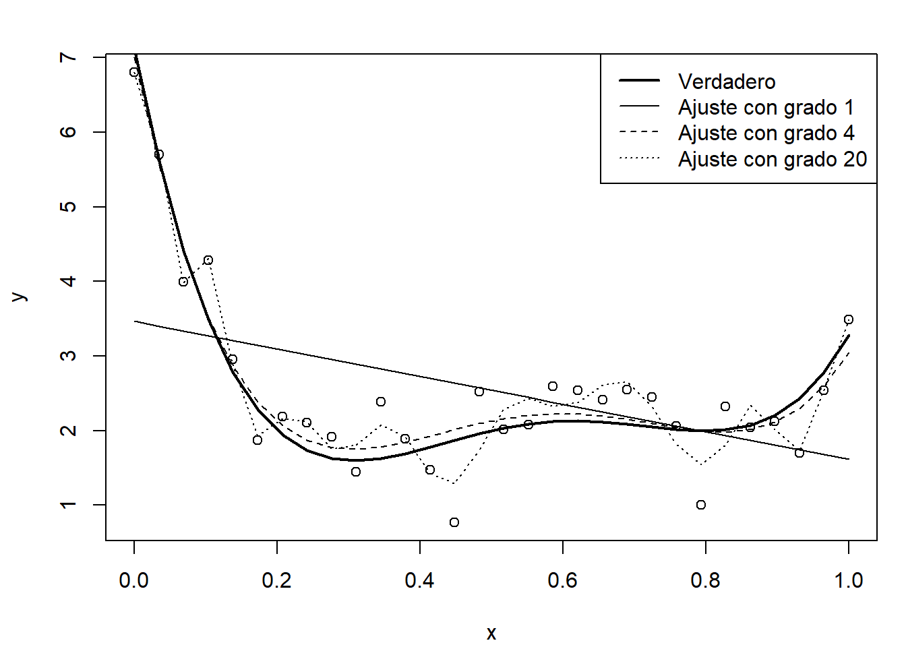
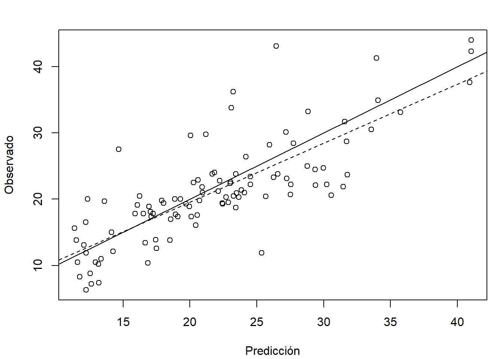

# Introducción al Aprendizaje Estadístico {#intro-AE}

<!-- 
knitr::purl("01-introduccion.Rmd", documentation = 2)
knitr::spin("01-introduccion.R",knit = FALSE)
-->


<!-- 
## Introducción {#intro} 
-->

La denominada *Ciencia de Datos* (Data Science; también denominada *Science of Learning*) se ha vuelto muy popular hoy en día. 
Se trata de un campo multidisciplicar, con importantes aportaciones estadísticas e informáticas, dentro del que se incluirían disciplinas como *Minería de Datos* (Data Mining), *Aprendizaje Automático* (Machine Learning), *Aprendizaje Profundo* (Deep Learning), *Modelado Predictivo* (Predictive Modeling), *Extracción de Conocimiento* (Knowlegde Discovery) y también el *Aprendizaje Estadístico* (Statistical Learning).

Podríamos definir la Ciencia de Datos como el conjunto de conocimientos y herramientas utilizados en las distintas etapas del análisis de datos (ver Figura \@ref(fig:esquema)). Otras definiciones podrían ser:

-   El arte y la ciencia del análisis inteligente de los datos.

-   El conjunto de herramientas para entender y modelizar conjuntos
    (complejos) de datos.

-   El proceso de descubrir patrones y obtener conocimiento a partir de
    grandes conjuntos de datos (*Big Data*).

Aunque esta ciencia incluiría también la gestión (sin olvidarnos del proceso de obtención) y la manipulación de los datos.

<div class="figure" style="text-align: center">

<p class="caption">(\#fig:esquema)Etapas del proceso</p>
</div>

Una de estas etapas (que están interrelacionadas) es la construcción de modelos a partir de los datos para aprender y predecir. Podríamos decir que el Aprendizaje Estadístico (AE) se encarga de este problema desde el punto de vista estadístico.

En Estadística se consideran modelos estocásticos (con componente aleatoria), para tratar de tener en cuenta la incertidumbre debida a que no se disponga de toda la información (sobre las variables que influyen en el fenómeno de interés).

> "Nothing in Nature is random... a thing appears random only through the incompleteness of our knowledge."
>
> --- Spinoza, Baruch (Ethics, 1677)

> "To my mind, although Spinoza lived and thought long before Darwin, Freud, Einstein, and the startling implications of quantum theory, he had a vision of truth beyond what is normally granted to human beings."
>
> --- Shirley, Samuel (Complete Works, 2002). Traductor de la obra completa de Spinoza al inglés.

La Inferencia Estadística proporciona herramientas para ajustar este tipo de modelos a los datos observados (seleccionar un modelo adecuado, estimar sus parámetros y contrastar su validez). 
Sin embargo, en la aproximación estadística clásica como primer objetivo se trata de explicar por completo lo que ocurre en la población y suponiendo que esto se puede hacer con modelos tratables analíticamente, emplear resultados teóricos (típicamente resultados asintóticos) para realizar inferencias (entre ellas la predicción). 
Los avances en computación han permitido el uso de modelos estadísticos más avanzados, principalmente métodos no paramétricos, muchos de los cuales no pueden ser tratados analíticamente (por lo menos no por completo o no inicialmente), este es el campo de la Estadística Computacional^[Lauro (1996) definió la Estadística Computacional como la disciplina que tiene como objetivo "diseñar algoritmos para implementar métodos estadísticos en computadoras, incluidos los impensables antes de la era de las computadoras (por ejemplo, bootstrap, simulación), así como hacer frente a problemas analíticamente intratables".]. Desde este punto de vista, el AE se enmarcaría dentro del campo de la Estadística Computacional.

Cuando pensamos en AE pensamos en:

- Flexibilidad (hay menos suposiciones sobre los datos).

- Procesamiento automático de datos.

- Big Data (en el sentido amplio, donde "big" puede hacer referencia a datos complejos).

- Predicción.

Por el contrario, muchos de los métodos del AE no se preocupan (o se preocupan poco) por:

- Reproducibilidad.

- Cuantificación de la incertidumbre (en términos de probabilidad).

- Inferencia.

La idea es “dejar hablar a los datos” y no "encorsetarlos" a priori, dándoles mayor peso que a los modelos.
Sin embargo, esta aproximación puede presentar diversos inconvenientes:

-   Algunos métodos son poco interpretables (se sacrifica la interpretabilidad por la precisión de las predicciones).

-   Pueden aparecer problemas de sobreajuste (*overfitting*; en los métodos estadísticos clásicos es más habitual que aparezcan problemas de infraajuste, *underfitting*).

-   Pueden presentar más problemas al extrapolar o interpolar (en comparación con los métodos clásicos).


## Aprendizaje Estadístico vs. Aprendizaje Automático

El término *Machine Learning* (ML; Aprendizaje Automático) se utiliza en el campo de la *Intelingencia Artificial* desde 1959 para hacer referencia, fundamentalmente, a algoritmos de predicción (inicialmente para reconocimiento de patrones). 
Muchas de las herramientas que utilizan provienen del campo de la Estadística y, en cualquier caso, la Estadística (y por tanto las Matemáticas) es la base de todos estos enfoques para analizar datos (y no conviene perder la base formal).
Por este motivo desde la Estadística Computacional se introdujo el término *Statistical Learning* (Aprendizaje Estadístico) para hacer referencia a este tipo de herramientas, pero desde el punto de vista estadístico (teniendo en cuenta la incertidumbre debida a no disponer de toda la información).

Tradicionalmente ML no se preocupa del origen de los datos e incluso es habitual que se considere que un conjunto enorme de datos es equivalente a disponer de toda la información (i.e. a la población).

> "The sheer volume of data would obviate the need of theory and even
> scientific method"
>
> --- Chris Anderson, físico y periodista, 2008

Por el contrario en el caso del AE se trata de comprender, si es posible, el proceso subyacente del que provienen los datos y si estos son representativos de la población de interés (i.e. si tienen algún tipo de sesgo).
No obstante, en este libro se considerará en general ambos términos como sinónimos.

ML/AE hacen un importante uso de la programación matemática, ya que muchos de sus problemas se plantean en términos de la optimización de funciones bajo restricciones. 
Recíprocamente, en optimización también se utilizan algoritmos de ML/AE.


### Machine Learning vs. Data Mining

Mucha gente utiliza indistintamente los nombres ML y *Data Mining* (DM). 
Sin embargo, aunque tienen mucho solapamiento, lo cierto es que hacen referencia a conceptos ligeramente distintos.

ML es un conjunto de algoritmos principalmente dedicados a hacer predicciones y que son esencialmente automáticos minimizando la intervención humana.

DM intenta *entender* conjuntos de datos (en el sentido de encontrar sus patrones), requiere de una intervención humana activa (al igual que la Inferencia Estadística tradicional), pero utiliza entre otras las técnicas automáticas de ML. Por tanto podríamos pensar que es más parecido al AE.


### Las dos culturas (Breiman, 2001)

Breiman diferencia dos objetivos en el análisis de datos, que él llama *información* (en el sentido de *inferencia*) y *predicción*. 
Cada uno de estos objetivos da lugar a una cultura:

- *Modelización de datos*: desarrollo de modelos (estocásticos) que permitan ajustar los datos y hacer inferencia. Es el trabajo habitual de los estadísticos académicos.

- *Modelización algorítmica* (en el sentido de predictiva): esta cultura no está interesada en los mecanismos que generan los datos, sólo en los algoritmos de predicción. Es el trabajo habitual de muchos estadísticos industriales y de muchos ingenieros informáticos. El ML es el núcleo de esta cultura que pone todo el énfasis en la precisión predictiva (así, un importante elemento dinamizador 
son las competiciones entre algoritmos predictivos, al estilo del [Netflix Challenge](https://en.wikipedia.org/wiki/Netflix_Prize)).


### Machine Learning vs. Estadística (Dunson, 2018)

- "Machine learning: The main publication outlets tend to be peer-reviewed conference proceedings and the style of research is very fast paced, trendy, and driven by performance metrics in prediction and related tasks".

- "Statistical community: The main publication outlets are peer-reviewed journals, most of which have a long drawn out review process, and the style of research tends to be careful, slower paced, intellectual as opposed to primarily performance driven, emphasizing theoretical support  (e.g., through asymptotic properties), under-stated, and conservative".

- "*Big data* in ML typically means that the number of examples (i.e. sample size) is very large".

- "In statistics (...) it has become common to collect high dimensional, complex and intricately structured data. Often the dimensionality of the data vastly exceeds the available sample size, and the fundamental challenge of the statistical analysis is obtaining new insights from these huge data, while maintaining reproducibility/replicability and reliability of the results".


## Métodos de Aprendizaje Estadístico

Dentro de los problemas que aborda el Aprendizaje Estadístico se suelen diferenciar dos grandes bloques: el aprendizaje no supervisado y el supervisado. El *aprendizaje no supervisado* comprende los métodos exploratorios, es decir, aquellos en los que no hay una variable respuesta (al menos no de forma explícita). El principal objetivo de estos métodos es entender las relaciones entre los datos y su estructura, y pueden clasificarse en las siguientes categorías:

  -   Análisis descriptivo.
    
  -   Métodos de reducción de la dimensión (análisis de componentes principales, análisis factorial...).
    
  -   Clúster.
    
  -   Detección de datos atípicos.

El *aprendizaje supervisado* engloba los métodos predictivos, en los que una de las variables está definida como variable respuesta. Su principal objetivo es la construcción de modelos que posteriormente se utilizarán, sobre todo, para hacer predicciones. Dependiendo del tipo de variable respuesta se diferencia entre:

  -   Clasificación: respuesta categórica (también se emplea la denominación de variable cualitativa, discreta o factor).

  -   Regresión: respuesta numérica (cuantitativa).

En este libro nos centraremos únicamente en el campo del aprendizaje supervisado y combinaremos la terminología propia de la Estadística con la empleada en AE (por ejemplo, en Estadística es habitual considerar un problema de clasificación como un caso particular de regresión).


### Notación y terminología {#notacion}

<!-- Emplearemos principalmente la terminología estadística, pero trataremos de incluir también la de ML -->

Denotaremos por $\mathbf{X}=(X_1, X_2, \ldots, X_p)$ al vector formado por las variables predictoras 
(variables explicativas o variables independientes; también *inputs* o *features* en la terminología de ML), cada una de las cuales podría ser tanto numérica como categórica^[Aunque hay que tener en cuenta que algunos métodos están diseñados para predictores numéricos, otros para categóricos y algunos para ambos tipos.].
En general (ver comentarios más adelante), emplearemos $Y\left(\mathbf{X} \right)$ para referirnos a la variable objetivo (variable respuesta o variable dependiente; también *output* en la terminología de ML), que como ya se comentó puede ser una variable numérica (regresión) o categórica (clasificación).

Supondremos que el objetivo principal es, a partir de una muestra:
$$\left\{ \left( x_{1i}, \ldots, x_{pi}, y_{i} \right)  : i = 1, \ldots, n \right\},$$
<!-- 
$$\left\{ \left( \mathbf{x}_{i}, y_{i} \right)  : i = 1, \ldots, n \right\},$$
siendo $\mathbf{x}_{i}=\left(  x_{1i},\ldots,x_{pi}\right)^{\prime}$ el vector de valores de las variables explicativas e $y_i$ el valor de la respuesta en la observación *i*-ésima,
-->
obtener (futuras) predicciones $\hat Y\left(\mathbf{x} \right)$ de la respuesta para $\mathbf{X}=\mathbf{x}=\left(x_{1}, \ldots, x_{p}\right)$.
<!-- 
ajustando un modelo, diseñando un algoritmo, entrenando una *machine* o *learner* 

$\mathbf{Y}=\left(  y_{1},\ldots,y_{n}\right)^{\prime}$
vector de observaciones de la variable $Y$
-->

En regresión consideraremos como base el siguiente modelo general (podría ser después de una transformación de la respuesta): 
\begin{equation} 
  Y(\mathbf{X})=m(\mathbf{X})+\varepsilon,
  (\#eq:modelogeneral)
\end{equation}
donde $m(\mathbf{x}) = E\left( \left. Y\right\vert_{\mathbf{X}=\mathbf{x}} \right)$ es la media condicional, denominada función de regresión (o tendencia), y $\varepsilon$ es un error aleatorio de media cero y varianza $\sigma^2$, independiente de $\mathbf{X}$.
Este modelo puede generalizarse de diversas formas, por ejemplo, asumiendo que la distribución del error depende de $X$ (considerando $\varepsilon(\mathbf{X})$ en lugar de $\varepsilon$) podríamos incluir dependencia y heterocedasticidad. 
En estos casos normalmente se supone que lo hace únicamente a través de la varianza (error heterocedástico independiente), denotando por $\sigma^2(\mathbf{x}) = Var\left( \left. Y\right\vert_{\mathbf{X}=\mathbf{x}} \right)$ la varianza condicional^[Por ejemplo considerando en el modelo base $\sigma(\mathbf{X})\varepsilon$ como termino de error y suponiendo adicionalmente que $\varepsilon$ tiene varianza uno.].


Como ya se comentó se podría considerar clasificación como un caso particular, por ejemplo definiendo $Y\left(\mathbf{X} \right)$ de forma que tome los valores $1, 2, \ldots, K$, etiquetas que identifican las $K$ posibles categorías (también se habla de modalidades, niveles, clases o grupos). 
Sin embargo, muchos métodos de clasificación emplean variables auxiliares (variables *dummy*), indicadoras de las distintas categorías, y emplearemos la notación anterior para referirnos a estas variables (también denominadas variables *target*). En cuyo caso, denotaremos por $G \left(\mathbf{X} \right)$ la respuesta categórica (la clase verdadera; $g_i$, $i =1, \ldots, n$, serían los valores observados) y por $\hat G \left(\mathbf{X} \right)$ el predictor.

Por ejemplo, en el caso de dos categorías, se suele definir $Y$ de forma que toma el valor 1 en la categoría de interés (también denominada *éxito* o *resultado positivo*) y 0 en caso contrario (*fracaso* o *resultado negativo*)^[Otra alternativa sería emplear 1 y -1, algo que simplifica las expresiones de algunos métodos.].
Además, en este caso, los modelos típicamente devuelven estimaciones de la probabilidad de la clase de interés en lugar de predecir directamente la clase, por lo que se empleará $\hat p$ en lugar de $\hat Y$. 
A partir de esa estimación se obtiene una predicción de la categoría. 
Normalmente se predice la clase más probable, i.e. "éxito" si $\hat p(\mathbf{x}) > c = 0.5$ y "fracaso" en caso contrario (con probabilidad estimada $1 - \hat p(\mathbf{x})$).

Resulta claro que el modelo base general \@ref(eq:modelogeneral) puede no ser adecuado para modelar variables indicadoras (o probabilidades).
Muchos de los métodos de AE emplean \@ref(eq:modelogeneral) para una variable auxiliar numérica (denominada puntuación o *score*) que se transforma a escala de probabilidades mediante la función logística (denominada función sigmoidal, *sigmoid function*, en ML)^[De especial interés en regresión logística y en redes neuronales artificiales.]:
$$p(s) = \frac{1}{1 + e^{-s}},$$
cuya inversa es la *función logit*:
$$\operatorname{logit}(p)=\log\left( \frac{p}{1-p} \right).$$

Lo anterior se puede generalizar para el caso de múltiples categorías, considerando variables indicadoras de cada categoría $Y_1, \ldots, Y_K$ (es lo que se conoce como la estrategia de "uno contra todos"). En este caso típicamente:
$$\hat G \left(\mathbf{x} \right) = \underset{k}{\operatorname{argmax}} \left\{ \hat p_k(\mathbf{x}) : k = 1, 2, \ldots, K \right\}.$$

<!-- 
Pendiente:

Múltiples categorías:

  Estrategia "uno contra uno"
  
  Otros métodos (árboles de decisión) permiten la estimación directa de las probabilidades de cada clase.


Otra notación:

  $\mathcal{G}$ conjunto de posibles categorías
  Matrices en mayúsculas y negrita/caligráfico? 
  Mayúsculas y negrita/caligráfico con subíndice para referirse al vector columna? 
  Traspuesta al estilo de JSS 
-->
    

### Métodos (de aprendizaje supervisado) y paquetes de R {#metodos-pkgs}

Hay una gran cantidad de métodos de aprendizaje supervisado implementados en centenares de paquetes de `R` (ver por ejemplo [CRAN Task View: Machine Learning & Statistical Learning](https://cran.r-project.org/web/views/MachineLearning.html)).
A continuación se muestran los principales métodos y algunos de los paquetes de R que los implementan (muchos son válidos para regresión y clasificación, como por ejemplo los basados en árboles, aunque aquí aparecen en su aplicación habitual).

Métodos de Clasificación:

-   Análisis discriminante (lineal, cuadrático), Regresión logística, multinomial...: 
    `stats`, `MASS`...

-   Árboles de decisión, *bagging*, *random forest*, *boosting*: 
    `rpart`, `party`, `C50`, `Cubist`, `randomForest`, `adabag`, `xgboost`...

-   *Support vector machines* (SVM): 
    `kernlab`, `e1071`...

Métodos de regresión:

-   Modelos lineales:

    -   Regresión lineal: `lm()`, `lme()`, `biglm`...

    -   Regresión lineal robusta: `MASS::rlm()`...

    -   Métodos de regularización (Ridge regression, Lasso):
        `glmnet`, `elasticnet`...

-   Modelos lineales generalizados: `glm()`, `bigglm`, ..

-   Modelos paramétricos no lineales: `nls()`, `nlme`...

-   Regresión local (vecinos más próximos y métodos de suavizado):
    `kknn`, `loess()`, `KernSmooth`, `sm`, `np`...

-   Modelos aditivos generalizados (GAM): `mgcv`, `gam`...

-   Redes neuronales: `nnet`... 

También existen paquetes de `R` que permiten utilizar plataformas de ML externas, como por ejemplo [`h2o`](https://github.com/h2oai/h2o-3/tree/master/h2o-r ) o [`RWeka`](https://CRAN.R-project.org/package=RWeka).

Como todos estos paquetes emplean opciones, estructuras y convenciones sintácticas diferentes, se han desarrollado paquetes que proporcionan interfaces unificadas a muchas de estas implementaciones. 
Entre ellos podríamos citar [`caret`](https://topepo.github.io/caret),[`mlr3`](https://mlr3.mlr-org.com) y [`tidymodels`](https://www.tidymodels.org).
En la Sección \@ref(caret) se incluye una breve introducción al paquete [`caret`](https://topepo.github.io/caret) que será empleado en diversas ocasiones a lo largo del presente libro.

Adicionalmente hay paquetes de R que disponen de entornos gráficos que permiten emplear estos métodos evitando el uso de comandos. 
Entre ellos estarían R-Commander con el plugin FactoMineR (`Rcmdr`, `RcmdrPlugin.FactoMineR`) y [`rattle`](https://rattle.togaware.com).


## Construcción y evaluación de los modelos {#const-eval}

En Inferencia Estadística clásica el procedimiento habitual es emplear toda la información disponible para construir un modelo válido (que refleje de la forma más fiel posible lo que ocurre en la población) y asumiendo que el modelo es el verdadero (lo que en general sería falso) utilizar métodos de inferencia para evaluar su precisión. 
Por ejemplo, en el caso de regresión lineal múltiple, el coeficiente de determinación ajustado sería una medida del la precisión del modelo para predecir nuevas observaciones (no se debería emplear el coeficiente de determinación sin ajustar; aunque, en cualquier caso, su validez dependería de la de las suposiciones estructurales del modelo).

Alternativamente, en Estadística Computacional es habitual emplear técnicas de remuestreo para evaluar la precisión (entrenando también el modelo con todos los datos disponibles), principalmente validación cruzada (leave-one-out, k-fold), jackniffe o bootstrap. 

Por otra parte, como ya se comentó, algunos de los modelos empleados en AE son muy flexibles (están hiperparametrizados) y pueden aparecer problemas si se permite que se ajusten demasiado bien a las observaciones (podrían llegar a interpolar los datos). 
En estos casos habrá que controlar el procedimiento de aprendizaje, típicamente a traves de  parámetros relacionados con la complejidad del modelo (ver sección siguiente).

En AE se distingue entre parámetros estructurales, los que van a ser estimados al ajustar el modelo a los datos (en el entrenamiento), e hiperparámetros (*tuning parameters* o parámetros de ajuste), que imponen restricciones al aprendizaje del modelo (por ejemplo determinando el número de parámetros estructurales).
Si los hiperparámetros seleccionados producen un modelo demasiado complejo aparecerán problemas de sobreajuste (*overfitting*) y en caso contrario de infraajuste (*undefitting*).

Hay que tener en cuenta también que al aumentar la complejidad disminuye la interpretabilidad de los modelos. 
Se trataría entonces de conseguir buenas predicciones (habrá que evaluar la capacidad predictiva) con el modelo más sencillo posible.

<!-- Sección \@ref(bias-variance) -->

### Equilibrio entre sesgo y varianza: infraajuste y sobreajuste {#bias-variance}

La idea es que queremos aprender más allá de los datos empleados en el entrenamiento (en Estadística diríamos que queremos hacer inferencia sobre nuevas observaciones).
Como ya se comentó, en AE hay que tener especial cuidado con el sobreajuste. 
Este problema ocurre cuando el modelo se ajusta demasiado bien a los datos de entrenamiento pero falla cuando se utiliza en un nuevo conjunto de datos (nunca antes visto).

Como ejemplo ilustrativo emplearemos regresión polinómica, considerando el grado del polinomio como un hiperparámetro que determina la complejidad del modelo. 
En primer lugar simulamos una muestra y ajustamos modelos polinómicos con distintos grados de complejidad. 


```r
# Simulación datos
n <- 30
x <- seq(0, 1, length = n)
mu <- 2 + 4*(5*x - 1)*(4*x - 2)*(x - 0.8)^2 # grado 4
sd <- 0.5
set.seed(1)
y <- mu + rnorm(n, 0, sd)
plot(x, y) 
lines(x, mu, lwd = 2)
# Ajuste de los modelos
fit1 <- lm(y ~ x)
lines(x, fitted(fit1))
fit2 <- lm(y ~ poly(x, 4))
lines(x, fitted(fit2), lty = 2)
fit3 <- lm(y ~ poly(x, 20)) 
# NOTA: poly(x, degree, raw = FALSE) tiene un problema de desbordamiento si degree > 25
lines(x, fitted(fit3), lty = 3)
legend("topright", legend = c("Verdadero", "Ajuste con grado 1", 
                              "Ajuste con grado 4", "Ajuste con grado 20"), 
       lty = c(1, 1, 2, 3), lwd = c(2, 1, 1, 1))
```

<div class="figure" style="text-align: center">

<p class="caption">(\#fig:polyfit)Muestra (simulada) y ajustes polinómicos con distinta complejidad.</p>
</div>

Como se observa en la Figura \@ref(fig:polyfit) al aumentar la complejidad del modelo se consigue un mejor ajuste a los datos observados (empleados en el entrenamiento), a costa de un incremento en la variabilidad de las predicciones, lo que puede producir un mal comportamiento del modelo a ser empleado en un conjunto de datos distinto del observado. 

Si calculamos medidas de bondad de ajuste, como el error cuadrático medio (MSE) o el coeficiente de determinación, se obtienen mejores resultados al aumentar la complejidad. 
Como se trata de modelos lineales, podríamos obtener también el coeficiente de determinación ajustado, que sería preferible (en principio, ya que dependería de la validez de las hipótesis estructurales del modelo) para medir la precisión al emplear los modelos en un nuevo conjunto de datos.


```r
knitr::kable(t(sapply(list(fit1 = fit1, fit2 = fit2, fit3 = fit3), 
       function(x) with(summary(x), 
                        c(MSE = mean(residuals^2), R2 = r.squared, R2adj = adj.r.squared)))), digits = 2)
```

         MSE     R2   R2adj
-----  -----  -----  ------
fit1    1.22   0.20    0.17
fit2    0.19   0.87    0.85
fit3    0.07   0.95    0.84

Por ejemplo, si generamos nuevas respuestas de este proceso, la precisión del modelo más complejo empeorará considerablemente:


```r
y.new <- mu + rnorm(n, 0, sd)
plot(x, y) 
points(x, y.new, pch = 2)
lines(x, mu, lwd = 2)
lines(x, fitted(fit1))
lines(x, fitted(fit2), lty = 2)
lines(x, fitted(fit3), lty = 3)
legend("topright", legend = c("Verdadero", "Muestra", "Ajuste con grado 1", "Ajuste con grado 4", 
                              "Ajuste con grado 20", "Nuevas observaciones"), 
       lty = c(1, NA, 1, 2, 3, NA), lwd = c(2, NA, 1, 1, 1, NA), pch = c(NA, 1, NA, NA, NA, 2))
```

<div class="figure" style="text-align: center">

<p class="caption">(\#fig:polyfit2)Muestra con ajustes polinómicos con distinta complejidad y nuevas observaciones.</p>
</div>

```r
MSEP <- sapply(list(fit1 = fit1, fit2 = fit2, fit3 = fit3), 
               function(x) mean((y.new - fitted(x))^2))
MSEP
```

```
##      fit1      fit2      fit3 
## 1.4983208 0.1711238 0.2621064
```

<!-- lines(x, y.new, type = "b", pch = 2, lty = 4, col = "blue") -->

Como ejemplo adicional, para evitar el efecto de la aleatoriedad de la muestra, en el siguiente código se simulan 100 muestras del proceso anterior a las que se les ajustan modelos polinómicos variando el grado de 1 a 20. Posteriormente se evalua la precisión en la muestra empleada en el ajuste y en un nuevo conjunto de datos procedente de la misma población.


```r
nsim <- 100
set.seed(1)
grado.max <- 20
grados <- seq_len(grado.max) 
mse <- mse.new <- matrix(nrow = grado.max, ncol = nsim) # Error cuadrático medio
for(i in seq_len(nsim)) {
  y <- mu + rnorm(n, 0, sd)
  y.new <- mu + rnorm(n, 0, sd)
  for (grado in grados) { # grado <- 1
    fit <- lm(y ~ poly(x, grado))
    mse[grado, i] <- mean(residuals(fit)^2)
    mse.new[grado, i] <- mean((y.new - fitted(fit))^2)
  }
}
# Simulaciones
matplot(grados, mse, type = "l", col = "lightgray", lty = 1, ylim = c(0, 2),
        xlab = "Grado del polinomio (complejidad)",
        ylab = "Error cuadrático medio")
matlines(grados, mse.new, type = "l", lty = 2, col = "lightgray") 
# Global
precision <- rowMeans(mse)
precision.new <- rowMeans(mse.new)
lines(grados, precision, lwd = 2)
lines(grados, precision.new, lty = 2, lwd = 2)
abline(h = sd^2, lty = 3)
abline(v = 4, lty = 3)
legend("topright", legend = c("Muestras", "Nuevas observaciones"), lty = c(1, 2))
```

<div class="figure" style="text-align: center">

<p class="caption">(\#fig:polyfitsim)Precisiones (errores cuadráticos medios) de ajustes polinómicos variando la complejidad, en las muestras empleadas en el ajuste y en nuevas observaciones (simulados).</p>
</div>


Como se puede observar en la Figura \@ref(fig:polyfitsim) los errores de entrenamiento disminuyen a medida que aumenta la complejidad del modelo.
Sin embargo los errores de predicción en nuevas observaciones primero disminuyen hasta alcanzar un mínimo, marcado por la línea de puntos vertical que se corresponde con el modelo de grado 4, y después aumentan (la línea de puntos horizontal es la varianza del proceso; el error cuadrático medio de predicción asintótico).
La línea vertical representa el equilibrio entre el sesgo y la varianza.
Considerando un valor de complejidad a la izquierda de esa línea tendríamos infraajuste (mayor sesgo y menor varianza) y a la derecha sobreajuste (menor sesgo y mayor varianza).

Desde un punto de vista más formal, considerando el modelo \@ref(eq:modelogeneral) y una función de pérdidas cuadrática, el predictor óptimo (desconocido) sería la media condicional $m(\mathbf{x}) = E\left( \left. Y\right\vert_{\mathbf{X}=\mathbf{x}} \right)$^[Se podrían considerar otras funciones de pérdida, por ejemplo con la distancia $L_1$ sería la mediana condicional, pero las consideraciones serían análogas.]. 
Por tanto los predictores serían realmente estimaciones de la función de regresión, $\hat Y(\mathbf{x}) = \hat m(\mathbf{x})$ y podemos expresar la media del error cuadrático de predicción en términos del sesgo y la varianza:
$$
\begin{aligned}
E \left( Y(\mathbf{x}_0) - \hat Y(\mathbf{x}_0) \right)^2 & = E \left( m(\mathbf{x}_0) + \varepsilon - \hat m(\mathbf{x}_0) \right)^2 = E \left( m(\mathbf{x}_0) - \hat m(\mathbf{x}_0) \right)^2 + \sigma^2 \\
& = E^2 \left( m(\mathbf{x}_0) - \hat m(\mathbf{x}_0) \right) + Var\left( \hat m(\mathbf{x}_0) \right) + \sigma^2 \\
& = \text{sesgo}^2 + \text{varianza} + \text{error irreducible}
\end{aligned}
$$
donde $\mathbf{x}_0$ hace referencia al vector de valores de las variables explicativas de una nueva observación (no empleada en la construcción del predictor).

En general, al aumentar la complejidad disminuye el sesgo y aumenta la varianza (y viceversa).
Esto es lo que se conoce como el dilema o compromiso entre el sesgo y la varianza (*bias-variance tradeoff*).
La recomendación sería por tanto seleccionar los hiperparámetros (el modelo final) tratando de que haya un equilibrio entre el sesgo y la varianza.

<!-- 
PENDIENTE: 
Gráfico equilibrio entre sesgo y varianza
-->

### Datos de entrenamiento y datos de test {#entrenamiento-test}

Como se mostró en la sección anterior hay que tener mucho cuidado si se pretende evaluar la precisión de las predicciones empleando la muestra de entrenamiento.

Si el número de observaciones no es muy grande, se puede entrenar el modelo con todos los datos y emplear técnicas de remuestreo para evaluar la precisión (típicamente validación cruzada o bootstrap). 
Habría que asegurase de que el procedimiento de remuestreo empleado es adecuado (por ejemplo, la presencia de dependencia requeriría de métodos más sofisticados).

Sin embargo, si el número de obervaciones es grande, se suele emplear el procedimiento tradicional en ML, que consiste en particionar la base de datos en 2 (o incluso en 3) conjuntos (disjuntos):

-   Conjunto de datos de entrenamiento (o aprendizaje) para construir los modelos.

-   Conjunto de datos de test para evaluar el rendimiento de los modelos.

Los datos de test deberían utilizarse únicamente para evaluar los modelos finales, no se deberían emplear para seleccionar hiperparámetros. 
Para seleccionalos se podría volver a particionar los datos de entrenamiento, es decir, dividir la muestra en tres subconjuntos: datos de entrenamiento, de validación y de test (por ejemplo considerando un 70\%, 15\% y 15\% de las observaciones, respectivamente). 
Para cada combinación de hiperparámetros se ajustaría el correspondiente modelo con los datos de entrenamiento, se emplearían los de validación para evaluarlos y posteriormente seleccionar los valores "óptimos". Por último, se emplean los datos de test para evaluar el rendimiento del modelo seleccionado. 
No obstante, lo más habitual es seleccionar los hiperparámetros empleando validación cruzada (o otro tipo de remuestreo) en la muestra de entrenamiento, en lugar de considerar una muestra adicional de validación. 
En la siguiente sección se describirá esta última aproximación. 

En R se puede realizar el particionamiento de los datos empleando la función `sample()` del paquete base (otra alternativa sería emplear la función `createDataPartition` del paquete `caret` como se describe en la Sección \@ref(caret)). 
Típicamente se selecciona el 80\% de los datos como muestra de entrenamiento y el 20\% restante como muestra de test, aunque esto dependería del número de datos.

Como ejemplo consideraremos el conjunto de datos `Boston` del paquete `MASS` que contiene, entre otros datos, la valoración de las viviendas (`medv`, mediana de los valores de las viviendas ocupadas, en miles de dólares) y el porcentaje de población con "menor estatus" (`lstat`) en los suburbios de Boston.
Podemos contruir las muestras de entrenamiento (80\%) y de test (20\%) con el siguiente código:


```r
data(Boston, package = "MASS")
# ?Boston
set.seed(1)
nobs <- nrow(Boston)
itrain <- sample(nobs, 0.8 * nobs)
train <- Boston[itrain, ]
test <- Boston[-itrain, ]
```

<!-- Sección \@ref(cv) -->

### Validación cruzada {#cv} 

Como ya se comentó, una herramienta para evaluar la calidad predictiva de un modelo es la *validación cruzada*, que permite cuantificar el error de predicción utilizando una única muestra de datos. 

En su versión más simple, validación cruzada dejando uno fuera (*Leave-one-out cross-validation*, LOOCV), para cada observación de la muestra se realiza un ajuste empleando el resto de observaciones, y se mide el error de predicción en esa observación (único dato no utilizado en el ajuste del modelo). 
Finalmente, combinando todos los errores individuales se puede obtener medidas globales del error de predicción (o aproximar características de su distribución).

El método de LOOCV requeriría, en principio (ver comentarios más adelante), el ajuste de un modelo para cada observación por lo que pueden aparecer problemas computacionales si el conjunto de datos es grande.
En este caso se suele emplear grupos de observaciones en lugar de observaciones individuales. 
Si se particiona el conjunto de datos en *k* grupos, típicamente 10 o 5 grupos, se denomina *k-fold cross-validation* (LOOCV sería un caso particular considerando un número de grupos igual al número de observaciones).
Hay muchas variaciones de este método, entre ellas particionar repetidamente de forma aleatoria los datos en un conjunto de entrenamiento y otro de validación (de esta forma algunas observaciones podrían aparecer repetidas veces y otras ninguna en las muestras de validación). 

<!-- 
La partición en k-fold CV se suele realizar al azar.
Hay que tener en cuenta la aleatoriedad al emplear k-fold CV, algo que no ocurre con LOOCV. 
-->

Continuando con el ejemplo anterior, supongamos que queremos emplear regresión polinómica para explicar la valoración de las viviendas (`medv`) a partir del "estatus" de los residentes (`lstat`). 
Al igual que se hizo en la Sección \@ref(bias-variance), consideraremos el grado del polinomio como un hiperparámetro.


```r
plot(medv ~ lstat, data = train)
```


Podríamos emplear la siguiente función que devuelve para cada observación (fila) de una muestra de entrenamiento, el error de predicción en esa observación ajustando un modelo lineal con todas las demás observaciones:


```r
cv.lm0 <- function(formula, datos) {
    n <- nrow(datos)
    cv.res <- numeric(n)
    for (i in 1:n) {
        modelo <- lm(formula, datos[-i, ])
        cv.pred <- predict(modelo, newdata = datos[i, ])
        cv.res[i] <- cv.pred - datos[i, ]
    }
    return(cv.res)
}
```

La función anterior no es muy eficiente, pero podría modificarse fácilmente para emplear otros métodos de regresión^[También puede ser de interés la función `cv.glm()` del paquete `boot`.]. 
En el caso de regresión lineal múltiple (y de otros modelos lineales), se pueden obtener fácilmente las predicciones eliminando una de las observaciones a partir del ajuste con todos los datos.
Por ejemplo, en lugar de la anterior sería preferible emplear la siguiente función (ver `?rstandard`):


```r
cv.lm <- function(formula, datos) {
    modelo <- lm(formula, datos)
    return(rstandard(modelo, type = "predictive"))
}
```

Empleando esta función, podemos calcular una medida del error de predicción de validación cruzada (en este caso el *error cuadrático medio*) para cada valor del hiperparámetro (grado del ajuste polinómico) y seleccionar el que lo minimiza.


```r
grado.max <- 10
grados <- seq_len(grado.max) 
cv.mse <- cv.mse.sd <- numeric(grado.max)
for(grado in grados){
  cv.res <- cv.lm(medv ~ poly(lstat, grado), train)
  se <- cv.res^2
  cv.mse[grado] <- mean(se)
  cv.mse.sd[grado] <- sd(se)/sqrt(length(se))
}
plot(grados, cv.mse, ylim = c(25, 45),
  xlab = "Grado del polinomio (complejidad)")
# Valor óptimo
imin.mse <- which.min(cv.mse)
grado.op <- grados[imin.mse]
points(grado.op, cv.mse[imin.mse], pch = 16)
```


```r
grado.op
```

```
## [1] 5
```
En lugar de emplear los valores óptimos de los hiperparámetros, Breiman *et al.* (1984) propusieron la regla de "un error estándar" para seleccionar la complejidad del modelo.
La idea es que estamos trabajando con estimaciones de la precisión y pueden presentar variabilidad, 
por lo que la sugerencia es seleccionar el modelo más simple^[Suponiendo que los modelos se pueden ordenar del más simple al más complejo.] dentro de un error estándar de la precisión del modelo correspondiente al valor óptimo 
(se consideraría que no hay diferencias significativas en la precisión; 
además, se mitigaría el efecto de la variabilidad debida a aleatoriedad/semilla).


```r
plot(grados, cv.mse, ylim = c(25, 45))
segments(grados, cv.mse - cv.mse.sd, grados, cv.mse + cv.mse.sd)
# Límite superior "oneSE rule" y complejidad mínima por debajo de ese valor
upper.cv.mse <- cv.mse[imin.mse] + cv.mse.sd[imin.mse]
abline(h = upper.cv.mse, lty = 2)
imin.1se <- min(which(cv.mse <= upper.cv.mse))
grado.1se <- grados[imin.1se]
points(grado.1se, cv.mse[imin.1se], pch = 16)
```


```r
grado.1se
```

```
## [1] 2
```


```r
plot(medv ~ lstat, data = train)
fit.op <- lm(medv ~ poly(lstat, grado.op), train)
fit.1se <- lm(medv ~ poly(lstat, grado.1se), train)
newdata <- data.frame(lstat = seq(0, 40, len = 100))
lines(newdata$lstat, predict(fit.op, newdata = newdata))
lines(newdata$lstat, predict(fit.1se, newdata = newdata), lty = 2)
legend("topright", legend = c(paste("Grado óptimo:", grado.op), paste("oneSE rule:", grado.1se)), 
       lty = c(1, 2))
```


### Evaluación de un método de regresión {#eval-reg}

Para estudiar la precisión de las predicciones de un método de regresión se evalúa el
modelo en el conjunto de datos de test y se comparan las predicciones frente a los valores reales.

Si generamos un gráfico de dispersión de observaciones frente a predicciones, los puntos deberían estar en torno a la recta $y=x$ (línea continua).


```r
obs <- test$medv
pred <- predict(fit.op, newdata = test)

plot(pred, obs, main = "Observado frente a predicciones",
     xlab = "Predicción", ylab = "Observado")
abline(a = 0, b = 1)
res <- lm(obs ~ pred)
# summary(res)
abline(res, lty = 2)
```



También es habitual calcular distintas medidas de error. 
Por ejemplo, podríamos emplear la función `postResample()` del paquete `caret`: 

```r
caret::postResample(pred, obs)
```

```
##      RMSE  Rsquared       MAE 
## 4.8526718 0.6259583 3.6671847
```

La función anterior, además de las medidas de error habituales (que dependen en su mayoría de la escala de la variable respuesta) calcula un *pseudo R-cuadrado*. 
En este paquete (también en `rattle`) se emplea uno de los más utilizados, el cuadrado del coeficiente de correlación entre las predicciones y los valores observados (que se corresponde con la línea discontinua en la figura anterior). 
Estos valores se interpretarían como el coeficiente de determinación en regresión lineal, debería ser próximo a 1. 
Hay otras alternativas (ver Kvålseth, 1985), pero la idea es que deberían medir la proporción de variabilidad de la respuesta explicada por el modelo, algo que en general no es cierto con el anterior^[Por ejemplo obtendríamos el mismo valor si desplazamos las predicciones sumando una constante (i.e. no tiene en cuenta el sesgo).].
La recomendación sería emplear:
$$\tilde R^2 = 1 - \frac{\sum_{i=1}^n(y_i - \hat y_i)^2}{\sum_{i=1}^n(y_i - \bar y_i)^2}$$
implementado junto con otras medidas en la siguiente función:


```r
accuracy <- function(pred, obs, na.rm = FALSE, 
                     tol = sqrt(.Machine$double.eps)) {
  err <- obs - pred     # Errores
  if(na.rm) {
    is.a <- !is.na(err)
    err <- err[is.a]
    obs <- obs[is.a]
  }  
  perr <- 100*err/pmax(obs, tol)  # Errores porcentuales
  return(c(
    me = mean(err),           # Error medio
    rmse = sqrt(mean(err^2)), # Raíz del error cuadrático medio 
    mae = mean(abs(err)),     # Error absoluto medio
    mpe = mean(perr),         # Error porcentual medio
    mape = mean(abs(perr)),   # Error porcentual absoluto medio
    r.squared = 1 - sum(err^2)/sum((obs - mean(obs))^2) # Pseudo R-cuadrado
  ))
}
accuracy(pred, obs)
```

```
##         me       rmse        mae        mpe       mape  r.squared 
## -0.6731294  4.8526718  3.6671847 -8.2322506 19.7097373  0.6086704
```

```r
accuracy(predict(fit.1se, newdata = test), obs)
```

```
##         me       rmse        mae        mpe       mape  r.squared 
## -0.9236280  5.2797360  4.1252053 -9.0029771 21.6512406  0.5367608
```

\BeginKnitrBlock{exercise}<div class="exercise"><span class="exercise" id="exr:train-validate-test"><strong>(\#exr:train-validate-test) </strong></span></div>\EndKnitrBlock{exercise}

Considerando de nuevo el ejemplo anterior, particionar la muestra en datos de entrenamiento (70\%), de validación (15\%) y de test (15\%), para entrenar los modelos polinómicos, seleccionar el grado óptimo (el hiperparámetro) y evaluar las predicciones del modelo final, respectivamente.

Podría ser de utilidad el siguiente código (basado en la aproximación de `rattle`), que particiona los datos suponiendo que están almacenados en el data.frame `df`:


```r
df <- Boston
set.seed(1)
nobs <- nrow(df)
itrain <- sample(nobs, 0.7 * nobs)
inotrain <- setdiff(seq_len(nobs), itrain)
ivalidate <- sample(inotrain, 0.15 * nobs)
itest <- setdiff(inotrain, ivalidate)
train <- df[itrain, ]
validate <- df[ivalidate, ]
test <- df[itest, ]
```
  
Alternativamente podríamos emplear la función `split()` creando un factor que divida aleatoriamente los datos en tres grupos (versión "simplificada" de una propuesta en este [post](https://stackoverflow.com/questions/36068963/r-how-to-split-a-data-frame-into-training-validation-and-test-sets)):


```r
set.seed(1)
p <- c(train = 0.7, validate = 0.15, test = 0.15)
f <- sample( rep(factor(seq_along(p), labels = names(p)),
                 times = nrow(df)*p/sum(p)) )
samples <- suppressWarnings(split(df, f))
str(samples)
```

```
## List of 3
##  $ train   :'data.frame':	356 obs. of  14 variables:
##   ..$ crim   : num [1:356] 0.00632 0.02731 0.02729 0.02985 0.08829 ...
##   ..$ zn     : num [1:356] 18 0 0 0 12.5 12.5 12.5 12.5 12.5 0 ...
##   ..$ indus  : num [1:356] 2.31 7.07 7.07 2.18 7.87 7.87 7.87 7.87 7.87 8.14 ...
##   ..$ chas   : int [1:356] 0 0 0 0 0 0 0 0 0 0 ...
##   ..$ nox    : num [1:356] 0.538 0.469 0.469 0.458 0.524 0.524 0.524 0.524 0.524 0.538 ...
##   ..$ rm     : num [1:356] 6.58 6.42 7.18 6.43 6.01 ...
##   ..$ age    : num [1:356] 65.2 78.9 61.1 58.7 66.6 100 85.9 82.9 39 56.5 ...
##   ..$ dis    : num [1:356] 4.09 4.97 4.97 6.06 5.56 ...
##   ..$ rad    : int [1:356] 1 2 2 3 5 5 5 5 5 4 ...
##   ..$ tax    : num [1:356] 296 242 242 222 311 311 311 311 311 307 ...
##   ..$ ptratio: num [1:356] 15.3 17.8 17.8 18.7 15.2 15.2 15.2 15.2 15.2 21 ...
##   ..$ black  : num [1:356] 397 397 393 394 396 ...
##   ..$ lstat  : num [1:356] 4.98 9.14 4.03 5.21 12.43 ...
##   ..$ medv   : num [1:356] 24 21.6 34.7 28.7 22.9 16.5 18.9 18.9 21.7 19.9 ...
##  $ validate:'data.frame':	75 obs. of  14 variables:
##   ..$ crim   : num [1:75] 0.0324 0.6298 0.9884 0.9558 1.0025 ...
##   ..$ zn     : num [1:75] 0 0 0 0 0 0 0 75 75 0 ...
##   ..$ indus  : num [1:75] 2.18 8.14 8.14 8.14 8.14 8.14 5.96 2.95 2.95 6.91 ...
##   ..$ chas   : int [1:75] 0 0 0 0 0 0 0 0 0 0 ...
##   ..$ nox    : num [1:75] 0.458 0.538 0.538 0.538 0.538 0.538 0.499 0.428 0.428 0.448 ...
##   ..$ rm     : num [1:75] 7 5.95 5.81 6.05 6.67 ...
##   ..$ age    : num [1:75] 45.8 61.8 100 88.8 87.3 95 41.5 21.8 15.8 6.5 ...
##   ..$ dis    : num [1:75] 6.06 4.71 4.1 4.45 4.24 ...
##   ..$ rad    : int [1:75] 3 4 4 4 4 4 5 3 3 3 ...
##   ..$ tax    : num [1:75] 222 307 307 307 307 307 279 252 252 233 ...
##   ..$ ptratio: num [1:75] 18.7 21 21 21 21 21 19.2 18.3 18.3 17.9 ...
##   ..$ black  : num [1:75] 395 397 395 306 380 ...
##   ..$ lstat  : num [1:75] 2.94 8.26 19.88 17.28 11.98 ...
##   ..$ medv   : num [1:75] 33.4 20.4 14.5 14.8 21 13.1 21 30.8 34.9 24.7 ...
##  $ test    :'data.frame':	75 obs. of  14 variables:
##   ..$ crim   : num [1:75] 0.069 0.1446 0.2249 0.638 0.6719 ...
##   ..$ zn     : num [1:75] 0 12.5 12.5 0 0 0 0 90 0 0 ...
##   ..$ indus  : num [1:75] 2.18 7.87 7.87 8.14 8.14 ...
##   ..$ chas   : int [1:75] 0 0 0 0 0 0 0 0 0 0 ...
##   ..$ nox    : num [1:75] 0.458 0.524 0.524 0.538 0.538 0.538 0.499 0.403 0.413 0.413 ...
##   ..$ rm     : num [1:75] 7.15 6.17 6.38 6.1 5.81 ...
##   ..$ age    : num [1:75] 54.2 96.1 94.3 84.5 90.3 94.1 68.2 21.9 6.6 7.8 ...
##   ..$ dis    : num [1:75] 6.06 5.95 6.35 4.46 4.68 ...
##   ..$ rad    : int [1:75] 3 5 5 4 4 4 5 5 4 4 ...
##   ..$ tax    : num [1:75] 222 311 311 307 307 307 279 226 305 305 ...
##   ..$ ptratio: num [1:75] 18.7 15.2 15.2 21 21 21 19.2 17.9 19.2 19.2 ...
##   ..$ black  : num [1:75] 397 397 393 380 377 ...
##   ..$ lstat  : num [1:75] 5.33 19.15 20.45 10.26 14.81 ...
##   ..$ medv   : num [1:75] 36.2 27.1 15 18.2 16.6 12.7 18.9 35.4 24.2 22.8 ...
```


### Evaluación de un método de clasificación {#eval-class}

Para estudiar la eficiencia de un método de clasificación supervisada típicamente se obtienen las predicciones para el conjunto de datos de test y se genera una tabla de contingencia, denominada *matriz de confusión*, con las predicciones frente a los valores reales.

En primer lugar consideraremos el caso de dos categorías.
La matriz de confusión será de la forma:

  Observado\\Predicción             Positivo                       Negativo
 ----------------------- ------------------------------ ------------------------------
        Verdadero           Verdaderos positivos (TP)         Falsos negativos (FN)
          Falso               Falsos positivos (FP)        Verdaderos negativos (TN)
 ----------------------- ------------------------------ ------------------------------

A partir de esta tabla se pueden obtener distintas medidas de la precisión de las predicciones. 
Por ejemplo, dos de las más utilizadas son la tasa de verdaderos positivos y la de verdaderos negativos (tasas de acierto en positivos y negativos), también denominadas *sensibilidad* y *especificidad*:

* Sensibilidad (*sensitivity*, *recall*, *hit rate*, *true positive rate*; TPR):
    $$TPR = \frac{TP}{P} = \frac{TP}{TP+FN}$$

* Especificidad (*specificity*, *true negative rate*; TNR):
    $$TNR = \frac{TN}{TN+FP}$$

La precisión global o tasa de aciertos (*accuracy*; ACC) sería:
$$ACC = \frac{TP + TN}{P + N} = \frac{TP+TN}{TP+TN+FP+FN}$$
Sin embargo hay que tener cuidado con esta medida cuando las clases no están balanceadas.
Otras medidas de la precisión global que tratan de evitar este problema son la *precisión balanceada* (*balanced accuracy*, BA):
$$BA = \frac{TPR + TNR}{2}$$
(media aritmética de TPR y TNR) o la *puntuación F1* (*F1 score*; media armónica de TPR y el valor predictivo positivo, PPV, descrito más adelante):
$$F_1 = \frac{2TP}{2TP+FP+FN}$$
Otra medida global es el coeficiente kappa de Cohen, que compara la tasa de aciertos con la obtenida en una clasificación al azar
(un valor de 1 indicaría máxima precisión y 0 que la precisión es igual a la que obtendríamos clasificando al azar; empleando la tasa de positivos, denominada *prevalencia*, para predecir positivo).

También hay que tener cuidado las medidas que utilizan como estimación de la probabilidad de positivo (*prevalencia*) la tasa de positivos en la muestra de test, como el valor (o índice) predictivo positivo (*precision*, *positive predictive value*; PPV):
$$PPV = \frac{TP}{TP+FP}$$
(que no debe ser confundido con la precisión global ACC) y el valor predictivo negativo negativo (NPV):
$$NPV = \frac{TN}{TN+FN},$$ 
si la muestra de test no refleja lo que ocurre en la población (por ejemplo si la clase de interés está sobrerrepresentada en la muestra).
En estos casos habrá que recalcularlos empleando estimaciones válidas de las probabilidades de la clases (por ejemplo, en estos casos, la función `caret::confusionMatrix()` permite establecer estimaciones válidas mediante el argumento `prevalence`).

Como ejemplo emplearemos los datos anteriores de valoraciones de viviendas y estatus de la población, considerando como respuesta una nueva variable `fmedv` que clasifica las valoraciones en "Bajo" o "Alto" dependiendo de si `medv > 25`.

```r
# data(Boston, package = "MASS")
datos <- Boston
datos$fmedv <- factor(datos$medv > 25, labels = c("Bajo", "Alto")) # levels = c('FALSE', 'TRUE')
# En este caso las clases no están balanceadas
table(datos$fmedv)
```

```
## 
## Bajo Alto 
##  382  124
```

```r
caret::featurePlot(datos$lstat, datos$fmedv, plot = "density",
            labels = c("lstat", "Density"), auto.key = TRUE)
```


El siguiente código realiza la partición de los datos y posteriormente ajusta un modelo de regresión logística en la muestra de entrenamiento considerando `lstat` como única variable explicativa (en el Capítulo 5 se darán más detalles sobre este tipo de modelos):


```r
# Particionado de los datos
set.seed(1)
nobs <- nrow(datos)
itrain <- sample(nobs, 0.8 * nobs)
train <- datos[itrain, ]
test <- datos[-itrain, ]
# Ajuste modelo
modelo <- glm(fmedv ~ lstat, family = binomial, data = train)
summary(modelo)
```

```
## 
## Call:
## glm(formula = fmedv ~ lstat, family = binomial, data = train)
## 
## Deviance Residuals: 
##     Min       1Q   Median       3Q      Max  
## -1.9749  -0.4161  -0.0890   0.3785   3.6450  
## 
## Coefficients:
##             Estimate Std. Error z value Pr(>|z|)    
## (Intercept)  3.74366    0.47901   7.815 5.48e-15 ***
## lstat       -0.54231    0.06134  -8.842  < 2e-16 ***
## ---
## Signif. codes:  0 '***' 0.001 '**' 0.01 '*' 0.05 '.' 0.1 ' ' 1
## 
## (Dispersion parameter for binomial family taken to be 1)
## 
##     Null deviance: 460.84  on 403  degrees of freedom
## Residual deviance: 243.34  on 402  degrees of freedom
## AIC: 247.34
## 
## Number of Fisher Scoring iterations: 7
```

En este caso podemos obtener las estimaciones de la probabilidad de la segunda categoría empleando `predict()` con `type = "response"`, a partir de las cuales podemos establecer las predicciones como la categoría más probable:


```r
obs <- test$fmedv
p.est <- predict(modelo, type = "response", newdata = test)
pred <- factor(p.est > 0.5, labels = c("Bajo", "Alto")) # levels = c('FALSE', 'TRUE')
```

Finalmente podemos obtener la matriz de confusión con el siguiente código:


```r
tabla <- table(obs, pred)
# addmargins(tabla, FUN = list(Total = sum))
tabla
```

```
##       pred
## obs    Bajo Alto
##   Bajo   71   11
##   Alto    8   12
```

```r
# Porcentajes respecto al total
print(100*prop.table(tabla), digits = 2) 
```

```
##       pred
## obs    Bajo Alto
##   Bajo 69.6 10.8
##   Alto  7.8 11.8
```

```r
# Porcentajes (de aciertos y fallos) por categorías
print(100*prop.table(tabla, 1), digits = 3) 
```

```
##       pred
## obs    Bajo Alto
##   Bajo 86.6 13.4
##   Alto 40.0 60.0
```

Alternativamente se podría emplear la función `confusionMatrix()` del paquete `caret` que permite obtener distintas medidas de la precisión:


```r
caret::confusionMatrix(pred, obs, positive = "Alto", mode = "everything")
```

```
## Confusion Matrix and Statistics
## 
##           Reference
## Prediction Bajo Alto
##       Bajo   71    8
##       Alto   11   12
##                                          
##                Accuracy : 0.8137         
##                  95% CI : (0.7245, 0.884)
##     No Information Rate : 0.8039         
##     P-Value [Acc > NIR] : 0.4604         
##                                          
##                   Kappa : 0.4409         
##                                          
##  Mcnemar's Test P-Value : 0.6464         
##                                          
##             Sensitivity : 0.6000         
##             Specificity : 0.8659         
##          Pos Pred Value : 0.5217         
##          Neg Pred Value : 0.8987         
##               Precision : 0.5217         
##                  Recall : 0.6000         
##                      F1 : 0.5581         
##              Prevalence : 0.1961         
##          Detection Rate : 0.1176         
##    Detection Prevalence : 0.2255         
##       Balanced Accuracy : 0.7329         
##                                          
##        'Positive' Class : Alto           
## 
```

Si el método de clasificación proporciona estimaciones de las probabilidades de las categorías, disponemos de más información en la clasificación que también podemos emplear en la evaluación del rendimiento.
Por ejemplo, se puede realizar un analisis descriptivo de las probabilidades estimadas y las categorías observadas en la muestra de test:


```r
# Imitamos la función caret::plotClassProbs()
library(lattice) 
histogram(~ p.est | obs, xlab = "Probabilidad estimada de 'Alto'")
```


Para evaluar las estimaciones de las probabilidades se suele emplear la curva ROC (*receiver operating characteristics*, característica operativa del receptor; diseñada inicialmente en el campo de la detección de señales).
Como ya se comentó, normalmente se emplea $c = 0.5$ como punto de corte para clasificar en la categoría de interés (es lo que se conoce como *regla de Bayes*), aunque se podrían considerar otros valores (por ejemplo para mejorar la clasificación en una de las categorías, a costa de empeorar la precisión global).
En la curva ROC se representa la sensibilidad (TPR) frente a la tasa de falsos negativos (FNR = 1 - TNR = 1 - especificidad) para distintos valores de corte.
Para ello se puede emplear el paquete `pROC`:


```r
library(pROC)
roc_glm <- roc(response = obs, predictor = p.est)
# View((as.data.frame(roc_glm[2:4])))
plot(roc_glm)
```

<div class="figure" style="text-align: center">

<p class="caption">(\#fig:ROC-curve)Curva ROC correspondiente al modelo de regresión logística.</p>
</div>

```r
# plot(roc_glm, legacy.axes = TRUE, print.thres = 0.5)
```

Lo ideal sería que la curva se aproximase a la esquina superior izquierda (máxima sensibilidad y especificidad). 
La recta diagonal se correspondería con un clasificador aleatorio.
Una medida global del rendimiento del clasificador es el área bajo la curva ROC (AUC; equivalente al estadístico U de Mann-Whitney o al índice de Gini).
Un clasificador perfecto tendría un valor de 1 y 0.5 uno aleatorio.


```r
# roc_glm$auc
roc_glm
```

```
## 
## Call:
## roc.default(response = obs, predictor = p.est)
## 
## Data: p.est in 82 controls (obs Bajo) < 20 cases (obs Alto).
## Area under the curve: 0.8427
```

```r
ci.auc(roc_glm)
```

```
## 95% CI: 0.7428-0.9426 (DeLong)
```

Como comentario adicional, aunque se puede modificar el punto de corte para mejorar la clasificación en la categoría de interés (de hecho, algunas herramientas como `h2o` lo modifican por defecto; en este caso concreto para maximizar $F_1$ en la muestra de entrenamiento), muchos métodos de clasificación (como los basados en árboles descritos en el Capítulo 2) admiten como opción una matriz de pérdidas que se tendrá en cuenta para medir la eficiencia durante el aprendizaje y normalmente esta sería la aproximación recomendada.

En el caso de más de dos categorías podríamos generar una matriz de confusión de forma análoga,
aunque en este caso en principio solo podríamos calcular medidas globales de la precisión como la tasa de aciertos o el coeficiente kappa de Cohen.
Podríamos obtener también medidas por clase, como la sensibilidad y la especificidad, siguiendo la estrategia “uno contra todos” descrita en la Sección \@ref(notacion).
Esta aproximación es la que sigue la función `confusionMatrix()` del paquete `caret` (devuelve las medidas comparando cada categoría con las restantes en el componente `$byClass`).

Como ejemplo ilustrativo consideraremos el conocido conjunto de datos `iris` (Fisher, 1936) en el que el objetivo es clasificar flores de lirio en tres especies (`Species`) a partir del largo y ancho de sépalos y pétalos, aunque en este caso emplearemos un clasificador aleatorio.


```r
data(iris)
# Partición de los datos
datos <- iris
set.seed(1)
nobs <- nrow(datos)
itrain <- sample(nobs, 0.8 * nobs)
train <- datos[itrain, ]
test <- datos[-itrain, ]
# Entrenamiento 
prevalences <- table(train$Species)/nrow(train)
prevalences
```

```
## 
##     setosa versicolor  virginica 
##  0.3250000  0.3166667  0.3583333
```

```r
# Calculo de las predicciones
levels <- names(prevalences) # levels(train$Species)
f <- factor(levels, levels = levels) # factor(levels) valdría en este caso al estar por orden alfabético
pred.rand <- sample(f, nrow(test), replace = TRUE, prob = prevalences)
# Evaluación
caret::confusionMatrix(pred.rand, test$Species)
```

```
## Confusion Matrix and Statistics
## 
##             Reference
## Prediction   setosa versicolor virginica
##   setosa          3          3         1
##   versicolor      4          2         5
##   virginica       4          7         1
## 
## Overall Statistics
##                                           
##                Accuracy : 0.2             
##                  95% CI : (0.0771, 0.3857)
##     No Information Rate : 0.4             
##     P-Value [Acc > NIR] : 0.9943          
##                                           
##                   Kappa : -0.1862         
##                                           
##  Mcnemar's Test P-Value : 0.5171          
## 
## Statistics by Class:
## 
##                      Class: setosa Class: versicolor Class: virginica
## Sensitivity                 0.2727           0.16667          0.14286
## Specificity                 0.7895           0.50000          0.52174
## Pos Pred Value              0.4286           0.18182          0.08333
## Neg Pred Value              0.6522           0.47368          0.66667
## Prevalence                  0.3667           0.40000          0.23333
## Detection Rate              0.1000           0.06667          0.03333
## Detection Prevalence        0.2333           0.36667          0.40000
## Balanced Accuracy           0.5311           0.33333          0.33230
```


## La maldición de la dimensionalidad

Podríamos pensar que al aumentar el número de variables explicativas se mejora la capacidad predictiva de los modelos. Lo cual, en general, sería cierto si realmente los predictores fuesen de utilidad para explicar la respuesta.
Sin embargo, al aumentar el número de dimensiones se pueden agravar notablemente muchos de los problemas que ya pueden aparecer en dimensiones menores, esto es lo que se conoce como la *maldición de la dimensionalidad* (*curse of dimensionality*, Bellman, 1961).

Uno de estos problemas es el denominado *efecto frontera* que ya puede aparecer en una dimensión, especialmente al trabajar con modelos flexibles (como ajustes polinómicos con grados altos o los métodos locales que trataremos en el Capítulo 6).
La idea es que en la "frontera" del rango de valores de una variable explicativa vamos a disponer de pocos datos y los errores de predicción van a tener gran variabilidad (se están haciendo extrapolaciones de los datos, más que interpolaciones, y van a ser menos fiables).

Como ejemplo consideraremos un problema de regresión simple, con un conjunto de datos simulados (del proceso ya considerado en la Sección \@ref(bias-variance)) con 100 observaciones (que ya podríamos considerar que no es muy pequeño).


```r
# Simulación datos
n <- 100
x <- seq(0, 1, length = n)
mu <- 2 + 4*(5*x - 1)*(4*x - 2)*(x - 0.8)^2 # grado 4
sd <- 0.5
set.seed(1)
y <- mu + rnorm(n, 0, sd)
datos <- data.frame(x = x, y = y)
plot(x, y) 
lines(x, mu, lwd = 2, col = "lightgray")
```

<div class="figure" style="text-align: center">

<p class="caption">(\#fig:simdat100)Muestra simulada y tendencia teórica.</p>
</div>

Cuando el número de datos es más o menos grande podríamos pensar en predecir la respuesta a partir de lo que ocurre en las observaciones cercanas a la posición de predicción, esta es la idea de los métodos locales (Capítulo 6).
Uno de los métodos de este tipo más conocidos es el de los *k-vecinos más cercanos* (*k-nearest neighbors*; KNN). 
Se trata de un método muy simple, pero que puede ser muy efectivo, que se basa en la idea de que localmente la media condicional (la predicción óptima) es constante.
Concretamente, dados un entero $k$ (hiperparámetro) y un conjunto de entrenamiento $\mathcal{T}$, para obtener la predicción correspondiente a un vector de valores de las variables explicativas $\mathbf{x}$, el método de regresión^[En el caso de clasificación se considerarían las variables indicadoras de las categorías y se obtendrían las frecuencias relativas en el vecindario como estimaciones de las probabilidades de las clases.] KNN promedia las obsevaciones en un vecindario $\mathcal{N}_k(\mathbf{x}, \mathcal{T})$ formado por las $k$ observaciones más cercanas a $\mathbf{x}$: 
$$\hat{Y}(\mathbf{x}) = \hat{m}(\mathbf{x}) = \frac{1}{k} \sum_{i \in \mathcal{N}_k(\mathbf{x}, \mathcal{T})} Y_i$$ 
(sería necesario definir una distancia, normalmente la distancia euclídea de los predictores estandarizados).

Este método está implementado en numerosos paquetes, por ejemplo en la función `knnreg()` del paquete `caret`:


```r
library(caret)

# Ajuste de los modelos
fit1 <- knnreg(y ~ x, data = datos, k = 5) # 5 observaciones más cercanas (5% de los datos)
fit2 <- knnreg(y ~ x, data = datos, k = 10)
fit3 <- knnreg(y ~ x, data = datos, k = 20)

plot(x, y) 
lines(x, mu, lwd = 2, col = "lightgray")
newdata <- data.frame(x = x)
lines(x, predict(fit1, newdata), lwd = 2, lty = 3)
lines(x, predict(fit2, newdata), lwd = 2, lty = 2)
lines(x, predict(fit3, newdata), lwd = 2)
legend("topright", legend = c("Verdadero", "5-NN", "10-NN", "20-NN"), 
       lty = c(1, 3, 2, 1), lwd = 2, col = c("lightgray", 1, 1, 1))
```

<div class="figure" style="text-align: center">

<p class="caption">(\#fig:knnfit2)Predicciones con el método KNN y distintos vecindarios</p>
</div>

A medida que aumenta $k$ disminuye la complejidad del modelo y se observa un incremento del efecto frontera.
Habría que seleccionar un valor óptimo de $k$ (buscando un equilibro entre sesgo y varianza, como se mostró en la Sección \@ref(bias-variance) y se ilustrará en la última sección de este capítulo empleando este método con el paquete `caret`), que dependerá de la tendencia teórica y del número de datos.
En este caso, para $k=5$, podríamos pensar que el efecto frontera aparece en el 10\% más externo del rango de la variable explicativa (con un número mayor de datos podría bajar al 1\%).
Al aumentar el número de variables explicativas, considerando que el 10\% más externo del rango de cada una de ellas constituye la "frontera" de los datos, tendríamos que la proporción de frontera sería $1-0.9^d$, siendo $d$ el número de dimensiones.
Lo que se traduce que con $d = 10$ el 65\% del espacio predictivo sería frontera y en torno al 88\% para $d=20$, es decir, al aumentar el número de dimensiones el problema del efecto frontera será generalizado.  


```r
curve(1 - 0.9^x, 0, 200, ylab = 'Proporción de "frontera"', xlab = 'Número de dimensiones')
curve(1 - 0.95^x, lty = 2, add = TRUE)
curve(1 - 0.99^x, lty = 3, add = TRUE)
abline(h = 0.5, col = "lightgray")
legend("bottomright", title = "Rango en cada dimensión", legend = c("10%" , "5%", "1%"), 
       lty = c(1, 2, 3))
```


Desde otro punto de vista, suponiendo que los predictores se distribuyen de forma uniforme, la densidad de las observaciones es proporcional a $n^{1/d}$, siendo $n$ el tamaño muestral. 
Por lo que si consideramos que una muestra de tamaño $n=100$ es suficientemente densa en una dimensión, para obtener la misma densidad muestral en 10 dimensiones tendríamos que disponer de un tamaño muestral de $n = 100^{10} = 10^{20}$.
Por tanto, cuando el número de dimensiones es grande no va a haber muchas observaciones en el entorno de la posición de predicción y puede haber serios problemas de sobreajuste si se pretende emplear un modelo demasiado flexible (por ejemplo KNN con $k$ pequeño). Hay que tener en cuenta que, en general, fijado el tamaño muestral, la flexibilidad de los modelos aumenta al aumentar el número de dimensiones del espacio predictivo.

Para concluir, otro de los problemas que se agravan notablemente al aumentar el número de dimensiones es el de colinealidad (o concurvidad) que puede producir que muchos métodos (como los modelos lineales o las redes neuronales) sean muy poco eficientes o inestables (llegando incluso a que no se puedan aplicar), además de que complica notablemente la interpretación de cualquier método. 
Esto está relacionado también con la dificultad para determinar que variables son de interés para predecir la respuesta (i.e. no son ruido).
Debido a la aleatoriedad, predictores que realmente no están relacionados con la respuesta pueden ser tenidos en cuenta por el modelo con mayor facilidad (KNN con las opciones habituales tiene en cuenta todos los predictores con el mismo peso).
Lo que resulta claro es que si se agrega ruido se producirá un incremento en el error de predicción. 
Incluso si las variables añadidas resultan de interés, si el número de observaciones es pequeño en comparación, el incremento en la variabilidad de las predicciones puede no compensar la disminución del sesgo de predicción.

Como conclusión, en el caso multidimensional habrá que tratar de emplear métodos que minimicen estos problemas.


## Análisis e interpretación de los modelos {#analisis-modelos}

El análisis e interpretación de modelos es un campo muy activo en AE/ML, para el que recientemente se ha acuñado el término de *interpretable machine learning* (IML). 
A continuación se resumen brevemente algunas de las principales ideas, para más detalles ver por ejemplo [Molnar (2020)](https://christophm.github.io/interpretable-ml-book).

Como ya se comentó, a medida que aumenta la complejidad de los modelos generalmente disminuye su interpretabilidad, por lo que normalmente interesa encontrar el modelo más simple posible que resulte de utilidad para los objetivos propuestos.
Aunque el principal objetivo sea la predicción, una vez obtenido el modelo final suele interesar medir la importancia de cada predictor en el modelo y si es posible como influyen en la predicción de la respuesta, es decir, estudiar el efecto de las variables explicativas.
Esto puede presentar serias dificultades especialmente en modelos complejos en los que hay interacciones entre los predictores (el efecto de una variable explicativa depende de los valores de otras).

La mayoría de los métodos de aprendizaje supervisado permiten obtener medidas de la importancia de las variables explicativas en la predicción (ver p.e. la [ayuda](https://topepo.github.io/caret/variable-importance.html) de la función `caret::varImp()`; algunos, como los basados en árboles, incluso de las no incluidas en el modelo final).
Muchos de los métodos de clasificación, en lugar de proporcionar medidas globales, calculan medidas para cada categoría.
Alternativamente también se pueden obtener medidas de la importancia de las variables mediante procedimientos generales (en el sentido de que se pueden aplicar a cualquier modelo), pero suelen requerir de mucho más tiempo de computación (ver p.e. [Molnar, 2020](https://christophm.github.io/interpretable-ml-book), [Capítulo 5](https://christophm.github.io/interpretable-ml-book/agnostic.htm)).

En algunos de los métodos se modela explícitamente los efectos de los distintos predictores y estos se pueden analizar con (mas o menos) facilidad. 
Hay que tener en cuenta que, al margen de las interacciones, la colinealidad/concurvidad dificulta notablemente el estudio de los efectos de las variables explicativas.
Otros métodos son más del tipo "caja negra" (*black box*) y precisan de aproximaciones más generales, como los gráficos PDP (*Partial Dependence Plots*; Friedman y Popescu, 2008; ver también [Greenwell, 2017](https://journal.r-project.org/archive/2017/RJ-2017-016/index.html)) o las curvas ICE (*Individual Conditional Expectation*; [Goldstein *et al.* , 2015](https://doi.org/10.1080/10618600.2014.907095)). 
Estos métodos^[Similares a los gráficos parciales de residuos de los modelos lineales o aditivos (ver p.e. las funciones `termplot()`, `car::crPlots()` o `car::avPlots()`).] tratan de estimar el efecto marginal de las variables explicativas, es decir, la variación en la predicción a medida que varía una variable explicativa manteniendo constantes el resto.
La principal diferencia entre ambas aproximaciones es que los gráficos PDP muestran una única curva con el promedio de la respuesta mientras que las curvas ICE muestran una curva para cada observación (para más detalles ver las referencias anteriores).

En problemas de clasificación también se están empleando la teoría de juegos cooperativos y las técnicas de optimización de Investigación Operativa para evaluar la importancia de las variables predictoras y determinar las más influyentes. 
Por citar algunos, Strumbelj y Kononenko (2010) propusieron un procedimiento general basado en el valor de Shapley de juegos cooperativos, y en Agor y Özaltın (2019) se propone el uso de algoritmos genéticos para determinar los predictores más influyentes.

Paquetes y funciones de R:

* [`pdp`](https://bgreenwell.github.io/pdp/index.html): Partial Dependence Plots 

    (también implementa curvas ICE y es compatible con `caret`)

* [`iml`](https://christophm.github.io/iml): Interpretable Machine Learning

* [`DALEX`](https://modeloriented.github.io/DALEX): moDel Agnostic Language for Exploration and eXplanation

* [`lime`](https://lime.data-imaginist.com): Local Interpretable Model-Agnostic Explanations

* [`vip`](https://koalaverse.github.io/vip/index.html): Variable Importance Plots

*  `caret::varImp()`, `h2o::h2o.partialPplot()`...

En los siguientes capítulos se mostrarán ejemplos empleando algunas de estas herramientas.


## Introducción al paquete `caret` {#caret}    

Como ya se comentó en la Sección \@ref(metodos-pkgs), el paquete `caret` (abreviatura de *Classification And REgression Training*) proporciona una interfaz unificada que simplifica el proceso de modelado empleando la mayoría de los métodos de AE implementados en R (actualmente admite 238 métodos; ver el [Capítulo 6](https://topepo.github.io/caret/available-models.html) del [manual](https://topepo.github.io/caret) de este paquete). 
Además de proporcionar rutinas para los principales pasos del proceso, incluye también numerosas funciones auxiliares que permitirían implementar nuevos procedimientos.

Enlaces:

* [Manual](https://topepo.github.io/caret)

    - [3. Pre-Processing](https://topepo.github.io/caret/pre-processing.html)

    - [5. Model Training and Tuning](https://topepo.github.io/caret/model-training-and-tuning.html)
    
    - [6. Available Models](https://topepo.github.io/caret/available-models.html)
    
    - [17. Measuring Performance](https://topepo.github.io/caret/measuring-performance.html)
    

* [Vignette](https://cran.r-project.org/web/packages/caret/vignettes/caret.html)

* [Cheat Sheet](https://raw.githubusercontent.com/rstudio/cheatsheets/master/caret.pdf)


La función principal es `train()` (descrita más adelante), que incluye un parámetro `method` que permite establecer el modelo mediante una cadena de texto.
Podemos obtener información sobre los modelos disponibles con las funciones `getModelInfo()` y `modelLookup()` (puede haber varias implementaciones del mismo método con distintas configuraciones de hiperparámetros; también se pueden definir nuevos modelos, ver el [Capítulo 13](https://topepo.github.io/caret/using-your-own-model-in-train.html) del [manual](https://topepo.github.io/caret)).


```r
library(caret)
str(names(getModelInfo())) # Listado de todos los métodos disponibles
```

```
##  chr [1:238] "ada" "AdaBag" "AdaBoost.M1" "adaboost" "amdai" "ANFIS" ...
```

```r
# names(getModelInfo("knn", regex = TRUE)) # Por defecto devuelve coincidencias parciales
modelLookup("knn")  # Información sobre hiperparámetros
```

```
##   model parameter      label forReg forClass probModel
## 1   knn         k #Neighbors   TRUE     TRUE      TRUE
```


<div class="figure" style="text-align: center">
<!--html_preserve--><div id="htmlwidget-7bf94cd961c11210a1ca" style="width:100%;height:auto;" class="datatables html-widget"></div>
<script type="application/json" data-for="htmlwidget-7bf94cd961c11210a1ca">{"x":{"filter":"none","data":[["ada","AdaBag","AdaBoost.M1","adaboost","amdai","ANFIS","avNNet","awnb","awtan","bag","bagEarth","bagEarthGCV","bagFDA","bagFDAGCV","bam","bartMachine","bayesglm","binda","blackboost","blasso","blassoAveraged","bridge","brnn","BstLm","bstSm","bstTree","C5.0","C5.0Cost","C5.0Rules","C5.0Tree","cforest","chaid","CSimca","ctree","ctree2","cubist","dda","deepboost","DENFIS","dnn","dwdLinear","dwdPoly","dwdRadial","earth","elm","enet","evtree","extraTrees","fda","FH.GBML","FIR.DM","foba","FRBCS.CHI","FRBCS.W","FS.HGD","gam","gamboost","gamLoess","gamSpline","gaussprLinear","gaussprPoly","gaussprRadial","gbm_h2o","gbm","gcvEarth","GFS.FR.MOGUL","GFS.LT.RS","GFS.THRIFT","glm.nb","glm","glmboost","glmnet_h2o","glmnet","glmStepAIC","gpls","hda","hdda","hdrda","HYFIS","icr","J48","JRip","kernelpls","kknn","knn","krlsPoly","krlsRadial","lars","lars2","lasso","lda","lda2","leapBackward","leapForward","leapSeq","Linda","lm","lmStepAIC","LMT","loclda","logicBag","LogitBoost","logreg","lssvmLinear","lssvmPoly","lssvmRadial","lvq","M5","M5Rules","manb","mda","Mlda","mlp","mlpKerasDecay","mlpKerasDecayCost","mlpKerasDropout","mlpKerasDropoutCost","mlpML","mlpSGD","mlpWeightDecay","mlpWeightDecayML","monmlp","msaenet","multinom","mxnet","mxnetAdam","naive_bayes","nb","nbDiscrete","nbSearch","neuralnet","nnet","nnls","nodeHarvest","null","OneR","ordinalNet","ordinalRF","ORFlog","ORFpls","ORFridge","ORFsvm","ownn","pam","parRF","PART","partDSA","pcaNNet","pcr","pda","pda2","penalized","PenalizedLDA","plr","pls","plsRglm","polr","ppr","PRIM","protoclass","qda","QdaCov","qrf","qrnn","randomGLM","ranger","rbf","rbfDDA","Rborist","rda","regLogistic","relaxo","rf","rFerns","RFlda","rfRules","ridge","rlda","rlm","rmda","rocc","rotationForest","rotationForestCp","rpart","rpart1SE","rpart2","rpartCost","rpartScore","rqlasso","rqnc","RRF","RRFglobal","rrlda","RSimca","rvmLinear","rvmPoly","rvmRadial","SBC","sda","sdwd","simpls","SLAVE","slda","smda","snn","sparseLDA","spikeslab","spls","stepLDA","stepQDA","superpc","svmBoundrangeString","svmExpoString","svmLinear","svmLinear2","svmLinear3","svmLinearWeights","svmLinearWeights2","svmPoly","svmRadial","svmRadialCost","svmRadialSigma","svmRadialWeights","svmSpectrumString","tan","tanSearch","treebag","vbmpRadial","vglmAdjCat","vglmContRatio","vglmCumulative","widekernelpls","WM","wsrf","xgbDART","xgbLinear","xgbTree","xyf"],["Boosted Classification Trees","Bagged AdaBoost","AdaBoost.M1","AdaBoost Classification Trees","Adaptive Mixture Discriminant Analysis","Adaptive-Network-Based Fuzzy Inference System","Model Averaged Neural Network","Naive Bayes Classifier with Attribute Weighting","Tree Augmented Naive Bayes Classifier with Attribute Weighting","Bagged Model","Bagged MARS","Bagged MARS using gCV Pruning","Bagged Flexible Discriminant Analysis","Bagged FDA using gCV Pruning","Generalized Additive Model using Splines","Bayesian Additive Regression Trees","Bayesian Generalized Linear Model","Binary Discriminant Analysis","Boosted Tree","The Bayesian lasso","Bayesian Ridge Regression (Model Averaged)","Bayesian Ridge Regression","Bayesian Regularized Neural Networks","Boosted Linear Model","Boosted Smoothing Spline","Boosted Tree","C5.0","Cost-Sensitive C5.0","Single C5.0 Ruleset","Single C5.0 Tree","Conditional Inference Random Forest","CHi-squared Automated Interaction Detection","SIMCA","Conditional Inference Tree","Conditional Inference Tree","Cubist","Diagonal Discriminant Analysis","DeepBoost","Dynamic Evolving Neural-Fuzzy Inference System ","Stacked AutoEncoder Deep Neural Network","Linear Distance Weighted Discrimination","Distance Weighted Discrimination with Polynomial Kernel","Distance Weighted Discrimination with Radial Basis Function Kernel","Multivariate Adaptive Regression Spline","Extreme Learning Machine","Elasticnet","Tree Models from Genetic Algorithms","Random Forest by Randomization","Flexible Discriminant Analysis","Fuzzy Rules Using Genetic Cooperative-Competitive Learning and Pittsburgh","Fuzzy Inference Rules by Descent Method","Ridge Regression with Variable Selection","Fuzzy Rules Using Chi's Method","Fuzzy Rules with Weight Factor","Simplified TSK Fuzzy Rules","Generalized Additive Model using Splines","Boosted Generalized Additive Model","Generalized Additive Model using LOESS","Generalized Additive Model using Splines","Gaussian Process","Gaussian Process with Polynomial Kernel","Gaussian Process with Radial Basis Function Kernel","Gradient Boosting Machines","Stochastic Gradient Boosting","Multivariate Adaptive Regression Splines","Fuzzy Rules via MOGUL","Genetic Lateral Tuning and Rule Selection of Linguistic Fuzzy Systems","Fuzzy Rules via Thrift","Negative Binomial Generalized Linear Model","Generalized Linear Model","Boosted Generalized Linear Model","glmnet","glmnet","Generalized Linear Model with Stepwise Feature Selection","Generalized Partial Least Squares","Heteroscedastic Discriminant Analysis","High Dimensional Discriminant Analysis","High-Dimensional Regularized Discriminant Analysis","Hybrid Neural Fuzzy Inference System","Independent Component Regression","C4.5-like Trees","Rule-Based Classifier","Partial Least Squares","k-Nearest Neighbors","k-Nearest Neighbors","Polynomial Kernel Regularized Least Squares","Radial Basis Function Kernel Regularized Least Squares","Least Angle Regression","Least Angle Regression","The lasso","Linear Discriminant Analysis","Linear Discriminant Analysis","Linear Regression with Backwards Selection","Linear Regression with Forward Selection","Linear Regression with Stepwise Selection","Robust Linear Discriminant Analysis","Linear Regression","Linear Regression with Stepwise Selection","Logistic Model Trees","Localized Linear Discriminant Analysis","Bagged Logic Regression","Boosted Logistic Regression","Logic Regression","Least Squares Support Vector Machine","Least Squares Support Vector Machine with Polynomial Kernel","Least Squares Support Vector Machine with Radial Basis Function Kernel","Learning Vector Quantization","Model Tree","Model Rules","Model Averaged Naive Bayes Classifier","Mixture Discriminant Analysis","Maximum Uncertainty Linear Discriminant Analysis","Multi-Layer Perceptron","Multilayer Perceptron Network with Weight Decay","Multilayer Perceptron Network with Weight Decay","Multilayer Perceptron Network with Dropout","Multilayer Perceptron Network with Dropout","Multi-Layer Perceptron, with multiple layers","Multilayer Perceptron Network by Stochastic Gradient Descent","Multi-Layer Perceptron","Multi-Layer Perceptron, multiple layers","Monotone Multi-Layer Perceptron Neural Network","Multi-Step Adaptive MCP-Net","Penalized Multinomial Regression","Neural Network","Neural Network","Naive Bayes","Naive Bayes","Naive Bayes Classifier","Semi-Naive Structure Learner Wrapper","Neural Network","Neural Network","Non-Negative Least Squares","Tree-Based Ensembles","Non-Informative Model","Single Rule Classification","Penalized Ordinal Regression","Random Forest","Oblique Random Forest","Oblique Random Forest","Oblique Random Forest","Oblique Random Forest","Optimal Weighted Nearest Neighbor Classifier","Nearest Shrunken Centroids","Parallel Random Forest","Rule-Based Classifier","partDSA","Neural Networks with Feature Extraction","Principal Component Analysis","Penalized Discriminant Analysis","Penalized Discriminant Analysis","Penalized Linear Regression","Penalized Linear Discriminant Analysis","Penalized Logistic Regression","Partial Least Squares","Partial Least Squares Generalized Linear Models ","Ordered Logistic or Probit Regression","Projection Pursuit Regression","Patient Rule Induction Method","Greedy Prototype Selection","Quadratic Discriminant Analysis","Robust Quadratic Discriminant Analysis","Quantile Random Forest","Quantile Regression Neural Network","Ensembles of Generalized Linear Models","Random Forest","Radial Basis Function Network","Radial Basis Function Network","Random Forest","Regularized Discriminant Analysis","Regularized Logistic Regression","Relaxed Lasso","Random Forest","Random Ferns","Factor-Based Linear Discriminant Analysis","Random Forest Rule-Based Model","Ridge Regression","Regularized Linear Discriminant Analysis","Robust Linear Model","Robust Mixture Discriminant Analysis","ROC-Based Classifier","Rotation Forest","Rotation Forest","CART","CART","CART","Cost-Sensitive CART","CART or Ordinal Responses","Quantile Regression with LASSO penalty","Non-Convex Penalized Quantile Regression","Regularized Random Forest","Regularized Random Forest","Robust Regularized Linear Discriminant Analysis","Robust SIMCA","Relevance Vector Machines with Linear Kernel","Relevance Vector Machines with Polynomial Kernel","Relevance Vector Machines with Radial Basis Function Kernel","Subtractive Clustering and Fuzzy c-Means Rules","Shrinkage Discriminant Analysis","Sparse Distance Weighted Discrimination","Partial Least Squares","Fuzzy Rules Using the Structural Learning Algorithm on Vague Environment","Stabilized Linear Discriminant Analysis","Sparse Mixture Discriminant Analysis","Stabilized Nearest Neighbor Classifier","Sparse Linear Discriminant Analysis","Spike and Slab Regression","Sparse Partial Least Squares","Linear Discriminant Analysis with Stepwise Feature Selection","Quadratic Discriminant Analysis with Stepwise Feature Selection","Supervised Principal Component Analysis","Support Vector Machines with Boundrange String Kernel","Support Vector Machines with Exponential String Kernel","Support Vector Machines with Linear Kernel","Support Vector Machines with Linear Kernel","L2 Regularized Support Vector Machine (dual) with Linear Kernel","Linear Support Vector Machines with Class Weights","L2 Regularized Linear Support Vector Machines with Class Weights","Support Vector Machines with Polynomial Kernel","Support Vector Machines with Radial Basis Function Kernel","Support Vector Machines with Radial Basis Function Kernel","Support Vector Machines with Radial Basis Function Kernel","Support Vector Machines with Class Weights","Support Vector Machines with Spectrum String Kernel","Tree Augmented Naive Bayes Classifier","Tree Augmented Naive Bayes Classifier Structure Learner Wrapper","Bagged CART","Variational Bayesian Multinomial Probit Regression","Adjacent Categories Probability Model for Ordinal Data","Continuation Ratio Model for Ordinal Data","Cumulative Probability Model for Ordinal Data","Partial Least Squares","Wang and Mendel Fuzzy Rules","Weighted Subspace Random Forest","eXtreme Gradient Boosting","eXtreme Gradient Boosting","eXtreme Gradient Boosting","Self-Organizing Maps"],["Classification","Classification","Classification","Classification","Classification","Regression","Classification, Regression","Classification","Classification","Classification, Regression","Classification, Regression","Classification, Regression","Classification","Classification","Classification, Regression","Classification, Regression","Classification, Regression","Classification","Classification, Regression","Regression","Regression","Regression","Regression","Classification, Regression","Classification, Regression","Classification, Regression","Classification","Classification","Classification","Classification","Classification, Regression","Classification","Classification","Classification, Regression","Classification, Regression","Regression","Classification","Classification","Regression","Classification, Regression","Classification","Classification","Classification","Classification, Regression","Classification, Regression","Regression","Classification, Regression","Classification, Regression","Classification","Classification","Regression","Regression","Classification","Classification","Regression","Classification, Regression","Classification, Regression","Classification, Regression","Classification, Regression","Classification, Regression","Classification, Regression","Classification, Regression","Classification, Regression","Classification, Regression","Classification, Regression","Regression","Regression","Regression","Regression","Classification, Regression","Classification, Regression","Classification, Regression","Classification, Regression","Classification, Regression","Classification","Classification","Classification","Classification","Regression","Regression","Classification","Classification","Classification, Regression","Classification, Regression","Classification, Regression","Regression","Regression","Regression","Regression","Regression","Classification","Classification","Regression","Regression","Regression","Classification","Regression","Regression","Classification","Classification","Classification, Regression","Classification","Classification, Regression","Classification","Classification","Classification","Classification","Regression","Regression","Classification","Classification","Classification","Classification, Regression","Classification, Regression","Classification","Classification, Regression","Classification","Classification, Regression","Classification, Regression","Classification, Regression","Classification, Regression","Classification, Regression","Classification, Regression","Classification","Classification, Regression","Classification, Regression","Classification","Classification","Classification","Classification","Regression","Classification, Regression","Regression","Classification, Regression","Classification, Regression","Classification","Classification","Classification","Classification","Classification","Classification","Classification","Classification","Classification","Classification, Regression","Classification","Classification, Regression","Classification, Regression","Regression","Classification","Classification","Regression","Classification","Classification","Classification, Regression","Classification, Regression","Classification","Regression","Classification","Classification","Classification","Classification","Regression","Regression","Classification, Regression","Classification, Regression","Classification, Regression","Classification, Regression","Classification, Regression","Classification","Classification","Regression","Classification, Regression","Classification","Classification","Classification, Regression","Regression","Classification","Regression","Classification","Classification","Classification","Classification","Classification, Regression","Classification, Regression","Classification, Regression","Classification","Classification","Regression","Regression","Classification, Regression","Classification, Regression","Classification","Classification","Regression","Regression","Regression","Regression","Classification","Classification","Classification, Regression","Classification","Classification","Classification","Classification","Classification","Regression","Classification, Regression","Classification","Classification","Regression","Classification, Regression","Classification, Regression","Classification, Regression","Classification, Regression","Classification, Regression","Classification","Classification","Classification, Regression","Classification, Regression","Classification, Regression","Classification, Regression","Classification","Classification, Regression","Classification","Classification","Classification, Regression","Classification","Classification","Classification","Classification","Classification, Regression","Regression","Classification","Classification, Regression","Classification, Regression","Classification, Regression","Classification, Regression"],["ada, plyr","adabag, plyr","adabag, plyr","fastAdaboost","adaptDA","frbs","nnet","bnclassify","bnclassify","caret","earth","earth","earth, mda","earth","mgcv","bartMachine","arm","binda","party, mboost, plyr, partykit","monomvn","monomvn","monomvn","brnn","bst, plyr","bst, plyr","bst, plyr","C50, plyr","C50, plyr","C50","C50","party","CHAID","rrcov, rrcovHD","party","party","Cubist","sparsediscrim","deepboost","frbs","deepnet","kerndwd","kerndwd","kernlab, kerndwd","earth","elmNN","elasticnet","evtree","extraTrees","earth, mda","frbs","frbs","foba","frbs","frbs","frbs","mgcv","mboost, plyr, import","gam","gam","kernlab","kernlab","kernlab","h2o","gbm, plyr","earth","frbs","frbs","frbs","MASS","","plyr, mboost","h2o","glmnet, Matrix","MASS","gpls","hda","HDclassif","sparsediscrim","frbs","fastICA","RWeka","RWeka","pls","kknn","","KRLS","KRLS, kernlab","lars","lars","elasticnet","MASS","MASS","leaps","leaps","leaps","rrcov","","MASS","RWeka","klaR","logicFS","caTools","LogicReg","kernlab","kernlab","kernlab","class","RWeka","RWeka","bnclassify","mda","HiDimDA","RSNNS","keras","keras","keras","keras","RSNNS","FCNN4R, plyr","RSNNS","RSNNS","monmlp","msaenet","nnet","mxnet","mxnet","naivebayes","klaR","bnclassify","bnclassify","neuralnet","nnet","nnls","nodeHarvest","","RWeka","ordinalNet, plyr","e1071, ranger, dplyr, ordinalForest","obliqueRF","obliqueRF","obliqueRF","obliqueRF","snn","pamr","e1071, randomForest, foreach, import","RWeka","partDSA","nnet","pls","mda","mda","penalized","penalizedLDA, plyr","stepPlr","pls","plsRglm","MASS","","supervisedPRIM","proxy, protoclass","MASS","rrcov","quantregForest","qrnn","randomGLM","e1071, ranger, dplyr","RSNNS","RSNNS","Rborist","klaR","LiblineaR","relaxo, plyr","randomForest","rFerns","HiDimDA","randomForest, inTrees, plyr","elasticnet","sparsediscrim","MASS","robustDA","rocc","rotationForest","rpart, plyr, rotationForest","rpart","rpart","rpart","rpart, plyr","rpartScore, plyr","rqPen","rqPen","randomForest, RRF","RRF","rrlda","rrcovHD","kernlab","kernlab","kernlab","frbs","sda","sdwd","pls","frbs","ipred","sparseLDA","snn","sparseLDA","spikeslab, plyr","spls","klaR, MASS","klaR, MASS","superpc","kernlab","kernlab","kernlab","e1071","LiblineaR","e1071","LiblineaR","kernlab","kernlab","kernlab","kernlab","kernlab","kernlab","bnclassify","bnclassify","ipred, plyr, e1071","vbmp","VGAM","VGAM","VGAM","pls","frbs","wsrf","xgboost, plyr","xgboost","xgboost, plyr","kohonen"],["iter, maxdepth, nu","mfinal, maxdepth","mfinal, maxdepth, coeflearn","nIter, method","model","num.labels, max.iter","size, decay, bag","smooth","score, smooth","vars","nprune, degree","degree","degree, nprune","degree","select, method","num_trees, k, alpha, beta, nu","None","lambda.freqs","mstop, maxdepth","sparsity","None","None","neurons","mstop, nu","mstop, nu","mstop, maxdepth, nu","trials, model, winnow","trials, model, winnow, cost","None","None","mtry","alpha2, alpha3, alpha4","None","mincriterion","maxdepth, mincriterion","committees, neighbors","model, shrinkage","num_iter, tree_depth, beta, lambda, loss_type","Dthr, max.iter","layer1, layer2, layer3, hidden_dropout, visible_dropout","lambda, qval","lambda, qval, degree, scale","lambda, qval, sigma","nprune, degree","nhid, actfun","fraction, lambda","alpha","mtry, numRandomCuts","degree, nprune","max.num.rule, popu.size, max.gen","num.labels, max.iter","k, lambda","num.labels, type.mf","num.labels, type.mf","num.labels, max.iter","select, method","mstop, prune","span, degree","df","None","degree, scale","sigma","ntrees, max_depth, min_rows, learn_rate, col_sample_rate","n.trees, interaction.depth, shrinkage, n.minobsinnode","degree","max.gen, max.iter, max.tune","popu.size, num.labels, max.gen","popu.size, num.labels, max.gen","link","None","mstop, prune","alpha, lambda","alpha, lambda","None","K.prov","gamma, lambda, newdim","threshold, model","gamma, lambda, shrinkage_type","num.labels, max.iter","n.comp","C, M","NumOpt, NumFolds, MinWeights","ncomp","kmax, distance, kernel","k","lambda, degree","lambda, sigma","fraction","step","fraction","None","dimen","nvmax","nvmax","nvmax","None","intercept","None","iter","k","nleaves, ntrees","nIter","treesize, ntrees","tau","degree, scale, tau","sigma, tau","size, k","pruned, smoothed, rules","pruned, smoothed","smooth, prior","subclasses","None","size","size, lambda, batch_size, lr, rho, decay, activation","size, lambda, batch_size, lr, rho, decay, cost, activation","size, dropout, batch_size, lr, rho, decay, activation","size, dropout, batch_size, lr, rho, decay, cost, activation","layer1, layer2, layer3","size, l2reg, lambda, learn_rate, momentum, gamma, minibatchsz, repeats","size, decay","layer1, layer2, layer3, decay","hidden1, n.ensemble","alphas, nsteps, scale","decay","layer1, layer2, layer3, learning.rate, momentum, dropout, activation","layer1, layer2, layer3, dropout, beta1, beta2, learningrate, activation","laplace, usekernel, adjust","fL, usekernel, adjust","smooth","k, epsilon, smooth, final_smooth, direction","layer1, layer2, layer3","size, decay","None","maxinter, mode","None","None","alpha, criteria, link","nsets, ntreeperdiv, ntreefinal","mtry","mtry","mtry","mtry","K","threshold","mtry","threshold, pruned","cut.off.growth, MPD","size, decay","ncomp","lambda","df","lambda1, lambda2","lambda, K","lambda, cp","ncomp","nt, alpha.pvals.expli","method","nterms","peel.alpha, paste.alpha, mass.min","eps, Minkowski","None","None","mtry","n.hidden, penalty, bag","maxInteractionOrder","mtry, splitrule, min.node.size","size","negativeThreshold","predFixed, minNode","gamma, lambda","cost, loss, epsilon","lambda, phi","mtry","depth","q","mtry, maxdepth","lambda","estimator","intercept, psi","K, model","xgenes","K, L","K, L, cp","cp","None","maxdepth","cp, Cost","cp, split, prune","lambda","lambda, penalty","mtry, coefReg, coefImp","mtry, coefReg","lambda, hp, penalty","None","None","scale, degree","sigma","r.a, eps.high, eps.low","diagonal, lambda","lambda, lambda2","ncomp","num.labels, max.iter, max.gen","None","NumVars, lambda, R","lambda","NumVars, lambda","vars","K, eta, kappa","maxvar, direction","maxvar, direction","threshold, n.components","length, C","lambda, C","C","cost","cost, Loss","cost, weight","cost, Loss, weight","degree, scale, C","sigma, C","C","sigma, C","sigma, C, Weight","length, C","score, smooth","k, epsilon, smooth, final_smooth, sp","None","estimateTheta","parallel, link","parallel, link","parallel, link","ncomp","num.labels, type.mf","mtry","nrounds, max_depth, eta, gamma, subsample, colsample_bytree, rate_drop, skip_drop, min_child_weight","nrounds, lambda, alpha, eta","nrounds, max_depth, eta, gamma, colsample_bytree, min_child_weight, subsample","xdim, ydim, user.weights, topo"]],"container":"<table class=\"display\">\n  <thead>\n    <tr>\n      <th>`method`<\/th>\n      <th>Modelo<\/th>\n      <th>Tipo<\/th>\n      <th>Librerías<\/th>\n      <th>Hiperparámetros<\/th>\n    <\/tr>\n  <\/thead>\n<\/table>","options":{"scrollX":true,"order":[],"autoWidth":false,"orderClasses":false}},"evals":[],"jsHooks":[]}</script><!--/html_preserve-->
<p class="caption">(\#fig:methods-caret)Listado de los métodos disponiles en `caret::train()`.</p>
</div>


Este paquete permite, entre otras cosas:

* Partición de los datos

     - `createDataPartition(y, p = 0.5, list = TRUE, ...)`: crea particiones balanceadas de los datos.
  
        * En el caso de que la respuesta `y` sea categórica realiza el muestreo en cada clase. Para respuestas numéricas emplea cuantiles (definidos por el argumento `groups = min(5, length(y))`).
        
        * `p`: proporción de datos en la muestra de entrenamiento.
        
        * `list`: lógico; determina si el resultado es una lista con las muestras o un vector (o matriz) de índices
  
     - Funciones auxiliares: `createFolds()`, `createMultiFolds()`, `groupKFold()`, `createResample()`, `createTimeSlices()`
     
* Análisis descriptivo: `featurePlot()`

* Preprocesado de los datos: 

     - La función principal es `preProcess(x, method = c("center", "scale"), ...)`, aunque se puede integrar en el entrenamiento (función `train()`) para estimar los parámetros de las transformaciones a partir de la muestra de entrenamiento y posteriormente aplicarlas automáticamente al hacer nuevas predicciones (p.e. en la muestra de test).
     
     - El parámetro `method` permite establecer una lista de procesados:

         * Imputación: `"knnImpute"`, `"bagImpute"` o `"medianImpute"`
         
         * Creación y transformación de variables explicativas: `"center"`, `"scale"`, `"range"`, 	`"BoxCox"`, `"YeoJohnson"`, `"expoTrans"`, `"spatialSign"` 
         
               Funciones auxiliares: `dummyVars()`...
      
         * Selección de predictores y extracción de componentes: `"corr"`, `"nzv"`, `"zv"`, `"conditionalX"`, `"pca"`, `"ica"`  

               Funciones auxiliares: `rfe()`...
     
* Entrenamiento y selección de los hiperparámetros del modelo:

    - La función principal es `train(formula, data, method = "rf", trControl = trainControl(), tuneGrid = NULL, tuneLength = 3, ...)`
    
        * `trControl`: permite establecer el método de remuestreo para la evaluación de los hiperparámetros y el método para seleccionar el óptimo, incluyendo las medidas de precisión. Por ejemplo `trControl = trainControl(method = "cv", number = 10, selectionFunction = "oneSE")`.
        
             Los métodos disponibles son: `"boot"`, `"boot632"`, `"optimism_boot"`, `"boot_all"`, `"cv"`, `"repeatedcv"`, `"LOOCV"`, `"LGOCV"`, `"timeslice"`, `"adaptive_cv"`, `"adaptive_boot"` o `"adaptive_LGOCV"`
    
        * `tuneLength` y `tuneGrid`: permite establecer cuantos hiperparámetros serán evaluados (por defecto 3) o una rejilla con las combinaciones de hiperparámetros. 
        
        * `...` permite establecer opciones específicas de los métodos.
        
    - También admite matrices `x`, `y` en lugar de fórmulas (o *recetas*: `recipe()`).
    
    - Si se imputan datos en el preprocesado será necesario establecer `na.action = na.pass`.


* Predicción: Una de las ventajas es que incorpora un único método `predict()` para objetos de tipo `train` con dos únicas opciones^[En lugar de la variedad de opciones que emplean los distintos paquetes (e.g.: `type = "response"`, `"class"`, `"posterior"`, `"probability"`...  ).] `type = c("raw", "prob")`, la primera para obtener predicciones de la respuesta y la segunda para obtener estimaciones de las probabilidades (en los métodos de clasificación que lo admitan).

    Además, si se incluyo un preprocesado en el entrenamiento, se emplearán las mismas transformaciones en un nuevo conjunto de datos `newdata`. 


* Evaluación de los modelos

    - `postResample(pred, obs, ...)`: regresión

    - `confusionMatrix(pred, obs, ...)`: clasificación
    
        * Funciones auxiliares: `twoClassSummary()`, `prSummary()`...  

* Analisis de la importancia de los predictores: 

    - `varImp()`: interfaz a las medidas específicas de los métodos de aprendizaje supervisado ([Sección 15.1](https://topepo.github.io/caret/variable-importance.html#model-specific-metrics)) o medidas genéricas ([Sección 15.2](https://topepo.github.io/caret/variable-importance.html#model-independent-metrics)).


Ejemplo regresión con KNN:


```r
# caret
data(Boston, package = "MASS")

library(caret)
# Partición
set.seed(1)
itrain <- createDataPartition(Boston$medv, p = 0.8, list = FALSE)
train <- Boston[itrain, ]
test <- Boston[-itrain, ]
# Entrenamiento y selección de hiperparámetros
set.seed(1)
knn <- train(medv ~ ., data = train,
             method = "knn",
             preProc = c("center", "scale"),
             tuneGrid = data.frame(k = 1:10),
             trControl = trainControl(method = "cv", number = 10))
plot(knn)
```


```r
ggplot(knn, highlight = TRUE)
```


```r
knn$bestTune
```

```
##   k
## 3 3
```

```r
knn$finalModel
```

```
## 3-nearest neighbor regression model
```

```r
# Interpretación
varImp(knn)
```

```
## loess r-squared variable importance
## 
##         Overall
## lstat    100.00
## rm        88.26
## indus     36.29
## ptratio   33.27
## tax       30.58
## crim      28.33
## nox       23.44
## black     21.29
## age       20.47
## rad       17.16
## zn        15.11
## dis       14.35
## chas       0.00
```

```r
# Evaluación
postResample(predict(knn, newdata = test), test$medv)
```

```
##     RMSE Rsquared      MAE 
## 4.960971 0.733945 2.724242
```


Un comentario final:

> "While I'm still supporting caret, the majority of my development effort has gone into the tidyverse modeling packages (called tidymodels)". 
>
> --- Max Kuhn, autor del paquete `caret` (actualmente ingeniero de software en RStudio).

Kuhn, M. y Wickham, H. (2020). *Tidymodels: a collection of packages for modeling and machine learning using tidyverse principles*. Version 0.1.1 (2020-07-14). <https://www.tidymodels.org>. 


