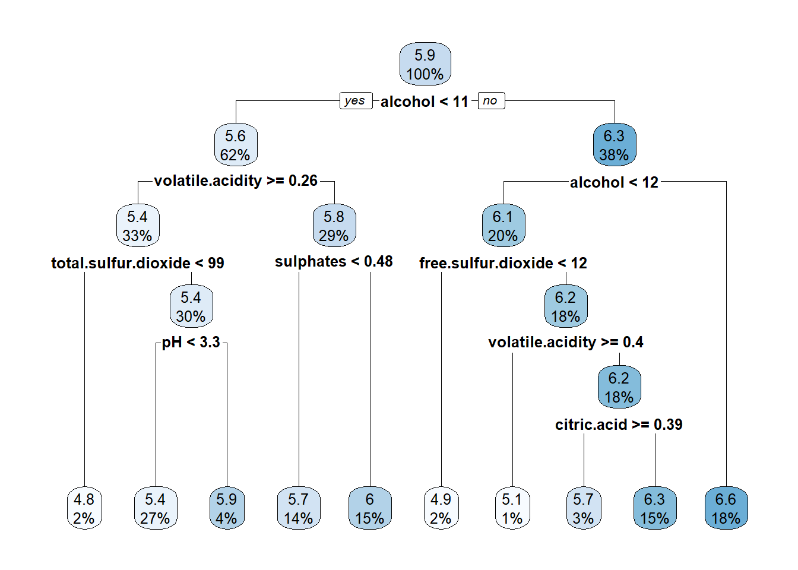
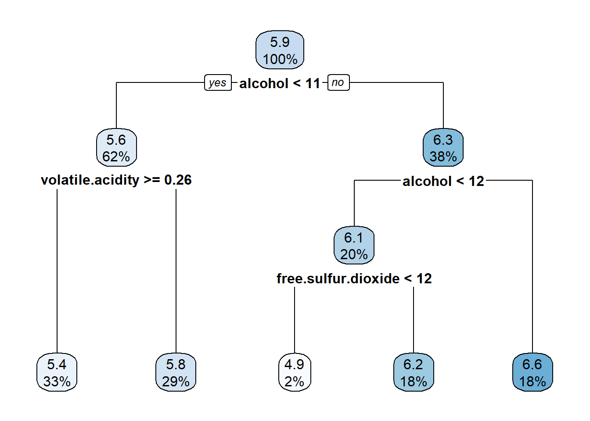
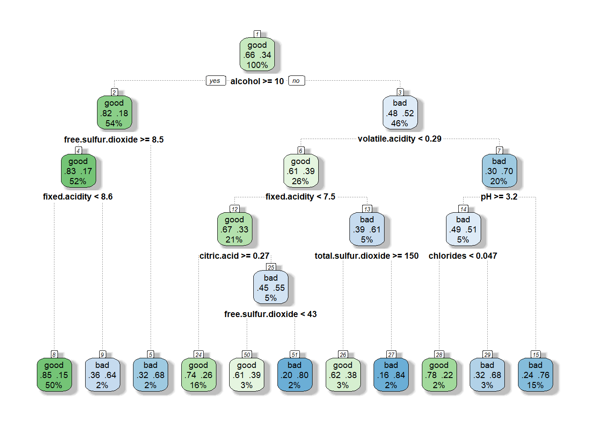
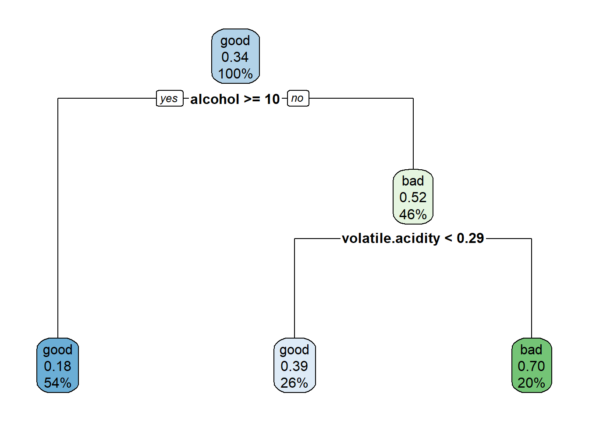
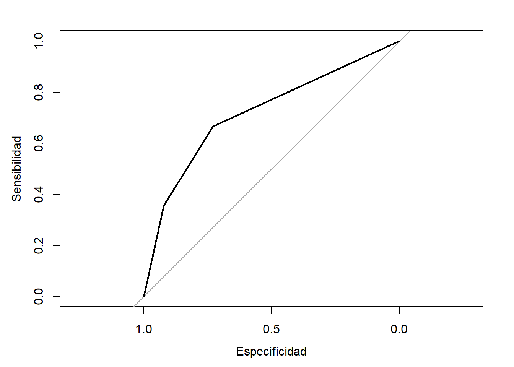

# Árboles de decisión {#trees}

<!-- Capítulo \@ref(trees) -->


<!-- 
---
title: "Árboles de decisión"
author: "Aprendizaje estadístico (UDC)"
date: "Máster en Técnicas Estadísticas"
bibliography: "aprendizaje.bib"
link-citations: yes
output: 
  bookdown::html_document2:
    pandoc_args: ["--number-offset", "2,0"]
    toc: yes 
    # mathjax: local            # copia local de MathJax, hay que establecer:
    # self_contained: false     # las dependencias se guardan en ficheros externos 
---

bookdown::preview_chapter("02-arboles.Rmd")
knitr::purl("02-arboles.Rmd", documentation = 2)
knitr::spin("02-arboles.R",knit = FALSE)
-->

Los *árboles de decisión* son uno de los métodos más simples y fáciles de interpretar para realizar predicciones en problemas de clasificación y de regresión. 
Se desarrollan a partir de los años 70 del siglo pasado como una alternativa versátil a los métodos clásicos de la estadística, fuertemente basados en las hipótesis de linealidad y de normalidad, y enseguida se convierten en una técnica básica del aprendizaje automático. 
Aunque su calidad predictiva es mediocre (especialmente en el caso de regresión), constituyen la base de otros métodos altamente competitivos (bagging, bosques aleatorios, boosting) en los que se combinan múltiples árboles para mejorar la predicción, pagando el precio, eso sí, de hacer más difícil la interpretación del modelo resultante.

La idea de este método consiste en la segmentación (partición) del *espacio predictor* (es decir, del conjunto de posibles valores de las variables predictoras) en regiones tan simples que el proceso se pueda representar mediante un árbol binario. 
Se parte de un nodo inicial que representa a toda la muestra de entrenamiento, del que salen dos ramas que dividen la muestra en dos subconjuntos, cada uno representado por un nuevo nodo. 
Como se muestra en la Figura \@ref(fig:arbol), este proceso se repite un número finito de veces hasta obtener las hojas del árbol, es decir, los nodos terminales, que son los que se utilizan para realizar la predicción.
Una vez construido el árbol, la predicción se realizará en cada nodo terminal utilizando, típicamente, la media en un problema de regresión y la moda en un problema de clasificación. 

<div class="figure" style="text-align: center">

<p class="caption">(\#fig:arbol)Ejemplo de un árbol de decisión obtenido al realizar una partición binaria recursiva de un espacio bidimensional.</p>
</div>

<!-- 
Incluir figuras en dos columnas? En principio no.
fig.cap="Izquierda: ejemplo de un árbol obtenido al realizar una partición binaria recursiva de un espacio bidimensional. Derecha: superficie de predicción correspondiente."
-->

Al final de este proceso iterativo, el espacio predictor se ha particionado en regiones de forma rectangular en las que la predicción de la respuesta es constante  (ver Figura \@ref(fig:predictor)). 
Si la relación entre las variables predictoras y la variable respuesta no se puede describir adecuadamente mediante rectángulos, la calidad predictiva del árbol será limitada. 
Como vemos, la simplicidad del modelo es su principal argumento, pero también su talón de Aquiles.

<div class="figure" style="text-align: center">

<p class="caption">(\#fig:predictor)Ejemplo de la superficie de predicción correspondiente a un árbol de decisión.</p>
</div>

Como se ha dicho antes, cada nodo padre se divide, a través de dos ramas, en dos nodos hijos. 
Esto se hace seleccionando una variable predictora y dando respuesta a una pregunta dicotómica sobre ella.
Por ejemplo, ¿es el sueldo anual menor que 30000 euros?, o ¿es el género igual a *mujer*? 
El objetivo de esta partición recursiva es que los nodos terminales sean homogéneos respecto a la variable respuesta $Y$. 

Por ejemplo, en un problema de clasificación, la homogeneidad de los nodos terminales significaría que en cada uno de ellos solo hay elementos de una clase (categoría), y diríamos que los nodos son *puros*. 
En la práctica, esto siempre se puede conseguir construyendo árboles suficientemente profundos, con muchas hojas. 
Sin embargo, esta solución no es interesante, ya que va a dar lugar a un modelo excesivamente complejo y por tanto sobreajustado y de difícil interpretación. 
Por lo tanto, se hace necesario encontrar un equilibrio entre la complejidad del árbol y la pureza de los nodos terminales.


En resumen:

- Métodos simples y fácilmente interpretables.

- Se representan mediante árboles binarios.

- Técnica clásica de aprendizaje automático.

- Válidos para regresión y para clasificación.

- Válidos para predictores numéricos y categóricos.

La metodología CART [*Classification and Regresion Trees*, @breiman1984classification] es la más popular para la construcción de árboles de decisión y es la que se va a explicar con algo de detalle en las siguientes secciones. 

En primer lugar se tratarán los *árboles de regresión* (árboles de decisión en un problema de regresión, en el que la variable respuesta $Y$ es numérica) y a continuación veremos los *árboles de clasificación* (con variable respuesta categórica), que son los más utilizados en la práctica. 
Los árboles de regresión se emplean principalmente con fines descriptivos o como base de métodos más complejos.
Las variables predictoras $\mathbf{X}=(X_1, X_2, \ldots, X_p)$ pueden ser tanto numéricas como categóricas.
Además, con la metodología CART, las variables explicativas podrían contener datos faltantes.
Se pueden establecer "particiones sustitutas" (*surrogate splits*), de forma que cuando falta un valor en una variable que determina una división, se usa una variable alternativa que produce una partición similar. 


## Árboles de regresión CART

Como se comentó previamente, la construcción del modelo se hace a partir de la muestra de entrenamiento, y consiste en la partición del espacio predictor en $J$ regiones $R_1, R_2, \ldots, R_J$, para cada una de las cuales se va a calcular una constante: 
la media de la variable respuesta $Y$ para las observaciones de entrenamiento que caen en la región. Estas constantes son las que se van a utilizar para la predicción de nuevas observaciones; para ello solo hay que comprobar cuál es la región que le corresponde.

La cuestión clave es cómo se elige la partición del espacio predictor, para lo que vamos a utilizar como criterio de error la suma de los residuos al cuadrado (RSS, por sus siglas en inglés). 
Como hemos dicho, vamos a modelizar la respuesta en cada región como una constante, por tanto en la región $R_j$ nos interesa el $min_{c_j} \sum_{i\in R_j} (y_i - c_j)^2$, que se alcanza en la media de las respuestas $y_i$ (de la muestra de entrenamiento) en la región $R_j$, a la que llamaremos $\widehat y_{R_j}$.
Por tanto, se deben seleccionar las regiones $R_1, R_2, \ldots, R_J$ que minimicen 
$$RSS = \sum_{j=1}^{J} \sum_{i\in R_j} (y_i - \widehat y_{R_j})^2$$ 
(Obsérvese el abuso de notación $i\in R_j$, que significa las observaciones 
$i\in N$ que verifican $x_i \in R_j$).

Pero este problema es intratable en la práctica, por lo que es necesario simplificarlo. 
El método CART busca un compromiso entre rendimiento, por una parte, y sencillez e interpretabilidad, por otra, y por ello en lugar de hacer una búsqueda por todas las particiones posibles sigue un proceso iterativo (recursivo) en el que va realizando cortes binarios. 
En la primera iteración se trabaja con todos los datos:

- Una variable explicativa $X_j$ y un punto de corte $s$ definen dos hiperplanos
  $R_1 = \{ X : X_j \le s \}$ y $R_2 = \{ X : X_j > s \}$.

- Se seleccionan los valores de $j$ y $s$ que minimizen 
  $$ \sum_{i\in R_1} (y_i - \widehat y_{R_1})^2 + \sum_{i\in R_2} (y_i - \widehat y_{R_2})^2$$

A diferencia del problema original, este se soluciona de forma muy rápida. A continuación se repite el proceso en cada una de las dos regiones $R_1$ y $R_2$, y así sucesivamente hasta alcanzar un criterio de parada.

Fijémonos en que este método hace dos concesiones importantes: no solo restringe la forma que pueden adoptar las particiones, sino que además sigue un criterio de error codicioso (*greedy*): 
en cada iteración busca minimizar el RSS de las dos regiones resultantes, sin preocuparse del error que se va a cometer en iteraciones sucesivas. 
Y fijémonos también en que este proceso se puede representar en forma de árbol binario (en el sentido de que de cada nodo salen dos ramas, o ninguna cuando se llega al final), de ahí la terminología de *hacer crecer* el árbol.

¿Y cuándo paramos? Se puede parar cuando se alcance una profundidad máxima, aunque lo más habitual es exigir un número mínimo de observaciones para dividir un nodo.

- Si el árbol resultante es demasiado grande, va a ser un modelo demasiado complejo, 
  por tanto va a ser difícil de interpretar y, sobre todo, 
  va a provocar un sobreajuste de los datos. Cuando se evalúe el rendimiento utilizando 
  la muestra de validación, los resultados van a ser malos. Dicho de otra manera, tendremos un 
  modelo con poco sesgo pero con mucha varianza y en consecuencia inestable (pequeños 
  cambios en los datos darán lugar a modelos muy distintos). Más adelante veremos que esto 
  justifica la utilización del bagging como técnica para reducir la varianza.

- Si el árbol es demasiado pequeño, va a tener menos varianza (menos inestable) a costa 
  de más sesgo. Más adelante veremos que esto justifica la utilización del boosting. Los 
  árboles pequeños son más fáciles de interpretar, ya que permiten identificar las variables 
  explicativas que más influyen en la predicción.

Sin entrar por ahora en métodos combinados (métodos ensemble, tipo bagging o boosting), vamos a explicar cómo encontrar un equilibrio entre sesgo y varianza. Lo que se hace es construir un árbol grande para a continuación empezar a *podarlo*. 
Podar un árbol significa colapsar cualquier cantidad de sus nodos internos (no terminales), dando lugar a otro árbol más pequeño al que llamaremos *subárbol* del árbol original. 
Sabemos que el árbol completo es el que va a tener menor error si utilizamos la muestra de entrenamiento, pero lo que realmente nos interesa es encontrar el subárbol con un menor error al utilizar la muestra de validación. 
Lamentablemente, no es una estrategia viable evaluar todos los subárboles: 
simplemente, hay demasiados. Lo que se hace es, mediante un hiperparámetro (*tuning parameter* o parámetro de ajuste), controlar el tamaño del árbol, es decir, la complejidad del modelo, seleccionando el subárbol *óptimo* (para los datos disponibles). 
Veamos la idea con más detalle.

Dado un subárbol $T$ con $R_1, R_2, \ldots, R_t$ nodos terminales, consideramos como medida del error el RSS más una penalización que depende de un hiperparámetro no negativo $\alpha \ge 0$

\begin{equation} 
RSS_{\alpha} = \sum_{j=1}^t \sum_{i\in R_j} (y_i - \widehat y_{R_j})^2 + \alpha t
(\#eq:rss-alpha)
\end{equation} 

Para cada valor del parámetro $\alpha$ existe un único subárbol *más pequeño* que minimiza este error (obsérvese que aunque hay un continuo de valores distinos de $\alpha$, solo hay una cantidad finita de subárboles). 
Evidentemente, cuando $\alpha = 0$, ese subárbol será el árbol completo, algo que no nos interesa. 
Pero a medida que se incrementa $\alpha$ se penalizan los subárboles con muchos nodos terminales, dando lugar a una solución más pequeña (compacta). 
Encontrarla puede parecer muy costoso computacionalmente, pero lo cierto es que no lo es. El algoritmo consistente en ir colapsando nodos de forma sucesiva, de cada vez el nodo que produzca el menor incremento en el RSS (corregido por un factor que depende del tamaño), da lugar a una sucesión finita de subárboles que contiene, para todo $\alpha$, la solución.

Para finalizar, solo resta seleccionar un valor de $\alpha$. 
Para ello, como se comentó en la Sección \@ref(entrenamiento-test), una posible estrategia consiste en 
dividir la muestra en tres subconjuntos: datos de entrenamiento, de validación y de test. 
Para cada valor del parámetro de complejidad $\alpha$ hemos utilizado la muestra de entrenamiento para obtener un árbol 
(en la jerga, para cada valor del hiperparámetro $\alpha$ se entrena un modelo). 
Se emplea la muestra independiente de validación para seleccionar el valor de $\alpha$ (y por tanto el árbol) con el que nos quedamos. 
Y por último emplearemos la muestra de test (independiente de las otras dos) para evaluar el rendimiento del árbol seleccionado. 
No obstante, lo más habitual para seleccionar el valor del hiperparámetro $\alpha$ es emplear validación cruzada (u otro tipo de remuestreo) en la muestra de entrenamiento en lugar de considerar una muestra adicional de validación.

Hay dos opciones muy utilizadas en la práctica para seleccionar el valor de $\alpha$: 
se puede utilizar directamente el valor que minimice el error; o se puede forzar que el modelo sea un poco más sencillo con la regla *one-standard-error*, que selecciona el árbol más pequeño que esté a una distancia de un error estándar del árbol obtenido mediante la opción anterior.


También es habitual escribir la Ecuación \@ref(eq:rss-alpha) reescalando el parámetro de complejidad como $\tilde \alpha = \alpha / RSS_0$, siendo $RSS_0 = \sum_{i=1}^{n} (y_i - \bar y)^2$ la variabilidad total (la suma de cuadrados residual del árbol sin divisiones):
$$RSS_{\tilde \alpha}=RSS + \tilde \alpha RSS_0 t$$

De esta forma se podría interpretar el hiperparámetro $\tilde \alpha$ como una penalización en la proporción de variabilidad explicada, ya que dividiendo la expresión anterior por $RSS_0$ obtendríamos la proporción de variabilidad residual y a partir de ella podríamos definir:
$$R^2_{\tilde \alpha}=R^2 - \tilde \alpha  t$$


## Árboles de clasificación CART

En un problema de clasificación, la variable respuesta puede tomar los valores $1, 2, \ldots, K$, etiquetas que identifican las $K$ categorías del problema. 
Una vez construido el árbol, se comprueba cuál es la categoría modal de cada región: considerando la muestra de entrenamiento, la categoría más frecuente. 
La predicción de una observación será la categoría modal de la región a la que pertenezca.

El resto del proceso es idéntico al de los árboles de regresión ya explicado, con una única salvedad: no podemos utilizar RSS como medida del error. 
Es necesario buscar una medida del error adaptada a este contexto. 
Fijada una región, vamos a denotar por $\widehat p_{k}$, con $k = 1, 2, \ldots, K$, a la proporción de observaciones (de la muestra de entrenamiento) en la categoría $k$. 
Se utilizan tres medidas distintas del error en la región:

- Proporción de errores de clasificación:
  $$1 - max_{k} (\widehat p_{k})$$

- Índice de Gini:
  $$\sum_{k=1}^K \widehat p_{k} (1 - \widehat p_{k})$$

- Entropía^[La entropía es un concepto básico de la teoría de la información [@shannon1948mathematical] y se mide en *bits* (cuando en la definición se utilizan $log_2$).] (*cross-entropy*):
  $$- \sum_{k=1}^K \widehat p_{k} \text{log}(\widehat p_{k})$$

Aunque la proporción de errores de clasificación es la medida del error más intuitiva, en la práctica solo se utiliza para la fase de poda. Fijémonos que en el cálculo de esta medida solo interviene $max_{k} (\widehat p_{k})$, mientras que en las medidas alternativas intervienen las proporciones $\widehat p_{k}$ de todas las categorías. Para la fase de crecimiento se utilizan indistintamente el índice de Gini o la entropía. Cuando nos interesa el error no en una única región, sino en varias (al romper un nodo en dos, o al considerar todos los nodos terminales), se suman los errores de cada región previa ponderación por el número de observaciones que hay en cada una de ellas.

En la introducción de este tema se comentó que los árboles de decisión admiten tanto variables predictoras numéricas como categóricas, y esto es cierto tanto para árboles de regresión como para árboles de clasificación. Veamos brevemente cómo se tratarían los predictores categóricos a la hora de incorporarlos al árbol. El problema radica en qué se entiende por hacer un corte si las categorías del predictor no están ordenadas. Hay dos soluciones básicas:

- Definir variables predictoras *dummy*. Se trata de variables indicadoras, una por cada una de las categorías que tiene el predictor.
  Este criterio de *uno contra todos* tiene la ventaja de que estas variables son fácilmente interpretables, pero tiene el inconveniente de que puede aumentar mucho el número de variables predictoras.

- Ordenar las categorías de la variable predictora. Lo ideal sería considerar todas las ordenaciones posibles, pero eso es desde luego poco práctico: el incremento es factorial. 
  El truco consiste en utilizar un único orden basado en algún criterio *greedy*. 
  Por ejemplo, si la variable respuesta $Y$ también es categórica, se puede seleccionar una de sus categorías que resulte especialmente interesante y ordenar las categorías del predictor según su proporción en la categoría de $Y$. 
  Este enfoque no añade complejidad al modelo, pero puede dar lugar a resultados de difícil interpretación.


## CART con el paquete `rpart` {#tree-rpart}

La metodología CART está implementada en el paquete [`rpart`](https://CRAN.R-project.org/package=rpart)  (acrónimo de *Recursive PARTitioning*)^[El paquete [`tree`](https://CRAN.R-project.org/package=tree) es una traducción del original en S.], implementado por @R-rpart. 

La función principal es [`rpart()`](https://rdrr.io/pkg/rpart/man/rpart.html) y habitualmente se emplea de la forma:

`rpart(formula, data, method, parms, control, ...)`  

* `formula`: permite especificar la respuesta y las variables predictoras de la forma habitual; 
  se suele establecer de la forma `respuesta ~ .` para incluir todas las posibles variables explicativas.
  
* `data`: `data.frame` (opcional; donde se evaluará la fórmula) con la muestra de entrenamiento.

* `method`: método empleado para realizar las particiones, puede ser `"anova"` (regresión), `"class"` (clasificación), 
  `"poisson"` (regresión de Poisson) o `"exp"` (supervivencia), o alternativamente una lista de funciones (con componentes 
  `init`, `split`, `eval`; ver la *vignette* [*User Written Split Functions*](https://cran.r-project.org/web/packages/rpart/vignettes/usercode.pdf)). 
  Por defecto se selecciona a partir de la variable respuesta en `formula`, 
  por ejemplo, si es un factor (lo recomendado en clasificación) emplea `method = "class"`.

* `parms`: lista de parámetros opcionales para la partición en el caso de clasificación 
  (o regresión de Poisson). Puede contener los componentes `prior` (vector de probabilidades previas; 
  por defecto las frecuencias observadas), `loss` (matriz de pérdidas; con ceros en la diagonal y por defecto 1 en el resto) 
  y `split` (criterio de error; por defecto `"gini"` o alternativamente `"information"`).
  
* `control`: lista de opciones que controlan el algoritmo de partición, por defecto se seleccionan mediante la función `rpart.control()`, 
  aunque también se pueden establecer en la llamada a la función principal, y los principales parámetros son:
  
    ```
    rpart.control(minsplit = 20, minbucket = round(minsplit/3), cp = 0.01, 
                  xval = 10, maxdepth = 30, ...)
    ```

    - `cp` es el parámetro de complejidad $\tilde \alpha$ para la poda del árbol, de forma que un valor de 1 se corresponde con un árbol sin divisiones, y un valor de 0, con un árbol de profundidad máxima. 
      Adicionalmente, para reducir el tiempo de computación, el algoritmo empleado no realiza una partición si la proporción de reducción del error es inferior a este valor (valores más grandes simplifican el modelo y reducen el tiempo de computación).
      
    - `maxdepth` es la profundidad máxima del árbol (la profundidad de la raíz sería 0).
    
    - `minsplit` y `minbucket` son, respectivamente, los números mínimos de observaciones en un nodo intermedio para particionarlo 
      y en un nodo terminal.
    
    - `xval` es el número de grupos (folds) para validación cruzada.

Para más detalles, consultar la documentación de esta función o la *vignette* [*Introduction to Rpart*](https://cran.r-project.org/web/packages/rpart/vignettes/longintro.pdf).


### Ejemplo: regresión {#reg-rpart}

Emplearemos el conjunto de datos [`winequality`](https://rubenfcasal.github.io/mpae/reference/winetaste.html) del paquete [`mpae`](https://CRAN.R-project.org/package=mpae), que contiene información fisico-química 
(`fixed.acidity`, `volatile.acidity`, `citric.acid`, `residual.sugar`, `chlorides`, `free.sulfur.dioxide`, 
`total.sulfur.dioxide`, `density`, `pH`, `sulphates` y `alcohol`) y sensorial (`quality`)  de una muestra de 1250 vinos portugueses de la variedad *vinho verde* [@cortez2009modeling]


```r
library(mpae)
# data(winequality, package = "mpae")
str(winequality)
```

```
## 'data.frame':	1250 obs. of  12 variables:
##  $ fixed.acidity       : num  6.8 7.1 6.9 7.5 8.6 7.7 5.4 6.8 6.1 5.5 ...
##  $ volatile.acidity    : num  0.37 0.24 0.32 0.23 0.36 0.28 0.59 0.16 0.28 0.2..
##  $ citric.acid         : num  0.47 0.34 0.13 0.49 0.26 0.63 0.07 0.36 0.27 0.2..
##  $ residual.sugar      : num  11.2 1.2 7.8 7.7 11.1 11.1 7 1.3 4.7 1.6 ...
##  $ chlorides           : num  0.071 0.045 0.042 0.049 0.03 0.039 0.045 0.034 0..
##  $ free.sulfur.dioxide : num  44 6 11 61 43.5 58 36 32 56 23 ...
##  $ total.sulfur.dioxide: num  136 132 117 209 171 179 147 98 140 85 ...
##  $ density             : num  0.997 0.991 0.996 0.994 0.995 ...
##  $ pH                  : num  2.98 3.16 3.23 3.14 3.03 3.08 3.34 3.02 3.16 3.4..
##  $ sulphates           : num  0.88 0.46 0.37 0.3 0.49 0.44 0.57 0.58 0.42 0.42..
##  $ alcohol             : num  9.2 11.2 9.2 11.1 12 8.8 9.7 11.3 12.5 12.5 ...
##  $ quality             : int  5 4 5 7 5 4 6 6 8 5 ...
```
Como respuesta consideraremos la variable `quality`, mediana de al menos 3 evaluaciones de la calidad del vino realizadas por expertos, que los evaluaron entre 0 (muy malo) y 10 (excelente) como puede observarse en el gráfico de barras de la Figura \@ref(fig:barplot).

(ref:barplot) Distribución de las evaluaciones de la calidad del vino (`winequality$quality`).


```r
barplot(table(winequality$quality), xlab = "Calidad", ylab = "Frecuencia")
```

<div class="figure" style="text-align: center">

<p class="caption">(\#fig:barplot)(ref:barplot)</p>
</div>

En primer lugar se selecciona el 80&#8239;% de los datos como muestra de entrenamiento y el 20&#8239;% restante como muestra de test:

```r
set.seed(1)
nobs <- nrow(winequality)
itrain <- sample(nobs, 0.8 * nobs)
train <- winequality[itrain, ]
test <- winequality[-itrain, ]
```

Podemos obtener el árbol de decisión con las opciones por defecto con el comando:


```r
tree <- rpart(quality ~ ., data = train)
```

Al imprimirlo se muestra el número de observaciones e información sobre los distintos nodos (número de nodo, condición que define la partición, número de observaciones en el nodo, función de pérdida y predicción), marcando con un `*` los nodos terminales.


```r
tree
```

```
## n= 1000 
## 
## node), split, n, deviance, yval
##       * denotes terminal node
## 
##  1) root 1000 768.960 5.8620  
##    2) alcohol< 10.75 622 340.810 5.5868  
##      4) volatile.acidity>=0.2575 329 154.760 5.3708  
##        8) total.sulfur.dioxide< 98.5 24  12.500 4.7500 *
##        9) total.sulfur.dioxide>=98.5 305 132.280 5.4197  
##         18) pH< 3.315 269 101.450 5.3532 *
##         19) pH>=3.315 36  20.750 5.9167 *
##      5) volatile.acidity< 0.2575 293 153.470 5.8294  
##       10) sulphates< 0.475 144  80.326 5.6597 *
##       11) sulphates>=0.475 149  64.993 5.9933 *
##    3) alcohol>=10.75 378 303.540 6.3148  
##      6) alcohol< 11.775 200 173.870 6.0750  
##       12) free.sulfur.dioxide< 11.5 15  10.933 4.9333 *
##       13) free.sulfur.dioxide>=11.5 185 141.810 6.1676  
##         26) volatile.acidity>=0.395 7  12.857 5.1429 *
##         27) volatile.acidity< 0.395 178 121.310 6.2079  
##           54) citric.acid>=0.385 31  21.935 5.7419 *
##           55) citric.acid< 0.385 147  91.224 6.3061 *
##      7) alcohol>=11.775 178 105.240 6.5843 *
```

Para representarlo se pueden emplear las herramientas del paquete [`rpart`](https://CRAN.R-project.org/package=rpart)  (ver Figura \@ref(fig:arbolrpart)):

(ref:arbolrpart) Árbol de regresión para predecir `winequality$quality` (obtenido con las opciones por defecto de [`rpart()`](https://rdrr.io/pkg/rpart/man/rpart.html)).


```r
plot(tree)
text(tree)
```

<div class="figure" style="text-align: center">

<p class="caption">(\#fig:arbolrpart)(ref:arbolrpart)</p>
</div>

Pero puede ser preferible emplear el paquete [`rpart.plot`](https://CRAN.R-project.org/package=rpart.plot) [@R-rpartplot]  (ver Figura \@ref(fig:arbolrpartplot)):

(ref:arbolrpartplot) Representación del árbol de regresión generada con [`rpart.plot()`](https://rdrr.io/pkg/rpart.plot/man/rpart.plot.html).


```r
library(rpart.plot)
rpart.plot(tree)  
```

<div class="figure" style="text-align: center">

<p class="caption">(\#fig:arbolrpartplot)(ref:arbolrpartplot)</p>
</div>

Nos interesa conocer cómo se clasificaría a una nueva observación en los nodos terminales, junto con las predicciones correspondientes (la media de la respuesta en el nodo terminal). En los nodos intermedios, solo nos interesan las condiciones y el orden de las variables consideradas hasta llegar a las hojas. Para ello, puede ser útil imprimir las reglas:


```r
rpart.rules(tree, style = "tall")
```

```
## quality is 4.8 when
##     alcohol < 11
##     volatile.acidity >= 0.26
##     total.sulfur.dioxide < 99
## 
## quality is 4.9 when
##     alcohol is 11 to 12
##     free.sulfur.dioxide < 12
## 
## quality is 5.1 when
##     alcohol is 11 to 12
##     volatile.acidity >= 0.40
##     free.sulfur.dioxide >= 12
## 
## quality is 5.4 when
##     alcohol < 11
##     volatile.acidity >= 0.26
##     total.sulfur.dioxide >= 99
##     pH < 3.3
## 
## quality is 5.7 when
##     alcohol < 11
##     volatile.acidity < 0.26
##     sulphates < 0.48
## 
## quality is 5.7 when
##     alcohol is 11 to 12
##     volatile.acidity < 0.40
##     free.sulfur.dioxide >= 12
##     citric.acid >= 0.39
## 
## quality is 5.9 when
##     alcohol < 11
##     volatile.acidity >= 0.26
##     total.sulfur.dioxide >= 99
##     pH >= 3.3
## 
## quality is 6.0 when
##     alcohol < 11
##     volatile.acidity < 0.26
##     sulphates >= 0.48
## 
## quality is 6.3 when
##     alcohol is 11 to 12
##     volatile.acidity < 0.40
##     free.sulfur.dioxide >= 12
##     citric.acid < 0.39
## 
## quality is 6.6 when
##     alcohol >= 12
```

Por defecto, el árbol se poda considerando `cp = 0.01`, que puede ser adecuado en muchas situaciones.
Sin embargo, para seleccionar el valor óptimo de este hiperparámetro se puede emplear validación cruzada.

En primer lugar habría que establecer `cp = 0` para construir el árbol completo, a la profundidad máxima. La profundidad máxima viene determinada por los valores de `minsplit` y `minbucket`, los cuales pueden ser ajustados manualmente dependiendo del número de observaciones o tratados como hiperparámetros; esto último no está implementado en `rpart`, ni en principio en `caret`^[Los parámetros `maxsurrogate`, `usesurrogate` y `surrogatestyle` serían de utilidad si hay datos faltantes.]. 


```r
tree <- rpart(quality ~ ., data = train, cp = 0)
```

Posteriormente, podemos emplear la función [`printcp()`](https://rdrr.io/pkg/rpart/man/printcp.html) para obtener los valores de CP para los árboles (óptimos) de menor tamaño, junto con su error de validación cruzada `xerror` (reescalado de forma que el máximo de `rel error` es 1):


```r
printcp(tree)
```

```
## 
## Regression tree:
## rpart(formula = quality ~ ., data = train, cp = 0)
## 
## Variables actually used in tree construction:
##  [1] alcohol              chlorides            citric.acid         
##  [4] density              fixed.acidity        free.sulfur.dioxide 
##  [7] pH                   residual.sugar       sulphates           
## [10] total.sulfur.dioxide volatile.acidity    
## 
## Root node error: 769/1000 = 0.769
## 
## n= 1000 
## 
##          CP nsplit rel error xerror   xstd
## 1  0.162047      0     1.000  1.002 0.0486
## 2  0.042375      1     0.838  0.858 0.0436
## 3  0.031765      2     0.796  0.828 0.0435
## 4  0.027487      3     0.764  0.813 0.0428
## 5  0.013044      4     0.736  0.770 0.0397
## 6  0.010596      6     0.710  0.782 0.0394
## 7  0.010266      7     0.700  0.782 0.0391
## 8  0.008408      9     0.679  0.782 0.0391
## 9  0.008139     10     0.671  0.801 0.0399
## 10 0.007806     11     0.663  0.800 0.0405
## 11 0.006842     13     0.647  0.798 0.0402
## 12 0.006738     15     0.633  0.814 0.0409
##  [ reached getOption("max.print") -- omitted 48 rows ]
```

También [`plotcp()`](https://rdrr.io/pkg/rpart/man/plotcp.html) para representarlos^[Realmente en la tabla de texto se muestra el valor mínimo de CP, ya que se obtendría la misma solución para un rango de valores de CP (desde ese valor hasta el anterior, sin incluirlo), mientras que en el gráfico generado por [`plotcp()`](https://rdrr.io/pkg/rpart/man/plotcp.html) se representa la media geométrica de los extremos de ese intervalo.] (ver Figura \@ref(fig:cp)): 


```r
plotcp(tree)
```

<div class="figure" style="text-align: center">

<p class="caption">(\#fig:cp)Error de validación cruzada (reescalado) dependiendo del parámetro de complejidad CP empleado en el ajuste del árbol de decisión.</p>
</div>

La tabla con los valores de las podas (óptimas, dependiendo del parámetro de complejidad) está almacenada en la componente `$cptable`:


```r
head(tree$cptable, 10)
```

```
##           CP nsplit rel error  xerror     xstd
## 1  0.1620471      0   1.00000 1.00203 0.048591
## 2  0.0423749      1   0.83795 0.85779 0.043646
## 3  0.0317653      2   0.79558 0.82810 0.043486
## 4  0.0274870      3   0.76381 0.81350 0.042814
## 5  0.0130437      4   0.73633 0.77038 0.039654
## 6  0.0105961      6   0.71024 0.78168 0.039353
## 7  0.0102661      7   0.69964 0.78177 0.039141
## 8  0.0084080      9   0.67911 0.78172 0.039123
## 9  0.0081392     10   0.67070 0.80117 0.039915
## 10 0.0078057     11   0.66256 0.80020 0.040481
```

A partir de esta misma tabla podríamos seleccionar el valor óptimo de forma automática, siguiendo el criterio de un error estándar de @breiman1984classification: 


```r
xerror <- tree$cptable[,"xerror"]
imin.xerror <- which.min(xerror)
# Valor óptimo
tree$cptable[imin.xerror, ]
```

```
##        CP    nsplit rel error    xerror      xstd 
##  0.013044  4.000000  0.736326  0.770380  0.039654
```

```r
# Límite superior "oneSE rule" y complejidad mínima por debajo de ese valor
upper.xerror <- xerror[imin.xerror] + tree$cptable[imin.xerror, "xstd"]
icp <- min(which(xerror <= upper.xerror))
cp <- tree$cptable[icp, "CP"]
```

Para obtener el modelo final (ver Figura \@ref(fig:arbolpoda)) podamos el árbol con el valor de complejidad obtenido 0.01304 (que en este caso coincide con el valor óptimo).


```r
tree <- prune(tree, cp = cp)
rpart.plot(tree) 
```

<div class="figure" style="text-align: center">

<p class="caption">(\#fig:arbolpoda)Árbol de regresión resultante después de la poda (modelo final).</p>
</div>


Podríamos estudiar el modelo final, por ejemplo, mediante el método [`summary.rpart()`](https://rdrr.io/pkg/rpart/man/summary.rpart.html).  Este método muestra,  entre otras cosas, una medida (en porcentaje) de la importancia de las variables explicativas para la predicción de la respuesta (teniendo en cuenta todas las particiones, principales y secundarias, en las que se emplea cada variable explicativa). Como alternativa, podríamos emplear el siguiente código:


```r
# summary(tree)
importance <- tree$variable.importance # Equivalente a caret::varImp(tree) 
importance <- round(100*importance/sum(importance), 1)
importance[importance >= 1]
```

```
##              alcohol              density            chlorides 
##                 36.1                 21.7                 11.3 
##     volatile.acidity total.sulfur.dioxide  free.sulfur.dioxide 
##                  8.7                  8.5                  5.0 
##       residual.sugar            sulphates          citric.acid 
##                  4.0                  1.9                  1.1 
##                   pH 
##                  1.1
```

El último paso sería evaluarlo en la muestra de test siguiendo los pasos descritos en la Sección \@ref(eval-reg). 
Representamos los valores observados frente a las predicciones (ver Figura \@ref(fig:obsXpred)):

(ref:obsXpred) Gráfico de observaciones frente a predicciones (`test$quality`; se añade una perturbación para mostrar la distribución de los valores).


```r
obs <- test$quality
pred <- predict(tree, newdata = test)
# plot(pred, obs, xlab = "Predicción", ylab = "Observado")
plot(jitter(pred), jitter(obs), xlab = "Predicción", ylab = "Observado")
abline(a = 0, b = 1)
```

<div class="figure" style="text-align: center">

<p class="caption">(\#fig:obsXpred)(ref:obsXpred)</p>
</div>

y calculamos medidas de error de las predicciones, bien empleando el paquete `caret`: 

```r
caret::postResample(pred, obs)
```

```
##     RMSE Rsquared      MAE 
##  0.81456  0.19695  0.65743
```
o con la función `accuracy()`:


```r
accuracy(pred, test$quality)
```

```
##         me       rmse        mae        mpe       mape  r.squared 
## -0.0012694  0.8145614  0.6574264 -1.9523422 11.5767160  0.1920077
```


Como se puede observar, el ajuste del modelo es bastante deficiente. Esto es habitual en árboles de regresión, especialmente si son tan pequeños, y por ello solo se utilizan, por lo general, en un análisis exploratorio inicial o como base para modelos más avanzados como los mostrados en el siguiente capítulo. En problemas de clasificación es más habitual que se puedan llegar a obtener buenos ajustes con árboles de decisión.


::: {.exercise #efecto-semilla}

Como se comentó en la introducción del Capítulo \@ref(intro-AE), al emplear el procedimiento habitual en AE de particionar los datos no se garantiza la reproducibilidad/repetibilidad de los resultados, ya que dependen de la semilla. 
El modelo ajustado puede variar con diferentes semillas, especialmente si el conjunto de entrenamiento es pequeño, aunque generalmente no se observan cambios significativos en las predicciones.

Podemos ilustrar el efecto de la semilla en los resultados empleando el ejemplo anterior. Para ello, repite el ajuste de un árbol de regresión considerando distintas semillas y compara los resultados obtenidos.

La dificultad podría estar en cómo comparar los resultados.
Una posible solución sería mantener fija la muestra de test, de modo que no dependa de la semilla utilizada.
Por comodidad, considera las primeras `ntest` observaciones del conjunto de datos como muestra de test.
Posteriormente, para cada semilla, selecciona la muestra de entrenamiento de la forma habitual y ajusta un árbol. 
Finalmente, evalúa los resultados en la muestra de test.

Como base se puede utilizar el siguiente código:


```r
ntest <- 10
test <- winequality[1:ntest, ]
df <- winequality[-(1:ntest), ]
nobs <- nrow(df)
# Para las distintas semillas
set.seed(semilla)
itrain <- sample(nobs, 0.8 * nobs)
train <- df[itrain, ]
# tree <- ...
```

Como observación final, en este caso el conjunto de datos no es muy grande y tampoco se obtuvo un buen ajuste con un árbol de regresión, por lo que sería de esperar que se observaran más diferencias.

:::


::: {.exercise #train-validate-test-tree}

Como se indicó previamente, el paquete `rpart` implementa la selección del parámetro de complejidad mediante validación cruzada. 
Como alternativa, siguiendo la idea del Ejercicio \@ref(exr:train-validate-test), y considerando de nuevo el ejemplo anterior, particiona la muestra en datos de entrenamiento (70&#8239;%), de validación (15&#8239;%) y de test (15&#8239;%), para ajustar los árboles de decisión, seleccionar el parámetro de complejidad (el hiperparámetro) y evaluar las predicciones del modelo final, respectivamente.

:::


::: {.exercise #train-boot-tree}

Una alternativa a particionar en entrenamiento y validación sería emplear bootstrap. 
La idea consiste en emplear una remuestra bootstrap del conjunto de datos de entrenamiento para ajustar el modelo y utilizar las observaciones no seleccionadas (se suelen denominar datos *out-of-bag*) como conjunto de validación.


```r
set.seed(1)
nobs <- nrow(winequality)
itrain <- sample(nobs, 0.8 * nobs)
train <- winequality[itrain, ]
test <- winequality[-itrain, ]
# Indice muestra de entrenamiento bootstrap
set.seed(1)
ntrain <- nrow(train)
itrain.boot <- sample(ntrain, replace = TRUE)
train.boot <- train[itrain.boot, ]
```

La muestra bootstrap va a contener muchas observaciones repetidas y habrá observaciones no seleccionadas.
La probabilidad de que una observación no sea seleccionada es $(1 - 1/n)^n \approx e^{-1} \approx 0.37$.


```r
# Número de casos "out of bag"
ntrain - length(unique(itrain.boot))
```

```
## [1] 370
```

```r
# Muestra "out of bag"
oob <- train[-itrain.boot, ]
```

El procedimiento restante sería análogo al caso anterior, cambiando `train` por `train.boot` y `validate` por `oob`.
Sin embargo, lo recomendable sería repetir el proceso un número grande de veces y promediar los errores, especialmente cuando el tamaño muestral es pequeño (este enfoque se relaciona con el método de bagging, descrito en el siguiente capítulo). 
No obstante, y por simplicidad, realiza el ajuste empleando una única muestra bootstrap y evalúa las predicciones en la muestra de test.

:::


### Ejemplo: modelo de clasificación {#class-rpart}

Para ilustrar los árboles de clasificación CART, podemos emplear los datos anteriores de calidad de vino, considerando como respuesta una nueva variable `taste` que clasifica los vinos en "good" o "bad" dependiendo de si `winequality$quality >= 6` 
(este conjunto de datos está disponible en [`mpae::winetaste`](https://rubenfcasal.github.io/mpae/reference/winetaste.html)).


```r
# data(winetaste, package = "mpae")
winetaste <- winequality[, colnames(winequality)!="quality"]
winetaste$taste <- factor(winequality$quality < 6, 
                      labels = c('good', 'bad')) # levels = c('FALSE', 'TRUE')
str(winetaste)
```

```
## 'data.frame':	1250 obs. of  12 variables:
##  $ fixed.acidity       : num  6.8 7.1 6.9 7.5 8.6 7.7 5.4 6.8 6.1 5.5 ...
##  $ volatile.acidity    : num  0.37 0.24 0.32 0.23 0.36 0.28 0.59 0.16 0.28 0.2..
##  $ citric.acid         : num  0.47 0.34 0.13 0.49 0.26 0.63 0.07 0.36 0.27 0.2..
##  $ residual.sugar      : num  11.2 1.2 7.8 7.7 11.1 11.1 7 1.3 4.7 1.6 ...
##  $ chlorides           : num  0.071 0.045 0.042 0.049 0.03 0.039 0.045 0.034 0..
##  $ free.sulfur.dioxide : num  44 6 11 61 43.5 58 36 32 56 23 ...
##  $ total.sulfur.dioxide: num  136 132 117 209 171 179 147 98 140 85 ...
##  $ density             : num  0.997 0.991 0.996 0.994 0.995 ...
##  $ pH                  : num  2.98 3.16 3.23 3.14 3.03 3.08 3.34 3.02 3.16 3.4..
##  $ sulphates           : num  0.88 0.46 0.37 0.3 0.49 0.44 0.57 0.58 0.42 0.42..
##  $ alcohol             : num  9.2 11.2 9.2 11.1 12 8.8 9.7 11.3 12.5 12.5 ...
##  $ taste               : Factor w/ 2 levels "good","bad": 2 2 2 1 2 2 1 1 1 2 ..
```

```r
table(winetaste$taste)
```

```
## 
## good  bad 
##  828  422
```

Como en el caso anterior, se contruyen las muestras de entrenamiento (80&#8239;%) y de test (20&#8239;%):


```r
# set.seed(1)
# nobs <- nrow(winetaste)
# itrain <- sample(nobs, 0.8 * nobs)
train <- winetaste[itrain, ]
test <- winetaste[-itrain, ]
```

Al igual que en el caso anterior, podemos obtener el árbol de clasificación con las opciones por defecto (`cp = 0.01` y `split = "gini"`) con el comando:


```r
tree <- rpart(taste ~ ., data = train)
```

Al imprimirlo, además de mostrar el número de nodo, la condición de la partición y el número de observaciones en el nodo, también se incluye el número de observaciones mal clasificadas, la predicción y las proporciones estimadas (frecuencias relativas en la muestra de entrenamiento) de las clases:


```r
tree
```

```
## n= 1000 
## 
## node), split, n, loss, yval, (yprob)
##       * denotes terminal node
## 
##  1) root 1000 338 good (0.66200 0.33800)  
##    2) alcohol>=10.117 541 100 good (0.81516 0.18484)  
##      4) free.sulfur.dioxide>=8.5 522  87 good (0.83333 0.16667)  
##        8) fixed.acidity< 8.55 500  73 good (0.85400 0.14600) *
##        9) fixed.acidity>=8.55 22   8 bad (0.36364 0.63636) *
##      5) free.sulfur.dioxide< 8.5 19   6 bad (0.31579 0.68421) *
##    3) alcohol< 10.117 459 221 bad (0.48148 0.51852)  
##      6) volatile.acidity< 0.2875 264 102 good (0.61364 0.38636)  
##       12) fixed.acidity< 7.45 213  71 good (0.66667 0.33333)  
##         24) citric.acid>=0.265 160  42 good (0.73750 0.26250) *
##         25) citric.acid< 0.265 53  24 bad (0.45283 0.54717)  
##           50) free.sulfur.dioxide< 42.5 33  13 good (0.60606 0.39394) *
##           51) free.sulfur.dioxide>=42.5 20   4 bad (0.20000 0.80000) *
##       13) fixed.acidity>=7.45 51  20 bad (0.39216 0.60784)  
##         26) total.sulfur.dioxide>=150 26  10 good (0.61538 0.38462) *
##         27) total.sulfur.dioxide< 150 25   4 bad (0.16000 0.84000) *
##      7) volatile.acidity>=0.2875 195  59 bad (0.30256 0.69744)  
##       14) pH>=3.235 49  24 bad (0.48980 0.51020)  
##         28) chlorides< 0.0465 18   4 good (0.77778 0.22222) *
##         29) chlorides>=0.0465 31  10 bad (0.32258 0.67742) *
##       15) pH< 3.235 146  35 bad (0.23973 0.76027) *
```

También puede ser preferible emplear el paquete [`rpart.plot`](https://CRAN.R-project.org/package=rpart.plot) para representarlo (ver Figura \@ref(fig:arbolclassif)):

(ref:arbolclassif) Árbol de clasificación de `winetaste$taste` (obtenido con las opciones por defecto).


```r
library(rpart.plot)
rpart.plot(tree) # Alternativa: rattle::fancyRpartPlot
```

<div class="figure" style="text-align: center">

<p class="caption">(\#fig:arbolclassif)(ref:arbolclassif)</p>
</div>

Nos interesa cómo se clasificaría a una nueva observación, es decir, cómo se llegaría a los nodos terminales, así como su probabilidad estimada, que representa la frecuencia relativa de la clase más frecuente en el correspondiente nodo terminal.  Para lograrlo, se puede modificar la información que se muestra en cada nodo (ver Figura \@ref(fig:arbolextra)):

(ref:arbolextra) Representación del árbol de clasificación de `winetaste$taste` con opciones adicionales.


```r
rpart.plot(tree, 
           extra = 104,          # show fitted class, probs, percentages
           box.palette = "GnBu", # color scheme
           branch.lty = 3,       # dotted branch lines
           shadow.col = "gray",  # shadows under the node boxes
           nn = TRUE)            # display the node numbers 
```

<div class="figure" style="text-align: center">

<p class="caption">(\#fig:arbolextra)(ref:arbolextra)</p>
</div>

Al igual que en el caso de regresión, puede ser de utilidad imprimir las reglas con `rpart.rules(tree, style = "tall")`.

También se suele emplear el mismo procedimiento para seleccionar un valor óptimo para el hiperparámetro de complejidad: se construye un árbol de decisión completo y se emplea validación cruzada para podarlo.
Además, si el número de observaciones es grande y las clases están más o menos balanceadas, 
se podría aumentar los valores mínimos de observaciones en los nodos intermedios y terminales^[Otra opción, más interesante para regresión, sería considerar estos valores como hiperparámetros.], por ejemplo:


```r
tree <- rpart(taste ~ ., data = train, cp = 0, minsplit = 30, minbucket = 10)
```

En este caso mantenemos el resto de valores por defecto:


```r
tree <- rpart(taste ~ ., data = train, cp = 0)
```

Representamos los errores (reescalados) de validación cruzada (ver Figura \@ref(fig:errorclassif)):

(ref:errorclassif) Evolución del error (reescalado) de validación cruzada en función del parámetro de complejidad.

<!-- printcp(tree) -->


```r
plotcp(tree)
```

<div class="figure" style="text-align: center">

<p class="caption">(\#fig:errorclassif)(ref:errorclassif)</p>
</div>

Para obtener el modelo final, seleccionamos el valor óptimo de complejidad siguiendo el criterio de un error estándar de @breiman1984classification y podamos el árbol (ver Figura \@ref(fig:arbolclassifpoda)).

(ref:arbolclassifpoda) Árbol de clasificación de `winetaste$taste` obtenido después de la poda (modelo final).


```r
xerror <- tree$cptable[,"xerror"]
imin.xerror <- which.min(xerror)
upper.xerror <- xerror[imin.xerror] + tree$cptable[imin.xerror, "xstd"]
icp <- min(which(xerror <= upper.xerror))
cp <- tree$cptable[icp, "CP"]
tree <- prune(tree, cp = cp)
rpart.plot(tree) 
```

<div class="figure" style="text-align: center">

<p class="caption">(\#fig:arbolclassifpoda)(ref:arbolclassifpoda)</p>
</div>

Si nos interesase estudiar la importancia de los predictores, podríamos utilizar el mismo código de la Sección \@ref(reg-rpart) (no evaluado):

```r
caret::varImp(tree)
importance <- tree$variable.importance
importance <- round(100*importance/sum(importance), 1)
importance[importance >= 1]
```


El último paso sería evaluar el modelo en la muestra de test siguiendo los pasos descritos en la Sección \@ref(eval-class).
El método [`predict.rpart()`](https://rdrr.io/pkg/rpart/man/predict.rpart.html) devuelve por defecto (`type = "prob"`) una matriz con las probabilidades de cada clase, por lo que habría que establecer `type = "class"` para obtener la clase predicha (consultar la ayuda de esta función para más detalles).


```r
obs <- test$taste
head(predict(tree, newdata = test))
```

```
##       good     bad
## 1  0.30256 0.69744
## 4  0.81516 0.18484
## 9  0.81516 0.18484
## 10 0.81516 0.18484
## 12 0.81516 0.18484
## 16 0.81516 0.18484
```

```r
pred <- predict(tree, newdata = test, type = "class")
table(obs, pred)
```

```
##       pred
## obs    good bad
##   good  153  13
##   bad    54  30
```

```r
caret::confusionMatrix(pred, obs)
```

```
## Confusion Matrix and Statistics
## 
##           Reference
## Prediction good bad
##       good  153  54
##       bad    13  30
##                                         
##                Accuracy : 0.732         
##                  95% CI : (0.673, 0.786)
##     No Information Rate : 0.664         
##     P-Value [Acc > NIR] : 0.0125        
##                                         
##                   Kappa : 0.317         
##                                         
##  Mcnemar's Test P-Value : 1.02e-06      
##                                         
##             Sensitivity : 0.922         
##             Specificity : 0.357         
##          Pos Pred Value : 0.739         
##          Neg Pred Value : 0.698         
##              Prevalence : 0.664         
##          Detection Rate : 0.612         
##    Detection Prevalence : 0.828         
##       Balanced Accuracy : 0.639         
##                                         
##        'Positive' Class : good          
## 
```

::: {.exercise #bfan-rpart}
En este ejercicio se empleará el conjunto de datos [`mpae::bfan`](https://rubenfcasal.github.io/mpae/reference/bfan.html) del paquete [`mpae`](https://CRAN.R-project.org/package=mpae) utilizado anteriormente en las secciones \@ref(reg-glm) y \@ref(generadores).
Considerando como respuesta la variable indicadora `bfan`, que clasifica a los individuos en `Yes` o `No` dependiendo de si su porcentaje de grasa corporal es superior al rango normal:

a) Particiona los datos, considerando un 80&#8239;% de las observaciones como muestra de aprendizaje y el 20&#8239;% restante como muestra de test.

b) Ajusta un árbol de decisión a los datos de entrenamiento seleccionando el parámetro de complejidad mediante la regla de un error estándar de Breiman. 

c) Representa e interpreta el árbol resultante, estudiando la importancia de las variables predictoras.

e) Evalúa la precisión de las predicciones en la muestra de test (precisión, sensibilidad y especificidad) y la estimación de las probabilidades mediante el AUC.

:::

### Interfaz de `caret`

En `caret` podemos ajustar un árbol CART seleccionando `method = "rpart"`.
Por defecto, `caret`  realiza bootstrap de las observaciones para seleccionar el valor óptimo del hiperparámetro `cp` (considerando únicamente tres posibles valores).
Si queremos emplear validación cruzada, como se hizo en el caso anterior, podemos emplear la función auxiliar [`trainControl()`](https://rdrr.io/pkg/caret/man/trainControl.html), y para considerar un mayor rango de posibles valores podemos hacer uso del argumento `tuneLength` (ver Figura \@ref(fig:arbolclassifggplot)).


```r
library(caret)
# modelLookup("rpart")  # Información sobre hiperparámetros
set.seed(1)
trControl <- trainControl(method = "cv", number = 10)
caret.rpart <- train(taste ~ ., method = "rpart", data = train, 
                     tuneLength = 20, trControl = trControl) 
caret.rpart
```

```
## CART 
## 
## 1000 samples
##   11 predictor
##    2 classes: 'good', 'bad' 
## 
## No pre-processing
## Resampling: Cross-Validated (10 fold) 
## Summary of sample sizes: 901, 900, 900, 900, 900, 900, ... 
## Resampling results across tuning parameters:
## 
##   cp        Accuracy  Kappa  
##   0.000000  0.70188   0.34873
##   0.005995  0.73304   0.38706
##   0.011990  0.74107   0.38785
##   0.017985  0.72307   0.33745
##   0.023980  0.73607   0.36987
##   0.029975  0.73407   0.35064
##   0.035970  0.73207   0.34182
##   0.041965  0.73508   0.34227
##   0.047960  0.73508   0.34227
##   0.053955  0.73508   0.34227
##   0.059950  0.73508   0.34227
##   0.065945  0.73508   0.34227
##   0.071940  0.73508   0.34227
##   0.077935  0.73508   0.34227
##   0.083930  0.73508   0.34227
##   0.089925  0.73508   0.34227
##   0.095920  0.73508   0.34227
##   0.101915  0.73508   0.34227
##   0.107910  0.72296   0.29433
##   0.113905  0.68096   0.10877
## 
## Accuracy was used to select the optimal model using the largest value.
## The final value used for the model was cp = 0.01199.
```

```r
ggplot(caret.rpart, highlight = TRUE)
```

<div class="figure" style="text-align: center">

<p class="caption">(\#fig:arbolclassifggplot)Evolución de la precisión (obtenida mediante validación cruzada) dependiendo del parámetro de complejidad, resaltando el valor óptimo.</p>
</div>
El modelo final se devuelve en la componente `$finalModel` (ver Figura \@ref(fig:arbolfinalcaret)):

(ref:arbolfinalcaret) Árbol de clasificación de `winetaste$taste`, obtenido con la complejidad "óptima" (empleando `caret`).


```r
caret.rpart$finalModel
```

```
## n= 1000 
## 
## node), split, n, loss, yval, (yprob)
##       * denotes terminal node
## 
##  1) root 1000 338 good (0.66200 0.33800)  
##    2) alcohol>=10.117 541 100 good (0.81516 0.18484)  
##      4) free.sulfur.dioxide>=8.5 522  87 good (0.83333 0.16667)  
##        8) fixed.acidity< 8.55 500  73 good (0.85400 0.14600) *
##        9) fixed.acidity>=8.55 22   8 bad (0.36364 0.63636) *
##      5) free.sulfur.dioxide< 8.5 19   6 bad (0.31579 0.68421) *
##    3) alcohol< 10.117 459 221 bad (0.48148 0.51852)  
##      6) volatile.acidity< 0.2875 264 102 good (0.61364 0.38636)  
##       12) fixed.acidity< 7.45 213  71 good (0.66667 0.33333)  
##         24) citric.acid>=0.265 160  42 good (0.73750 0.26250) *
##         25) citric.acid< 0.265 53  24 bad (0.45283 0.54717)  
##           50) free.sulfur.dioxide< 42.5 33  13 good (0.60606 0.39394) *
##           51) free.sulfur.dioxide>=42.5 20   4 bad (0.20000 0.80000) *
##       13) fixed.acidity>=7.45 51  20 bad (0.39216 0.60784)  
##         26) total.sulfur.dioxide>=150 26  10 good (0.61538 0.38462) *
##         27) total.sulfur.dioxide< 150 25   4 bad (0.16000 0.84000) *
##      7) volatile.acidity>=0.2875 195  59 bad (0.30256 0.69744)  
##       14) pH>=3.235 49  24 bad (0.48980 0.51020)  
##         28) chlorides< 0.0465 18   4 good (0.77778 0.22222) *
##         29) chlorides>=0.0465 31  10 bad (0.32258 0.67742) *
##       15) pH< 3.235 146  35 bad (0.23973 0.76027) *
```

```r
rpart.plot(caret.rpart$finalModel)
```

<div class="figure" style="text-align: center">

<p class="caption">(\#fig:arbolfinalcaret)(ref:arbolfinalcaret)</p>
</div>

Para utilizar la regla de "un error estándar" se puede añadir `selectionFunction = "oneSE"` en las opciones de entrenamiento[^rpart-1]:

[^rpart-1]: En principio también se podría utilizar la regla de un error estándar estableciendo `method = "rpart1SE"` en la llamada a `train()`, pero `caret` implementa internamente este método y en ocasiones no se obtienen los resultados esperados.

(ref:arbolclassifoneSE) Árbol de clasificación de `winetaste$taste`, obtenido con la regla de un error estándar para seleccionar la complejidad (empleando `caret`).


```r
set.seed(1)
trControl <- trainControl(method = "cv", number = 10, 
                          selectionFunction = "oneSE")
caret.rpart <- train(taste ~ ., method = "rpart", data = train, 
                     tuneLength = 20, trControl = trControl) 
# ggplot(caret.rpart, highlight = TRUE)
caret.rpart
```

```
## CART 
## 
## 1000 samples
##   11 predictor
##    2 classes: 'good', 'bad' 
## 
## No pre-processing
## Resampling: Cross-Validated (10 fold) 
## Summary of sample sizes: 901, 900, 900, 900, 900, 900, ... 
## Resampling results across tuning parameters:
## 
##   cp        Accuracy  Kappa  
##   0.000000  0.70188   0.34873
##   0.005995  0.73304   0.38706
##   0.011990  0.74107   0.38785
##   0.017985  0.72307   0.33745
##   0.023980  0.73607   0.36987
##   0.029975  0.73407   0.35064
##   0.035970  0.73207   0.34182
##   0.041965  0.73508   0.34227
##   0.047960  0.73508   0.34227
##   0.053955  0.73508   0.34227
##   0.059950  0.73508   0.34227
##   0.065945  0.73508   0.34227
##   0.071940  0.73508   0.34227
##   0.077935  0.73508   0.34227
##   0.083930  0.73508   0.34227
##   0.089925  0.73508   0.34227
##   0.095920  0.73508   0.34227
##   0.101915  0.73508   0.34227
##   0.107910  0.72296   0.29433
##   0.113905  0.68096   0.10877
## 
## Accuracy was used to select the optimal model using  the one SE rule.
## The final value used for the model was cp = 0.10192.
```

Como cabría esperar, el modelo resultante es más simple (ver Figura \@ref(fig:figarbolclassifoneSE)):


```r
rpart.plot(caret.rpart$finalModel)
```

<div class="figure" style="text-align: center">

<p class="caption">(\#fig:figarbolclassifoneSE)(ref:arbolclassifoneSE)</p>
</div>

Adicionalmente, representamos la importancia de los predictores (ver Figura \@ref(fig:arbolImpor)):


```r
var.imp <- varImp(caret.rpart)
plot(var.imp)
```

<div class="figure" style="text-align: center">

<p class="caption">(\#fig:arbolImpor)Importancia de los (posibles) predictores según el modelo obtenido con la regla de un error estándar.</p>
</div>

Finalmente, calculamos las predicciones con el método [`predict.train()`](https://rdrr.io/pkg/caret/man/predict.train.html) y posteriormente evaluamos su precisión con [`confusionMatrix()`](https://rdrr.io/pkg/caret/man/confusionMatrix.html):


```r
pred <- predict(caret.rpart, newdata = test)
confusionMatrix(pred, test$taste)
```

```
## Confusion Matrix and Statistics
## 
##           Reference
## Prediction good bad
##       good  153  54
##       bad    13  30
##                                         
##                Accuracy : 0.732         
##                  95% CI : (0.673, 0.786)
##     No Information Rate : 0.664         
##     P-Value [Acc > NIR] : 0.0125        
##                                         
##                   Kappa : 0.317         
##                                         
##  Mcnemar's Test P-Value : 1.02e-06      
##                                         
##             Sensitivity : 0.922         
##             Specificity : 0.357         
##          Pos Pred Value : 0.739         
##          Neg Pred Value : 0.698         
##              Prevalence : 0.664         
##          Detection Rate : 0.612         
##    Detection Prevalence : 0.828         
##       Balanced Accuracy : 0.639         
##                                         
##        'Positive' Class : good          
## 
```

También podríamos calcular las estimaciones de las probabilidades (añadiendo el argumento `type = "prob"`) y, por ejemplo, generar la curva ROC con `pROC::roc()` (ver Figura \@ref(fig:ROC-tree)): 

(ref:ROC-tree) Curva ROC correspondiente al árbol de clasificación de `winetaste$taste`.


```r
library(pROC)
p.est <- predict(caret.rpart, newdata = test, type = "prob")
roc_tree <- roc(response = obs, predictor = p.est$good)
roc_tree
```

```
## 
## Call:
## roc.default(response = obs, predictor = p.est$good)
## 
## Data: p.est$good in 166 controls (obs good) > 84 cases (obs bad).
## Area under the curve: 0.72
```

```r
plot(roc_tree, xlab = "Especificidad", ylab = "Sensibilidad")
```

<div class="figure" style="text-align: center">

<p class="caption">(\#fig:ROC-tree)(ref:ROC-tree)</p>
</div>

A la vista de los resultados, los árboles de clasificación no parecen muy adecuados para este problema.
Sobre todo por la mala clasificación en la categoría `"bad"` (en este último ajuste se obtuvo un valor de especificidad de 0.3571 en la muestra de test), lo que podría ser debido a que las clases están desbalanceadas y en el ajuste recibe mayor peso el error en la clase mayoritaria.
Para tratar de evitarlo, se podría emplear una matriz de pérdidas a través del componente `loss` del argumento `parms` (en el Ejercicio \@ref(exr:svm-class-weight) se propone una aproximación similar).
También se podría pensar en cambiar el criterio de optimalidad.
Por ejemplo, emplear el coeficiente kappa en lugar de la precisión (solo habría que establecer `metric = "Kappa"` en la llamada a la función `train()`), o el área bajo la curva ROC (ver Ejercicio \@ref(exr:svm-caret-roc)).


<!-- 

NOTA: En principio también se podría utilizar la regla de "un error estándar" seleccionando `method = "rpart1SE"` (pero `caret` implementa internamente este método y en ocasiones no se obtienen los resultados esperados).


```r
set.seed(1)
caret.rpart <- train(taste ~ ., method = "rpart1SE", data = train) 
caret.rpart
printcp(caret.rpart$finalModel)
caret.rpart$finalModel
rpart.plot(caret.rpart$finalModel) #, main = "Classification tree winetaste"
varImp(caret.rpart)
```

Como alternativas al uso de la metodología CART desde `caret` se  puede considerar las opciones de los metapaquetes: 

* [`mlr3`](https://mlr-org.com), que incorpora una llamada a `rpart::rpart()` desde sus **learners** `lrn("regr.rpart")` y `lrn("classif.rpart")`.
* [`h2o`](https://www.h2o.ai/blog/finally-you-can-plot-h2o-decision-trees-in-r/), que aunque no ofrece una implementación de los árboles CART, sí ofrece dos alternativas más sofisticadas usando bosques aleatorios `h2o.randomForest()` y los procedimientos basados en el aumento del gradiente `h2o.gbm()`.
-->


::: {.exercise #bfan-rpart-caret}

Continuando con el Ejercicio \@ref(exr:bfan-rpart), emplea `caret` para clasificar los individuos mediante un árbol de decisión.
Utiliza la misma partición de los datos, seleccionando el parámetro de complejidad mediante validación cruzada con 10 grupos y el criterio de un error estándar de Breiman. 
Representa e interpreta el árbol resultante (comentando la importancia de las variables) y evalúa la precisión de las predicciones en la muestra de test.

:::


## Alternativas a los árboles CART

Una de las alternativas más populares es la metodología C4.5 [@quinlan1993c4], evolución de ID3 [@quinlan1986induction], que en estos momentos se encuentra en la versión C5.0 (y es ya muy similar a CART). 
C5.0 se utiliza solo para clasificación e incorpora boosting (que veremos en el tema siguiente).
Esta metodología está implementada en el paquete [`C50`](https://topepo.github.io/C5.0/index.html) [@R-C50]. 

Ross Quinlan desarrolló también la metodologia M5 [@quinlan1992learning] para regresión. 
Su principal característica es que los nodos terminales, en lugar de contener un número, contienen un modelo (de regresión) lineal. 
El paquete [`Cubist`](https://topepo.github.io/Cubist) [@R-Cubist] es una evolución de M5 que incorpora un método ensemble similar a boosting.

La motivación detrás de M5 es que, si la predicción que aporta un nodo terminal se limita a un único número (como hace la metodología CART), entonces el modelo va a predecir muy mal los valores que *realmente* son muy extremos, ya que el número de posibles valores predichos está limitado por el número de nodos terminales, y en cada uno de ellos se utiliza una media. 
Por ello, M5 le asocia a cada nodo un modelo de regresión lineal, para cuyo ajuste se utilizan los datos del nodo y todas las variables que están en la ruta del nodo. 
Para evaluar los posibles cortes que conducen al siguiente nodo, se utilizan los propios modelos lineales para calcular la medida del error.

Una vez se ha construido todo el árbol, para realizar la predicción se puede utilizar el modelo lineal que está en el nodo terminal correspondiente, pero funciona mejor si se utiliza una combinación lineal del modelo del nodo terminal y de todos sus nodos ascendientes (es decir, los que están en su camino).

Otra opción es CHAID [*CHi-squared Automated Interaction Detection*, @kass1980exploratory], que se basa en una idea diferente. Es un método de construcción de árboles de clasificación que se utiliza cuando las variables predictoras son cualitativas o discretas; en caso contrario, deben ser categorizadas previamente. 
Y se basa en el contraste chi-cuadrado de independencia para tablas de contingencia.

Para cada par $(X_i, Y)$, se considera su tabla de contingencia y se calcula el *p*-valor del contraste chi-cuadrado, seleccionándose la variable predictora que tenga un *p*-valor más pequeño, ya que se asume que las variables predictoras más relacionadas con la respuesta $Y$ son las que van a tener *p*-valores más pequeños y darán lugar a mejores predicciones. 
Se divide el nodo de acuerdo con los distintos valores de la variable predictora seleccionada, y se repite el proceso mientras haya variables *significativas*.
Dado que el método exige que el *p*-valor sea menor que 0.05 (o el nivel de significación que se elija), y hay que hacer muchas comparaciones, es necesario aplicar una corrección para comparaciones múltiples, por ejemplo la de Bonferroni.

Lo que acabamos de explicar daría lugar a árboles no necesariamente binarios. 
Como se desea trabajar con árboles binarios (si se admite que de un nodo salga cualquier número de ramas, con muy pocos niveles de profundidad del árbol ya nos quedaríamos sin datos), es necesario hacer algo más: forzar a que las variables predictoras tengan solo dos categorías mediante un proceso de fusión. 
Se van haciendo pruebas chi-cuadrado entre pares de categorías y la variable respuesta, y se fusiona el par con el *p*-valor más alto, ya que se trata de fusionar las categorías que sean más similares.

Para árboles de regresión hay metodologías que, al igual que CHAID, se basan en el cálculo de *p*-valores, en este caso de contrastes de igualdad de medias.
Una de las más utilizadas son los *conditional inference trees* [@hothorn2006unbiased]^[Otra alternativa es GUIDE [*Generalized, Unbiased, Interaction Detection and Estimation*, @loh2002regression].], implementada en la función [`ctree()`](https://rdrr.io/pkg/party/man/ctree.html) del paquete [`party`](https://CRAN.R-project.org/package=party) [@R-party].

Un problema conocido de los árboles CART es que sufren un sesgo de selección de variables: los predictores con más valores distintos son favorecidos. 
Esta es una de las motivaciones de utilizar estos métodos basados en contrastes de hipótesis. 
Por otra parte, hay que ser conscientes de que los contrastes de hipótesis y la calidad predictiva son cosas distintas.

A modo de ejemplo, siguiendo con el problema de clasificación anterior, podríamos ajustar un árbol de decisión empleando la metodología de *inferencia condicional* mediante el siguiente código:

(ref:ctree-plot) Árbol de decisión para clasificar la calidad del vino (`winetaste$taste`) obtenido con el método condicional.


```r
library(party)
tree2 <- ctree(taste ~ ., data = train) 
plot(tree2)
```

<div class="figure" style="text-align: center">

<p class="caption">(\#fig:ctree-plot)(ref:ctree-plot)</p>
</div>

En la representación del árbol (ver Figura \@ref(fig:ctree-plot)) se muestra el *p*-valor (ajustado por Bonferroni) en cada nodo interno y se representa la proporción de cada clase en los nodos terminales.

Para más detalles, ver la *vignette* del paquete [*party: A Laboratory for Recursive Partytioning*](https://cran.r-project.org/web/packages/party/vignettes/party.pdf).
