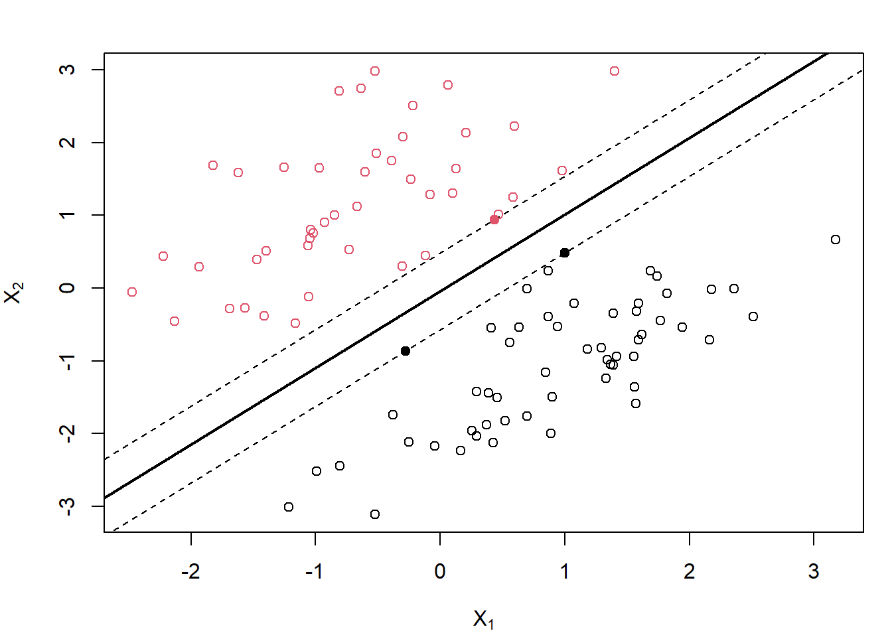
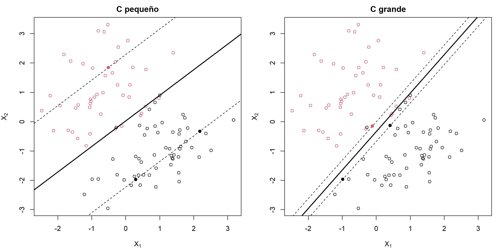
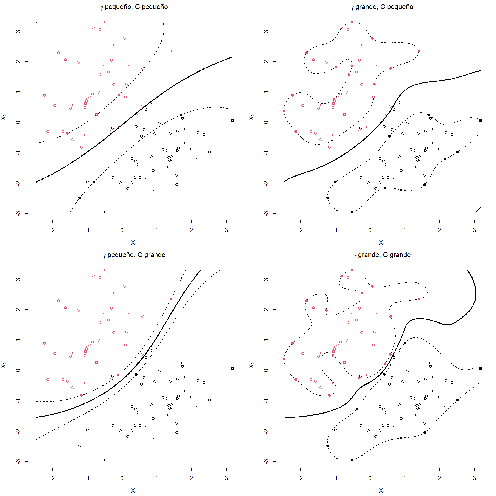

# Máquinas de soporte vectorial {#svm}

<!-- Capítulo \@ref(svm) -->


<!-- 
---
title: "Máquinas de soporte vectorial"
author: "Aprendizaje Estadístico (UDC)"
date: "Máster en Técnicas Estadísticas"
bibliography: "aprendizaje.bib"
link-citations: yes
output: 
  bookdown::html_document2:
    pandoc_args: ["--number-offset", "4,0"]
    toc: yes 
    # mathjax: local            # copia local de MathJax
    # self_contained: false     # dependencias en ficheros externos
header-includes:
- \setcounter{section}{4}          
    
---

bookdown::preview_chapter("04-svm.Rmd")
knitr::purl("04-svm.Rmd", documentation = 2)
knitr::spin("04-svm.R",knit = FALSE)
-->

Las máquinas de soporte vectorial (*support vector machines*, SVM) son métodos estadísticos desarrollados por Vladimir Vapnik a mediados de la década de 1960.  Inicialmente concebidos para abordar problemas de clasificación binaria (clasificación con dos categorias), se basan en la idea de separar los datos mediante hiperplanos. 
En la actualidad existen extensiones de esta metodología que permiten la clasificación multiclase (clasificación con más de dos categorías), así como su empleo en regresión y en detección de datos atípicos. 
El nombre proviene de la utilización de vectores que hacen de soporte para maximizar la separación entre los datos y el hiperplano.

La popularidad de las máquinas de soporte vectorial creció a partir de los años 90, cuando los incorpora la comunidad informática. 
Se considera una metodología muy flexible y con buen rendimiento en un amplio abanico de situaciones, aunque por lo general no es la que consigue los mejores rendimientos. 
Dos referencias clásicas que han contribuido a la comprensión y popularización de esta metodología son @vapnik1998statistical y @vapnik2000nature.

Siguiendo a @james2021introduction, distinguiremos en nuestra exposición entre clasificadores de máximo margen (*maximal margin classifiers*), clasificadores de soporte vectorial (*support vector classifiers*) y máquinas de soporte vectorial (*support vector machines*).


## Clasificadores de máximo margen 

Los clasificadores de máximo margen (*maximal margin classifiers*; también denominados *hard margin classifiers*) son un método de clasificación binaria que se utiliza cuando hay una frontera lineal que separa perfectamente los datos de entrenamiento de una categoría de los de la otra. 
Por conveniencia, etiquetamos las dos categorías como $+1/-1$, es decir, los valores de la variable respuesta $Y \in \{-1, 1\}$. 
Y suponemos que existe un hiperplano
\[ \beta_0 + \beta_1 X_1 + \beta_2 X_2 + \ldots + \beta_p X_p = 0,\]
donde $p$ es el número de variables predictoras, que tiene la propiedad de separar los datos de entrenamiento según la categoría a la que pertenecen, es decir, 
\[ y_i(\beta_0 + \beta_1 x_{1i} + \beta_2 x_{2i} + \ldots + \beta_p x_{pi}) > 0\]
para todo $i = 1, 2, \ldots, n$, siendo $n$ el número de datos de entrenamiento.

Una vez tenemos el hiperplano, clasificar una nueva observación $\mathbf{x}$ se reduce a calcular el signo de
\[m(\mathbf{x}) = \beta_0 + \beta_1 x_1 + \beta_2 x_2 + \ldots + \beta_p x_p\]
Si el signo es positivo, la observación se clasifica como perteneciente a la categoría $+1$, y si es negativo a la categoría $-1$. 
Además, el valor absoluto de $m(\mathbf{x})$ nos da una idea de la distancia entre la observación y la frontera que define el hiperplano. 
En concreto 
$$\frac{y_i}{\sqrt {\sum_{j=1}^p \beta_j^2}}(\beta_0 + \beta_1 x_{1i} + \beta_2 x_{2i} + \ldots + \beta_p x_{pi})$$
sería la distancia de la observación $i$-ésima al hiperplano.
Por supuesto, aunque clasifique los datos de entrenamiento sin error, no hay ninguna garantía de que clasifique bien nuevas observaciones, por ejemplo los datos de test. 
De hecho, si $p$ es grande, es fácil que haya un sobreajuste.

En realidad, si existe al menos un hiperplano que separa perfectamente los datos de entrenamiento de las dos categorías, entonces va a haber infinitos. 
El objetivo es seleccionar un hiperplano que separe los datos lo mejor posible, en el sentido que exponemos a continuación. 
Dado un hiperplano de separación, se calculan sus distancias a todos los datos de entrenamiento y se define el *margen* como la menor de esas distancias. 
El método *maximal margin classifier* lo que hace es seleccionar, de entre los infinitos hiperplanos, aquel que tiene el mayor margen. 
Fijémonos en que siempre va a haber varias observaciones que equidistan del hiperplano de máximo margen, y cuya distancia es precisamente el margen. 
Esas observaciones reciben el nombre de *vectores soporte* (podemos obtener el hiperplano a partir de ellas) y son las que dan nombre a esta metodología (ver Figura \@ref(fig:margin)). 


<div class="figure" style="text-align: center">

<p class="caption">(\#fig:margin)Ilustración de un clasificador de máximo margen con dos predictores (con datos simulados; los puntos se corresponden con las observaciones y el color, negro o rojo, con la clase). La línea sólida es el hiperplano de máximo margen y los puntos sólidos son los vectores de soporte (las líneas discontinuas se corresponden con la máxima distancia del hiperplano a las observaciones).</p>
</div>

Matemáticamente, dadas las $n$ observaciones de entrenamiento $\mathbf{x}_1, \mathbf{x}_2, \ldots, \mathbf{x}_n$, el clasificador de máximo margen es la solución del problema de optimización
\[max_{\beta_0, \beta_1,\ldots, \beta_p} M\]
sujeto a
\[\sum_{j=1}^p \beta_j^2 = 1\]
\[ y_i(\beta_0 + \beta_1 x_{1i} + \beta_2 x_{2i} + \ldots + \beta_p x_{pi}) \ge M \ \ \forall i\]

Si, como estamos suponiendo en esta sección, los datos de entrenamiento son perfectamente separables mediante un hiperplano, entonces el problema anterior va a tener solución con $M>0$, y $M$ va a ser el margen. 

Una forma equivalente (y más conveniente) de formular el problema anterior, utilizando $M = 1/\lVert \boldsymbol{\beta} \rVert$ con $\boldsymbol{\beta} = (\beta_1, \beta_2, \ldots, \beta_p)$, es
\[\mbox{min}_{\beta_0, \boldsymbol{\beta}} \lVert \boldsymbol{\beta} \rVert\]
sujeto a
\[ y_i(\beta_0 + \beta_1 x_{1i} + \beta_2 x_{2i} + \ldots + \beta_p x_{pi}) \ge 1 \ \ \forall i\]
El problema anterior de optimización es convexo, dado que la función objetivo es cuadrática y las restricciones son lineales.

Hay una característica de este método que es de destacar: así como en otros métodos, si se modifica cualquiera de los datos se modifica también el modelo, en este caso el modelo solo depende de los (pocos) datos que son vector soporte, y la modificación de cualquier otro dato no afecta a la construcción del modelo (siempre que, al *moverse* el dato, no cambie el margen).


## Clasificadores de soporte vectorial 

Los clasificadores de soporte vectorial (*support vector classifiers*; también denominados *soft margin classifiers*) fueron introducidos en @cortes1995support. Son una extensión del problema anterior que se utiliza cuando se desea clasificar mediante un hiperplano, pero no existe ninguno que separe perfectamente los datos de entrenamiento según su categoría. En este caso no queda más remedio que admitir errores en la clasificación de algunos datos de entrenamiento (como hemos visto que pasa con todas las metodologías), que van a estar en el lado equivocado del hiperplano. Y en lugar de hablar de un margen, se habla de un margen débil (*soft margin*).

Este enfoque, consistente en aceptar que algunos datos de entrenamiento van a estar mal clasificados, puede ser preferible aunque exista un hiperplano que resuelva el problema de la sección anterior, ya que los clasificadores de soporte vectorial son más robustos que los clasificadores de máximo margen.

Veamos la formulación matemática del problema: 
\[\mbox{max}_{\beta_0, \beta_1,\ldots, \beta_p, \epsilon_1,\ldots, \epsilon_n} M\]
sujeto a
\[\sum_{j=1}^p \beta_j^2 = 1\]
\[ y_i(\beta_0 + \beta_1 x_{1i} + \beta_2 x_{2i} + \ldots + \beta_p x_{pi}) \ge M(1 - \epsilon_i) \ \ \forall i\]
\[\sum_{i=1}^n \epsilon_i \le K\]
\[\epsilon_i \ge 0 \ \ \forall i\]

Las variables $\epsilon_i$ son las variables de holgura (*slack variables*). 
Quizás resultase más intuitivo introducir las holguras en términos absolutos, como $M -\epsilon_i$, pero eso daría lugar a un problema no convexo, mientras que escribiendo la restricción en términos relativos como $M(1 - \epsilon_i)$ el problema pasa a ser convexo. 

En esta formulación el elemento clave es la introducción del hiperparámetro $K$, necesariamente no negativo, que se puede interpretar como la tolerancia al error. 
De hecho, es fácil ver que no puede haber más de $K$ datos de entrenamiento incorrectamente clasificados, ya que si un dato está mal clasificado, entonces $\epsilon_i > 1$. 
En el caso extremo de utilizar $K = 0$, estaríamos en el caso de un *hard margin classifier*. 
La elección del valor de $K$ también se puede interpretar como una penalización por la complejidad del modelo, y por tanto en términos del balance entre el sesgo y la varianza: valores pequeños van a dar lugar a modelos muy complejos, con mucha varianza y poco sesgo (con el consiguiente riesgo de sobreajuste); y valores grandes, a modelos con mucho sesgo y poca varianza. 
El hiperparámetro $K$ se puede seleccionar de modo óptimo por los procedimientos ya conocidos, tipo bootstrap o validación cruzada.

Una forma equivalente de formular el problema (cuadrático con restricciones lineales) es
\[\mbox{min}_{\beta_0, \boldsymbol{\beta}} \lVert \boldsymbol{\beta} \rVert\]
sujeto a
\[ y_i(\beta_0 + \beta_1 x_{1i} + \beta_2 x_{2i} + \ldots + \beta_p x_{pi}) \ge 1 - \epsilon_i \ \ \forall i\]
\[\sum_{i=1}^n \epsilon_i \le K\]
\[\epsilon_i \ge 0 \ \ \forall i\]

En la práctica, por una conveniencia de cálculo, se utiliza la formulación equivalente
\[\mbox{min}_{\beta_0, \boldsymbol{\beta}} \frac{1}{2}\lVert \boldsymbol{\beta} \rVert^2 + C \sum_{i=1}^n \epsilon_i\]
sujeto a
\[ y_i(\beta_0 + \beta_1 x_{1i} + \beta_2 x_{2i} + \ldots + \beta_p x_{pi}) \ge 1 - \epsilon_i \ \ \forall i\]
\[\epsilon_i \ge 0 \ \ \forall i\]

Aunque el problema a resolver es el mismo, y por tanto también la solución, hay que tener cuidado con la interpretación, pues el hiperparámetro $K$ se ha sustituido por $C$. Este nuevo parámetro es el que nos vamos a encontrar en los ejercicios prácticos y tiene una interpretación inversa a $K$. El parámetro $C$ es la penalización por mala clasificación (coste que supone que un dato de entrenamiento esté mal clasificado), y por tanto el *hard margin classifier* se obtiene para valores muy grandes ($C = \infty$ se corresponde con $K = 0$), como se ilustra en la Figura \@ref(fig:margin2). Esto es algo confuso, ya que no se corresponde con la interpretación habitual de *penalización por complejidad*.

<!--(ref:magin2) Izquierda, ejemplo de un margen débil (*soft margin*)  parámetro de coste pequeño. Derecha, ejemplo de un margen duro (*hard  margin*), parámetro de coste C grande. -->

(ref:margin2) Ejemplo de clasificadores de soporte vectorial (margen débil), con parámetro de coste "pequeño" (izquierda) y "grande" (derecha). 

<div class="figure" style="text-align: center">

<p class="caption">(\#fig:margin2)(ref:margin2)</p>
</div>

En este contexto, los vectores soporte van a ser no solo los datos de entrenamiento que están (correctamente clasificados) a una distancia $M$ del hiperplano, sino también aquellos que están incorrectamente clasificados e incluso los que están a una distancia inferior a $M$. Como se comentó en la sección anterior, estos son los datos que definen el modelo, que es por tanto robusto a las observaciones que están lejos del hiperplano.

Aunque no vamos a entrar en detalles sobre cómo se obtiene la solución del problema de optimización, sí resulta interesante destacar que el clasificador de soporte vectorial
\[m(\mathbf{x}) = \beta_0 + \beta_1 x_1 + \beta_2 x_2 + \ldots + \beta_p x_p\]
puede representarse como
\[m(\mathbf{x}) = \beta_0 + \sum_{i=1}^n \alpha_i \mathbf{x}^t \mathbf{x}_i\]
donde $\mathbf{x}^t \mathbf{x}_i$ es el producto escalar entre el vector $\mathbf{x}$ del dato a clasificar y el vector $\mathbf{x}_i$ del dato de entrenamiento $i$-ésimo. Asimismo, los coeficientes $\beta_0, \alpha_1, \ldots, \alpha_n$ se obtienen (exclusivamente) a partir de los productos escalares $\mathbf{x}_i^t \mathbf{x}_j$ de los distintos pares de datos de entrenamiento y de las respuestas $y_i$. Y más aún, el sumatorio anterior se puede reducir a los índices que corresponden a vectores soporte ($i\in S$), al ser los demás coeficientes nulos:
\[m(\mathbf{x}) = \beta_0 + \sum_{i\in S} \alpha_i \mathbf{x}^t \mathbf{x}_i\]


## Máquinas de soporte vectorial

De manera similar a lo discutido en el Capítulo \@ref(trees), dedicado a árboles, donde se comentó que estos serán efectivos en la medida en la que los datos se separen adecuadamente utilizando particiones basadas en rectángulos, los dos métodos de clasificación que hemos visto hasta ahora en este capítulo serán efectivos si hay una frontera lineal que separe los datos de las dos categorías. En caso contrario, un clasificador de soporte vectorial podría ser inadecuado. Una solución natural es sustituir el hiperplano, lineal en esencia, por otra función que dependa de las variables predictoras $X_1,X_2, \ldots, X_n$, utilizando por ejemplo una expresión polinómica o incluso una expresión no aditiva en los predictores. Pero esta solución puede resultar computacionalmente compleja.  

En @boser1992training se propuso sustituir, en todos los cálculos que conducen a la expresión
\[m(\mathbf{x}) = \beta_0 + \sum_{i\in S} \alpha_i \mathbf{x}^t \mathbf{x}_i\]
los productos escalares $\mathbf{x}^t \mathbf{x}_i$, $\mathbf{x}_i^t \mathbf{x}_j$ por funciones alternativas de los datos que reciben el nombre de funciones *kernel*, obteniendo la máquina de soporte vectorial 
\[m(\mathbf{x}) = \beta_0 + \sum_{i\in S} \alpha_i K(\mathbf{x}, \mathbf{x}_i)\]

Algunas de las funciones kernel más utilizadas son:

- Kernel lineal

    \[K(\mathbf{x}, \mathbf{y}) = \mathbf{x}^t \mathbf{y}\]

- Kernel polinómico

    \[K(\mathbf{x}, \mathbf{y}) = (1 + \gamma \mathbf{x}^t \mathbf{y})^d\]

- Kernel radial

    \[K(\mathbf{x}, \mathbf{y}) = \mbox{exp} (-\gamma \| \mathbf{x} - \mathbf{y} \|^2)\]

- Tangente hiperbólica

    \[K(\mathbf{x}, \mathbf{y}) = \mbox{tanh} (1 + \gamma \mathbf{x}^t \mathbf{y})\]

(ref:magin3) Ejemplos de máquinas de soporte vectorial con diferentes valores de los hiperparámetros ($\gamma$ inverso de la ventana de la función kernel y coste $C$).

Antes de construir el modelo, es recomendable centrar y reescalar los datos para evitar que los valores grandes *ahoguen* al resto de los datos. Por supuesto, tiene que hacerse la misma transformación a todos los datos, incluidos los datos de test. La posibilidad de utilizar distintos kernels da mucha flexibilidad a esta metodología, pero es muy importante seleccionar adecuadamente los parámetros de la función kernel ($\gamma,d$) y el parámetro $C$ para evitar sobreajustes, como se ilustra en la Figura \@ref(fig:magin3).

<div class="figure" style="text-align: center">

<p class="caption">(\#fig:magin3)(ref:magin3)</p>
</div>

La metodología *support vector machine* está específicamente diseñada para clasificar cuando hay exactamente dos categorías. 
En la literatura se pueden encontrar varias propuestas para extenderla al caso multiclase (más de dos categorías), siendo las dos opciones más populares las comentadas en la Sección \@ref(notacion): "uno contra todos" (*One-vs-Rest*, OVR) y "uno contra uno" (*One-vs-One*, OVO)[^nota-svm-1].

[^nota-svm-1]: Esta última, también conocida como voto mayoritario (*majority voting*), es la que implementa la función `kernlab::ksvm()`, empleada como ejemplo en la Sección \@ref(svm-kernlab), y también por la función `e1071::svm()`, que hace uso de la librería LIBSVM.

<!--Para la clasificación multiclase con k niveles, k>2, libsvm utiliza el enfoque 'uno contra uno', en el que se entrenan k(k-1)/2 clasificadores binarios; la clase apropiada se encuentra mediante un esquema de votación.-->


### Regresión con SVM

Aunque la metodología SVM está concebida para problemas de clasificación, ha habido varios intentos para adaptar su filosofía a problemas de regresión. En esta sección vamos a comentar de forma general, sin entrar en detalles, el planteamiento de @drucker1997support, con un fuerte enfoque en la robustez. Recordemos que, en el contexto de la clasificación, el modelo SVM  depende de unos pocos datos: los vectores soporte. En regresión, si se utiliza RSS como criterio de error, todos los datos van a influir en el modelo y, además, al estar los errores elevados al cuadrado, los valores atípicos van a tener mucha influencia, muy superior a la que tendrían si se utilizase, por ejemplo, el valor absoluto. Una alternativa, poco intuitiva pero efectiva, es fijar los hiperparámetros $\epsilon,c > 0$ como umbral y coste, respectivamente, y definir la función de pérdidas 
\[
L_{\epsilon,c} (x) = \left\{ \begin{array}{ll}
  0 & \mbox{si } |x|< \epsilon \\
  (|x| - \epsilon)c & \mbox{en otro caso}
  \end{array}
  \right.
\]

En un problema de regresión lineal, SVM estima los parámetros del modelo
\[m(\mathbf{x}) = \beta_0 + \beta_1 x_1 + \beta_2 x_2 + \ldots + \beta_p x_p\]
minimizando
\[\sum_{i=1}^n L_{\epsilon,c} (y_i - \hat y_i) + \sum_{j=1}^p \beta_j^2\]

Para hacer las cosas aún más confusas, hay autores que utilizan una formulación, equivalente, en la que el parámetro aparece en el segundo sumando como $\lambda = 1/c$. En la práctica, es habitual fijar el valor de $\epsilon$ y seleccionar el valor de $c$ (equivalentemente, $\lambda$) utilizando, por ejemplo, validación cruzada.

El modelo puede escribirse en función de los vectores soporte, que son aquellas observaciones cuyo residuo excede el umbral $\epsilon$:
\[m(\mathbf{x}) = \beta_0 + \sum_{i\in S} \alpha_i \mathbf{x}^t \mathbf{x}_i\]


Finalmente, utilizando una función kernel, el modelo de regresión SVM se expresa como
\[m(\mathbf{x}) = \beta_0 + \sum_{i\in S} \alpha_i K(\mathbf{x}, \mathbf{x}_i)\]


### Ventajas e incovenientes

A modo de conclusión, veamos las principales ventajas e inconvenientes de las máquinas de soporte vectorial.

Ventajas:

- Son muy flexibles, ya que pueden adaptarse a fronteras no lineales complejas, por lo que en muchos casos se obtienen buenas predicciones.

- Al suavizar el margen, utilizando un parámetro de coste $C$, son relativamente robustas frente a valores atípicos.

Inconvenientes:

- Los modelos ajustados son difíciles de interpretar (son una caja negra), por lo que habría que recurrir a herramientas generales como las descritas en la Sección \@ref(analisis-modelos).

- Pueden requerir mucho tiempo de computación cuando $n >> p$, ya que hay que estimar (en principio) tantos parámetros como número de observaciones hay en los datos de entrenamiento, aunque finalmente la mayoría de ellos se anularán (en cualquier caso es necesario factorizar la matriz $K_{ij} = K(\mathbf{x}_i, \mathbf{x}_j)$ de dimensión $n \times n$).

- Están diseñados para predictores numéricos, ya que emplean distancias, por lo que para utilizar variables explicativas categóricas habrá que realizar un preprocesado, transformándolas en variables indicadoras.

<!-- Realmente si todos los predictores fuesen categóricos se podrían emplear distancias/núcleos adecuados -->


## SVM en R {#svm-kernlab}

Hay varios paquetes que implementan este procedimiento [p.&nbsp;ej. [`e1071`](https://CRAN.R-project.org/package=e1071), @R-e1071; [`svmpath`](https://CRAN.R-project.org/package=svmpath), ver @hastie2004entire], aunque se considera que el más completo es [`kernlab`](https://CRAN.R-project.org/package=kernlab) [@kernlab2004].

La función principal del paquete `kernlab` es [`ksvm()`](https://rdrr.io/pkg/kernlab/man/ksvm.html) y se suelen utilizar los siguientes argumentos:


``` r
ksvm(formula, data, scaled = TRUE, type, kernel ="rbfdot", kpar = "automatic",
     C = 1, epsilon = 0.1, prob.model = FALSE, class.weights, cross = 0)
```

* `formula` y `data` (opcional): permiten especificar la respuesta y las variables predictoras de la forma habitual (p.&nbsp;ej. `respuesta ~ .`; también admite matrices).

* `scaled`: vector lógico indicando qué predictores serán reescalados; por defecto, se reescalan todas las variables no binarias (y se almacenan los valores empleados para ser usados en posteriores predicciones).

* `type` (opcional): cadena de texto que permite seleccionar los distintos métodos de clasificación, de regresión o de detección de atípicos implementados (ver `?ksvm`); por defecto, se establece a partir del tipo de la respuesta: `"C-svc"`, clasificación con parámetro de coste, si es un factor, y `"eps-svr"`, regresión épsilon, si la respuesta es numérica.

* `kernel`: función núcleo. Puede ser una función definida por el usuario o una cadena de texto que especifique una de las implementadas en el paquete (ver `?kernels`); por defecto,  `"rbfdot"`, kernel radial gaussiano.

* `kpar`: lista con los hiperparámetros del núcleo. En el caso de `"rbfdot"`, además de una lista con un único componente `"sigma"` (inversa de la ventana), puede ser `"automatic"` (valor por defecto) e internamente emplea la función `sigest()` para seleccionar un valor "adecuado".

* `C`: hiperparámetro $C$ que especifica el coste de la violación de las restricciones; 1 por defecto.

* `epsilon`: hiperparámetro $\epsilon$ empleado en la función de pérdidas de los métodos de regresión; 0.1 por defecto.

* `prob.model`: si se establece a `TRUE` (por defecto es `FALSE`), se emplean los resultados de la clasificación para ajustar un modelo para estimar las probabilidades (y se podrán calcular con el método `predict()`). 

* `class.weights`: vector (con las clases como nombres) con los pesos asociados a las observaciones de cada clase (por defecto, 1). Se puede entender como el coste de una mala clasificación en cada clase y podría ser de utilidad también para clases desbalanceadas.

<!-- 
Revisar: class.weights a named vector of weights for the different classes, used for asymmetric class sizes. Not all factor levels have to be supplied (default weight: 1). All components have to be named. 
-->

  
* `cross`: número de grupos para validación cruzada; 0 por defecto (no se hace validación cruzada). Si se asigna un valor mayor que 1, se realizará validación cruzada y se devolverá el error en la componente `@cross` (se puede acceder con la función `cross()`; y se puede emplear para seleccionar hiperparámetros).

Como ejemplo consideraremos el problema de clasificación con los datos de calidad de vino:


``` r
library(mpae)
data("winetaste")
# Partición de los datos
set.seed(1)
df <- winetaste
nobs <- nrow(df)
itrain <- sample(nobs, 0.8 * nobs)
train <- df[itrain, ]
test <- df[-itrain, ]
# Entrenamiento
library(kernlab)
set.seed(1) 
svm <- ksvm(taste ~ ., data = train, kernel = "rbfdot", prob.model = TRUE)
svm
```

```
## Support Vector Machine object of class "ksvm" 
## 
## SV type: C-svc  (classification) 
##  parameter : cost C = 1 
## 
## Gaussian Radial Basis kernel function. 
##  Hyperparameter : sigma =  0.0751133799772488 
## 
## Number of Support Vectors : 594 
## 
## Objective Function Value : -494.14 
## Training error : 0.198 
## Probability model included.
```

<!-- # plot(svm, data = train) produce un error # packageVersion("kernlab") ‘0.9.32’ -->

Podemos evaluar la precisión en la muestra de test empleando el procedimiento habitual:


``` r
pred <- predict(svm, newdata = test)
caret::confusionMatrix(pred, test$taste)
```

```
## Confusion Matrix and Statistics
## 
##           Reference
## Prediction good bad
##       good  147  45
##       bad    19  39
##                                         
##                Accuracy : 0.744         
##                  95% CI : (0.685, 0.797)
##     No Information Rate : 0.664         
##     P-Value [Acc > NIR] : 0.00389       
##                                         
##                   Kappa : 0.379         
##                                         
##  Mcnemar's Test P-Value : 0.00178       
##                                         
##             Sensitivity : 0.886         
##             Specificity : 0.464         
##          Pos Pred Value : 0.766         
##          Neg Pred Value : 0.672         
##              Prevalence : 0.664         
##          Detection Rate : 0.588         
##    Detection Prevalence : 0.768         
##       Balanced Accuracy : 0.675         
##                                         
##        'Positive' Class : good          
## 
```

Para obtener las estimaciones de las probabilidades, habría que establecer 
`type = "probabilities"` al predecir (devolverá una matriz con columnas 
correspondientes a los niveles)^[Otras opciones son `"votes"` y `"decision"` para obtener matrices con el número de votos o los valores de $m(\mathbf{x})$.]:


``` r
p.est <- predict(svm, newdata = test, type = "probabilities")
head(p.est)
```

```
##         good     bad
## [1,] 0.47619 0.52381
## [2,] 0.70893 0.29107
## [3,] 0.88935 0.11065
## [4,] 0.84240 0.15760
## [5,] 0.66409 0.33591
## [6,] 0.36055 0.63945
```


::: {.exercise #svm-class-weight}

En el ejemplo anterior, el error de clasificación en la categoría `bad` es mucho mayor que en la otra categoría (la especificidad es 0.4643).
Esto podría ser debido a que las clases están desbalanceadas y el modelo trata de clasificar mejor la clase mayoritaria.
Podríamos tratar de mejorar la especificidad empleando el argumento `class.weights` de la función `ksvm()`. 
Por ejemplo, de forma que el coste de una mala clasificación en la categoría `bad` sea el doble que el coste en la categoría `good`[^svm-class-weight-1].
De esta forma sería de esperar que se clasifique mejor la clase minoritaria, `bad` (que aumente la especificidad), a expensas de una disminución en la sensibilidad (para la clase mayoritaria `good`). 
Se esperaría también una mejora en la precisión balanceada, aunque con una reducción en la precisión.
Repite el ejemplo anterior empleando el argumento `class.weights` para mejorar la especificidad.

[^svm-class-weight-1]: Una alternativa similar, que se suele emplear cuando las clases están desbalanceadas, es ponderar las observaciones por un peso inversamente proporcional a la frecuencia de cada clase.

:::

\vspace{0.5cm}

Las SVM también están implementadas en `caret`, en múltiples métodos.
Uno de los más empleados es `"svmRadial"` (equivalente a la clasificación anterior con núcleos radiales gaussianos) y considera como hiperparámetros:


``` r
library(caret)
# names(getModelInfo("svm")) # 17 métodos
modelLookup("svmRadial")
```

```
##       model parameter label forReg forClass probModel
## 1 svmRadial     sigma Sigma   TRUE     TRUE      TRUE
## 2 svmRadial         C  Cost   TRUE     TRUE      TRUE
```

En este caso, la función `train()` por defecto evaluará únicamente tres valores del hiperparámetro `C = c(0.25, 0.5, 1)` y fijará el valor de `sigma`. 
Alternativamente, podríamos establecer la rejilla de búsqueda.
Por ejemplo, fijamos `sigma` al valor por defecto[^svm-caret-sigma] de la función `ksvm()` e incrementamos los valores del hiperparámetro de coste:

[^svm-caret-sigma]: La función `ksvm()`, por defecto, selecciona `sigma = mean(sigest(taste ~ ., data = train)[-2])`, aunque hay que tener en cuenta que el resultado de la función `sigest()` depende de la semilla.


``` r
tuneGrid <- data.frame(sigma = kernelf(svm)@kpar$sigma, # Emplea clases S4
                       C = c(0.5, 1, 5))
set.seed(1)
caret.svm <- train(taste ~ ., data = train, method = "svmRadial", 
                   preProcess = c("center", "scale"),
                   trControl = trainControl(method = "cv", number = 5),
                   tuneGrid = tuneGrid, prob.model = TRUE)
caret.svm
```

```
## Support Vector Machines with Radial Basis Function Kernel 
## 
## 1000 samples
##   11 predictor
##    2 classes: 'good', 'bad' 
## 
## Pre-processing: centered (11), scaled (11) 
## Resampling: Cross-Validated (5 fold) 
## Summary of sample sizes: 800, 801, 800, 800, 799 
## Resampling results across tuning parameters:
## 
##   C    Accuracy  Kappa  
##   0.5  0.75495   0.42052
##   1.0  0.75993   0.42975
##   5.0  0.75494   0.41922
## 
## Tuning parameter 'sigma' was held constant at a value of 0.075113
## Accuracy was used to select the optimal model using the largest value.
## The final values used for the model were sigma = 0.075113 and C = 1.
```

En este caso, el modelo obtenido es el mismo que en el ejemplo anterior (se seleccionaron los mismos valores de los hiperparámetros).

::: {.exercise #svm-caret-tunegrid}

Repite el ajuste anterior realizando una búsqueda de ambos hiperparámetros para tratar de mejorar la clasificación.
Para el hiperparámetro `sigma` se podría considerar como referencia el valor seleccionado automáticamente por la función `ksvm()`. 
Por ejemplo, incluyendo además la mitad y el doble de ese valor: `sigma = with(kernelf(svm)@kpar, c(sigma/2, sigma, 2*sigma)`.

::: 


::: {.exercise #svm-caret-roc}

Para seleccionar los hiperparámetros en un problema de clasificación, `caret` utiliza como criterio por defecto la precisión de las predicciones.
En la Sección \@ref(eval-class) se mostraron criterios alternativos que podrían resultar de interés en ciertos casos. 
Por ejemplo, para emplear el área bajo la curva ROC (AUC), en primer lugar necesitaríamos añadir `classProbs = TRUE` en `trainControl()`, ya que esta medida precisa de las estimaciones de las probabilidades de cada clase, que no se calculan por defecto. 
En segundo lugar, habría que cambiar la función que calcula los distintos criterios de optimalidad en la llamada a `trainControl()`. 
Estableciendo `summaryFunction = twoClassSummary` se calcularían medidas específicas para problemas de dos clases: el área bajo la curva ROC, la sensibilidad y la especificidad (en lugar de la precisión y el valor de Kappa).
Finalmente, habría que incluir `metric = "ROC"` en la llamada a `train()` para establecer el AUC como criterio de selección de hiperparámetros.

Repite el ejemplo anterior seleccionando los hiperparámetros de forma que se maximice el área bajo la curva ROC.

::: 


::: {.exercise #bfan-svm}

Continuando con el conjunto de datos [`mpae::bfan`](https://rubenfcasal.github.io/mpae/reference/bfan.html) empleado en ejercicios de capítulos anteriores, particiona los datos y clasifica los individuos según su nivel de grasa corporal (`bfan`):

a) Empleando la función `ksvm()` del paquete `kernlab` con las opciones por defecto. 

b) Empleando el método `"svmRadial"` del paquete `caret`, seleccionando los valores óptimos de los hiperparámetros mediante validación cruzada con 5 grupos y considerando las posibles combinaciones de `C = c(0.5, 1, 5)` y `sigma = c(0.5, 1, 2)*sigma0`, siendo `sigma0` el valor de este parámetro seleccionado en el apartado anterior. 

c) Evalúa la precisión de las predicciones de ambos modelos en la muestra de test y compara los resultados.
      
:::
