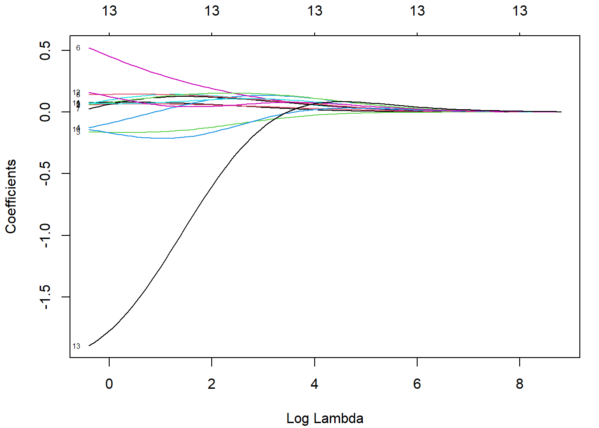
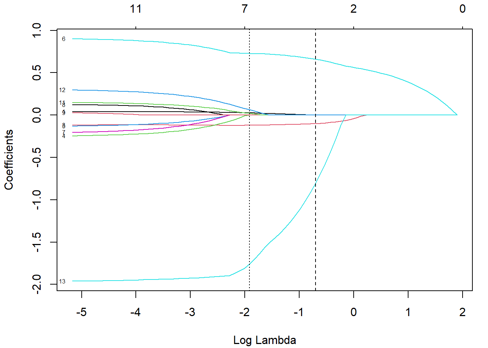

# Extensiones de los modelos lineales (generalizados) {#ext-glm}

<!-- Capítulo \@ref(ext-glm) -->


<!-- 
---
title: "Extensiones de los modelos lineales (generalizados)"
author: "Aprendizaje Estadístico (UDC)"
date: "Máster en Técnicas Estadísticas"
bibliography: "aprendizaje.bib"
link-citations: yes
output: 
  bookdown::html_document2:
    pandoc_args: ["--number-offset", "5,0"]
    toc: yes
    toc_depth: 3
    toc_float:
      collapsed: no
      smooth_scroll: no    
    # mathjax: local            # copia local de MathJax
    # self_contained: false     # dependencias en ficheros externos
header-includes:
- \setcounter{section}{5} 
---

bookdown::preview_chapter("06-ext_glm.Rmd")
knitr::purl("06-ext_glm.Rmd", documentation = 2)
knitr::spin("06-ext_glm.R",knit = FALSE)
-->

En este capítulo, y en los siguientes, nos centraremos principalmente en regresión.
Comenzaremos por extensiones de los modelos lineales y los modelos lineales generalizados, descritos en el Capítulo \@ref(clasicos).
En las secciones \@ref(seleccion-rlm) y \@ref(seleccion-glm) se mostraron los métodos clásicos de inferencia para la selección de predictores (métodos envolventes según la terminología introducida al final de la Sección \@ref(dimen-curse)), con el objetivo principal de evitar problemas de colinealidad.
En este capítulo se mostrarán métodos alternativos de ajuste que integran el procedimiento de selección de predictores.
Los métodos de regularización (Sección \@ref(shrinkage)), incluyen una penalización en el ajuste que retrae los valores estimados de los parámetros hacia cero.
Los métodos de reducción de la dimensión (Sección \@ref(pca-pls)) introducen restricciones en el ajuste al considerar únicamente combinaciones lineales ortogonales de los predictores, denominadas componentes.

Por simplicidad, nos limitaremos al estudio de modelos lineales, pero los distintos procedimientos y comentarios se extienden de forma análoga a los modelos lineales generalizados[^nota-ext-glm-1]. 

[^nota-ext-glm-1]: En los métodos de regularización básicamente habría que sustituir la suma de cuadrados residual por el logaritmo negativo de la verosimilitud.


## Métodos de regularización {#shrinkage}

Como ya se comentó en el Capítulo \@ref(clasicos), el procedimiento habitual para ajustar un modelo de regresión lineal es emplear mínimos cuadrados, es decir, utilizar como criterio de error la suma de cuadrados residual
$$\mbox{RSS} = \sum\limits_{i=1}^{n}\left(  y_{i} - \beta_0 - \boldsymbol{\beta}^t \mathbf{x}_{i} \right)^{2}$$

Si el modelo lineal es razonablemente adecuado, utilizar $\mbox{RSS}$ va a dar lugar a estimaciones con poco sesgo, y si además $n\gg p$, entonces el modelo también va a tener poca varianza (bajo las hipótesis estructurales, la estimación es insesgada y además de varianza mínima entre todas las técnicas insesgadas). 
Las dificultades surgen cuando $p$ es grande o cuando hay correlaciones altas entre las variables predictoras: tener muchas variables dificulta la interpretación del modelo, y si además hay problemas de colinealidad o se incumple $n\gg p$, entonces la estimación del modelo va a tener mucha varianza y el modelo estará sobreajustado.
La solución pasa por forzar a que el modelo tenga menos complejidad para así reducir su varianza. 
Una forma de conseguirlo es mediante la regularización (*regularization* o *shrinkage*) de la estimación de los parámetros $\beta_1, \beta_2,\ldots, \beta_p$, que consiste en considerar todas las variables predictoras, pero forzando a que algunos de los parámetros se estimen mediante valores muy próximos a cero, o directamente con ceros.
Esta técnica va a provocar un pequeño aumento en el sesgo, pero a cambio una notable reducción en la varianza y una interpretación más sencilla del modelo resultante. 

Hay dos formas básicas de lograr esta simplificación de los parámetros (con la consiguiente simplificación del modelo), utilizando una penalización cuadrática (norma $L_2$) o en valor absoluto (norma $L_1$):

- *Ridge regression* [@hoerl1970ridge]
    $$\mbox{min}_{\beta_0, \boldsymbol{\beta}} \mbox{RSS} + \lambda\sum_{j=1}^{p}\beta_{j}^{2}$$
    
    Equivalentemente,
    $$\mbox{min}_{\beta_0, \boldsymbol{\beta}} \mbox{RSS}$$
    sujeto a
    $$\sum_{j=1}^{p}\beta_{j}^{2} \le s$$

- LASSO [*least absolute shrinkage and selection operator*, @tibshirani1996regression]
    $$\mbox{min}_{\beta_0, \boldsymbol{\beta}} RSS + \lambda\sum_{j=1}^{p}|\beta_{j}|$$
    
    Equivalentemente,
    $$\mbox{min}_{\beta_0, \boldsymbol{\beta}} \mbox{RSS}$$
    sujeto a
    $$\sum_{j=1}^{p}|\beta_{j}| \le s$$
    
Una formulación unificada consiste en considerar el problema
$$\mbox{min}_{\beta_0, \boldsymbol{\beta}} RSS + \lambda\sum_{j=1}^{p}|\beta_{j}|^d$$

Si $d=0$, la penalización consiste en el número de variables utilizadas, por tanto se corresponde con el problema de selección de variables; $d=1$ se corresponde con LASSO y $d=2$ con *ridge*.

La ventaja de utilizar LASSO es que tiende a forzar a que algunos parámetros sean cero, con lo cual también se realiza una selección de las variables más influyentes. 
Por el contrario, *ridge regression* tiende a incluir todas las variables predictoras en el modelo final, si bien es cierto que algunas con parámetros muy próximos a cero: de este modo va a reducir el riesgo del sobreajuste, pero no resuelve el problema de la interpretabilidad. 
Otra posible ventaja de utilizar LASSO es que cuando hay variables predictoras correlacionadas tiene tendencia a seleccionar una y anular las demás (esto también se puede ver como un inconveniente, ya que pequeños cambios en los datos pueden dar lugar a modelos distintos), mientras que *ridge* tiende a darles igual peso.

Dos generalizaciones de LASSO son *least angle regression* [LARS, @efron2004least] y *elastic net* [@zou2005regularization]. 
*Elastic net* combina las ventajas de *ridge* y LASSO, minimizando
$$\mbox{min}_{\beta_0, \boldsymbol{\beta}} \ \mbox{RSS} + \lambda \left( \frac{1 - \alpha}{2}\sum_{j=1}^{p}\beta_{j}^{2} + \alpha \sum_{j=1}^{p}|\beta_{j}| \right)$$ 
siendo $\alpha$, $0 \leq \alpha \leq 1$, un hiperparámetro adicional que determina la combinación lineal de ambas penalizaciones.

<!-- LARS parte de coeficientes nulos y, simplificando, los va aumentando en la dirección de mínimos cuadrados (o minimizando otro criterio de error) de forma incremental, añadiendo secuencialmente el coeficiente de la variable que está más correlacionada con los residuos -->

Es muy importante estandarizar (centrar y reescalar) las variables predictoras antes de realizar estas técnicas.
Fijémonos en que, así como $\mbox{RSS}$ es insensible a los cambios de escala, la penalización es muy sensible.
Previa estandarización, el término independiente $\beta_0$ (que no interviene en la penalización) tiene una interpretación muy directa, ya que
$$\widehat \beta_0 = \bar y =\sum_{i=1}^n \frac{y_i}{n}$$

Los dos métodos de regularización comentados dependen del hiperparámetro $\lambda$ (equivalentemente, $s$). 
Es importante seleccionar adecuadamente el valor del hiperparámetro, por ejemplo utilizando validación cruzada. 
Hay algoritmos muy eficientes que permiten el ajuste, tanto de *ridge regression* como de LASSO, de forma conjunta (simultánea) para todos los valores de $\lambda$.


### Implementación en R

Hay varios paquetes que implementan estos métodos: `h2o`, `elasticnet`, `penalized`, `lasso2`, `biglasso`, etc., pero el paquete [`glmnet`](https://glmnet.stanford.edu) [@R-glmnet] utiliza una de las más eficientes.
Sin embargo, este paquete no emplea formulación de modelos, hay que establecer la respuesta `y` y la matriz numérica `x` correspondiente a las variables explicativas.
Por tanto, no se pueden incluir directamente predictores categóricos, hay que codificarlos empleando variables auxiliares numéricas. 
Se puede emplear la función [`model.matrix()`](https://rdrr.io/r/stats/model.matrix.html) (o [`Matrix::sparse.model.matrix()`](https://rdrr.io/pkg/Matrix/man/sparse.model.matrix.html) si el conjunto de datos es muy grande) para construir la matriz de diseño `x` a partir de una fórmula (alternativamente, se pueden emplear las herramientas implementadas en el paquete `caret`). 
Además, tampoco admite datos faltantes.

La función principal es [`glmnet()`](https://glmnet.stanford.edu/reference/glmnet.html):


```r
glmnet(x, y, family, alpha = 1, lambda = NULL, ...)
```

 - `family`: familia del modelo lineal generalizado (ver Sección \@ref(reg-glm)); por defecto `"gaussian"` (modelo lineal con ajuste cuadrático), también admite `"binomial"`, `"poisson"`, `"multinomial"`, `"cox"` o `"mgaussian"` (modelo lineal con respuesta multivariante).

 - `alpha`:  parámetro $\alpha$ de elasticnet $0 \leq \alpha \leq 1$.  Por defecto `alpha = 1` penalización LASSO (`alpha = 0` para *ridge regression*).
 
 - `lambda`: secuencia (opcional) de valores de $\lambda$; si no se especifica se establece una secuencia por defecto (en base a los argumentos adicionales `nlambda` y `lambda.min.ratio`). Se devolverán los ajustes para todos los valores de esta secuencia (también se podrán obtener posteriormente para otros valores).
 
Entre los métodos disponibles para el objeto resultante, `coef()` y `predict()` permiten obtener los coeficientes y las predicciones para un valor concreto de $\lambda$, que se debe especificar mediante el argumento[^nota-glmnet-0] `s = valor`.

[^nota-glmnet-0]: Los autores afirman que utilizan `s` en lugar de `lambda` por motivos históricos.

Para seleccionar el valor "óptimo" del hiperparámetro $\lambda$ (mediante validación cruzada) se puede emplear [`cv.glmnet()`](https://glmnet.stanford.edu/reference/cv.glmnet.html):


```r
cv.glmnet(x, y, family, alpha, lambda, type.measure = "default", 
          nfolds = 10, ...)
```

Esta función también devuelve los ajustes con toda la muestra de entrenamiento (en la componente `$glmnet.fit`) y se puede emplear el resultado directamente para predecir o obtener los coeficientes del modelo. 
Por defecto, selecciona $\lambda$ mediante la regla de "un error estándar" de @breiman1984classification (componente `$lambda.1se`), aunque también calcula el valor óptimo (componente `$lambda.min`; que se puede seleccionar estableciendo `s = "lambda.min"`). 
Para más detalles, consultar la *vignette* del paquete [*An Introduction to glmnet*](https://glmnet.stanford.edu/articles/glmnet.html).

Continuaremos con el ejemplo de los datos de grasa corporal empleado en la Sección \@ref(rlm) (con predictores numéricos y sin datos faltantes):


```r
library(glmnet)
library(mpae)
data(bodyfat)
df <- bodyfat
set.seed(1)
nobs <- nrow(df)
itrain <- sample(nobs, 0.8 * nobs)
train <- df[itrain, ]
test <- df[-itrain, ]
x <- as.matrix(train[-1])
y <- train$bodyfat
```


### Ejemplo: *ridge regression*

Podemos ajustar modelos de regresión ridge (con la secuencia de valores de $\lambda$ por defecto) con la función [`glmnet()`](https://glmnet.stanford.edu/reference/glmnet.html) con `alpha=0` (*ridge penalty*).
Con el método [`plot()`](https://glmnet.stanford.edu/reference/plot.glmnet.html), podemos representar la evolución de los coeficientes en función de la penalización (etiquetando las curvas con el índice de la variable si `label = TRUE`; ver Figura \@ref(fig:ridge-fit)).


```r
fit.ridge <- glmnet(x, y, alpha = 0)
plot(fit.ridge, xvar = "lambda", label = TRUE)
```

<div class="figure" style="text-align: center">

<p class="caption">(\#fig:ridge-fit)Gráfico de perfil de la evolución de los coeficientes en función del logaritmo de la penalización del ajuste ridge.</p>
</div>

Podemos obtener el modelo o predicciones para un valor concreto de $\lambda$:

```r
coef(fit.ridge, s = 2) # lambda = 2
```

```
## 14 x 1 sparse Matrix of class "dgCMatrix"
##                    s1
## (Intercept) -2.948568
## age          0.079808
## weight       0.066058
## height      -0.163590
## neck        -0.018690
## chest        0.135327
## abdomen      0.344659
## hip          0.110577
## thigh        0.145096
## knee         0.113076
## ankle       -0.206822
## biceps       0.072182
## forearm      0.073053
## wrist       -1.441640
```

Para seleccionar el parámetro de penalización por validación cruzada, empleamos [`cv.glmnet()`](https://glmnet.stanford.edu/reference/cv.glmnet.html) (normalmente emplearíamos esta función en lugar de `glmnet()`).
El correspondiente método [`plot()`](https://glmnet.stanford.edu/reference/plot.cv.glmnet.html) muestra la evolución de los errores de validación cruzada en función de la penalización, incluyendo las bandas de un error estándar de Breiman (ver Figura \@ref(fig:ridge-cv)).

(ref:ridge-cv) Error cuadrático medio de validación cruzada en función del logaritmo de la penalización del ajuste ridge, junto con los intervalos de un error estándar. Las líneas verticales se corresponden con `lambda.min` y `lambda.1se`.


```r
set.seed(1)
cv.ridge <- cv.glmnet(x, y, alpha = 0)
plot(cv.ridge)
```

<div class="figure" style="text-align: center">

<p class="caption">(\#fig:ridge-cv)(ref:ridge-cv)</p>
</div>

[^nota-glmnet-1]: Para obtener el valor óptimo global podemos emplear `cv.ridge$lambda.min`, y añadir el argumento `s = "lambda.min"` a los métodos `coef()` y `predict()` para obtener los correspondientes coeficientes y predicciones.

En este caso el parámetro óptimo, según la regla de un error estándar de Breiman, sería[^nota-glmnet-1]:


```r
cv.ridge$lambda.1se
```

```
## [1] 1.6984
```

y el correspondiente modelo contiene todas las variables explicativas:


```r
coef(cv.ridge) # s = "lambda.1se"
```

```
## 14 x 1 sparse Matrix of class "dgCMatrix"
##                    s1
## (Intercept) -1.344135
## age          0.080359
## weight       0.066044
## height      -0.164795
## neck        -0.035658
## chest        0.129400
## abdomen      0.368416
## hip          0.102600
## thigh        0.145259
## knee         0.105121
## ankle       -0.200403
## biceps       0.069859
## forearm      0.084012
## wrist       -1.532999
```

Finalmente, evaluamos la precisión en la muestra de test:


```r
obs <- test$bodyfat
newx <- as.matrix(test[-1])
pred <- predict(cv.ridge, newx = newx) # s = "lambda.1se"
accuracy(pred, obs)
```

```
##        me      rmse       mae       mpe      mape r.squared 
##   1.17762   4.42419   3.81770  -4.64274  24.66151   0.69743
```

<!-- 
Aunque en este caso no mejoraríamos el ajuste lineal sin penalización o seleccionando el valor el mínimo global [^nota-glmnet-1].
-->


### Ejemplo: LASSO

Podemos ajustar modelos LASSO con la opción por defecto de `glmnet()` (`alpha = 1`, *LASSO penalty*).
Pero en este caso lo haremos al mismo tiempo que seleccionamos el parámetro de penalización por validación cruzada (ver Figura \@ref(fig:lasso-cv)):

(ref:lasso-cv) Error cuadrático medio de validación cruzada en función del logaritmo de la penalización del ajuste LASSO, junto con los intervalos de un error estándar. Las líneas verticales se corresponden con `lambda.min` y `lambda.1se`.


```r
set.seed(1)
cv.lasso <- cv.glmnet(x,y)
plot(cv.lasso)
```

<div class="figure" style="text-align: center">

<p class="caption">(\#fig:lasso-cv)(ref:lasso-cv)</p>
</div>

También podemos generar el gráfico con la evolución de los componentes a partir del ajuste almacenado en la componente `$glmnet.fit`:

(ref:lasso-fit) Evolución de los coeficientes en función del logaritmo de la penalización del ajuste LASSO. Las líneas verticales se corresponden con `lambda.min` y `lambda.1se`.


```r
plot(cv.lasso$glmnet.fit, xvar = "lambda", label = TRUE) 	
abline(v = log(cv.lasso$lambda.1se), lty = 2)
abline(v = log(cv.lasso$lambda.min), lty = 3)
```

<div class="figure" style="text-align: center">

<p class="caption">(\#fig:lasso-fit)(ref:lasso-fit)</p>
</div>

Como podemos observar en la Figura \@ref(fig:lasso-fit), la penalización LASSO tiende a forzar que las estimaciones de los coeficientes sean exactamente cero cuando el parámetro de penalización $\lambda$ es suficientemente grande.
En este caso, el modelo resultante (empleando la regla *oneSE*) solo contiene 3 variables explicativas:


```r
coef(cv.lasso) # s = "lambda.1se"
```

```
## 14 x 1 sparse Matrix of class "dgCMatrix"
##                   s1
## (Intercept) -9.58463
## age          .      
## weight       .      
## height      -0.10060
## neck         .      
## chest        .      
## abdomen      0.66075
## hip          .      
## thigh        .      
## knee         .      
## ankle        .      
## biceps       .      
## forearm      .      
## wrist       -0.80327
```

Por tanto, este método también podría ser empleado para la selección de variables.
Si se quisiera ajustar el modelo sin regularización con estas variables, solo habría que establecer `relax = TRUE` en la llamada a `glmnet()` o `cv.glmnet()`.

Finalmente, evaluamos también la precisión en la muestra de test:


```r
pred <- predict(cv.lasso, newx = newx)
accuracy(pred, obs)
```

```
##        me      rmse       mae       mpe      mape r.squared 
##   1.32227   4.29096   3.73005  -3.38653  23.84939   0.71538
```


### Ejemplo: *elastic net*

Podemos ajustar modelos *elastic net* para un valor concreto de `alpha` empleando la función `glmnet()`, pero las opciones del paquete no incluyen la selección de este hiperparámetro.
Aunque se podría implementar fácilmente (como se muestra en  [`help(cv.glmnet)`](https://glmnet.stanford.edu/reference/cv.glmnet.html)), resulta mucho más cómodo emplear el método `"glmnet"` de `caret`:


```r
library(caret)
modelLookup("glmnet") 
```

```
##    model parameter                    label forReg forClass probModel
## 1 glmnet     alpha        Mixing Percentage   TRUE     TRUE      TRUE
## 2 glmnet    lambda Regularization Parameter   TRUE     TRUE      TRUE
```

```r
set.seed(1)
# Se podría emplear una fórmula: train(bodyfat ~ ., data = train, ...)
caret.glmnet <- train(x, y, method = "glmnet", 
                      preProc = c("zv", "center", "scale"), tuneLength = 5,
                      trControl = trainControl(method = "cv", number = 5))
caret.glmnet
```

```
## glmnet 
## 
## 196 samples
##  13 predictor
## 
## Pre-processing: centered (13), scaled (13) 
## Resampling: Cross-Validated (5 fold) 
## Summary of sample sizes: 159, 157, 156, 156, 156 
## Resampling results across tuning parameters:
## 
##   alpha  lambda     RMSE    Rsquared  MAE   
##   0.100  0.0062187  4.4663  0.71359   3.6756
##   0.100  0.0288646  4.4595  0.71434   3.6741
##   0.100  0.1339777  4.4570  0.71443   3.6906
##   0.100  0.6218696  4.5473  0.70262   3.7527
##   0.100  2.8864628  4.9398  0.66058   4.0574
##   0.325  0.0062187  4.4646  0.71383   3.6735
##   0.325  0.0288646  4.4515  0.71542   3.6676
##   0.325  0.1339777  4.4547  0.71472   3.6885
##   0.325  0.6218696  4.5082  0.70919   3.7079
##   0.325  2.8864628  5.1988  0.63972   4.2495
##   0.550  0.0062187  4.4609  0.71432   3.6695
##   0.550  0.0288646  4.4459  0.71622   3.6637
##  [ reached getOption("max.print") -- omitted 13 rows ]
## 
## RMSE was used to select the optimal model using the smallest value.
## The final values used for the model were alpha = 1 and lambda = 0.13398.
```

<!-- 
Pendiente: probar a incluir rejilla con lambda = 0 (sin penalización)
-->

Los resultados de la selección de los hiperparámetros $\alpha$ y $\lambda$ de regularización se muestran en la Figura \@ref(fig:elastic-caret):

(ref:elastic-caret) Errores RMSE de validación cruzada de los modelos *elastic net* en función de los hiperparámetros de regularización.


```r
ggplot(caret.glmnet, highlight = TRUE)
```

<div class="figure" style="text-align: center">

<p class="caption">(\#fig:elastic-caret)(ref:elastic-caret)</p>
</div>

Finalmente, se evalúan las predicciones en la muestra de test del modelo ajustado (que en esta ocasión mejoran los resultados del modelo LASSO obtenido en la sección anterior):


```r
pred <- predict(caret.glmnet, newdata = test)
accuracy(pred, obs)
```

```
##        me      rmse       mae       mpe      mape r.squared 
##   1.36601   4.09331   3.50120  -1.25401  21.20872   0.74099
```

<!-- 
Aunque tampoco mejoraríamos el ajuste lineal sin penalización.
-->

::: {.exercise #bfan-glmnet}

Continuando con el conjunto de datos [`mpae::bfan`](https://rubenfcasal.github.io/mpae/reference/bfan.html) empleado en ejercicios de capítulos anteriores, particiona los datos y clasifica los individuos según su nivel de grasa corporal (`bfan`) mediante modelos logísticos:

a) Con penalización *ridge*, seleccionada mediante validación cruzada, empleando el paquete `glmnet`. 

b) Con penalización LASSO, seleccionada mediante validación cruzada, empleando el paquete `glmnet`. 

c) Con penalización *elastic net*, seleccionando los valores óptimos de los hiperparámetros, empleando `caret`.

d) Evalúa la precisión de las predicciones de los modelos en la muestra de test y compara los resultados.

:::

## Métodos de reducción de la dimensión {#pca-pls}

Otra alternativa, para tratar de reducir la varianza de los modelos lineales, es transformar los predictores considerando $k < p$ combinaciones lineales:
$$Z_j = a_{1j}X_{1} + a_{2j}X_{2} + \ldots + a_{pj}X_{p}$$
con $j = 1, \ldots, k$, denominadas componentes (o variables latentes), 
y posteriormente ajustar un modelo de regresión lineal empleándolas como nuevos predictores:
$$Y = \alpha_0 + \alpha_1 Z_1 + \ldots + \alpha_k Z_k + \varepsilon$$

Adicionalmente, si se seleccionan los coeficientes $a_{ij}$ (denominados *cargas* o *pesos*) de forma que 
$$\sum_{i=1}^p a_{ij}a_{il} = 0, \text{ si } j \neq l,$$
las componentes serán ortogonales y se evitarán posibles problemas de colinealidad.
De esta forma se reduce la dimensión del problema, pasando de $p + 1$ a $k + 1$ coeficientes a estimar, lo cual en principio disminuirá la varianza, especialmente si $p$ es grande en comparación con $n$. 
Por otra parte, también podríamos expresar el modelo final en función de los predictores originales, con coeficientes:
$$\beta_i = \sum_{j=1}^k \alpha_j a_{ij}$$
Es decir, se ajusta un modelo lineal con restricciones, lo que en principio incrementará el sesgo (si $k = p$ sería equivalente a ajustar un modelo lineal sin restricciones).
Además, podríamos interpretar los coeficientes $\alpha_j$ como los efectos de las componentes del modo tradicional, pero resultaría más complicado interpretar los efectos de los predictores originales. 

También hay que tener en cuenta que al considerar combinaciones lineales, si las hipótesis estructurales de linealidad, homocedasticidad, normalidad o independencia no son asumibles en el modelo original, es de esperar que tampoco lo sean en el modelo transformado (se podrían emplear las herramientas descritas en la Sección \@ref(analisis-rlm) para su análisis).

Hay una gran variedad de algoritmos para obtener estas componentes. En esta sección consideraremos las dos aproximaciones más utilizadas: componentes principales y mínimos cuadrados parciales. 
También hay numerosos paquetes de R que implementan métodos de este tipo ([`pls`](https://mevik.net/work/software/pls.html), [`plsRglm`](https://github.com/fbertran/plsRglm)...), incluyendo `caret`. 


### Regresión por componentes principales (PCR)

Una de las aproximaciones tradicionales, cuando se detecta la presencia de colinealidad, consiste en aplicar el método de componentes principales a los predictores.
El análisis de componentes principales (*principal component analysis*, PCA) es un método muy utilizado de aprendizaje no supervisado, que permite reducir el número de dimensiones tratando de recoger la mayor parte de la variabilidad de los datos originales, en este caso de los predictores [para más detalles sobre PCA ver, por ejemplo, el Capítulo 10 de @james2021introduction].

Al aplicar PCA a los predictores $X_1, \ldots, X_p$ se obtienen componentes ordenadas según la variabilidad explicada de forma descendente. 
La primera componente es la que recoge el mayor porcentaje de la variabilidad total (se corresponde con la dirección de mayor variación de las observaciones). 
Las siguientes componentes se seleccionan entre las direcciones ortogonales a las anteriores y de forma que recojan la mayor parte de la variabilidad restante.
Además, estas componentes son normalizadas, de forma que:
$$\sum_{i=1}^p a_{ij}^2 = 1$$
(se busca una transformación lineal ortonormal).
En la práctica, esto puede llevarse a cabo de manera sencilla a partir de la descomposición espectral de la matriz de covarianzas muestrales, aunque normalmente se estandarizan previamente los datos (*i.&nbsp;e.* se emplea la matriz de correlaciones).
Por tanto, si se pretende emplear estas componentes para ajustar un modelo de regresión, habrá que conservar los parámetros de estas transformaciones para poder aplicarlas a nuevas observaciones.

Normalmente, se seleccionan las primeras $k$ componentes de forma que expliquen la mayor parte de la variabilidad de los datos (los predictores en este caso).
En PCR [*principal component regression*, @massy1965principal] se confía en que estas componentes recojan también la mayor parte de la información sobre la respuesta, pero podría no ser el caso.

Aunque se pueden utilizar las funciones `printcomp()` y `lm()` del paquete base, emplearemos por comodidad la función [`pcr()`](https://rdrr.io/pkg/pls/man/mvr.html) del paquete [`pls`](https://mevik.net/work/software/pls.html) [@Mevik2007pls], ya que incorpora validación cruzada para seleccionar el número de componentes y facilita el cálculo de nuevas predicciones.
Los argumentos principales de esta función son:

```r
pcr(formula, ncomp, data, scale = FALSE, center = TRUE, 
    validation = c("none", "CV", "LOO"), segments = 10, 
    segment.type = c("random", "consecutive", "interleaved"), ...)
```

- `ncomp`: número máximo de componentes (ajustará modelos desde 1 hasta `ncomp` componentes).

- `scale`, `center`: normalmente valores lógicos indicando si los predictores serán reescalados (divididos por su desviación estándar y centrados, restando su media). 

- `validation`: determina el tipo de validación, puede ser `"none"` (ninguna, se empleará el modelo ajustado con toda la muestra de entrenamiento), `"LOO"` (VC dejando uno fuera) y `"CV"` (VC por grupos). En este último caso, los grupos de validación se especifican mediante `segments` (número de grupos) y `segment.type` (por defecto aleatorios; para más detalles consultar la ayuda de [`mvrCv()`](https://rdrr.io/pkg/pls/man/mvrCv.html)).

Como ejemplo continuaremos con los datos de grasa corporal.
Reescalaremos los predictores y emplearemos validación cruzada por grupos para seleccionar el número de componentes:


```r
library(pls)
set.seed(1)
pcreg <- pcr(bodyfat ~ ., data = train, scale = TRUE, validation = "CV")
```

Podemos obtener un resumen de los resultados de validación (evolución de los errores de validación cruzada) y del ajuste en la muestra de entrenamiento (evolución de la proporción de variabilidad explicada de los predictores y de la respuesta) con el método [`summary()`](https://rdrr.io/pkg/pls/man/summary.mvr.html):


```r
summary(pcreg)
```

```
## Data: 	X dimension: 196 13 
## 	Y dimension: 196 1
## Fit method: svdpc
## Number of components considered: 13
## 
## VALIDATION: RMSEP
## Cross-validated using 10 random segments.
##        (Intercept)  1 comps  2 comps  3 comps  4 comps  5 comps  6 comps
## CV           8.253    6.719    5.778    5.327    5.023    5.050    5.082
## adjCV        8.253    6.713    5.763    5.310    5.014    5.041    5.077
##        7 comps  8 comps  9 comps  10 comps  11 comps  12 comps  13 comps
## CV       4.935    4.887    4.899     4.881     4.929     4.449     4.457
## adjCV    4.907    4.873    4.887     4.870     4.925     4.436     4.444
## 
## TRAINING: % variance explained
##          1 comps  2 comps  3 comps  4 comps  5 comps  6 comps  7 comps  8 comps
## X          61.55    72.80    79.90    85.42    89.33    91.98    94.17    96.06
## bodyfat    35.51    53.27    59.62    64.52    64.53    64.58    67.25    67.33
##          9 comps  10 comps  11 comps  12 comps  13 comps
## X          97.63     98.76     99.37     99.85    100.00
## bodyfat    67.33     67.62     67.64     73.65     73.67
```

Aunque suele resultar más cómodo representar gráficamente estos valores (ver Figura \@ref(fig:pcreg-plot)). 
Por ejemplo empleando [`RMSEP()`](https://rdrr.io/pkg/pls/man/mvrVal.html) para acceder a los errores de validación^[`"adjCV"` es una estimación de validación cruzada con corrección de sesgo.]:


```r
# validationplot(pcreg, legend = "topright") 
rmsep.cv <- RMSEP(pcreg)
plot(rmsep.cv, legend = "topright")
```

<div class="figure" style="text-align: center">

<p class="caption">(\#fig:pcreg-plot)Errores de validación cruzada en función del número de componentes en el ajuste mediante PCR.</p>
</div>

```r
ncomp.op <- with(rmsep.cv, comps[which.min(val[2, 1, ])]) # mínimo adjCV RMSEP
```

En este caso, empleando el criterio de menor error de validación cruzada se seleccionaría un número elevado de componentes, el mínimo se alcanzaría con 12 componentes (casi como ajustar un modelo lineal con todos los predictores).

[^nota-pcreg-1]: También se pueden analizar distintos aspectos del ajuste (predicciones, coeficientes, puntuaciones, cargas, biplots, cargas de correlación o gráficos de validación) con el método [`plot.mvr()`](https://rdrr.io/pkg/pls/man/plot.mvr.html).

<!-- biplot(pcreg) -->

Los coeficientes de los predictores originales con el modelo seleccionado serían[^nota-pcreg-1]:


```r
coef(pcreg, ncomp = 12, intercept = TRUE)
```

```
## , , 12 comps
## 
##               bodyfat
## (Intercept) 21.141410
## age          0.523514
## weight       0.730388
## height      -0.915070
## neck        -0.625323
## chest       -1.361064
## abdomen      9.175811
## hip         -1.587609
## thigh        0.576468
## knee         0.050425
## ankle       -0.025927
## biceps       0.422922
## forearm      0.595122
## wrist       -1.781728
```

Finalmente evaluamos su precisión:


```r
pred <- predict (pcreg , test, ncomp = 12)
accuracy(pred, obs)
```

```
##        me      rmse       mae       mpe      mape r.squared 
##   1.46888   3.96040   3.24888   1.40161  18.71800   0.75754
```

Alternativamente, podríamos emplear el método `"pcr"` de `caret`.
Por ejemplo, seleccionando el número de componentes mediante la regla de un error estándar (ver Figura \@ref(fig:pcr-plot-caret)):


```r
library(caret)
modelLookup("pcr")
```

```
##   model parameter       label forReg forClass probModel
## 1   pcr     ncomp #Components   TRUE    FALSE     FALSE
```

```r
set.seed(1)
trControl <- trainControl(method = "cv", number = 10, 
                          selectionFunction = "oneSE")
caret.pcr <- train(bodyfat ~ ., data = train, method = "pcr",
                   preProcess = c("zv", "center", "scale"), 
                   trControl = trControl, tuneGrid = data.frame(ncomp = 1:10))
caret.pcr
```

```
## Principal Component Analysis 
## 
## 196 samples
##  13 predictor
## 
## Pre-processing: centered (13), scaled (13) 
## Resampling: Cross-Validated (10 fold) 
## Summary of sample sizes: 177, 176, 176, 177, 177, 177, ... 
## Resampling results across tuning parameters:
## 
##   ncomp  RMSE    Rsquared  MAE   
##    1     6.5808  0.36560   5.3235
##    2     5.6758  0.53027   4.7039
##    3     5.2136  0.59429   4.3556
##    4     4.9757  0.62975   4.0940
##    5     5.0257  0.62283   4.1352
##    6     5.1269  0.60878   4.2177
##    7     4.9522  0.62418   4.0541
##    8     4.9588  0.62119   4.0375
##    9     4.9612  0.61994   4.0361
##   10     4.9603  0.61727   4.0152
## 
## RMSE was used to select the optimal model using  the one SE rule.
## The final value used for the model was ncomp = 3.
```

```r
ggplot(caret.pcr, highlight = TRUE)
```

<div class="figure" style="text-align: center">

<p class="caption">(\#fig:pcr-plot-caret)Errores de validación cruzada en función del número de componentes en el ajuste mediante PCR y valor óptimo según la regla de un error estándar.</p>
</div>

```r
pred <- predict(caret.pcr, newdata = test)
accuracy(pred, obs)
```

```
##        me      rmse       mae       mpe      mape r.squared 
##   1.21285   5.20850   4.33211  -5.71168  28.14310   0.58064
```

Al incluir más componentes se aumenta la proporción de variabilidad explicada de los predictores,
pero esto no está relacionado con su utilidad para explicar la respuesta.
No va a haber problemas de colinealidad aunque incluyamos muchas componentes, pero se tendrán que estimar más coeficientes y va a disminuir su precisión.
Sería más razonable obtener las componentes principales y después aplicar un método de selección.
Por ejemplo, podemos combinar el método de preprocesado `"pca"` de `caret` con un método de selección de variables^[Esta forma de proceder se podría emplear con otros modelos que puedan tener problemas de colinealidad, como los lineales generalizados.] (ver Figura \@ref(fig:pcr2-plot-caret)):


```r
set.seed(1)
caret.pcrsel <- train(bodyfat ~ ., data = train, method = "leapSeq",
                    preProcess = c("zv", "center", "scale", "pca"),     
                    trControl = trControl, tuneGrid = data.frame(nvmax = 1:6))
caret.pcrsel
```

```
## Linear Regression with Stepwise Selection 
## 
## 196 samples
##  13 predictor
## 
## Pre-processing: centered (13), scaled (13), principal component
##  signal extraction (13) 
## Resampling: Cross-Validated (10 fold) 
## Summary of sample sizes: 177, 176, 176, 177, 177, 177, ... 
## Resampling results across tuning parameters:
## 
##   nvmax  RMSE    Rsquared  MAE   
##   1      6.5808  0.36560   5.3235
##   2      5.6758  0.53027   4.7039
##   3      5.4083  0.57633   4.4092
##   4      5.0320  0.62265   4.1378
##   5      4.8434  0.64078   3.9361
##   6      4.9449  0.62511   4.0321
## 
## RMSE was used to select the optimal model using  the one SE rule.
## The final value used for the model was nvmax = 4.
```

```r
ggplot(caret.pcrsel, highlight = TRUE)
```

<div class="figure" style="text-align: center">

<p class="caption">(\#fig:pcr2-plot-caret)Errores de validación cruzada en función del número de componentes en el ajuste mediante PCR con selección por pasos y valor óptimo según la regla de un error estándar.</p>
</div>

No obstante, en este caso las primeras componentes también resultan ser aparentemente las de mayor utilidad para explicar la respuesta, ya que se seleccionaron las cuatro primeras:

```r
with(caret.pcrsel, coef(finalModel, bestTune$nvmax))
```

```
## (Intercept)         PC1         PC2         PC3         PC4 
##     18.8036      1.7341     -2.8685      2.1570     -2.1531
```

Para finalizar evaluamos también la precisión del modelo obtenido:

```r
pred <- predict(caret.pcrsel, newdata = test)
accuracy(pred, obs)
```

```
##        me      rmse       mae       mpe      mape r.squared 
##   0.83749   4.76899   3.89344  -6.10279  25.16598   0.64843
```


<!-- 
Pendiente: revisar error con nvmax = 1:10
-->


### Regresión por mínimos cuadrados parciales (PLSR)

Como ya se comentó, en PCR las componentes se determinan con el objetivo de explicar la variabilidad de los predictores, ignorando por completo la respuesta.
Por el contrario, en PLSR [*partial least squares regression*, @wold1983multivariate] se construyen las componentes $Z_1, \ldots, Z_k$ teniendo en cuenta desde un principio el objetivo final de predecir linealmente la respuesta.

Hay varios procedimientos para seleccionar los pesos $a_{ij}$, pero la idea es asignar mayor peso a los predictores que están más correlacionados con la respuesta (o con los correspondientes residuos al ir obteniendo nuevas componentes), considerando siempre direcciones ortogonales [ver, por ejemplo, la Sección 6.3.2 de @james2021introduction].

Continuando con el ejemplo anterior, emplearemos en primer lugar la función [`plsr()`](https://rdrr.io/pkg/pls/man/mvr.html) del paquete [`pls`](https://mevik.net/work/software/pls.html), que tiene los mismos argumentos que la función `pcr()` descrita en la sección anterior[^nota-plsr-1]:

[^nota-plsr-1]: Realmente, ambas funciones llaman internamente a [`mvr()`](https://rdrr.io/pkg/pls/man/mvr.html), donde están implementadas distintas proyecciones [ver  [`help(pls.options)`](https://rdrr.io/pkg/pls/man/pls.options.html), o @Mevik2007pls].


```r
set.seed(1)
plsreg <- plsr(bodyfat ~ ., data = train, scale = TRUE, validation = "CV")
summary(plsreg)
```

```
## Data: 	X dimension: 196 13 
## 	Y dimension: 196 1
## Fit method: kernelpls
## Number of components considered: 13
## 
## VALIDATION: RMSEP
## Cross-validated using 10 random segments.
##        (Intercept)  1 comps  2 comps  3 comps  4 comps  5 comps  6 comps
## CV           8.253    6.279    4.969    4.809    4.652    4.550    4.474
## adjCV        8.253    6.273    4.965    4.798    4.637    4.541    4.458
##        7 comps  8 comps  9 comps  10 comps  11 comps  12 comps  13 comps
## CV       4.466    4.451    4.454     4.455     4.455     4.456     4.457
## adjCV    4.452    4.438    4.442     4.442     4.442     4.443     4.444
## 
## TRAINING: % variance explained
##          1 comps  2 comps  3 comps  4 comps  5 comps  6 comps  7 comps
## X          60.53     71.8    78.48    81.90    86.35    88.12    90.16
## bodyfat    44.34     65.1    68.47    71.07    72.35    73.62    73.66
##          8 comps  9 comps  10 comps  11 comps  12 comps  13 comps
## X          92.96    95.50     96.51     97.82     98.44    100.00
## bodyfat    73.67    73.67     73.67     73.67     73.67     73.67
```

```r
# validationplot(plsreg, legend = "topright")
rmsep.cv <- RMSEP(plsreg)
plot(rmsep.cv, legend = "topright")
```

<div class="figure" style="text-align: center">

<p class="caption">(\#fig:plsr-plot)Error cuadrático medio de validación cruzada en función del número de componentes en el ajuste mediante PLS.</p>
</div>

```r
ncomp.op <- with(rmsep.cv, comps[which.min(val[2, 1, ])]) # mínimo adjCV RMSEP
```

En este caso el mínimo se alcanza con 8 componentes, pero, a la vista de la Figura \@ref(fig:plsr-plot), parece que 6 (o incluso 2) sería un valor más razonable.
Podemos obtener los coeficientes de los predictores del modelo seleccionado:


```r
coef(plsreg, ncomp = 6, intercept = TRUE)
```

```
## , , 6 comps
## 
##              bodyfat
## (Intercept) 16.54393
## age          0.63007
## weight       0.42119
## height      -0.82098
## neck        -0.55223
## chest       -1.37545
## abdomen      9.14806
## hip         -1.27990
## thigh        0.76228
## knee        -0.23770
## ankle        0.08447
## biceps       0.40080
## forearm      0.60030
## wrist       -1.80885
```

y evaluar su precisión:


```r
pred.pls <- predict(plsreg , test, ncomp = 6)
accuracy(pred.pls, obs)
```

```
##        me      rmse       mae       mpe      mape r.squared 
##    1.4373    3.9255    3.2329    1.2006   18.7601    0.7618
```

Empleamos también el método `"pls"` de `caret` seleccionando el número de componentes mediante la regla de un error estándar (ver Figura \@ref(fig:plsr-plot-caret)):


```r
modelLookup("pls")
```

```
##   model parameter       label forReg forClass probModel
## 1   pls     ncomp #Components   TRUE     TRUE      TRUE
```

```r
set.seed(1)
caret.pls <- train(bodyfat ~ ., data = train, method = "pls",
                   preProcess = c("zv", "center", "scale"),
                   trControl = trControl, tuneGrid = data.frame(ncomp = 1:10))
caret.pls
```

```
## Partial Least Squares 
## 
## 196 samples
##  13 predictor
## 
## Pre-processing: centered (13), scaled (13) 
## Resampling: Cross-Validated (10 fold) 
## Summary of sample sizes: 177, 176, 176, 177, 177, 177, ... 
## Resampling results across tuning parameters:
## 
##   ncomp  RMSE    Rsquared  MAE   
##    1     6.1572  0.44386   4.9987
##    2     4.9669  0.63414   4.1385
##    3     4.8262  0.64034   3.9733
##    4     4.7833  0.64563   3.9540
##    5     4.6810  0.66197   3.8776
##    6     4.5704  0.68981   3.7961
##    7     4.5855  0.68780   3.8110
##    8     4.5613  0.69161   3.7855
##    9     4.5566  0.69237   3.7800
##   10     4.5671  0.69087   3.7897
## 
## RMSE was used to select the optimal model using  the one SE rule.
## The final value used for the model was ncomp = 5.
```

```r
ggplot(caret.pls, highlight = TRUE)
```

<div class="figure" style="text-align: center">

<p class="caption">(\#fig:plsr-plot-caret)Errores de validación cruzada en función del número de componentes en el ajuste mediante PLS.</p>
</div>

```r
pred <- predict(caret.pls, newdata = test)
accuracy(pred, obs)
```

```
##        me      rmse       mae       mpe      mape r.squared 
##   1.58389   4.14455   3.50307   0.82895  20.26616   0.73447
```

En la práctica se suelen obtener resultados muy similares empleando PCR, PLSR o *ridge regression*.
Todos ellos son modelos lineales, por lo que el principal problema es que no sean suficientemente flexibles para explicar adecuadamente lo que ocurre con los datos (puede que no sea adecuado asumir que el efecto de algún predictor es lineal).
En este problema concreto, el mejor resultado se obtuvo con el ajuste con `plsr()`, aunque si representamos las observaciones frente a las predicciones (ver Figura \@ref(fig:plsr-test)):

(ref:plsr-test) Gráfico de dispersión de observaciones frente a predicciones, del ajuste lineal con `plsr()`, en la muestra de test.


```r
pred.plot(pred.pls, obs, xlab = "Predicción", ylab = "Observado")
```

<div class="figure" style="text-align: center">

<p class="caption">(\#fig:plsr-test)(ref:plsr-test)</p>
</div>
parece que se debería haber incluido un término cuadrático (coincidiendo con lo observado en las secciones \@ref(analisis-rlm) y \@ref(eval-rlm)).


Como comentarios finales, el método PCR (Sección \@ref(pca-pls)) se extiende de forma inmediata al caso de modelos generalizados, simplemente cambiando el tipo de modelo ajustado.
También están disponibles métodos PLSR para modelos generalizados [p.&nbsp;ej. paquete [`plsRglm`](https://fbertran.github.io/plsRglm), @R-plsRglm].
En cualquier caso, `caret` ajustará un modelo generalizado si la respuesta es un factor.

::: {.exercise #bfan-pca-pls}

Continuando con el Ejercicio \@ref(exr:bfan-glmnet) y utilizando la misma partición, vuelve a clasificar los individuos según su nivel de grasa corporal (`bfan`), pero ahora:

a) Ajusta un modelo de regresión logística por componentes principales, con el método `"glmStepAIC"` de `caret` y preprocesado `"pca"`. 

b) Ajusta un modelo de regresión logística por mínimos cuadrados parciales con el método `"pls"` de `caret`.

c) Interpreta los modelos obtenidos, evalúa la capacidad predictiva en la muestra `test` y compara los resultados (también con los del Ejercicio \@ref(exr:bfan-glmnet)).

:::


