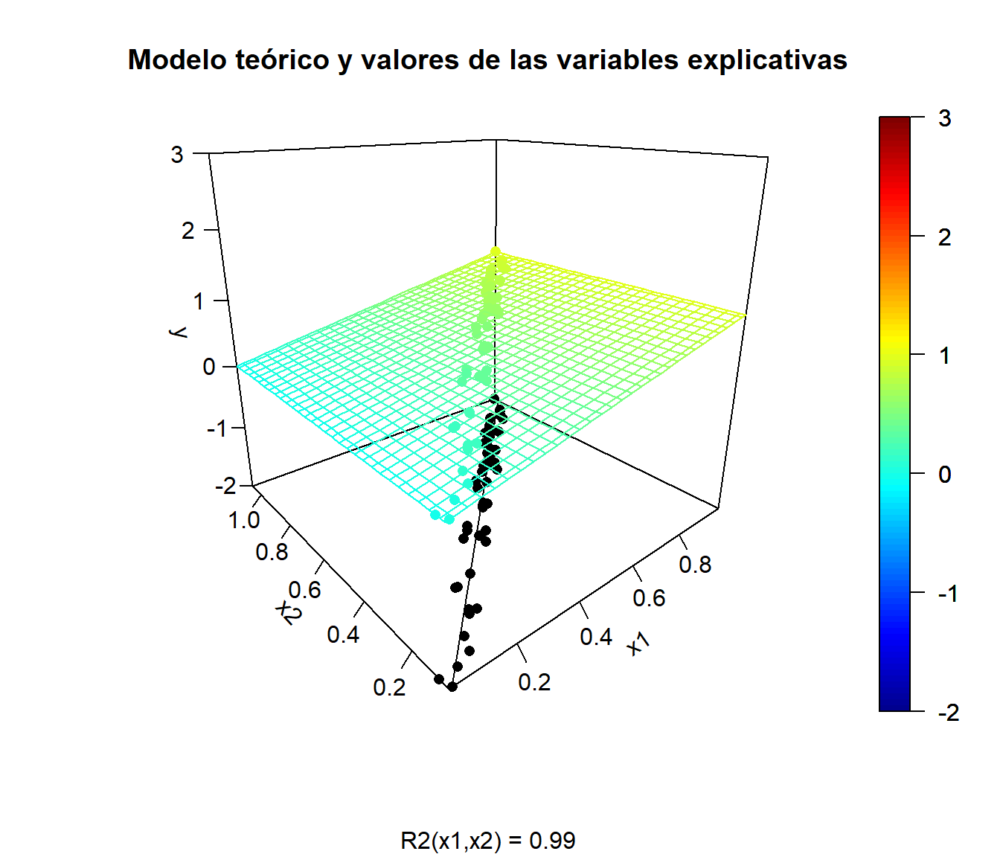
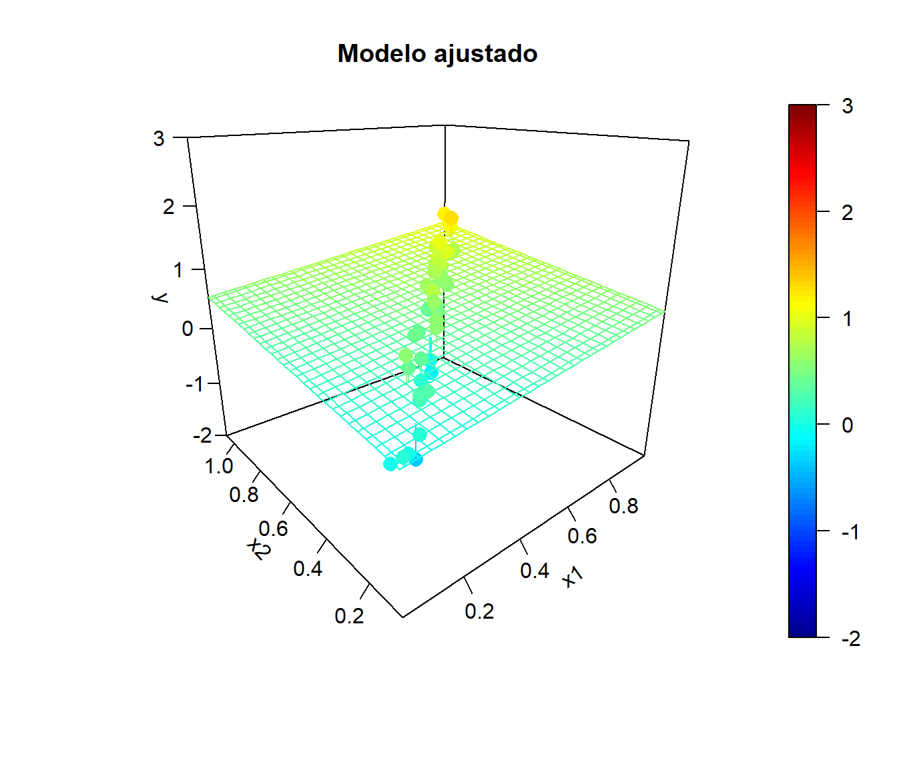
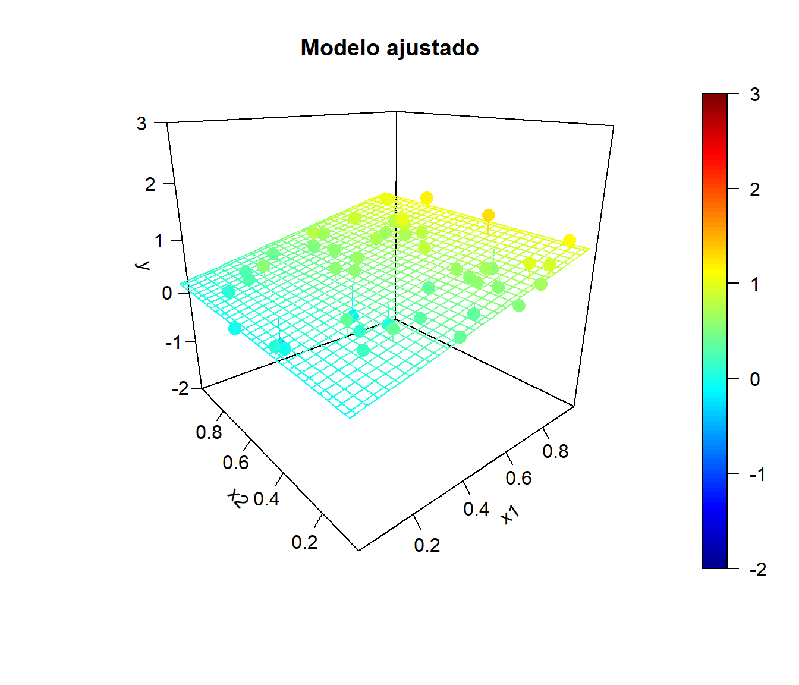
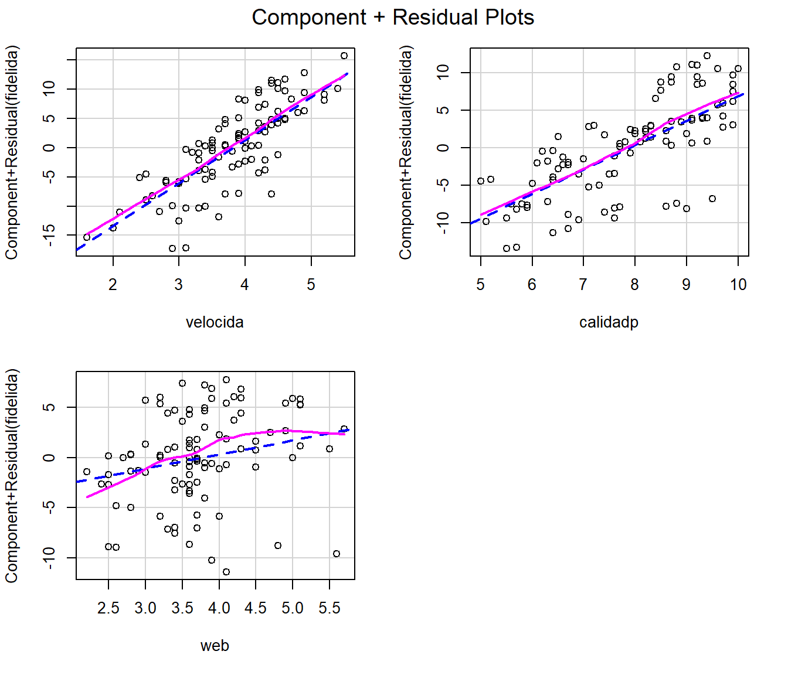
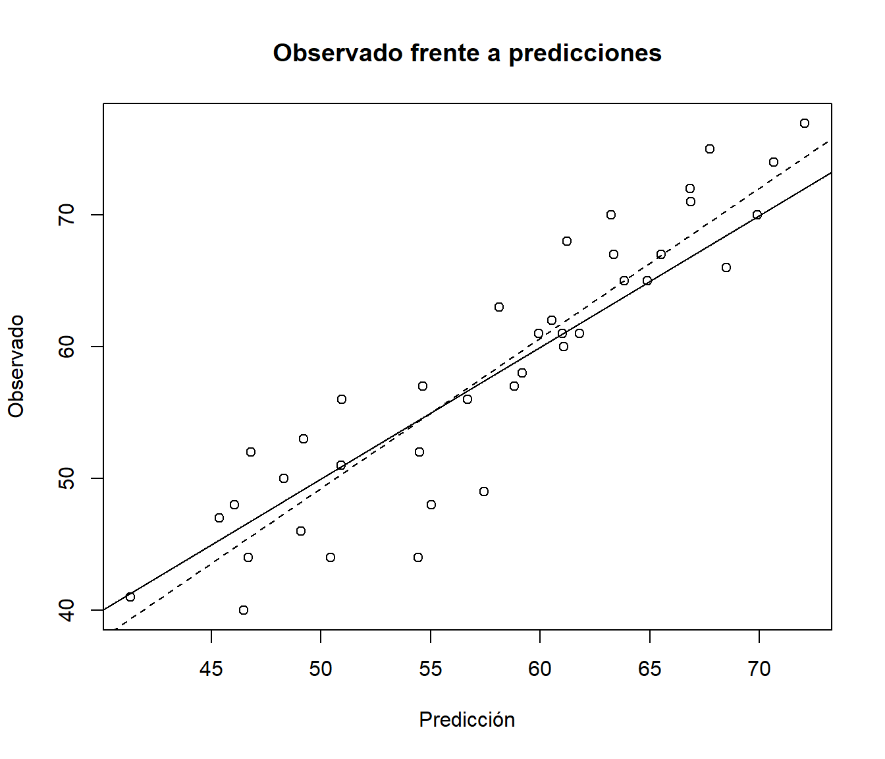
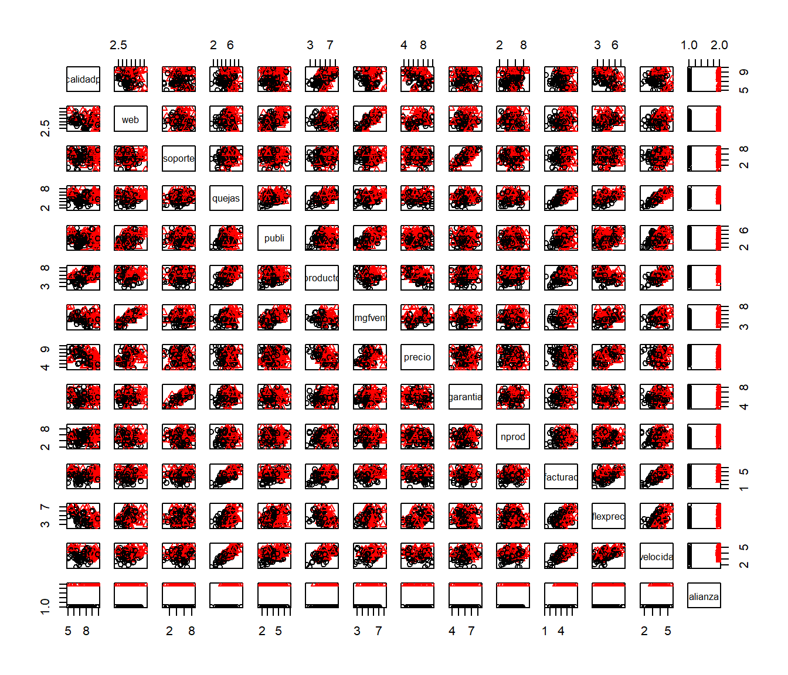

# Modelos lineales y extensiones {#modelos-lineales}


En los modelo lineales se supone que la función de regresión es lineal^[Algunos predictores podrían corresponderse con interacciones, $X_i = X_j X_k$, o transformaciones (e.g. $X_i = X_j^2$) de las variables explicativas originales. También se podría haber transformado la respuesta.]:
$$E( Y | \mathbf{X} ) = \beta_{0}+\beta_{1}X_{1}+\beta_{2}X_{2}+\cdots+\beta_{p}X_{p}$$
Es decir, que el efecto de las variables explicativas sobre la respuesta es muy simple, proporcional a su valor, y por tanto la interpretación de este tipo de modelos es (en principio) muy fácil. 
El coeficiente $\beta_j$ representa el incremento medio de $Y$ al aumentar en una unidad el valor de $X_j$, manteniendo fijos el resto de las covariables.
En este contexto las variables predictoras se denominan habitualmente variables independientes, pero en la práctica es de esperar que no haya independencia entre ellas, por lo que puede no ser muy razonable pensar que al variar una de ellas el resto va a permanecer constante.

El ajuste de este tipo de modelos en la práctica se suele realizar empleando el método de mínimos cuadrados (ordinarios), asumiendo (implícitamente o explícitamente) que la distribución condicional de la respuesta es normal, lo que se conoce como el modelo de regresión lineal múltiple (siguiente sección).

Los modelos lineales generalizados son una extensión de los modelos lineales para el caso de que la distribución condicional de la variable respuesta no sea normal (por ejemplo discreta: Bernouilli, Binomial, Poisson...).
En los modelos lineales generalizados se introduce una función invertible *g*, denominada función enlace (o link):
$$g\left(E(Y | \mathbf{X} )\right) = \beta_{0}+\beta_{1}X_{1}+\beta_{2}X_{2}+\cdots+\beta_{p}X_{p}$$
y su ajuste en la práctica se realiza empleando el método de máxima verosimilitud.

Ambos son modelos clásicos de la inferencia estadística y, aunque pueden ser demasiado simples en muchos casos, pueden resultar muy útiles en otros por lo que también se emplean habitualmente en AE.
Además, como veremos más adelante (en las secciones finales de este capítulo y en los siguientes), sirve como punto de partida para procedimientos más avanzados.
En este capítulo se tratarán estos métodos desde el punto de vista de AE (descrito en el Capítulo \@ref(intro-AE)), es decir, con el objetivo de predecir en lugar de realizar inferencias (y preferiblemente empleando un procedimiento automático y capaz de manejar grandes volúmenes de datos).

En consecuencia, se supondrá que se dispone de unos conocimientos básicos de los métodos clásicos de regresión lineal y regresión lineal generalizada. 
Para un tratamiento más completo de este tipo de métodos se puede consultar Faraway (2014), que incluye su aplicación en la práctica con R (también el [Capítulo 8](https://rubenfcasal.github.io/intror/modelos-lineales.html) de Fernández-Casal *et al*., 2019).
Además por simplicidad, en las siguientes secciones nos centraremos principalmente en el caso de modelos lineales, pero los distintos procedimientos y comentarios se extienden de forma análoga al caso de modelos generalizados (básicamente habría que sustituir la suma de cuadrados residual por el logaritmo negativo de la verosimilitud), que serán tratados en la última sección. 


## Regresión lineal múltiple {#reg-multiple}

Como ya se comentó, el método tradicional considera el siguiente modelo:
\begin{equation} 
  Y = \beta_{0}+\beta_{1}X_{1}+\beta_{2}X_{2}+\cdots+\beta_{p}X_{p} + \varepsilon,
  (\#eq:modelo-rlm)
\end{equation}
donde $\left(  \beta_{0},\beta_{1},\ldots,\beta_{p}\right)^t$ es un vector de parámetros (desconocidos) y $\varepsilon$ es un error aleatorio normal de media cero y varianza $\sigma^2$.

Por tanto las hipótesis estructurales del modelo son:

- Linealidad

- Homocedasticidad (varianza constante del error)

- Normalidad (y homogeneidad: ausencia de valores atípicos y/o influyentes)

- Independencia de los errores

Hipótesis adicional en regresión múltiple:

- Ninguna de las variables explicativas es combinación lineal de las demás.

En el caso de regresión múltiple es de especial interés el fenómeno de la multicolinealidad (o colinearidad) relacionado con la última de estas hipótesis (que se tratará en la Sección \@ref(multicolinealidad)).
Además se da por hecho que el número de observaciones disponible es como mínimo el número de parámetros, $n \geq p + 1$.


### Ajuste: función `lm`

El procedimiento habitual para ajustar un modelo de regresión lineal a un conjunto de datos es emplear mínimos cuadrados (ordinarios):

$$\mbox{min}_{\beta_{0},\beta_{1},\ldots,\beta_{p}}  \sum\limits_{i=1}^{n}\left(  y_{i} - \beta_0 - \beta_1 x_{1i} - \cdots - \beta_p x_{pi} \right)^{2}$$

En R podemos emplear la función `lm`:


```r
ajuste <- lm(formula, data, subset, weights, na.action)
```

-   `formula`: fórmula que especifica el modelo.

-   `data`: data.frame (opcional) con las variables de la formula.

-   `subset`: vector (opcional) que especifica un subconjunto de observaciones.

-   `weights`: vector (opcional) de pesos (mínimos cuadrados ponderados, WLS).

-   `na.action`: opción para manejar los datos faltantes; por defecto `na.omit`.

Alternativamente se puede emplear la función `biglm()` del paquete [`biglm`](https://CRAN.R-project.org/package=biglm) para ajustar modelos lineales a grandes conjuntos de datos (especialmente cuando el número de observaciones es muy grande, incluyendo el caso de que los datos excedan la capacidad de memoria del equipo).
También se podría utilizar la función `rlm()` del paquete [`MASS`](https://CRAN.R-project.org/package=MASS) para ajustar modelos lineales empleando un método robusto cuando hay datos atípicos.

<!-- 
Proxeccións demográficas de Galicia 2011-2030. Análise dos resultados. Documentos de Traballo. Análise Económica (IDEGA).  
-->

### Ejemplo

Como ejemplo consideraremos el conjunto de datos *hbat.RData* que contiene observaciones de clientes de la compañía de distribución industrial HBAT (Hair *et al.*, 1998).
Las variables se pueden clasificar en tres grupos: las 6 primeras (categóricas) son características del comprador, las variables de la 7 a la 19 (numéricas) miden percepciones de HBAT por parte del comprador y las 5 últimas son posibles variables de interés (respuestas).


```r
load("data/hbat.RData")
as.data.frame(attr(hbat, "variable.labels"))
```

```
##             attr(hbat, "variable.labels")
## empresa                           Empresa
## tcliente                  Tipo de cliente
## tindustr                   Tipo Industria
## tamaño               Tamaño de la empresa
## region                             Región
## distrib           Sistema de distribución
## calidadp              Calidad de producto
## web      Actividades comercio electrónico
## soporte                   Soporte técnico
## quejas               Resolución de quejas
## publi                          Publicidad
## producto               Línea de productos
## imgfvent       Imagen de fuerza de ventas
## precio                   Nivel de precios
## garantia         Garantía y reclamaciones
## nprod                    Nuevos productos
## facturac            Encargo y facturación
## flexprec          Flexibilidad de precios
## velocida             Velocidad de entrega
## satisfac            Nivel de satisfacción
## precomen          Propensión a recomendar
## pcompra              Propensión a comprar
## fidelida      Porcentaje de compra a HBAT
## alianza  Consideraría alianza estratégica
```

Consideraremos como respuesta la variable *fidelida* y, por comodidad, únicamente las variables continuas correspondientes a las percepciones de HBAT como variables explicativas (para una introducción al tratamiento de variables predictoras categóricas ver por ejemplo la [Sección 8.5](https://rubenfcasal.github.io/intror/modelos-lineales.html#regresion-con-variables-categoricas) de Fernández-Casal *et al*., 2019).

Como ya se comentó, se trata de un método clásico de Estadística y el procedimiento habitual es emplear toda la información disponible para construir el modelo y posteriormente (asumiendo que es el verdadero) utilizar métodos de inferencia para evaluar su precisión.
Sin embargo seguiremos el procedimiento habitual en AE y particionaremos los datos en una muestra de entrenamiento y en otra de test.


```r
df <- hbat[, c(7:19, 23)]  # Nota: realmente no copia el objeto...
set.seed(1)
nobs <- nrow(df)
itrain <- sample(nobs, 0.8 * nobs)
train <- df[itrain, ]
test <- df[-itrain, ]

# plot(train)
mcor <- cor(train)
corrplot::corrplot(mcor, method = "ellipse")
```


```r
print(mcor, digits = 1)
```

```
##          calidadp    web soporte quejas publi producto imgfvent precio garantia
## calidadp     1.00 -0.088   0.051   0.05 -0.05     0.51    -0.15  -0.43     0.09
## web         -0.09  1.000  -0.009   0.14  0.53     0.03     0.79   0.20     0.08
## soporte      0.05 -0.009   1.000   0.17  0.03     0.17     0.04  -0.11     0.84
## quejas       0.05  0.144   0.172   1.00  0.27     0.53     0.23  -0.06     0.19
## publi       -0.05  0.534   0.026   0.27  1.00     0.15     0.66   0.10     0.04
## producto     0.51  0.027   0.166   0.53  0.15     1.00     0.02  -0.48     0.23
## imgfvent    -0.15  0.787   0.038   0.23  0.66     0.02     1.00   0.20     0.14
## precio      -0.43  0.196  -0.109  -0.06  0.10    -0.48     0.20   1.00    -0.10
## garantia     0.09  0.079   0.841   0.19  0.04     0.23     0.14  -0.10     1.00
## nprod        0.17 -0.049   0.017   0.06  0.05     0.13     0.03  -0.14     0.09
## facturac     0.04  0.209   0.128   0.74  0.26     0.42     0.30  -0.05     0.20
## flexprec    -0.51  0.221  -0.005   0.44  0.27    -0.36     0.29   0.45    -0.03
## velocida     0.04  0.227   0.142   0.88  0.36     0.60     0.29  -0.07     0.18
## fidelida     0.55  0.219   0.070   0.61  0.27     0.67     0.21  -0.19     0.14
##          nprod facturac flexprec velocida fidelida
## calidadp  0.17     0.04   -0.509     0.04     0.55
## web      -0.05     0.21    0.221     0.23     0.22
## soporte   0.02     0.13   -0.005     0.14     0.07
## quejas    0.06     0.74    0.444     0.88     0.61
## publi     0.05     0.26    0.266     0.36     0.27
## producto  0.13     0.42   -0.364     0.60     0.67
## imgfvent  0.03     0.30    0.285     0.29     0.21
## precio   -0.14    -0.05    0.449    -0.07    -0.19
## garantia  0.09     0.20   -0.030     0.18     0.14
## nprod     1.00     0.10    0.015     0.12     0.14
## facturac  0.10     1.00    0.428     0.77     0.50
## flexprec  0.01     0.43    1.000     0.52     0.05
## velocida  0.12     0.77    0.515     1.00     0.68
## fidelida  0.14     0.50    0.055     0.68     1.00
```

<!-- Pendiente: gráfico compacto de correlaciones -->

En este caso observamos que aparentemente hay una relación (lineal) entre la respuesta y algunas de las variables explicativas (que en principio no parece adecuado suponer que son independientes).
Si consideramos un modelo de regresión lineal simple, el mejor ajuste se obtendría empleando `velocida` como variable explicativa:


```r
modelo <- lm(fidelida ~ velocida, train)
summary(modelo)
```

```
## 
## Call:
## lm(formula = fidelida ~ velocida, data = train)
## 
## Residuals:
##      Min       1Q   Median       3Q      Max 
## -13.8349  -4.3107   0.3677   4.3413  12.3677 
## 
## Coefficients:
##             Estimate Std. Error t value Pr(>|t|)    
## (Intercept)  27.5486     2.6961   10.22   <2e-16 ***
## velocida      7.9736     0.6926   11.51   <2e-16 ***
## ---
## Signif. codes:  0 '***' 0.001 '**' 0.01 '*' 0.05 '.' 0.1 ' ' 1
## 
## Residual standard error: 6.403 on 158 degrees of freedom
## Multiple R-squared:  0.4562,	Adjusted R-squared:  0.4528 
## F-statistic: 132.6 on 1 and 158 DF,  p-value: < 2.2e-16
```

```r
plot(fidelida ~ velocida, train)
abline(modelo)
```


Para calcular predicciones (estimaciones de la media condicionada), también intervalos de confianza o de predicción, se puede emplear la función `predict()` (consultar la ayuda `help(predict.lm)` para ver todas las opciones disponibles).


```r
valores <- seq(1, 6, len = 100)
newdata <- data.frame(velocida = valores)
pred <- predict(modelo, newdata = newdata, interval = c("confidence"))
# head(pred)
plot(fidelida ~ velocida, train)
matlines(valores, pred, lty = c(1, 2, 2), col = 1)
pred2 <- predict(modelo, newdata = newdata, interval = c("prediction"))
matlines(valores, pred2[, -1], lty = 3, col = 1)
legend("topleft", c("Ajuste", "Int. confianza", "Int. predicción"), lty = c(1, 2, 3))
```


Para la extracción de información se pueden acceder a los componentes del modelo ajustado o emplear funciones  (genéricas; muchas de ellas válidas para otro tipo de modelos: rlm, glm...). 
Algunas de las más utilizadas son las siguientes:

Función   |   Descripción
-------   |   ---------------------------------------------------
`fitted`  |   valores ajustados
`coef`    |   coeficientes estimados (y errores estándar)
`confint`   |   intervalos de confianza para los coeficientes
`residuals` |   residuos
`plot`    |   gráficos de diagnóstico
`termplot` |  gráfico de efectos parciales
`anova`   |   calcula tablas de análisis de varianza (también permite comparar modelos)
`influence.measures` |   calcula medidas de diagnóstico ("dejando uno fuera"; LOOCV)
`update`  |   actualiza un modelo (p.e. eliminando o añadiendo variables)

Ejemplos (no evaluados):


```r
modelo2 <- update(modelo, . ~ . + calidadp)
summary(modelo2)
confint(modelo2)
anova(modelo2)
anova(modelo, modelo2)
oldpar <- par(mfrow=c(1,2))
termplot(modelo2, partial.resid = TRUE)
par(oldpar)
```


## El problema de la multicolinelidad {#multicolinealidad}

Si alguna de las variables explicativas no aporta información relevante sobre la respuesta puede aparecer el problema de la multicolinealidad. 

En regresión múltiple se supone que ninguna de las variables explicativas es combinación lineal de las demás.
Si una de las variables explicativas (variables independientes) es combinación lineal de las otras, no se pueden determinar los parámetros de forma única (sistema singular).
Sin llegar a esta situación extrema, cuando algunas variables explicativas estén altamente correlacionadas entre sí, tendremos una situación de alta multicolinealidad.
En este caso las estimaciones de los parámetros pueden verse seriamente afectadas:

-   Tendrán varianzas muy altas (serán poco eficientes).

-   Habrá mucha dependencia entre ellas (al modificar ligeramente el
    modelo, añadiendo o eliminando una variable o una observación,
    se producirán grandes cambios en las estimaciones de los efectos).
 
Consideraremos un ejemplo de regresión lineal bidimensional con datos simulados en el que las dos variables explicativas están altamente correlacionadas:


```r
set.seed(1)
n <- 50
rand.gen <- runif # rnorm
x1 <- rand.gen(n)
rho <- sqrt(0.99) # coeficiente de correlación
x2 <- rho*x1 + sqrt(1 - rho^2)*rand.gen(n)
fit.x2 <- lm(x2 ~ x1)
# plot(x1, x2)
# summary(fit.x2)

# Rejilla x-y para predicciones:
x1.range <- range(x1)
x1.grid <- seq(x1.range[1], x1.range[2], length.out = 30)
x2.range <- range(x2)
x2.grid <- seq(x2.range[1], x2.range[2], length.out = 30)
xy <- expand.grid(x1 = x1.grid, x2 = x2.grid)

# Modelo teórico:
model.teor <- function(x1, x2) x1
# model.teor <- function(x1, x2) x1 - 0.5*x2
y.grid <- matrix(mapply(model.teor, xy$x1, xy$x2), nrow = length(x1.grid))
y.mean <- mapply(model.teor, x1, x2)
```

Tendencia teórica y valores de las variables explicativas: 


```r
library(plot3D)
ylim <- c(-2, 3) # range(y, y.pred)
scatter3D(z = y.mean, x = x1, y = x2, pch = 16, cex = 1, clim = ylim, zlim = ylim,
          theta = -40, phi = 20, ticktype = "detailed", 
          main = "Modelo teórico y valores de las variables explicativas",
          xlab = "x1", ylab = "x2", zlab = "y", sub = sprintf("R2(x1,x2) = %.2f", summary(fit.x2)$r.squared),
          surf = list(x = x1.grid, y = x2.grid, z = y.grid, facets = NA))
scatter3D(z = rep(ylim[1], n), x = x1, y = x2, add = TRUE, colkey = FALSE, 
           pch = 16, cex = 1, col = "black")
x2.pred <- predict(fit.x2, newdata = data.frame(x1 = x1.range))
lines3D(z = rep(ylim[1], 2), x = x1.range, y = x2.pred, add = TRUE, colkey = FALSE, col = "black") 
```



Simulación de la respuesta:


```r
sd.err <- 0.25
nsim <- 10

for (isim in 1:nsim) {
  set.seed(isim)
  y <- y.mean + rnorm(n, 0, sd.err)
  
  # Ajuste lineal y superficie de predicción
  fit <- lm(y ~ x1 + x2)
  y.pred <- matrix(predict(fit, newdata = xy), nrow = length(x1.grid)) 
  
  # Representar
  fitpoints <- predict(fit) 
  scatter3D(z = y, x = x1, y = x2, pch = 16, cex = 1.5, clim = ylim, zlim = ylim,
            theta = -40, phi = 20, ticktype = "detailed", 
            main = "Modelo ajustado", xlab = "x1", ylab = "x2", zlab = "y", 
            surf = list(x = x1.grid, y = x2.grid, z = y.pred, 
                        facets = NA, fit = fitpoints))
}
```



Incluso puede ocurrir que el contraste de regresión sea significativo (alto coeficiente de determinación), pero los contrastes individuales sean no significativos. 

Por ejemplo, en el último ajuste obtendríamos:


```r
summary(fit)
```

```
## 
## Call:
## lm(formula = y ~ x1 + x2)
## 
## Residuals:
##      Min       1Q   Median       3Q      Max 
## -0.45461 -0.13147  0.01428  0.16316  0.36616 
## 
## Coefficients:
##             Estimate Std. Error t value Pr(>|t|)
## (Intercept) -0.11373    0.08944  -1.272    0.210
## x1           0.87084    1.19929   0.726    0.471
## x2           0.16752    1.19337   0.140    0.889
## 
## Residual standard error: 0.2209 on 47 degrees of freedom
## Multiple R-squared:  0.6308,	Adjusted R-squared:  0.6151 
## F-statistic: 40.15 on 2 and 47 DF,  p-value: 6.776e-11
```

Si las variables explicativas no estuviesen correlacionadas:


```r
x2 <- rand.gen(n)
y.mean <- mapply(model.teor, x1, x2)

for (isim in 1:nsim) {
  # Simular respuesta
  set.seed(isim)
  y <- y.mean + rnorm(n, 0, sd.err)
  
  # Ajuste lineal y superficie de predicción
  fit2 <- lm(y ~ x1 + x2)
  y.pred <- matrix(predict(fit2, newdata = xy), nrow = length(x1.grid)) 
  
  # Representar
  fitpoints <- predict(fit2) 
  scatter3D(z = y, x = x1, y = x2, pch = 16, cex = 1.5, clim = ylim, zlim = ylim,
            theta = -40, phi = 20, ticktype = "detailed", 
            main = "Modelo ajustado", xlab = "x1", ylab = "x2", zlab = "y", 
            surf = list(x = x1.grid, y = x2.grid, z = y.pred, 
                        facets = NA, fit = fitpoints))
}
```



Por ejemplo, en el último ajuste obtendríamos:

```r
summary(fit2)
```

```
## 
## Call:
## lm(formula = y ~ x1 + x2)
## 
## Residuals:
##      Min       1Q   Median       3Q      Max 
## -0.45800 -0.08645  0.00452  0.15402  0.33662 
## 
## Coefficients:
##             Estimate Std. Error t value Pr(>|t|)    
## (Intercept) -0.22365    0.08515  -2.627   0.0116 *  
## x1           1.04125    0.11044   9.428 2.07e-12 ***
## x2           0.22334    0.10212   2.187   0.0337 *  
## ---
## Signif. codes:  0 '***' 0.001 '**' 0.01 '*' 0.05 '.' 0.1 ' ' 1
## 
## Residual standard error: 0.2105 on 47 degrees of freedom
## Multiple R-squared:  0.6648,	Adjusted R-squared:  0.6505 
## F-statistic:  46.6 on 2 and 47 DF,  p-value: 7.016e-12
```

En la práctica, para la detección de multicolinealidad, se puede emplear la función
`vif()` del paquete [`car`](https://CRAN.R-project.org/package=car) para calcular los factores de inflación de varianza para las variables del modelo.
Por ejemplo, en los últimos ajustes obtendríamos:

```r
library(car)
vif(fit)
```

```
##       x1       x2 
## 107.0814 107.0814
```

```r
vif(fit2) 
```

```
##       x1       x2 
## 1.000139 1.000139
```
La idea de este estadístico es que la varianza de la estimación del efecto en 
regresión simple (efecto global) es menor que en regresión múltiple (efecto parcial).
El factor de inflación de la varianza mide el incremento debido a la multicolinealidad.
Valores grandes, por ejemplo > 10, indican la posible presencia de multicolinealidad.

Las tolerancias, proporciones de variabilidad no explicada por las demás covariables, se pueden calcular con `1/vif(modelo)`.
Por ejemplo, los coeficientes de tolerancia de los últimos ajustes serían:

```r
1/vif(fit)
```

```
##          x1          x2 
## 0.009338689 0.009338689
```

```r
1/vif(fit2) 
```

```
##        x1        x2 
## 0.9998606 0.9998606
```

Como ya se comentó en la Sección 1.4, el problema de la multicolinealidad se agrava al aumentar el número de dimensiones (la maldición de la dimensionalidad).
Hay que tener en cuenta también que, además de la dificultad para interpretar el efecto de los predictores, va a resultar más difícil determinar que variables son de interés para predecir la respuesta (i.e. no son ruido). Debido a la aleatoriedad, predictores que realmente no están relacionados con la respuesta pueden ser tenidos en cuenta por el modelo con mayor facilidad, especialmente si se recurre a los contrastes tradicionales para determinar si tienen un efecto significativo. 

<!-- Por ejemplo en el último ajuste, bajo las hipótesis del modelo de regresión lineal múltiple, se aceptaría un efecto lineal significativo de x2... -->

 
## Selección de variables explicativas {#seleccion-reg-lineal}

Cuando se dispone de un conjunto grande de posibles variables explicativas 
suele ser especialmente importante determinar cuales de estas deberían ser 
incluidas en el modelo de regresión. Si alguna de las variables no contiene 
información relevante sobre la respuesta no se debería incluir (se simplificaría 
la interpretación del modelo, aumentaría la precisión de la estimación y se 
evitarían problemas como la multicolinealidad). Se trataría entonces de conseguir 
un buen ajuste con el menor número de variables explicativas posible.

Para obtener el modelo "óptimo" lo ideal sería evaluar todos los modelos posibles.

### Búsqueda exhaustiva

La función `regsubsets` del paquete `leaps` permite seleccionar los mejores modelos
fijando el número de variables explicativas. 
Por defecto, evalúa todos los modelos posibles con un determinado número de
parámetros (variando desde 1 hasta por defecto un máximo de `nvmax = 8`) 
y selecciona el mejor (`nbest = 1`).

```r
library(leaps)
res <- regsubsets(fidelida ~ . , data = train)
# summary(res)
# names(summary(res))
```

Al representar el resultado se obtiene un gráfico con los mejores modelos ordenados 
según el criterio determinado por el argumento `scale = c("bic", "Cp", "adjr2", "r2")`.
Por ejemplo, en este caso, empleando el coeficiente de determinación ajustado, obtendríamos:

```r
plot(res, scale = "adjr2")
```


En este caso, considerando que es preferible un modelo más simple que una mejora del 2%, podríamos considerar como modelo final:

```r
lm(fidelida ~ velocida + calidadp, data = train)
```

```
## 
## Call:
## lm(formula = fidelida ~ velocida + calidadp, data = train)
## 
## Coefficients:
## (Intercept)     velocida     calidadp  
##       3.333        7.700        3.204
```

**Notas**:

-   Si se emplea alguno de los criterios habituales, el mejor modelo con un determinado
    número de variables no depende del criterio empleado. 
    Aunque estos criterios pueden diferir al comparar modelos con distinto número de 
    variables explicativas.

-   Si el número de variables explicativas es grande, en lugar de emplear una 
    búsqueda exhaustiva se puede emplear un criterio por pasos, mediante el argumento 
    `method = c("backward", "forward", "seqrep")`, pero puede ser recomendable 
    emplear el paquete `MASS` para obtener directamente el modelo final.

    
### Selección por pasos

Si el número de variables es grande (no sería práctico evaluar todas las posibilidades) 
se suele utilizar alguno (o varios) de los siguientes métodos:

-   *Selección progresiva* (forward): Se parte de una situación en la
    que no hay ninguna variable y en cada paso se incluye una aplicando
    un criterio de entrada (hasta que ninguna de las restantes lo
    verifican).

-   *Eliminación progresiva* (backward): Se parte del modelo con todas
    las variables y en cada paso se elimina una aplicando un criterio
    de salida (hasta que ninguna de las incluidas lo verifican).

-   *Selección paso a paso* (stepwise): El más utilizado, se combina
    un criterio de entrada y uno de salida. Normalmente se parte sin
    ninguna variable y en cada paso puede haber una inclusión y una
    exclusión (forward/backward).

La función `stepAIC` del paquete `MASS` permite seleccionar el modelo por pasos, hacia delante o hacia atrás según criterio AIC o BIC (también esta disponible una función `step` del paquete base `stats` con menos opciones). 
La función `stepwise` del paquete `RcmdrMisc` es una interfaz de `stepAIC` que facilita su uso:

```r
library(MASS)
library(RcmdrMisc)
modelo.completo <- lm(fidelida ~ . , data = train)
modelo <- stepwise(modelo.completo, direction = "forward/backward", criterion = "BIC")
```

```
## 
## Direction:  forward/backward
## Criterion:  BIC 
## 
## Start:  AIC=694.72
## fidelida ~ 1
## 
##            Df Sum of Sq     RSS    AIC
## + velocida  1    5435.2  6478.5 602.32
## + producto  1    5339.6  6574.2 604.67
## + quejas    1    4405.4  7508.4 625.93
## + calidadp  1    3664.7  8249.1 640.98
## + facturac  1    2962.6  8951.2 654.05
## + publi     1     866.5 11047.3 687.71
## + web       1     572.1 11341.6 691.92
## + imgfvent  1     516.4 11397.4 692.70
## + precio    1     433.4 11480.4 693.87
## <none>                  11913.8 694.72
## + garantia  1     248.7 11665.1 696.42
## + nprod     1     234.1 11679.6 696.62
## + soporte   1      59.0 11854.7 699.00
## + flexprec  1      35.9 11877.9 699.31
## 
## Step:  AIC=602.32
## fidelida ~ velocida
## 
##            Df Sum of Sq     RSS    AIC
## + calidadp  1    3288.7  3189.9 494.04
## + flexprec  1    1395.7  5082.9 568.58
## + producto  1    1312.1  5166.5 571.19
## + precio    1     254.7  6223.8 600.98
## <none>                   6478.5 602.32
## + web       1      54.4  6424.2 606.05
## + nprod     1      45.1  6433.4 606.28
## + quejas    1      13.5  6465.1 607.06
## + facturac  1       9.6  6468.9 607.16
## + publi     1       8.4  6470.1 607.19
## + soporte   1       7.9  6470.6 607.20
## + garantia  1       4.8  6473.7 607.28
## + imgfvent  1       2.4  6476.1 607.34
## - velocida  1    5435.2 11913.8 694.72
## 
## Step:  AIC=494.04
## fidelida ~ velocida + calidadp
## 
##            Df Sum of Sq    RSS    AIC
## + web       1     175.4 3014.5 490.06
## + imgfvent  1     125.6 3064.3 492.68
## <none>                  3189.9 494.04
## + precio    1      95.3 3094.6 494.26
## + publi     1      48.1 3141.8 496.68
## + soporte   1      29.4 3160.5 497.63
## + facturac  1      15.3 3174.6 498.34
## + nprod     1       9.7 3180.2 498.63
## + garantia  1       6.2 3183.7 498.80
## + quejas    1       5.2 3184.7 498.85
## + flexprec  1       4.8 3185.0 498.87
## + producto  1       3.6 3186.3 498.93
## - calidadp  1    3288.7 6478.5 602.32
## - velocida  1    5059.2 8249.1 640.98
## 
## Step:  AIC=490.06
## fidelida ~ velocida + calidadp + web
## 
##            Df Sum of Sq    RSS    AIC
## <none>                  3014.5 490.06
## + precio    1      53.8 2960.7 492.26
## + soporte   1      24.2 2990.3 493.85
## + facturac  1      21.9 2992.6 493.97
## - web       1     175.4 3189.9 494.04
## + quejas    1      14.7 2999.8 494.36
## + flexprec  1      10.6 3004.0 494.58
## + producto  1      10.3 3004.2 494.59
## + garantia  1       9.7 3004.8 494.62
## + nprod     1       5.3 3009.3 494.86
## + imgfvent  1       2.5 3012.1 495.01
## + publi     1       0.2 3014.3 495.13
## - calidadp  1    3409.7 6424.2 606.05
## - velocida  1    4370.9 7385.4 628.36
```

```r
summary(modelo)
```

```
## 
## Call:
## lm(formula = fidelida ~ velocida + calidadp + web, data = train)
## 
## Residuals:
##      Min       1Q   Median       3Q      Max 
## -12.1533  -1.8588   0.1145   3.0086   7.7625 
## 
## Coefficients:
##             Estimate Std. Error t value Pr(>|t|)    
## (Intercept)  -1.2205     3.0258  -0.403  0.68724    
## velocida      7.3582     0.4893  15.040  < 2e-16 ***
## calidadp      3.2794     0.2469  13.283  < 2e-16 ***
## web           1.4005     0.4649   3.012  0.00302 ** 
## ---
## Signif. codes:  0 '***' 0.001 '**' 0.01 '*' 0.05 '.' 0.1 ' ' 1
## 
## Residual standard error: 4.396 on 156 degrees of freedom
## Multiple R-squared:  0.747,	Adjusted R-squared:  0.7421 
## F-statistic: 153.5 on 3 and 156 DF,  p-value: < 2.2e-16
```
Los métodos disponibles son `"backward/forward"`, `"forward/backward"`, `"backward"` y `"forward"`. 
 
Cuando el número de variables explicativas es muy grande (o si el tamaño de la muestra es pequeño en comparación) pueden aparecer problemas al emplear los métodos anteriores (incluso pueden no ser aplicables). 
Una alternativa son los métodos de regularización (ridge regression, lasso; Sección \@ref(shrinkage)) o los de reducción de la dimensión (regresión con componentes principales o mínimos cuadrados parciales; Sección \@ref(pca-pls)).

Por otra parte en los modelos anteriores no se consideraron interacciones entre predictores (para detalles sobre como incluir interacciones en modelos lineales ver por ejemplo la [Sección 8.6](https://rubenfcasal.github.io/intror/modelos-lineales.html#interacciones) de Fernández-Casal *et al*., 2019).
Por ejemplo podríamos considerar como modelo completo `respuesta ~ .*.`, que incluiría los efectos principales y las interacciones de orden 2 de todos los predictores.

En la práctica se suele comenzar con modelos aditivos y posteriormente se estudian posibles interacciones siguiendo un proceso interactivo (aunque también, por ejemplo, se podría considerar un nuevo modelo completo a partir de las variables seleccionadas en el modelo aditivo, incluyendo todas las posibles interacciones de orden 2, y posteriormente aplicar alguno de los métodos de selección anteriores).
Como ya vimos en capítulos anteriores, en AE interesan algoritmos que puedan detectar e incorporar automáticamente efectos de interacción (en el siguiente capítulo veremos extensiones en este sentido).


## Análisis e interpretación del modelo

Al margen de la multicolinealidad, si no se verifican las otras hipótesis estructurales del modelo (Sección \@ref(reg-multiple)), las conclusiones obtenidas pueden no ser fiables, o incluso totalmente erróneas:

-   La falta de linealidad "invalida" las conclusiones obtenidas
    (cuidado con las extrapolaciones).

-   La falta de normalidad tiene poca influencia si el
    número de datos es suficientemente grande (TCL). En caso contrario
    la estimación de la varianza, los intervalos de confianza y los
    contrastes podrían verse afectados.

-   Si no hay igualdad de varianzas los estimadores de los
    parámetros no son eficientes pero sí insesgados. Las varianzas, los
    intervalos de confianza y contrastes podrían verse afectados.

-   La dependencia entre observaciones puede tener un efecto mucho
    más grave.

Con la función `plot` se pueden generar gráficos de interés para la diagnosis del modelo:


```r
oldpar <- par(mfrow = c(2,2))
plot(modelo)
```


```r
par(oldpar)
```
Por defecto se muestran cuatro gráficos (ver `help(plot.lm)` para más detalles). 
El primero (residuos frente a predicciones) permite detectar falta de
linealidad o heterocedasticidad (o el efecto de un factor omitido: mala
especificación del modelo), lo ideal sería no observar ningún patrón.

El segundo gráfico (gráfico QQ), permite diagnosticar la normalidad, 
los puntos del deberían estar cerca de la diagonal.

El tercer gráfico de dispersión-nivel permite detectar heterocedasticidad (la pendiente debería ser nula) y ayudar a seleccionar una transformación para corregirla (también se podría emplear la función `boxcox()` del paquete `MASS`).

El último gráfico permite detectar valores atípicos o influyentes. Representa los residuos estandarizados en función del valor de influencia (a priori) o leverage ($hii$ que depende de los valores de las variables explicativas, debería ser $< 2(p+1)/2$) y señala las observaciones atípicas (residuos fuera de [-2,2]) e influyentes a posteriori (estadístico de Cook >0.5 y >1).

Si las conclusiones obtenidas dependen en gran medida de una
observación (normalmente atípica), esta se denomina influyente (a
posteriori) y debe ser examinada con cuidado por el experimentador.
Se puede volver a ajustar el modelo eliminando las observaciones influyentes^[Normalmente se sigue un proceso iterativo, eliminando la más influyente cada vez, por ejemplo con `which.max(cooks.distance(modelo))` y `update()`.],
pero puede ser recomendable emplear regresión lineal robusta, 
por ejemplo mediante la función `rlm()` del paquete `MASS`.

En regresión lineal múltiple, en lugar de generar gráficos de dispersión simple 
(p.e. gráficos de dispersión matriciales) para analizar los efectos de las variables explicativas y 
detectar posibles problemas (falta de linealidad...), 
se pueden generar gráficos parciales de residuos, por ejemplo con el comando:


```r
termplot(modelo, partial.resid = TRUE)
```

Aunque puede ser preferible emplear las funciones `crPlots` ó `avPlots` del paquete `car`:


```r
library(car)
crPlots(modelo)
```



```r
# avPlots(modelo)
```
Estas funciones permitirían además detectar puntos atípicos o influyentes 
(mediante los argumentos `id.method` e `id.n`).
    
Para obtener medidas de diagnosis o resúmenes numéricos de interés se pueden emplear
las siguientes funciones (ver `help(influence.measures)` para un listado más completo):

Función  |  Descripción
-------  |  --------------------------------------------------------------
rstandard  |  residuos estandarizados (también eliminados)
rstudent  |  residuos estudentizados 
cooks.distance  |  valores del estadístico de Cook
influence  |  valores de influencia, cambios en coeficientes y varianza residual al eliminar cada dato (LOOCV).

Hay muchas herramientas adicionales disponibles en otros paquetes.
Por ejemplo, como ya se comentó, se puede emplear la función
`vif()` del paquete `car` para calcular los factores de inflación de varianza, 
aunque puede ser preferible emplear otras medidas como el *índice de condicionamiento*, 
implementado en el paquete [`mctest`](https://CRAN.R-project.org/package=mctest).
La librería [`lmtest`](https://CRAN.R-project.org/package=lmtest) proporciona herramientas adicionales para la diagnosis de modelos lineales, 
por ejemplo el test de Breusch-Pagan (para contrastar homocedasticidad) en la función `bptest()` 
o el de Durbin-Watson (para detectar si hay correlación en serie) en `dwtest()`.

Posibles soluciones cuando no se satisfacen los supuestos básicos:

-   Como ya se comentó, pueden llevarse a cabo transformaciones de los datos para tratar de 
    corregir la falta de linealidad, heterocedasticidad y/o normalidad
    (normalmente estas últimas "suelen ocurrir en la misma escala"). 
    Otra alternativa sería tratar de emplear modelos lineales generalizados.

-   Si no se logra corregir la heterocedasticidad puede ser adecuado
    utilizar mínimos cuadrados ponderados (habría que modelar la varianza).

-   Si hay dependencia se puede tratar de modelarla y utilizar mínimos 
    cuadrados generalizados.

-   Si no se logra corregir la falta de linealidad se puede pensar en
    utilizar modelos más flexibles (capítulo siguiente y anteriores).
    

## Evaluación de la precisión

Para evaluar la precisión de las predicciones podríamos utilizar el coeficiente de determinación ajustado:


```r
summary(modelo)$adj.r.squared
```

```
## [1] 0.7421059
```

que estimaría la proporción de variabilidad explicada en una nueva muestra. 
Sin embargo, hay que tener en cuenta que su validez dependería de la de las hipótesis estructurales (especialmente de la linealidad, homocedasticidad e independencia), ya que se obtiene a partir de estimaciones de las varianzas residual y total:

$$R_{ajus}^{2} = 1 - \frac{\hat{S}_{R}^{2}}{\hat{S}_{Y}^{2}} 
= 1 - \left( \frac{n-1}{n-p-1} \right) (1-R^{2})$$

siendo $\hat{S}_{R}^{2}=\sum_{i=1}^{n}(y_{i}-\hat{y}_{i})^{2}/(n - p - 1)$. 
Algo similar ocurriría con otras medidas de bondad de ajuste, como por ejemplo BIC o AIC.

Alternativamente, por si no es razonable asumir estas hipótesis, se pueden emplear el procedimiento tradicional en AE (o alguno de los otros descritos en la Sección \@ref(const-eval)):


```r
obs <- test$fidelida
pred <- predict(modelo, newdata = test)

plot(pred, obs, main = "Observado frente a predicciones",
     xlab = "Predicción", ylab = "Observado")
abline(a = 0, b = 1)
res <- lm(obs ~ pred)
# summary(res)
abline(res, lty = 2)
```



```r
accuracy <- function(pred, obs, na.rm = FALSE, 
                     tol = sqrt(.Machine$double.eps)) {
  err <- obs - pred     # Errores
  if(na.rm) {
    is.a <- !is.na(err)
    err <- err[is.a]
    obs <- obs[is.a]
  }  
  perr <- 100*err/pmax(obs, tol)  # Errores porcentuales
  return(c(
    me = mean(err),           # Error medio
    rmse = sqrt(mean(err^2)), # Raíz del error cuadrático medio 
    mae = mean(abs(err)),     # Error absoluto medio
    mpe = mean(perr),         # Error porcentual medio
    mape = mean(abs(perr)),   # Error porcentual absoluto medio
    r.squared = 1 - sum(err^2)/sum((obs - mean(obs))^2) # Pseudo R-cuadrado
  ))
}
accuracy(pred, obs)
```

```
##         me       rmse        mae        mpe       mape  r.squared 
##  0.4032996  4.1995208  3.3013714 -0.1410512  5.9553699  0.8271449
```

De igual forma, los métodos de selección de variables descritos en la Sección \@ref(seleccion-reg-lineal) dependen (en mayor o menor medida) de la validez de las hipótesis estructurales. 
Por este motivo se podría pensar también en emplear alguno de los procedimientos descritos en la Sección \@ref(const-eval) para evaluar la precisión de los distintos modelos.
Por ejemplo adaptando adecuadamente el algoritmo de validación cruzada empleado en la Sección \@ref(cv).
Sin embargo, el procedimiento de selección se debería realizar también en cada uno de los conjuntos de entrenamiento utilizados en la validación.
Esto puede hacerse fácilmente empleando el paquete `caret`.

Por ejemplo, el método de selección por pasos hacia atrás, empleando la función `stepAIC` del paquete `MASS`, está implementado en el método `"lmStepAIC"`:


```r
library(caret)
# names(getModelInfo("lm")) # 15 métodos
# names(getModelInfo("leap")) # 3 métodos
modelLookup("lmStepAIC") 
```

```
##       model parameter     label forReg forClass probModel
## 1 lmStepAIC parameter parameter   TRUE    FALSE     FALSE
```

```r
caret.lmStepAIC <- train(fidelida ~ ., data = train, method = "lmStepAIC",
                   trControl = trainControl(method = "cv", number = 5),
                   trace = 0) # Opción de MASS::stepAIC para no imprimir output...
caret.lmStepAIC
```

```
## Linear Regression with Stepwise Selection 
## 
## 160 samples
##  13 predictor
## 
## No pre-processing
## Resampling: Cross-Validated (5 fold) 
## Summary of sample sizes: 128, 127, 128, 128, 129 
## Resampling results:
## 
##   RMSE      Rsquared   MAE     
##   4.748814  0.7052369  3.615072
```

```r
caret.lmStepAIC$finalModel
```

```
## 
## Call:
## lm(formula = .outcome ~ calidadp + web + precio + flexprec + 
##     velocida, data = dat)
## 
## Coefficients:
## (Intercept)     calidadp          web       precio     flexprec     velocida  
##     -3.8487       3.2198       1.2449       0.5979      -0.7551       8.1166
```

```r
pred <- predict(caret.lmStepAIC, newdata = test)
accuracy(pred, obs)
```

```
##         me       rmse        mae        mpe       mape  r.squared 
##  0.3735687  4.1900738  3.3732868 -0.1928986  6.0990996  0.8279217
```

También está implementados métodos de selección basados en el paquete `leaps`, considerando el número máximo de predictores `nvmax` como hiperparámetro y empleando búsqueda: hacia atrás (`"leapBackward"`), hacia adelante (`"leapForward"`) y por reemplazamiento secuencial (`"leapSeq"`).
Además, en el caso de ajustes de modelos de este tipo, puede resultar de interés realizar un preprocesado de los datos para eliminar predictores correlados o con varianza próxima a cero,
estableciendo por ejemplo `preProc = c("nzv", "corr")` en la llamada a la función `train()`.


## Métodos de regularización {#shrinkage}

Como ya se comentó, el procedimiento habitual para ajustar un modelo de regresión lineal es emplear mínimos cuadrados, es decir, utilizar como criterio de error la suma de cuadrados residual
$$\mbox{RSS} = \sum\limits_{i=1}^{n}\left(  y_{i} - \beta_0 - \boldsymbol{\beta}^t \mathbf{x}_{i} \right)^{2}$$

Si el modelo lineal es razonablemente adecuado, utilizar $\mbox{RSS}$ va a dar lugar a estimaciones con poco sesgo, y si además $n\gg p$, entonces el modelo también va a tener poca varianza (bajo las hipótesis estructurales, la estimación es insesgada y además de varianza mínima entre todas las técnicas insesgadas). 
Las dificultades surgen cuando $p$ es grande o cuando hay correlaciones altas entre las variables predictoras: tener muchas variables dificulta la interpretación del modelo, y si además hay problemas de colinealidad o se incumple $n\gg p$, entonces la estimación del modelo va a tener muchas varianza y el modelo estará sobreajustado.
La solución pasa por forzar a que el modelo tenga menos complejidad para así reducir su varianza. 
Una forma de conseguirlo es mediante la regularización (*regularization* o *shrinkage*) de la estimación de los parámetros $\beta_1, \beta_2,\ldots, \beta_p$ que consiste en considerar todas las variables predictoras pero forzando a que algunos de los parámetros se estimen mediante valores muy próximos a cero, o directamente con ceros.
Esta técnica va a provocar un pequeño aumento en el sesgo pero a cambio una notable reducción en la varianza y una interpretación más sencilla del modelo resultante. 

Hay dos formas básicas de lograr esta simplificación de los parámetros (con la consiguiente simplificación del modelo), utilizando una penalización cuadrática (norma $L_2$) o en valor absoluto (norma $L_1$):

- *Ridge regression* (Hoerl, 1970)
    $$\mbox{min}_{\beta_0, \boldsymbol{\beta}} \mbox{RSS} + \lambda\sum_{j=1}^{p}\beta_{j}^{2}$$
    
    Equivalentemente,
    $$\mbox{min}_{\beta_0, \boldsymbol{\beta}} \mbox{RSS}$$
    sujeto a
    $$\sum_{j=1}^{p}\beta_{j}^{2} \le s$$

- *Lasso* (*least absolute shrinkage and selection operator*, Tibshirani, 1996)
    $$\mbox{min}_{\beta_0, \boldsymbol{\beta}} RSS + \lambda\sum_{j=1}^{p}|\beta_{j}|$$
    
    Equivalentemente,
    $$\mbox{min}_{\beta_0, \boldsymbol{\beta}} \mbox{RSS}$$
    sujeto a
    $$\sum_{j=1}^{p}|\beta_{j}| \le s$$
    
Una formulación unificada consiste en considerar el problema
$$\mbox{min}_{\beta_0, \boldsymbol{\beta}} RSS + \lambda\sum_{j=1}^{p}|\beta_{j}|^d$$

Si $d=0$, la penalización consiste en el número de variables utilizadas, por tanto se corresponde con el problema de selección de variables; $d=1$ se corresponde con *lasso* y $d=2$ con *ridge*.

La ventaja de utilizar *lasso* es que va a forzar a que algunos parámetros sean cero, con lo cual también se realiza una selección de las variables más influyentes. 
Por el contrario, *ridge regression* va a incluir todas las variables predictoras en el modelo final, si bien es cierto que algunas con parámetros muy próximos a cero: de este modo va a reducir el riesgo del sobreajuste, pero no resuelve el problema de la interpretabilidad. 
Otra ventaja de utilizar *lasso* es que hace un mejor tratamiento de las variables predictoras correlacionadas al tener tendencia a seleccionar una y anular las demás (esto también puede verse como un inconveniente, ya que pequeños cambios en los datos pueden dar lugar a distintos modelos).

Dos generalizaciones de *lasso* son *least angle regression* (LARS, Efron et al., 2004) y *elastic net* (Zou y Hastie, 2005). 
*Elastic net* combina las ventajas de *ridge* y *lasso*, minimizando
$$\mbox{min}_{\beta_0, \boldsymbol{\beta}} \ \mbox{RSS} + \lambda \left( \frac{1 - \alpha}{2}\sum_{j=1}^{p}\beta_{j}^{2} + \alpha \sum_{j=1}^{p}|\beta_{j}| \right)$$ 
con $0 \leq \alpha \leq 1$.

<!-- LARS parte de coeficientes nulos y, simplificando, los va aumentando en la dirección de mínimos cuadrados (o minimizando otro criterio de error) de forma incremental, añadiendo secuencialmente el coeficiente de la variable que está más correlacionada con los residuos -->

Es muy importante estandarizar (centrar y reescalar) las variables predictoras antes de realizar estas técnicas.
Fijémonos en que, así como $\mbox{RSS}$ es insensible a los cambios de escala, la penalización es muy sensible.
Previa estandarización, el término independiente $\beta_0$ (que no interviene en la penalización) tiene una interpretación muy directa, ya que
$$\widehat \beta_0 = \bar y =\sum_{i=1}^n \frac{y_i}{n}$$

Los dos métodos de regularización comentados dependen del hiperparámetro $\lambda$ (equivalentemente, $s$). 
Es muy importante seleccionar adecuadamente el valor del hiperparámetro, por ejemplo utilizando *validación cruzada*. 
Hay algoritmos muy eficientes que permiten el ajuste, tanto de *ridge regression* como de *lasso* de forma conjunta (simultánea) para todos los valores de $\lambda$.


### Implementación en R

Hay varios paquetes que implementan estos métodos: `h2o`, `elasticnet`, `penalized`, `lasso2`, `biglasso`, etc., pero el paquete [`glmnet`](https://glmnet.stanford.edu) utiliza una de las más eficientes.


```r
library(glmnet)
```

El paquete `glmnet` no emplea formulación de modelos, hay que establecer la respuesta
`y` y una matriz o data.frame con las variables explicativas `x`.
Además, no admite predictores categóricos ni datos faltantes, por lo que puede ser recomendable emplear la función `model.matrix()` para construir la matriz de diseño `x` (o `Matrix::sparse.model.matrix()` si el conjunto de datos es muy grande) a partir de una fórmula (alternativamente se pueden emplear la herramientas implementadas en el paquete `caret`). 

La función principal es:


```r
glmnet(x, y, family, alpha = 1, lambda = NULL, ...)
```

 - `family`: familia del modelo lineal generalizado (ver Sección \@ref(reg-glm)); por defecto `"gaussian"` (modelo lineal con ajuste cuadrático), también admite `"binomial"`, `"poisson"`, `"multinomial"`, `"cox"` o `"mgaussian"` (modelo lineal con respuesta multivariante).

 - `alpha`:  parámetro $\alpha$ de elasticnet $0 \leq \alpha \leq 1$.  Por defecto `alpha = 1` penalización *lasso* (`alpha = 0` para *ridge regression*).
 
 - `lambda`: secuencia (opcional) de valores de $\lambda$; si no se especifica se establece una secuencia por defecto (en base a los argumentos adicionales `nlambda` y `lambda.min.ratio`). Se devolverán los ajustes para todos los valores de esta secuencia (también se podrán obtener posteriormente para otros valores).
 
Entre los métodos genéricos disponibles del objeto resultante, `coef()` y `predict()` permiten obtener los coeficientes y las predicciones para un valor concreto de $\lambda$, que se debe especificar mediante el argumento `s = valor` ("For historical reasons we use the symbol 's' rather than 'lambda'").

Aunque para seleccionar el un valor "óptimo" del hiperparámetro $\lambda$ (mediante validación cruzada) se puede emplear:


```r
cv.glmnet(x, y, family, alpha, lambda, type.measure = "default", nfolds = 10, ...)
```

Esta función también devuelve los ajustes con toda la muestra de entrenamiento (en la componente `$glmnet.fit`) y se puede emplear el resultado directamente para predecir o obtener los coeficientes del modelo. 
Por defecto seleccionando $\lambda$ mediante la regla de "un error estándar" de Breiman et al. (1984) (componente `$lambda.1se`), aunque también calcula el valor óptimo (componente `$lambda.min`; que se puede seleccionar con estableciendo `s = "lambda.min"`).

Para más detalles consultar la vignette del paquete [An Introduction to glmnet](https://glmnet.stanford.edu/articles/glmnet.html).

Continuaremos con el ejemplo de los datos de clientes de la compañía de distribución industrial HBAT (en este caso todos los predictores son numéricos y no hay datos faltantes):


```r
x <- as.matrix(train[, -14])
y <- train$fidelida
```

### Ejemplo: Ridge Regression

Ajustamos los modelos de regresión ridge (con la secuencia de valores de $\lambda$ por defecto) con la función `glmnet()` con `alpha=0` (ridge penalty):


```r
fit.ridge <- glmnet(x, y, alpha = 0)
plot(fit.ridge, xvar = "lambda", label = TRUE)
```


Podemos obtener el modelo o predicciones para un valor concreto de $\lambda$:

```r
coef(fit.ridge, s = 2) # lambda = 2
```

```
## 14 x 1 sparse Matrix of class "dgCMatrix"
##                       1
## (Intercept)  3.56806743
## calidadp     2.41027431
## web          0.94414628
## soporte     -0.22183509
## quejas       1.08417665
## publi        0.20121976
## producto     1.41018809
## imgfvent     0.21140360
## precio       0.26171759
## garantia     0.07110803
## nprod        0.04859325
## facturac     0.22695054
## flexprec     0.37732748
## velocida     3.11101217
```


Para seleccionar el parámetro de penalización por validación cruzada empleamos `cv.glmnet()`:


```r
set.seed(1)
cv.ridge <- cv.glmnet(x, y, alpha = 0)
plot(cv.ridge)
```


En este caso el parámetro óptimo (según la regla de un error estándar) sería:


```r
cv.ridge$lambda.1se
```

```
## [1] 3.413705
```

```r
# cv.ridge$lambda.min
```

y el correspondiente modelo contiene todas las variables explicativas:


```r
coef(cv.ridge) # s = "lambda.1se"
```

```
## 14 x 1 sparse Matrix of class "dgCMatrix"
##                       1
## (Intercept)  8.38314273
## calidadp     2.06713538
## web          0.84771656
## soporte     -0.17674892
## quejas       1.08099022
## publi        0.25926570
## producto     1.34198207
## imgfvent     0.21510001
## precio       0.15194226
## garantia     0.05417865
## nprod        0.08252518
## facturac     0.45964418
## flexprec     0.24646749
## velocida     2.70697234
```

```r
# coef(cv.ridge, s = "lambda.min")
```

Finalmente evaluamos la precisión en la muestra de test:


```r
newx <- as.matrix(test[, -14])
pred <- predict(cv.ridge, newx = newx) # s = "lambda.1se"
accuracy(pred, obs)
```

```
##         me       rmse        mae        mpe       mape  r.squared 
## 0.74752331 5.04159165 4.08299692 0.03577857 7.26473444 0.75087456
```

### Ejemplo: Lasso

También podríamos ajustar modelos lasso con la opción por defecto de `glmnet()` (`alpha = 1`, lasso penalty).
Pero en este caso lo haremos al mismo tiempo que seleccionamos el parámetro de penalización por validación cruzada:


```r
set.seed(1)
cv.lasso <- cv.glmnet(x,y)
plot(cv.lasso)
```


```r
plot(cv.lasso$glmnet.fit, xvar = "lambda", label = TRUE) 	
abline(v = log(cv.lasso$lambda.1se), lty = 2)
abline(v = log(cv.lasso$lambda.min), lty = 3)
```


El modelo resultante (oneSE rule) solo contiene 4 variables explicativas:


```r
coef(cv.lasso) # s = "lambda.1se"
```

```
## 14 x 1 sparse Matrix of class "dgCMatrix"
##                      1
## (Intercept) 12.0485398
## calidadp     2.4673862
## web          0.3498592
## soporte      .        
## quejas       .        
## publi        .        
## producto     0.3227830
## imgfvent     .        
## precio       .        
## garantia     .        
## nprod        .        
## facturac     .        
## flexprec     .        
## velocida     6.1011015
```

Por tanto este método también podría ser empleando para la selección de variables (puede hacerse automáticamente estableciendo `relax = TRUE`, ajustará los modelos sin regularización). 

Finalmente evaluamos también la precisión en la muestra de test:


```r
pred <- predict(cv.lasso, newx = newx)
accuracy(pred, obs)
```

```
##         me       rmse        mae        mpe       mape  r.squared 
##  0.4895391  4.8572144  3.8870383 -0.4192005  6.9713208  0.7687630
```

### Ejemplo: Elastic Net

Podemos ajustar modelos elastic net para un valor concreto de `alpha` empleando la función `glmnet()`, pero las opciones del paquete no incluyen la selección de este hiperparámetro.
Aunque se podría implementar fácilmente (como se muestra en  `help(cv.glmnet)`), resulta mucho más cómodo emplear el método `"glmnet"` de `caret`:


```r
library(caret)
modelLookup("glmnet") 
```

```
##    model parameter                    label forReg forClass probModel
## 1 glmnet     alpha        Mixing Percentage   TRUE     TRUE      TRUE
## 2 glmnet    lambda Regularization Parameter   TRUE     TRUE      TRUE
```

```r
set.seed(1)
# Se podría emplear train(fidelida ~ ., data = train, ...)
caret.glmnet <- train(x, y, method = "glmnet",
    preProc = c("zv", "center", "scale"),
    trControl = trainControl(method = "cv", number = 5),
    tuneLength = 5)


caret.glmnet
```

```
## glmnet 
## 
## 160 samples
##  13 predictor
## 
## Pre-processing: centered (13), scaled (13) 
## Resampling: Cross-Validated (5 fold) 
## Summary of sample sizes: 129, 129, 127, 127, 128 
## Resampling results across tuning parameters:
## 
##   alpha  lambda       RMSE      Rsquared   MAE     
##   0.100  0.005410604  4.581364  0.7148069  3.414825
##   0.100  0.025113801  4.576940  0.7153275  3.408862
##   0.100  0.116567945  4.545239  0.7187940  3.361951
##   0.100  0.541060495  4.474562  0.7284099  3.295198
##   0.100  2.511380465  4.704071  0.7187452  3.594686
##   0.325  0.005410604  4.573738  0.7157479  3.408931
##   0.325  0.025113801  4.564560  0.7167890  3.397543
##   0.325  0.116567945  4.500834  0.7241961  3.326005
##   0.325  0.541060495  4.438653  0.7349191  3.306102
##   0.325  2.511380465  4.881621  0.7184709  3.757854
##   0.550  0.005410604  4.573800  0.7157344  3.411370
##   0.550  0.025113801  4.552473  0.7182118  3.386635
##   0.550  0.116567945  4.462650  0.7291272  3.299872
##   0.550  0.541060495  4.459588  0.7344030  3.358370
##   0.550  2.511380465  5.140746  0.7128471  3.964142
##   0.775  0.005410604  4.570751  0.7161237  3.409145
##   0.775  0.025113801  4.542225  0.7194584  3.378410
##   0.775  0.116567945  4.430677  0.7334438  3.277212
##   0.775  0.541060495  4.495356  0.7323161  3.413533
##   0.775  2.511380465  5.410928  0.7138082  4.213179
##   1.000  0.005410604  4.569043  0.7162973  3.407715
##   1.000  0.025113801  4.532524  0.7206448  3.371146
##   1.000  0.116567945  4.420602  0.7349329  3.279275
##   1.000  0.541060495  4.525359  0.7308248  3.449277
##   1.000  2.511380465  5.730967  0.7102963  4.473639
## 
## RMSE was used to select the optimal model using the smallest value.
## The final values used for the model were alpha = 1 and lambda = 0.1165679.
```

```r
ggplot(caret.glmnet)
```


```r
pred <- predict(caret.glmnet, newdata = test)
accuracy(pred, obs)
```

```
##          me        rmse         mae         mpe        mape   r.squared 
##  0.49843131  4.28230542  3.43805154 -0.02851825  6.15711129  0.82026278
```


## Métodos de reducción de la dimensión {#pca-pls}

***En preparación...***

## Modelos lineales generalizados {#reg-glm}

***En preparación...***

Como ya se comentó, los modelos lineales generalizados son una extensión de los modelos lineales para el caso de que la distribución condicional de la variable respuesta no sea normal, introduciendo una función de enlace (o link) $g$ de forma que
$$g\left(E(Y | \mathbf{X} )\right) = \beta_{0}+\beta_{1}X_{1}+\beta_{2}X_{2}+\cdots+\beta_{p}X_{p}$$
y su ajuste en la práctica se realiza empleando el método de máxima verosimilitud (habrá que especificar también una familia de distribuciones para la respuesta).

La función link debe ser invertible, de forma que se pueda volver a transformar el modelo ajustado (en la escala lineal de las puntuaciones) a la escala original.
Por ejemplo, como se comentó al final de la Sección \@ref(notacion), para modelar una variable indicadora, con distribución de Bernouilli (caso particular de la Binomial) donde $E(Y | \mathbf{X} ) = p(\mathbf{X})$ es la probabilidad de éxito, podemos considerar la función logit
$$\operatorname{logit}(p(\mathbf{X}))=\log\left( \frac{p(\mathbf{X})}{1-p(\mathbf{X})} \right) = \beta_{0}+\beta_{1}X_{1}+\beta_{2}X_{2}+\cdots+\beta_{p}X_{p}$$
(que proyecta el intervalo $[0, 1]$ en $\mathbb{R}$), siendo su inversa la función logística
$$p(\mathbf{X}) = \frac{e^{\beta_{0}+\beta_{1}X_{1}+\beta_{2}X_{2}+\cdots+\beta_{p}X_{p}}}{1 + e^{\beta_{0}+\beta_{1}X_{1}+\beta_{2}X_{2}+\cdots+\beta_{p}X_{p}}}$$
Esto da lugar al modelo de regresión logística (múltiple), que será el que utilizaremos como ejemplo en esta sección.
Para un tratamiento más completo de los métodos de regresión lineal generalizada se recomienda consultar Faraway (2014).


### Ajuste: función `glm`

Para el ajuste (estimación de los parámetros) de un modelo lineal generalizado a un conjunto de datos (por máxima verosimilitud) se emplea la función `glm()` (la mayoría de los principales parámetros coinciden con los de la función `lm()`):

```r
ajuste <- glm(formula, family = gaussian, data, weights, subset, na.action, ...)
```

El parámetro `family` especifica la distribución y opcionalmente la función de enlace. 
Por ejemplo:

-   `gaussian(link = "identity")`, `gaussian(link = "log")`

-   `binomial(link = "logit")`, `binomial(link = "probit")`

-   `poisson(link = "log")`

-   `Gamma(link = "inverse")`

Para cada distribución se toma por defecto una función link (el denominado *enlace canónico*, mostrada en primer lugar en la lista anterior; ver `help(family)` para más detalles).
Por ejemplo, en el caso del modelo logístico bastará con establecer `family = binomial`.

Como ya se comentó, muchas de las herramientas y funciones genéricas disponibles para los modelos lineales son válidas también para este tipo de modelos: `summary`, `coef`, `confint`, `predict`, `anova`...


### Ejemplo: Regresión logística

Como ejemplo continuaremos con los datos de clientes de la compañía de distribución industrial HBAT, pero consideraremos como respuesta la variable *alianza* y como predictores las percepciones de HBAT (al igual que en las secciones anteriores consideraremos únicamente variables explicativas continuas, sin interacciones, por comodidad).


```r
# load("data/hbat.RData")
# as.data.frame(attr(hbat, "variable.labels"))
df <- hbat[, c(7:19, 24)]  
set.seed(1)
nobs <- nrow(df)
itrain <- sample(nobs, 0.8 * nobs)
train <- df[itrain, ]
test <- df[-itrain, ]

plot(train, pch = as.numeric(train$alianza), col = as.numeric(train$alianza))
```



Como ya se comentó, estableciendo `family = binomial` en la llamada a `glm()` se ajusta un modelo de regresión logística  (por defecto `link = "logit"`):


```r
modelo <- glm(alianza ~ velocida + calidadp, family = binomial, data = train)
modelo
```

```
## 
## Call:  glm(formula = alianza ~ velocida + calidadp, family = binomial, 
##     data = train)
## 
## Coefficients:
## (Intercept)     velocida     calidadp  
##    -12.5218       1.6475       0.7207  
## 
## Degrees of Freedom: 159 Total (i.e. Null);  157 Residual
## Null Deviance:	    218.2 
## Residual Deviance: 160.5 	AIC: 166.5
```

La razón de ventajas (OR) permite cuantificar el efecto de las variables explicativas en la respuesta (incremento proporcional en la razón entre la probabilidad de éxito y la de fracaso, al aumentar una unidad la variable manteniendo las demás fijas):


```r
exp(coef(modelo))  # Razones de ventajas ("odds ratios")
```

```
##  (Intercept)     velocida     calidadp 
## 3.646214e-06 5.194162e+00 2.055887e+00
```

```r
exp(confint(modelo))
```

```
##                    2.5 %       97.5 %
## (Intercept) 4.465945e-08 1.593277e-04
## velocida    2.766629e+00 1.068554e+01
## calidadp    1.557441e+00 2.789897e+00
```

Para obtener un resumen más completo del ajuste también se utiliza `summary()`


```r
summary(modelo)
```

```
## 
## Call:
## glm(formula = alianza ~ velocida + calidadp, family = binomial, 
##     data = train)
## 
## Deviance Residuals: 
##     Min       1Q   Median       3Q      Max  
## -1.8273  -0.7622  -0.2998   0.7837   1.8375  
## 
## Coefficients:
##             Estimate Std. Error z value Pr(>|z|)    
## (Intercept) -12.5218     2.0758  -6.032 1.62e-09 ***
## velocida      1.6475     0.3426   4.809 1.52e-06 ***
## calidadp      0.7207     0.1479   4.872 1.11e-06 ***
## ---
## Signif. codes:  0 '***' 0.001 '**' 0.01 '*' 0.05 '.' 0.1 ' ' 1
## 
## (Dispersion parameter for binomial family taken to be 1)
## 
##     Null deviance: 218.19  on 159  degrees of freedom
## Residual deviance: 160.55  on 157  degrees of freedom
## AIC: 166.55
## 
## Number of Fisher Scoring iterations: 5
```

La desvianza (deviance) es una medida de la bondad del ajuste de un modelo lineal generalizado (sería equivalente a la suma de cuadrados residual de un modelo lineal; valores más altos indican peor ajuste). 
La *Null deviance* se correspondería con un modelo solo con la constante y la *Residual deviance* con el modelo ajustado.
En este caso hay una reducción de 57.65 con una pérdida de 2 grados de libertad (una reducción significativa).

Para contrastar globalmente el efecto de las covariables también podemos emplear:


```r
modelo.null <- glm(alianza ~ 1, binomial, train)
anova(modelo.null, modelo, test = "Chi")
```

```
## Analysis of Deviance Table
## 
## Model 1: alianza ~ 1
## Model 2: alianza ~ velocida + calidadp
##   Resid. Df Resid. Dev Df Deviance  Pr(>Chi)    
## 1       159     218.19                          
## 2       157     160.55  2   57.646 3.036e-13 ***
## ---
## Signif. codes:  0 '***' 0.001 '**' 0.01 '*' 0.05 '.' 0.1 ' ' 1
```

Como ya se mostró en la Sección \@ref(eval-class), podemos obtener las estimaciones de la probabilidad de la segunda categoría empleando `predict()` con `type = "response"`:


