# Regresión no paramétrica {#reg-np}


Se trata de métodos que no suponen ninguna forma concreta de la media condicional (i.e. no se hacen suposiciones paramétricas sobre el efecto de las variables explicativas):
$$Y=m\left( X_1, \ldots,  X_p \right) + \varepsilon$$
siendo $m$ una función "cualquiera" (se asume que es una función "suave" de los predictores).

La idea detrás de la mayoría de estos métodos es ajustar localmente un modelo de regresión (este capítulo se podría haber titulado "modelos locales").
Suponiendo que disponemos de "suficiente" información en un entorno de la posición de predicción (el número de observaciones debe ser relativamente grande), podríamos pensar en predecir la respuesta a partir de lo que ocurre en las observaciones cercanas.

Nos centraremos principalmente en el caso de regresión, pero la mayoría de estos métodos se pueden extender para el caso de clasificación (por ejemplo considerando una función de enlace y realizando el ajuste localmente por máxima verosimilitud).

Los métodos de regresión basados en: árboles de decisión, bosques aleatorios, bagging, boosting y máquinas de soporte vectorial, vistos en capítulos anteriores, entrarían también dentro de esta clasificación.


## Regresión local {#reg-local}

En este tipo de métodos se incluirían: vecinos más próximos, regresión tipo núcleo y loess (o lowess).
También se podrían incluir los *splines de regresión* (*regression splines*), pero se tratarán en la siguiente sección, ya que también se pueden ver como una extensión de un modelo lineal global.

Con muchos de estos procedimientos no se obtiene una expresión cerrada del modelo ajustado y (en principio) es necesario disponer de la muestra de entrenamiento para calcular predicciones, por lo que en AE también se denominan *métodos basados en memoria*.


### Vecinos más próximos {#reg-knn}

Uno de los métodos más conocidos de regresión local es el denominado *k-vecinos más cercanos* (*k-nearest neighbors*; KNN), que ya se empleó como ejemplo en la Sección \@ref(dimen-curse) (la maldición de la dimensionalidad). 
Se trata de un método muy simple, pero que en la práctica puede ser efectivo en muchas ocasiones. 
Se basa en la idea de que localmente la media condicional (la predicción óptima) es constante.
Concretamente, dados un entero $k$ (hiperparámetro) y un conjunto de entrenamiento $\mathcal{T}$, para obtener la predicción correspondiente a un vector de valores de las variables explicativas $\mathbf{x}$, el método de regresión KNN promedia las observaciones en un vecindario $\mathcal{N}_k(\mathbf{x}, \mathcal{T})$ formado por las $k$ observaciones más cercanas a $\mathbf{x}$: 
$$\hat{Y}(\mathbf{x}) = \hat{m}(\mathbf{x}) = \frac{1}{k} \sum_{i \in \mathcal{N}_k(\mathbf{x}, \mathcal{T})} Y_i$$ 
Se puede emplear la misma idea en el caso de clasificación, las frecuencias relativas en el vecindario serían las estimaciones de las probabilidades de las clases (lo que sería equivalente a considerar las variables indicadoras de las categorías) y normalmente la predicción sería la moda (la clase más probable).

Para seleccionar el vecindario es necesario especificar una distancia, por ejemplo:
$$d(\mathbf{x}_0, \mathbf{x}_i) = \left( \sum_{j=1}^p \left| x_{0j} - x_{ij}  \right|^d  \right)^{\frac{1}{d}}$$
Normalmente se considera la distancia euclídea ($d=2$) o la de Manhatan ($d=1$) si los predictores son muméricos (también habría distancias diseñadas para predictores categóricos).
En cualquier caso la recomendación es estandarizar previamente los predictores para que no influya su escala en el cálculo de las distancias.

Como ya se mostró en al final del Capítulo \@ref(intro-AE), este método está implementado en la función `knnreg()` (Sección \@ref(dimen-curse)) y en el método `"knn"` del paquete `caret` (Sección \@ref(caret)).

Como ejemplo adicional emplearemos el conjunto de datos `MASS::mcycle` que contiene mediciones de la aceleración de la cabeza en una simulación de un accidente de motocicleta, utilizado para probar cascos protectores (considerando el conjunto de datos completo como si fuese la muestra de entrenamiento).


```r
data(mcycle, package = "MASS")

library(caret)

# Ajuste de los modelos
fit1 <- knnreg(accel ~ times, data = mcycle, k = 5) # 5 observaciones más cercanas (5% de los datos)
fit2 <- knnreg(accel ~ times, data = mcycle, k = 10)
fit3 <- knnreg(accel ~ times, data = mcycle, k = 20)

plot(accel ~ times, data = mcycle, col = 'darkgray') 
newx <- seq(1 , 60, len = 200)
newdata <- data.frame(times = newx)
lines(newx, predict(fit1, newdata), lty = 3)
lines(newx, predict(fit2, newdata), lty = 2)
lines(newx, predict(fit3, newdata))
legend("topright", legend = c("5-NN", "10-NN", "20-NN"), 
       lty = c(3, 2, 1), lwd = 1)
```

<div class="figure" style="text-align: center">

<p class="caption">(\#fig:np-knnfit)Predicciones con el método KNN y distintos vecindarios</p>
</div>

El hiperparámetro $k$ (número de vecinos más cercanos) determina la complejidad del modelo, de forma que valores más pequeños de $k$ se corresponden con modelos más complejos (en el caso extremo $k = 1$ se interpolarían las observaciones).
Este parámetro se puede seleccionar empleando alguno de los métodos descritos en la Sección \@ref(cv) (por ejemplo mediante validación con *k* grupos como se mostró en la Sección \@ref(caret)).  


### Regresión polinómica local {#reg-locpol}

En el caso univariante, para cada $x_0$ se ajusta un polinomio de grado $d$:
$$\beta_0+\beta_{1}\left(x - x_0\right) + \cdots 
+ \beta_{d}\left( x-x_0\right)^{d}$$ 
por mínimos cuadrados ponderados, con pesos
$$w_{i} = K_h(x - x_0) = \frac{1}{h}K\left(\frac{x-x_0}{h}\right)$$
donde $K$ es una función núcleo (normalmente una densidad simétrica en torno al cero) y $h>0$ es un parámetro de suavizado, llamado ventana, que regula el tamaño del entorno que se usa para llevar a cabo el ajuste 
(esta ventana también se puede suponer local, $h \equiv h(x_0)$; por ejemplo el método KNN se puede considerar un caso particular, con $d=0$ y $K$ la densidad de una $\mathcal{U}(-1, 1)$). 
A partir de este ajuste^[Se puede pensar que se están estimando los coeficientes de un desarrollo de Taylor de $m(x_0)$.]:

-   La estimación en $x_0$ es $\hat{m}_{h}(x_0)=\hat{\beta}_0$.

-   Podemos obtener también estimaciones de las derivadas: 
    $\widehat{m_{h}^{(r)}}(x_0) = r!\hat{\beta}_{r}$.

Por tanto, la estimación polinómica local de grado $d$, $\hat{m}_{h}(x)=\hat{\beta}_0$, se obtiene al minimizar:
$$\min_{\beta_0 ,\beta_1, \ldots, \beta_d} \sum_{i=1}^{n}\left\{ Y_{i} - \beta_0 
- \beta_1(x - X_i) - \ldots -\beta_d(x - X_i)^d \right\}^{2} K_{h}(x - X_i)$$ 

Explícitamente:
$$\hat{m}_{h}(x) = \mathbf{e}_{1}^{t} \left(
X_{x}^{t} {W}_{x} 
X_{x} \right)^{-1} X_{x}^{t} 
{W}_{x}\mathbf{Y} \equiv {s}_{x}^{t}\mathbf{Y}$$
donde $\mathbf{e}_{1} = \left( 1, \cdots, 0\right)^{t}$, $X_{x}$ 
es la matriz con $(1,x - X_i, \ldots, (x - X_i)^d)$ en la fila $i$,
$W_{x} = \mathtt{diag} \left( K_{h}(x_{1} - x), \ldots, K_{h}(x_{n} - x) \right)$
es la matriz de pesos, e $\mathbf{Y} = \left( Y_1, \cdots, Y_n\right)^{t}$ es el vector de observaciones de la respuesta.

Se puede pensar que se obtiene aplicando un suavizado polinómico a 
$(X_i, Y_i)$:
$$\hat{\mathbf{Y}} = S\mathbf{Y}$$ 
siendo $S$ la matriz de suavizado con $\mathbf{s}_{X_{i}}^{t}$ en la fila $i$ (este tipo de métodos también se denominan *suavizadores lineales*).

Habitualmente se considera:

-   $d=0$: Estimador Nadaraya-Watson.

-   $d=1$: Estimador lineal local.

Desde el punto de vista asintótico ambos estimadores tienen un comportamiento similar^[Asintóticamente el estimador lineal local tiene un sesgo menor que el de Nadaraya-Watson (pero del mismo orden) y la misma varianza (e.g. Fan and Gijbels, 1996).], pero en la práctica suele ser preferible el estimador lineal local, sobre todo porque se ve menos afectado por el denominado efecto frontera (Sección \@ref(dimen-curse)).

Aunque el paquete base de `R` incluye herramientas para la estimación tipo núcleo de la regresión (`ksmooth()`, `loess()`), recomiendan el uso del paquete `KernSmooth` (Wand y Ripley, 2020). 

La ventana $h$ es el (hiper)parámetro de mayor importancia en la predicción y para seleccionarlo se suelen emplear métodos de validación cruzada (Sección \@ref(cv)) o tipo plug-in (reemplazando las funciones desconocidas que aparecen en la expresión de la ventana asintóticamente óptima por estimaciones; e.g. función `dpill()` del paquete `KernSmooth`).
Por ejemplo, usando el criterio de validación cruzada dejando uno fuera (LOOCV) se trataría de minimizar:
$$CV(h)=\frac{1}{n}\sum_{i=1}^n(y_i-\hat{m}_{-i}(x_i))^2$$
siendo $\hat{m}_{-i}(x_i)$ la predicción obtenida eliminando la observación $i$-ésima.
Al igual que en el caso de regresión lineal, este error también se puede obtener a partir del ajuste con todos los datos:
$$CV(h)=\frac{1}{n}\sum_{i=1}^n\left(\frac{y_i-\hat{m}(x_i)}{1 - S_{ii}}\right)^2$$
siendo $S_{ii}$ el elemento $i$-ésimo de la diagonal de la matriz de suavizado (esto en general es cierto para cualquier suavizador lineal).

Alternativamente se podría emplear *validación cruzada generalizada* (Craven y Wahba, 1979):
$$GCV(h)=\frac{1}{n}\sum_{i=1}^n\left(\frac{y_i-\hat{m}(x_i)}{1 - \frac{1}{n}tr(S)}\right)^2$$
(sustituyendo $S_{ii}$ por su promedio). 
Además, la traza de la matriz de suavizado $tr(S)$ es lo que se conoce como el *número efectivo de parámetros* ($n - tr(S)$ sería una aproximación de los grados de libertad del error).

Continuando con el ejemplo del conjunto de datos `MASS::mcycle` emplearemos la función `locpoly()` del paquete `KernSmooth` para obtener estimaciones lineales locales^[La función `KernSmooth::locpoly()` también admite la estimación de derivadas.] con una venta seleccionada mediante un método plug-in:


```r
# data(mcycle, package = "MASS")
x <- mcycle$times
y <- mcycle$accel  

library(KernSmooth)
h <- dpill(x, y) # Método plug-in de Ruppert, Sheather y Wand (1995)
fit <- locpoly(x, y, bandwidth = h) # Estimación lineal local
plot(x, y, col = 'darkgray')
lines(fit)
```

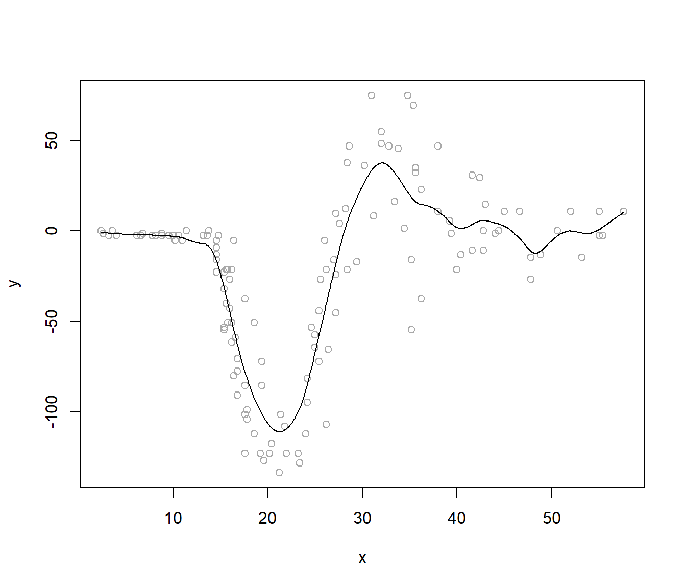

Hay que tener en cuenta que el paquete `KernSmooth` no implementa los métodos
`predict()` y `residuals()`:


```r
pred <- approx(fit, xout = x)$y # pred <- predict(fit)
resid <- y - pred # resid <- residuals(fit)
```

Tampoco calcula medidas de bondad de ajuste, aunque podríamos calcular medidas de la precisión de las predicciones de la forma habitual (en este caso de la muestra de entrenamiento):


```r
accuracy <- function(pred, obs, na.rm = FALSE, 
                     tol = sqrt(.Machine$double.eps)) {
  err <- obs - pred     # Errores
  if(na.rm) {
    is.a <- !is.na(err)
    err <- err[is.a]
    obs <- obs[is.a]
  }  
  perr <- 100*err/pmax(obs, tol)  # Errores porcentuales
  return(c(
    me = mean(err),           # Error medio
    rmse = sqrt(mean(err^2)), # Raíz del error cuadrático medio 
    mae = mean(abs(err)),     # Error absoluto medio
    mpe = mean(perr),         # Error porcentual medio
    mape = mean(abs(perr)),   # Error porcentual absoluto medio
    r.squared = 1 - sum(err^2)/sum((obs - mean(obs))^2) # Pseudo R-cuadrado
  ))
}
accuracy(pred, y)
```

```
##            me          rmse           mae           mpe          mape 
## -1.457414e-01  2.144568e+01  1.577670e+01 -2.458145e+10  7.556536e+10 
##     r.squared 
##  8.015429e-01
```

El caso multivariante es análogo, aunque habría que considerar una matriz de ventanas simétrica $H$. También hay extensiones para el caso de predictores categóricos (nominales o ordinales) y para el caso de distribuciones de la respuesta distintas de la normal (máxima verosimilitud local).

Otros paquetes de R incluyen más funcionalidades (`sm`, `locfit`, [`npsp`](https://rubenfcasal.github.io/npsp)...), pero hoy en día el paquete [`np`](https://github.com/JeffreyRacine/R-Package-np) es el que se podría considerar más completo.


### Regresión polinómica local robusta

También hay versiones robustas del ajuste polinómico local tipo núcleo.
Estos métodos surgieron en el caso bivariante ($p=1$), por lo que también se denominan *suavizado de diagramas de dispersión* (*scatterplot smoothing*; e.g. función `lowess()`, *locally weighted scatterplot smoothing*, del paquete base).
Posteriormente se extendieron al caso multivariante (e.g. función `loess()`).

Son métodos muy empleados en análisis descriptivo (no supervisado) y normalmente se emplean ventanas locales tipo vecinos más cercanos (por ejemplo a través de un parámetro `spam` que determina la proporción de observaciones empleadas en el ajuste).

Como ejemplo emplearemos la función `loess()` con ajuste robusto (habrá que establecer `family = "symmetric"` para emplear M-estimadores, por defecto con 4 iteraciones, en lugar de mínimos cuadrados ponderados), seleccionando previamente `spam` por validación cruzada (LOOCV) pero empleando como criterio de error la mediana de los errores en valor absoluto (*median absolute deviation*, MAD)^[En este caso habría dependencia entre las observaciones y los criterios habituales como validación cruzada tenderán a seleccionar ventanas pequeñas, i.e. a infrasuavizar.].


```r
cv.loess <- function(formula, datos, span, ...) {
  n <- nrow(datos)
  cv.pred <- numeric(n)
  for (i in 1:n) {
    modelo <- loess(formula, datos[-i, ], span = span, 
                    control = loess.control(surface = "direct"), ...)
    # control = loess.control(surface = "direct") permite extrapolaciones
    cv.pred[i] <- predict(modelo, newdata = datos[i, ])
  }
  return(cv.pred)
}

ventanas <- seq(0.1, 0.5, len = 10)
np <- length(ventanas)
cv.error <- numeric(np)
for(p in 1:np){
  cv.pred <- cv.loess(accel ~ times, mcycle, ventanas[p], family = "symmetric")
  # cv.error[p] <- mean((cv.pred - mcycle$accel)^2)
  cv.error[p] <- median(abs(cv.pred - mcycle$accel))
}

plot(ventanas, cv.error)
imin <- which.min(cv.error)
span.cv <- ventanas[imin]
points(span.cv, cv.error[imin], pch = 16)
```


```r
# Ajuste con todos los datos
plot(accel ~ times, data = mcycle, col = 'darkgray')
fit <- loess(accel ~ times, mcycle, span = span.cv, family = "symmetric")
lines(mcycle$times, predict(fit))
```

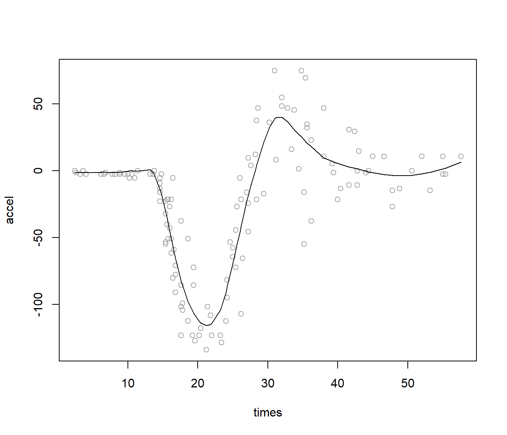


## Splines

Otra alternativa consiste en trocear los datos en intervalos, fijando unos puntos de corte $z_i$ (denominados nudos; *knots*), con $i = 1, \ldots, k$, y ajustar un polinomio en cada segmento (lo que se conoce como regresión segmentada, *piecewise regression*).

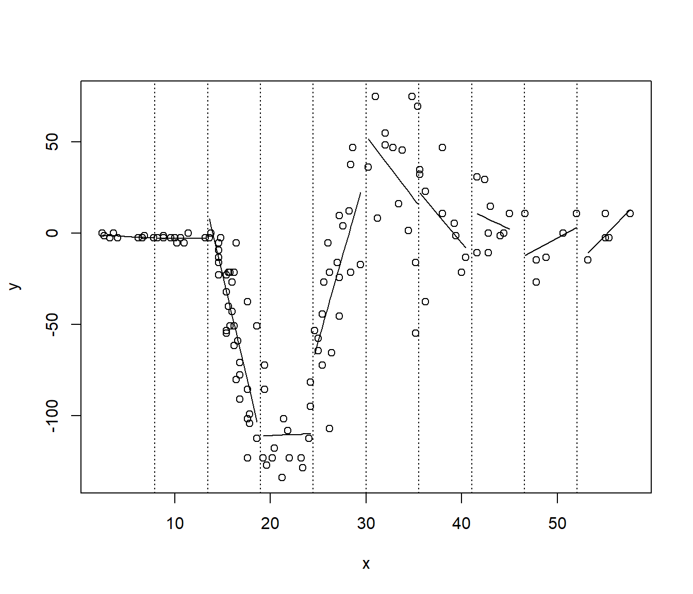

De esta forma sin embargo habrá discontinuidades en los puntos de corte, pero podrían añadirse restricciones adicionales de continuidad (o incluso de diferenciabilidad) para evitarlo (e.g. paquete [`segmented`](https://CRAN.R-project.org/package=segmented)).


### Regression splines {#reg-splines}

Cuando en cada intervalo se ajustan polinomios de orden $d$ y se incluyen restricciones de forma que las derivadas sean continuas hasta el orden $d-1$ se obtienen los denominados splines de regresión (*regression splines*).

Puede verse que este tipo de ajustes equivalen a transformar la variable predictora $X$, considerando por ejemplo la *base de potencias truncadas* (*truncated power basis*):
$$1, x, \ldots, x^d, (x-z_1)_+^d,\ldots,(x-z_k)_+^d$$
siendo $(x - z)_+ = \max(0, x - z)$, y posteriormente realizar un ajuste lineal:
$$m(x) = \beta_0 + \beta_1 b_1(x) +  \beta_2 b_2(x) + \ldots  + \beta_{k+d} b_{k+d}(x)$$

Típicamente se seleccionan polinomios de grado $d=3$, lo que se conoce como splines cúbicos, y nodos equiespaciados.
Además, se podrían emplear otras bases equivalentes. Por ejemplo, para evitar posibles problemas computacionales con la base anterior, se suele emplear la denominada base $B$-spline (de Boor, 1978; implementada en la función `bs()` del paquete `splines`).


```r
nknots <- 9 # nodos internos; 10 intervalos
knots <- seq(min(x), max(x), len = nknots + 2)[-c(1, nknots + 2)]
# knots <- quantile(x, 1:nknots/(nknots + 1)) # bs(x, df = nknots + degree + intercept)

library(splines)
fit1 <- lm(y ~ bs(x, knots = knots, degree = 1))
fit2 <- lm(y ~ bs(x, knots = knots, degree = 2))
fit3 <- lm(y ~ bs(x, knots = knots)) # degree = 3

plot(x, y, col = 'darkgray')
newx <- seq(min(x), max(x), len = 200)
newdata <- data.frame(x = newx)
lines(newx, predict(fit1, newdata), lty = 3)
lines(newx, predict(fit2, newdata), lty = 2)
lines(newx, predict(fit3, newdata))
abline(v = knots, lty = 3, col = 'darkgray')
legend("topright", legend = c("d=1 (df=11)", "d=2 (df=12)", "d=3 (df=13)"), 
       lty = c(3, 2, 1))
```

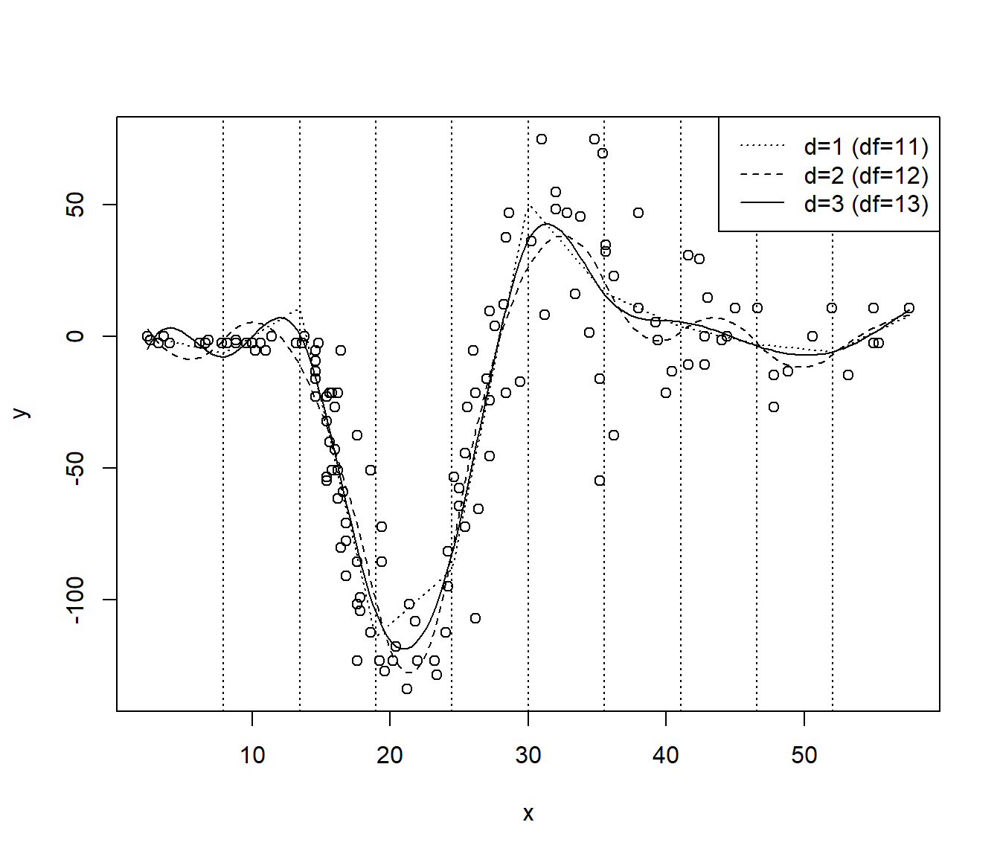

El grado del polinomio, pero sobre todo el número de nodos, determinarán la flexibilidad del modelo. 
Se podrían considerar el número de parámetros en el ajuste lineal, los grados de libertad, como medida de la complejidad (en la función `bs()` se puede especificar `df` en lugar de `knots`, y estos se generarán a partir de los cuantiles de `x`). 

Como ya se comentó, al aumentar el grado del modelo polinómico se incrementa la variabilidad de las predicciones, especialmente en la frontera.
Para tratar de evitar este problema se suelen emplear los *splines naturales*, que son splines de regresión con restricciones adicionales de forma que el ajuste sea lineal en los intervalos extremos (lo que en general produce estimaciones más estables en la frontera y mejores extrapolaciones).
Estas restricciones reducen la complejidad (los grados de libertad del modelo), y al igual que en el caso de considerar únicamente las restricciones de continuidad y diferenciabilidad, resultan equivalentes a considerar una nueva base en un ajuste sin restricciones.
Por ejemplo, se puede emplear la función `splines::ns()` para ajustar un spline natural (cúbico por defecto): 


```r
plot(x, y, col = 'darkgray')
fit4 <- lm(y ~ ns(x, knots = knots))
lines(newx, predict(fit4, newdata))
lines(newx, predict(fit3, newdata), lty = 2)
abline(v = knots, lty = 3, col = 'darkgray')
legend("topright", legend = c("ns (d=3, df=11)", "bs (d=3, df=13)"), lty = c(1, 2))
```

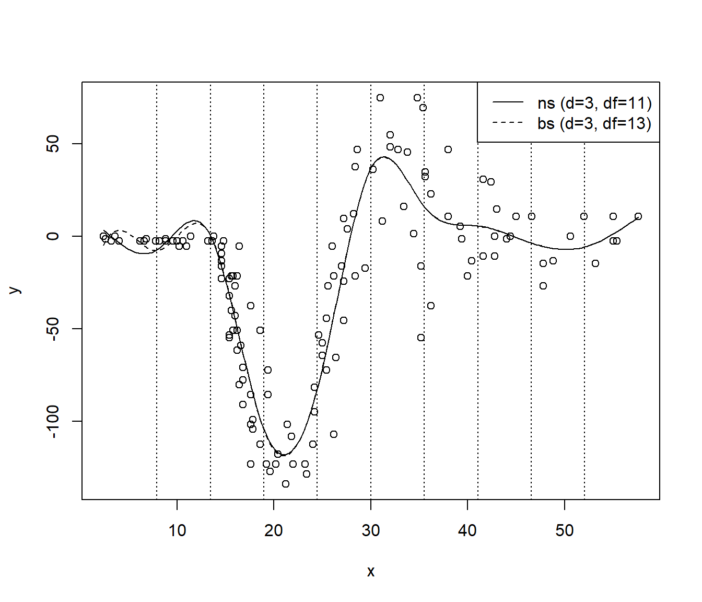

La dificultad está en la selección de los nodos $z_i$. Si se consideran equiespaciados (o se emplea otro criterio como los cuantiles), se podría seleccionar su número (equivalentemente los grados de libertad) empleando algún método de validación cruzada.
Sin embargo, sería preferible considerar más nodos donde aparentemente hay más variaciones en la función de regresión y menos donde es más estable, esta es la idea de la regresión spline adaptativa descrita en la Sección \@ref(mars).
Otra alternativa son los splines penalizados, descritos al final de esta sección.


### Smoothing splines

Los splines de suavizado (*smoothing splines*) se obtienen como la función $s(x)$ suave (dos veces diferenciable) que minimiza la suma de cuadrados residual más una penalización que mide su rugosidad:
$$\sum_{i=1}^{n} (y_i - s(x_i))^2  + \lambda \int s^{\prime\prime}(x)^2 dx$$
siendo $0 \leq \lambda < \infty$ el (hiper)parámetro de suavizado.

Puede verse que la solución a este problema, en el caso univariante, es un spline natural cúbico con nodos en $x_1, \ldots, x_n$ y restricciones en los coeficientes determinadas por el valor de $\lambda$ (es una versión regularizada de un spline natural cúbico).
Por ejemplo si $\lambda = 0$ se interpolarán las observaciones y cuando $\lambda \rightarrow \infty$ el ajuste tenderá a una recta (con segunda derivada nula).
En el caso multivariante $p> 1$ la solución da lugar a los denominados *thin plate splines*^[Están relacionados con las funciones radiales. También hay versiones con un número reducido de nodos denominados *low-rank thin plate regression splines* empleados en el paquete `mgcv`.].


Al igual que en el caso de la regresión polinómica local (Sección \@ref(reg-locpol)), estos métodos son suavizadores lineales:
$$\hat{\mathbf{Y}} = S_{\lambda}\mathbf{Y}$$
y para seleccionar el parámetro de suavizado $\lambda$ podemos emplear los criterios de validación cruzada (dejando uno fuera), minimizando:
$$CV(\lambda)=\frac{1}{n}\sum_{i=1}^n\left(\frac{y_i-\hat{s}_{\lambda}(x_i)}{1 - \{ S_{\lambda}\}_{ii}}\right)^2$$
siendo $\{ S_{\lambda}\}_{ii}$ el elemento $i$-ésimo de la diagonal de la matriz de suavizado, 
o validación cruzada generalizada (GCV), minimizando:
$$GCV(\lambda)=\frac{1}{n}\sum_{i=1}^n\left(\frac{y_i-\hat{s}_{\lambda}(x_i)}{1 - \frac{1}{n}tr(S_{\lambda})}\right)^2$$

Análogamente, el número efectivo de parámetros o grados de libertad^[Esto también permitiría generalizar los criterios AIC o BIC.] $df_{\lambda}=tr(S_{\lambda})$ sería una medida de la complejidad del modelo equivalente a $\lambda$ (muchas implementaciones permiten seleccionar la complejidad empleando $df$).

Este método de suavizado está implementado en la función `smooth.spline()` del paquete base y por defecto emplea GCV para seleccionar el parámetro de suavizado (aunque también admite CV y se puede especificar `lambda` o `df`)^[Además de predicciones, el correspondiente método `predict()` también permite obtener estimaciones de las derivadas.].


```r
sspline.gcv <- smooth.spline(x, y)
sspline.cv <- smooth.spline(x, y, cv = TRUE)
plot(x, y, col = 'darkgray')
lines(sspline.gcv)
lines(sspline.cv, lty = 2)
```


Cuando el número de observaciones es muy grande, y por tanto el número de nodos, pueden aparecer problemas computacionales al emplear estos métodos.


### Splines penalizados

Los splines penalizados (*penalized splines*) combinan las dos aproximaciones anteriores.
Incluyen una penalización (que depende de la base considerada) y el número de nodos puede ser mucho menor que el número de observaciones (son un tipo de *low-rank smoothers*). De esta forma se obtienen modelos spline con mejores propiedades, con un menor efecto frontera y en los que se evitan problemas en la selección de los nodos.
Unos de los más empleados son los $P$-splines (Eilers and Marx, 1996) que emplean una base $B$-spline con una penalización simple (basada en los cuadrados de diferencias de coeficientes consecutivos $(\beta_{i+1} - \beta_i)^2$).

Además, un modelo spline penalizado se puede representar como un modelo lineal mixto, lo que permite emplear herramientas desarrolladas para este tipo de modelos (por ejemplo la implementadas en el paquete `nlme`, del que depende `mgcv`, que por defecto emplea splines penalizados).
Para más detalles ver por ejemplo las secciones 5.2 y 5.3 de Wood (2017).

<!-- 
?mgcv::adaptive.smooth 
Wand, M.P. (2003). Smoothing and Mixed Models. *Computational Statistics*, 18(2), 223–249
-->

## Modelos aditivos

Se supone que:
$$Y= \beta_{0} + f_1(X_1) + f_2(X_2) + \ldots + f_p(X_p)  + \varepsilon$$
con $f_{i},$ $i=1,...,p,$ funciones cualesquiera.
De esta forma se consigue mucha mayor flexibilidad que con los modelos lineales pero manteniendo la interpretabilidad de los efectos de los predictores. 
Adicionalmente se puede considerar una función de enlace, obteniéndose los denominados *modelos aditivos generalizados* (GAM). Para más detalles sobre este tipo modelos ver por ejemplo Hastie y Tibshirani (1990) o Wood (2017).

Los modelos lineales (generalizados) serían un caso particular considerando $f_{i}(x) = \beta_{i}x$.
Además, se podrían considerar cualquiera de los métodos de suavizado descritos anteriormente para construir las componentes no paramétricas (por ejemplo si se emplean splines naturales de regresión el ajuste se reduciría al de un modelo lineal).
Se podrían considerar distintas aproximaciones para el modelado de cada componente (modelos semiparamétricos) y realizar el ajuste mediante *backfitting* (se ajusta cada componente de forma iterativa, empleando los residuos obtenidos al mantener las demás fijas).
Si en las componentes no paramétricas se emplea únicamente splines de regresión (con o sin penalización), se puede reformular el modelo como un GLM (regularizado si hay penalización) y ajustarlo fácilmente adaptando herramientas disponibles (*penalized re-weighted iterative least squares*, PIRLS).


De entre todos los paquetes de R que implementan estos modelos destacan: 

- `gam`: Admite splines de suavizado (univariantes, `s()`) y regresión polinómica local (multivariante, `lo()`), pero no dispone de un método para la selección automática de los parámetros de suavizado (se podría emplear un criterio por pasos para la selección de componentes).
Sigue la referencia:

    * Hastie, T.J. y Tibshirani, R.J. (1990). *Generalized Additive Models*. Chapman & Hall.

<br> \vspace{0.5cm}

- `mgcv`: Admite una gran variedad de splines de regresión y splines penalizados (`s()`; por defecto emplea thin plate regression splines penalizados multivariantes), con la opción de selección automática de los parámetros de suavizado mediante distintos criterios.
Además de que se podría emplear un método por pasos, permite la selección de componentes mediante regularización.
Al ser más completo que el anterior sería el recomendado en la mayoría de los casos (ver `?mgcv::mgcv.package` para una introducción al paquete).
Sigue la referencia:

    * Wood, S.N. (2017). *Generalized Additive Models: An Introduction with R*. Chapman & Hall/CRC

<br> \vspace{0.5cm}


### Ajuste: función `gam` 

La función `gam()` del paquete `mgcv` permite ajustar modelos aditivos generalizados empleando suavizado mediante splines:


```r
library(mgcv)
ajuste <- gam(formula, family = gaussian, data, method = "GCV.Cp", select = FALSE, ...)
```

(también dispone de la función `bam()` para el ajuste de estos modelos a grandes conjuntos de datos y de la función `gamm()` para el ajuste de modelos aditivos generalizados mixtos). El modelo se establece a partir de la `formula` empleando `s()` para especificar las componentes "suaves" (ver `help(s)` y Sección \@ref(mgcv-diagnosis)).

Algunas posibilidades de uso son las que siguen:

-   Modelo lineal:
    
    ```r
    ajuste <- gam(y ~ x1 + x2 + x3)
    ```

-   Modelo (semiparamétrico) aditivo con efectos no paramétricos para `x1` y `x2`, y un efecto lineal para `x3`:
    
    ```r
    ajuste <- gam(y ~ s(x1) + s(x2) + x3)
    ```

-   Modelo no aditivo (con interacción):
    
    ```r
    ajuste <- gam(y ~ s(x1, x2))
    ```

-   Modelo (semiparamétrico) con distintas combinaciones :
    
    ```r
    ajuste <- gam(y ~ s(x1, x2) + s(x3) + x4)
    ```

### Ejemplo

En esta sección utilizaremos como ejemplo el conjunto de datos `Prestige` de la librería `carData`. 
Se tratará de explicar `prestige` (puntuación de ocupaciones obtenidas a partir de una encuesta) a partir de `income` (media de ingresos en la ocupación) y `education` (media de los años de educación).


```r
data(Prestige, package = "carData")
library(mgcv)
modelo <- gam(prestige ~ s(income) + s(education), data = Prestige)
summary(modelo)
```

```
## 
## Family: gaussian 
## Link function: identity 
## 
## Formula:
## prestige ~ s(income) + s(education)
## 
## Parametric coefficients:
##             Estimate Std. Error t value Pr(>|t|)    
## (Intercept)  46.8333     0.6889   67.98   <2e-16 ***
## ---
## Signif. codes:  0 '***' 0.001 '**' 0.01 '*' 0.05 '.' 0.1 ' ' 1
## 
## Approximate significance of smooth terms:
##                edf Ref.df     F  p-value    
## s(income)    3.118  3.877 14.61 1.53e-09 ***
## s(education) 3.177  3.952 38.78  < 2e-16 ***
## ---
## Signif. codes:  0 '***' 0.001 '**' 0.01 '*' 0.05 '.' 0.1 ' ' 1
## 
## R-sq.(adj) =  0.836   Deviance explained = 84.7%
## GCV = 52.143  Scale est. = 48.414    n = 102
```

```r
# coef(modelo) # El resultado es un modelo lineal en transformaciones de los predictores
```

En este caso el método `plot()` representa los efectos (parciales) estimados de cada predictor:  


```r
par.old <- par(mfrow = c(1, 2))
plot(modelo, shade = TRUE) # 
```

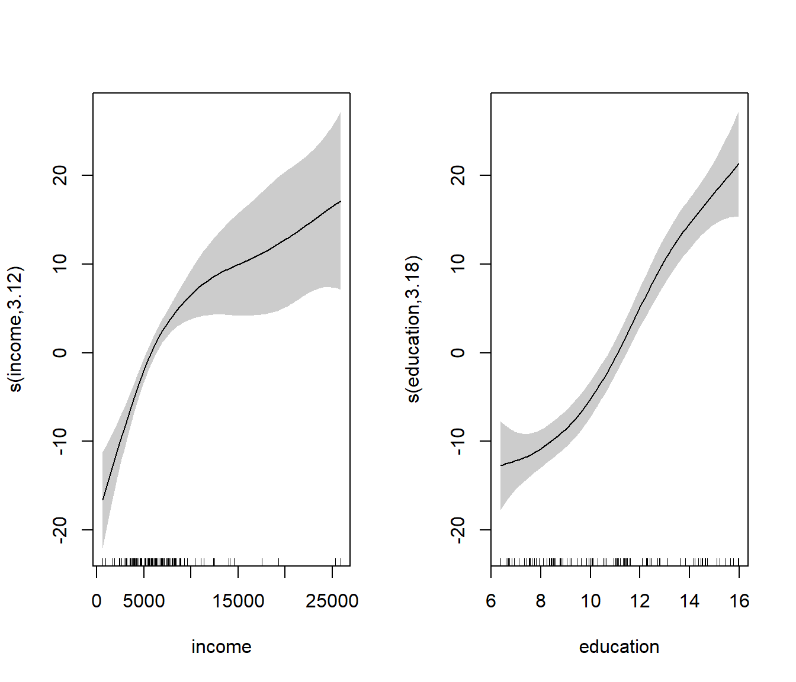

```r
par(par.old)
```

En general se representa cada componente no paramétrica (salvo que se especifique `all.terms = TRUE`), incluyendo gráficos de contorno para el caso de componentes bivariantes (correspondientes a interacciones entre predictores).

Se dispone también de un método `predict()` para calcular las predicciones de la forma habitual (por defecto devuelve las correspondientes a las observaciones `modelo$fitted.values` y para nuevos datos hay que emplear el argumento `newdata`).


### Superficies de predicción

En el caso bivariante, para representar las estimaciones (la superficie de predicción) obtenidas con el modelo se pueden utilizar las funciones `persp()` o versiones mejoradas como `plot3D::persp3D`. 
Estas funciones requieren que los valores de entrada estén dispuestos en una rejilla bidimensional. 
Para generar esta rejilla se puede emplear la función `expand.grid(x,y)` que crea todas las combinaciones de los puntos dados en `x` e `y`.


```r
inc <- with(Prestige, seq(min(income), max(income), len = 25))
ed <- with(Prestige, seq(min(education), max(education), len = 25))
newdata <- expand.grid(income = inc, education = ed)
# Representamos la rejilla
plot(income ~ education, Prestige, pch = 16)
abline(h = inc, v = ed, col = "grey")
```


```r
# Se calculan las predicciones
pred <- predict(modelo, newdata)
# Se representan
pred <- matrix(pred, nrow = 25)
# persp(inc, ed, pred, theta = -40, phi = 30)
plot3D::persp3D(inc, ed, pred, theta = -40, phi = 30, ticktype = "detailed",
                xlab = "Income", ylab = "Education", zlab = "Prestige")
```

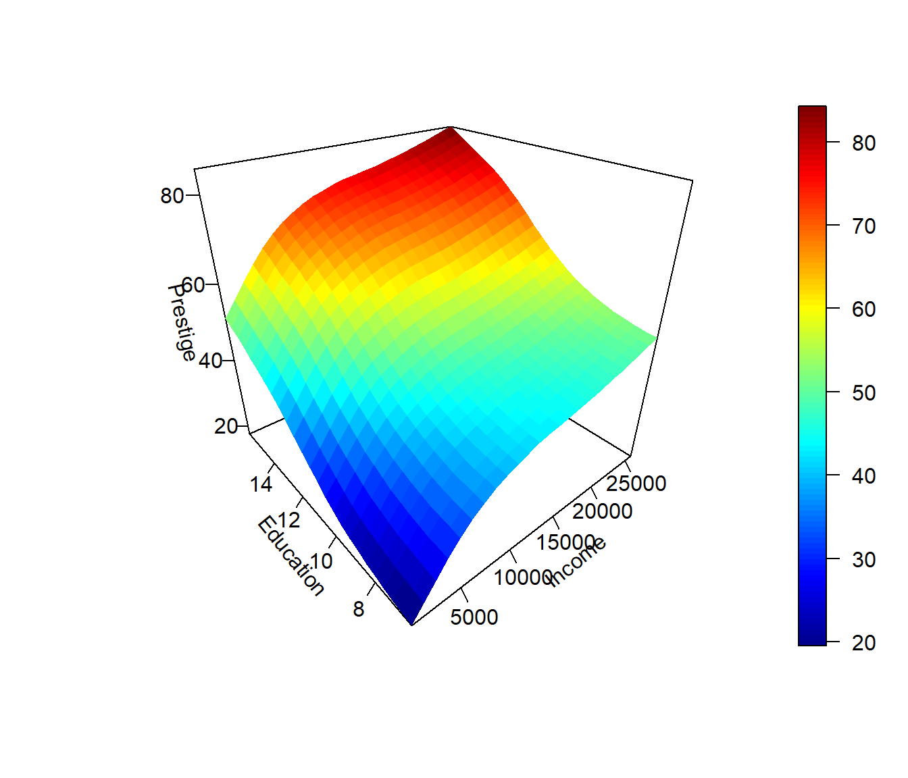

Alternativamente se podrían emplear las funciones `contour()`, `filled.contour()`, `plot3D::image2D` o similares:


```r
# contour(inc, ed, pred, xlab = "Income", ylab = "Education")
filled.contour(inc, ed, pred, xlab = "Income", ylab = "Education", key.title = title("Prestige"))
```


Puede ser más cómodo emplear el paquete [`modelr`](https://modelr.tidyverse.org) (emplea gráficos `ggplot2`) para trabajar con modelos y predicciones.


### Comparación y selección de modelos

Además de las medidas de bondad de ajuste como el coeficiente de determinación ajustado, también se puede emplear la función `anova` para la comparación de modelos (y seleccionar las componentes por pasos de forma interactiva).
Por ejemplo, viendo el gráfico de los efectos se podría pensar que el efecto de `education` podría ser lineal:


```r
# plot(modelo)
modelo0 <- gam(prestige ~ s(income) + education, data = Prestige)
summary(modelo0)
```

```
## 
## Family: gaussian 
## Link function: identity 
## 
## Formula:
## prestige ~ s(income) + education
## 
## Parametric coefficients:
##             Estimate Std. Error t value Pr(>|t|)    
## (Intercept)   4.2240     3.7323   1.132    0.261    
## education     3.9681     0.3412  11.630   <2e-16 ***
## ---
## Signif. codes:  0 '***' 0.001 '**' 0.01 '*' 0.05 '.' 0.1 ' ' 1
## 
## Approximate significance of smooth terms:
##            edf Ref.df    F  p-value    
## s(income) 3.58  4.441 13.6 1.16e-09 ***
## ---
## Signif. codes:  0 '***' 0.001 '**' 0.01 '*' 0.05 '.' 0.1 ' ' 1
## 
## R-sq.(adj) =  0.825   Deviance explained = 83.3%
## GCV = 54.798  Scale est. = 51.8      n = 102
```

```r
anova(modelo0, modelo, test="F")
```

```
## Analysis of Deviance Table
## 
## Model 1: prestige ~ s(income) + education
## Model 2: prestige ~ s(income) + s(education)
##   Resid. Df Resid. Dev     Df Deviance      F Pr(>F)  
## 1    95.559     4994.6                                
## 2    93.171     4585.0 2.3886   409.58 3.5418 0.0257 *
## ---
## Signif. codes:  0 '***' 0.001 '**' 0.01 '*' 0.05 '.' 0.1 ' ' 1
```

En este caso aceptaríamos que el modelo original es significativamente mejor.

Alternativamente, podríamos pensar que hay interacción:


```r
modelo2 <- gam(prestige ~ s(income, education), data = Prestige)
summary(modelo2)
```

```
## 
## Family: gaussian 
## Link function: identity 
## 
## Formula:
## prestige ~ s(income, education)
## 
## Parametric coefficients:
##             Estimate Std. Error t value Pr(>|t|)    
## (Intercept)  46.8333     0.7138   65.61   <2e-16 ***
## ---
## Signif. codes:  0 '***' 0.001 '**' 0.01 '*' 0.05 '.' 0.1 ' ' 1
## 
## Approximate significance of smooth terms:
##                      edf Ref.df     F p-value    
## s(income,education) 4.94  6.303 75.41  <2e-16 ***
## ---
## Signif. codes:  0 '***' 0.001 '**' 0.01 '*' 0.05 '.' 0.1 ' ' 1
## 
## R-sq.(adj) =  0.824   Deviance explained = 83.3%
## GCV = 55.188  Scale est. = 51.974    n = 102
```

```r
# plot(modelo2, se = FALSE)
# plot(modelo2, scheme = 2)
```

En este caso el coeficiente de determinación ajustado es menor y no sería necesario realizar el contraste.

<!-- 
También podríamos emplear el criterio `AIC()` (o `BIC()`): 


```r
AIC(modelo)
```

```
## [1] 694.222
```

```r
AIC(modelo2)
```

```
## [1] 700.1994
```
-->

Ademas se pueden seleccionar componentes del modelo (mediante regularización) empleando el parámetro `select = TRUE`. 


```r
example(gam.selection)
```

```
## 
## gm.slc> ## an example of automatic model selection via null space penalization
## gm.slc> library(mgcv)
## 
## gm.slc> set.seed(3);n<-200
## 
## gm.slc> dat <- gamSim(1,n=n,scale=.15,dist="poisson") ## simulate data
## Gu & Wahba 4 term additive model
## 
## gm.slc> dat$x4 <- runif(n, 0, 1);dat$x5 <- runif(n, 0, 1) ## spurious
## 
## gm.slc> b<-gam(y~s(x0)+s(x1)+s(x2)+s(x3)+s(x4)+s(x5),data=dat,
## gm.slc+          family=poisson,select=TRUE,method="REML")
## 
## gm.slc> summary(b)
## 
## Family: poisson 
## Link function: log 
## 
## Formula:
## y ~ s(x0) + s(x1) + s(x2) + s(x3) + s(x4) + s(x5)
## 
## Parametric coefficients:
##             Estimate Std. Error z value Pr(>|z|)    
## (Intercept)  1.21758    0.04082   29.83   <2e-16 ***
## ---
## Signif. codes:  0 '***' 0.001 '**' 0.01 '*' 0.05 '.' 0.1 ' ' 1
## 
## Approximate significance of smooth terms:
##             edf Ref.df  Chi.sq p-value    
## s(x0) 1.7655088      9   5.264  0.0397 *  
## s(x1) 1.9271040      9  65.356  <2e-16 ***
## s(x2) 6.1351414      9 156.204  <2e-16 ***
## s(x3) 0.0002849      9   0.000  0.4068    
## s(x4) 0.0003044      9   0.000  1.0000    
## s(x5) 0.1756926      9   0.195  0.2963    
## ---
## Signif. codes:  0 '***' 0.001 '**' 0.01 '*' 0.05 '.' 0.1 ' ' 1
## 
## R-sq.(adj) =  0.545   Deviance explained = 51.6%
## -REML = 430.78  Scale est. = 1         n = 200
## 
## gm.slc> plot(b,pages=1)
```

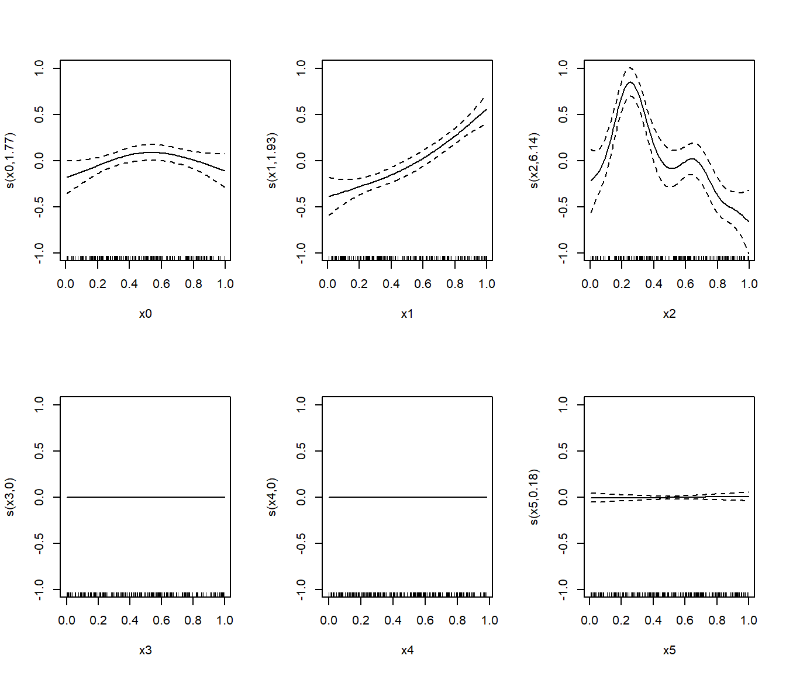


### Diagnosis del modelo {#mgcv-diagnosis}

La función `gam.check()` realiza una diagnosis del modelo: 


```r
gam.check(modelo)
```

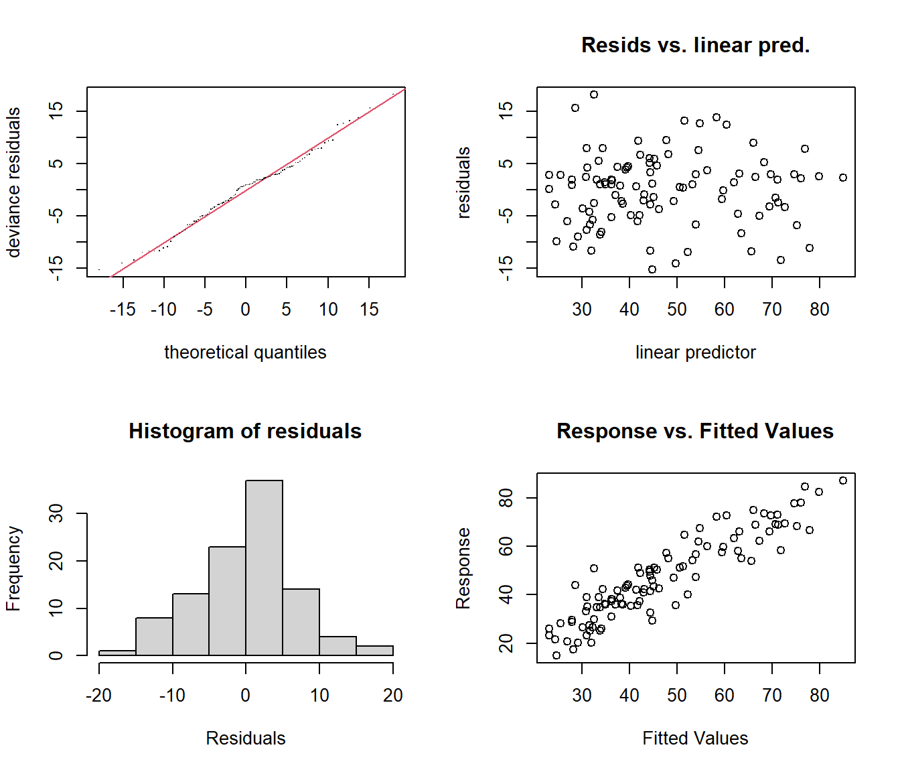

```
## 
## Method: GCV   Optimizer: magic
## Smoothing parameter selection converged after 4 iterations.
## The RMS GCV score gradient at convergence was 9.783945e-05 .
## The Hessian was positive definite.
## Model rank =  19 / 19 
## 
## Basis dimension (k) checking results. Low p-value (k-index<1) may
## indicate that k is too low, especially if edf is close to k'.
## 
##                k'  edf k-index p-value
## s(income)    9.00 3.12    0.98    0.42
## s(education) 9.00 3.18    1.03    0.54
```

Lo ideal sería observar normalidad en los dos gráficos de la izquierda, falta de patrón en el superior derecho, y ajuste a una recta en el inferior derecho. En este caso parece que el modelo se comporta adecuadamente.
Como se deduce del resultado anterior, podría ser recomendable modificar la dimensión `k` de la base utilizada construir la componente no paramétrica, este valor se puede interpretar como el grado máximo de libertad permitido en ese componente, aunque normalmente no influye demasiado en el resultado (puede influir en el tiempo de computación).


También se podría chequear concurvidad (*concurvity*; generalización de la multicolinealidad) entre las componentes del modelo:


```r
concurvity(modelo)
```

```
##                  para s(income) s(education)
## worst    3.107241e-23 0.5931528    0.5931528
## observed 3.107241e-23 0.4065402    0.4398639
## estimate 3.107241e-23 0.3613674    0.4052251
```

Esta función devuelve tres medidas por componente, que tratan de medir la proporción de variación de esa componente que está contenida en el resto (similares al complementario de la tolerancia; un valor próximo a 1 indicaría que puede haber problemas de concurvidad).


### GAM en `caret`

El soporte de GAM en `caret` es como poco deficiente... 


```r
library(caret)
names(getModelInfo("gam")) # 4 métodos
```

```
## [1] "gam"       "gamboost"  "gamLoess"  "gamSpline"
```

```r
modelLookup("gam")
```

```
##   model parameter             label forReg forClass probModel
## 1   gam    select Feature Selection   TRUE     TRUE      TRUE
## 2   gam    method            Method   TRUE     TRUE      TRUE
```

```r
modelLookup("gamLoess")
```

```
##      model parameter  label forReg forClass probModel
## 1 gamLoess      span   Span   TRUE     TRUE      TRUE
## 2 gamLoess    degree Degree   TRUE     TRUE      TRUE
```

### Ejercicios

1. Continuando con los datos de `MASS:mcycle`, emplear `mgcv::gam()` para ajustar un spline penalizado para predecir `accel` a partir de `times` con las opciones por defecto y representar el ajuste obtenido. Comparar el ajuste con el obtenido empleando un spline penalizado adaptativo (`bs="ad"`; ver `?adaptive.smooth`).

2. Empleando el conjunto de datos `airquality`, crear una muestra de entrenamiento y otra de test, buscar un modelo aditivo que resulte adecuado para explicar `sqrt(Ozone)` a partir de `Temp`, `Wind` y `Solar.R`.
Es preferible suponer que hay una interacción entre `Temp` y `Wind`?

## Regresión spline adaptativa multivariante {#mars}

La regresión spline adaptativa multivariante, en inglés *multivariate adaptive regression splines* (MARS; Friedman, 1991), es un procedimiento adaptativo para problemas de regresión que puede verse como una generalización tanto de la regresión lineal por pasos (*stepwise linear regression*) como de los árboles de decisión CART. 

El modelo MARS es un spline multivariante lineal:  
$$m(\mathbf{x}) = \beta_0 + \sum_{m=1}^M \beta_m h_m(\mathbf{x})$$
(es un modelo lineal en transformaciones $h_m(\mathbf{x})$ de los predictores originales), donde las bases $h_m(\mathbf{x})$ se construyen de forma adaptativa empleando funciones *bisagra* (*hinge functions*)
$$ h(x) = (x)_+ = \mbox{max}\{0, x\} = \left\{ \begin{array}{ll}
  x & \mbox{si } x > 0 \\
  0 & \mbox{si } x \leq 0
  \end{array}
  \right.$$
y considerando como posibles nodos los valores observados de los predictores
(en el caso univariante se emplean las bases de potencias truncadas con $d=1$ descritas en la Sección \@ref(reg-splines), pero incluyendo también su versión simetrizada).

Vamos a empezar explicando el modelo MARS aditivo (sin interacciones), que funciona de forma muy parecida a los árboles de decisión CART, y después lo extenderemos al caso con interacciones. Asumimos que todas las variables predictoras son numéricas. El proceso de construcción del modelo es un proceso iterativo *hacia delante* (forward) que empieza con el modelo
$$\hat m(\mathbf{x}) = \hat \beta_0 $$
donde $\hat \beta_0$ es la media de todas las respuestas, para a continuación considerar todos los puntos de corte (*knots*) posibles $x_{ij}$ con $i = 1, 2, \ldots, n$, $j = 1, 2, \ldots, p$, es decir, todas las observaciones de todas las variables predictoras de la muestra de entrenamiento. Para cada punto de corte $x_{ij}$ se consideran dos bases:
$$h_1(\mathbf{x}) = h(X_j - x_{ij}) \\
h_2(\mathbf{x}) = h(x_{ij} - X_j)$$
y se construye el nuevo modelo 
$$\hat m(\mathbf{x}) = \hat \beta_0 + \hat \beta_1 h_1(\mathbf{x}) + \hat \beta_2 h_2(\mathbf{x})$$
La estimación de los parámetros $\beta_0, \beta_1, \beta_2$ se realiza de la forma estándar en regresión lineal, minimizando $\mbox{RSS}$. De este modo se construyen muchos modelos alternativos y entre ellos se selecciona aquel que tenga un menor error de entrenamiento. En la siguiente iteración se conservan $h_1(\mathbf{x})$ y $h_2(\mathbf{x})$ y se añade una pareja de términos nuevos siguiendo el mismo procedimiento. Y así sucesivamente, añadiendo de cada vez dos nuevos términos. Este procedimiento va creando un modelo lineal segmentado (piecewise) donde cada nuevo término modeliza una porción aislada de los datos originales.

El *tamaño* de cada modelo es el número términos (funciones $h_m$) que este incorpora. El proceso iterativo se para cuando se alcanza un modelo de tamaño $M$, que se consigue después de incorporar $M/2$ cortes. Este modelo depende de $M+1$ parámetros $\beta_m$ con $m=0,1,\ldots,M$. El objetivo es alcanzar un modelo lo suficientemente grande para que sobreajuste los datos, para a continuación proceder a su poda en un proceso de eliminación de variables hacia atrás (*backward deletion*) en el que se van eliminando las variables de una en una (no por parejas, como en la construcción). En cada paso de poda se elimina el término que produce el menor incremento en el error. Así, para cada tamaño $\lambda = 0,1,\ldots, M$ se obtiene el mejor modelo estimado $\hat{m}_{\lambda}$. 

La selección *óptima* del valor del hiperparámetro $\lambda$ puede realizarse por los procedimientos habituales tipo validación cruzada. Una alternativa mucho más rápida es utilizar validación cruzada generalizada (GCV) que es una aproximación de la validación cruzada *leave-one-out* mediante la fórmula
$$\mbox{GCV} (\lambda) = \frac{\mbox{RSS}}{(1-M(\lambda)/n)^2}$$
donde $M(\lambda)$ es el número de parámetros *efectivos* del modelo, que depende del número de términos más el número de puntos de corte utilizados penalizado por un factor (2 en el caso aditivo que estamos explicando, 3 cuando hay interacciones). 

Hemos explicado una caso particular de MARS: el modelo aditivo. El modelo general sólo se diferencia del caso aditivo en que se permiten iteracciones, es decir, multiplicaciones entre las variables $h_m(\mathbf{x})$. Para ello, en las iteraciones de la fase de construcción del modelo, además de considerar todos los puntos de corte, se consideran también todos los términos incorporados previamente al modelo, a los que se añade $h_0(\mathbf{x}) = 1$. De este modo, si resulta seleccionado un término padre $h_l(\mathbf{x})$, después de analizar todas las posibilidades, al modelo anterior se le agrega
$$\hat \beta_{m+1} h_l(\mathbf{x}) h(X_j - x_{ij}) + \hat \beta_{m+2} h_l(\mathbf{x}) h(x_{ij} - X_j)$$
Recordando que en cada caso se vuelven a estimar todos los parámetros $\beta_i$.

Al igual que $\lambda$, también el grado de interacción máxima permitida se considera un hiperparámetro del problema, aunque lo habitual es trabajar con grado 1 (modelo aditivo) o interacción de grado 2. Una restricción adicional que se impone al modelo es que en cada producto no puede aparecer más de una vez la misma variable $X_j$.

Aunque el procedimiento de construcción del modelo realiza búsquedas exhaustivas y en consecuencia puede parecer computacionalmente intratable, en la práctica se realiza de forma razonablemente rápida, al igual que ocurría en CART. Una de las principales ventajas de MARS es que realiza una selección automática de las variables predictoras. Aunque inicialmente pueda haber muchos predictores, y este método es adecuado para problemas de alta dimensión, en el modelo final van a aparecer muchos menos (pueden aparecer más de una vez). Además, si se utiliza un modelo aditivo su interpretación es directa, e incluso permitiendo interacciones de grado 2 el modelo puede ser interpretado. Otra ventaja es que no es necesario realizar un prepocesado de los datos, ni filtrando variables ni transformando los datos. Que haya predictores con correlaciones altas no va a afectar al rendimiento del modelo, aunque sí puede dificultar su interpretación. Aunque hemos supuesto al principio de la explicación que los predictores son numéricos, se pueden incorporar variables predictoras cualitativas siguiendo los procedimientos estándar. Por último, se puede realizar una cuantificación de la importancia de las variables de forma similar a como se hace en CART.

En conclusión, MARS utiliza splines lineales con una selección automática de los puntos de corte mediante un algoritmo avaricioso similar al empleado en los árboles CART, tratando de añadir más puntos de corte donde aparentemente hay más variaciones en la función de regresión y menos puntos donde esta es más estable.


### MARS con el paquete `earth`

Actualmente el paquete de referencia para MARS es [`earth`](http://www.milbo.users.sonic.net/earth) (*Enhanced Adaptive Regression Through Hinges*)^[Desarrollado a partir de la función `mda::mars()` de T. Hastie y R. Tibshirani. Utiliza este nombre porque MARS está registrado para un uso comercial por [Salford Systems](https://www.salford-systems.com).].

Su función principal es:


```r
earth(formula, data, glm = NULL, degree = 1, ...) 
```

donde los parámetros principales son:

* `glm`: lista con los parámetros del ajuste GLM (e.g. `glm = list(family = binomial)`).

* `degree`: grado máximo de interacción; por defecto 1 (modelo aditivo).

Esta función admite respuestas multidimensionales (ajustando un modelo para cada componente) y categóricas (las convierte en multivariantes), también predictores categóricos, aunque no permite datos faltantes.

Otros parámetros que pueden ser de interés (afectan a la complejidad del modelo en el crecimiento, a la selección del modelo final o al tiempo de computación; para más detalles ver `help(earth)`):

* `nk`: número máximo de términos (dimensión de la base $M$) en el crecimiento del modelo; por defecto `min(200, max(20, 2 * ncol(x))) + 1` (puede ser demasiado pequeña si muchos de los predictores influyen en la respuesta).   

* `thresh`: umbral de parada en el crecimiento (se interpretaría como `cp` en los árboles CART); por defecto 0.001.

* `fast.k`: número máximo de términos padre considerados en cada paso durante el crecimiento.

* `linpreds`: índice de variables que se considerarán con efecto lineal.

* `nprune`: número máximo de términos (incluida la intersección) en el modelo final (después de la poda).

* `pmethod`: método empleado para la poda; por defecto `"backward"`. Otras opciones son: `"forward"`, `"seqrep"`, `"exhaustive"` (emplea los métodos de selección implementados en paquete `leaps`), `"cv"` (validación cruzada, empleando `nflod`) y `"none"` para no realizar poda.

* `nfold`: número de grupos de validación cruzada; por defecto 0 (no se hace validación cruzada).

* `varmod.method`: permite seleccionar un método para estimar las varianzas y por ejemplo poder realizar contrastes o construir intervalos de confianza (para más detalles ver `?varmod` o la vignette "Variance models in earth"). 


Utilizaremos como ejemplo inicial los datos de `MASS:mcycle`:


```r
# data(mcycle, package = "MASS")
library(earth)
mars <- earth(accel ~ times, data = mcycle)
# mars
summary(mars)
```

```
## Call: earth(formula=accel~times, data=mcycle)
## 
##               coefficients
## (Intercept)     -90.992956
## h(19.4-times)     8.072585
## h(times-19.4)     9.249999
## h(times-31.2)   -10.236495
## 
## Selected 4 of 6 terms, and 1 of 1 predictors
## Termination condition: RSq changed by less than 0.001 at 6 terms
## Importance: times
## Number of terms at each degree of interaction: 1 3 (additive model)
## GCV 1119.813    RSS 133670.3    GRSq 0.5240328    RSq 0.5663192
```

```r
plot(mars)
```

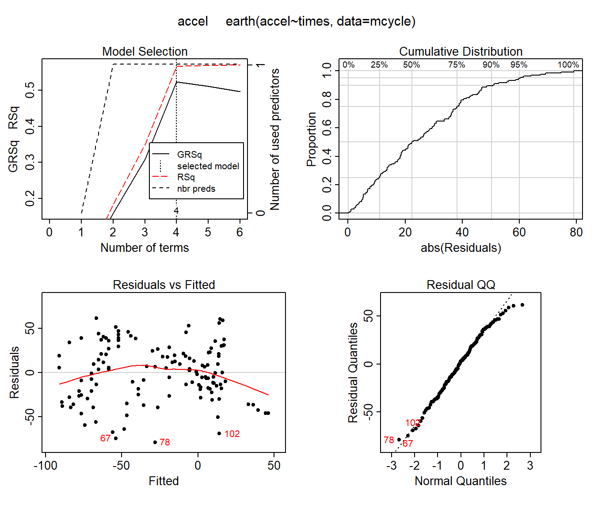

```r
plot(accel ~ times, data = mcycle, col = 'darkgray')
lines(mcycle$times, predict(mars))
```


Como con las opciones por defecto el ajuste no es muy bueno (aunque podría valer...), podríamos forzar la complejidad del modelo en el crecimiento  (`minspan = 1` permite que todas las observaciones sean potenciales nodos): 


```r
mars2 <- earth(accel ~ times, data = mcycle, minspan = 1, thresh = 0)
summary(mars2)
```

```
## Call: earth(formula=accel~times, data=mcycle, minspan=1, thresh=0)
## 
##               coefficients
## (Intercept)      -6.274366
## h(times-14.6)   -25.333056
## h(times-19.2)    32.979264
## h(times-25.4)   153.699248
## h(times-25.6)  -145.747392
## h(times-32)     -30.041076
## h(times-35.2)    13.723887
## 
## Selected 7 of 12 terms, and 1 of 1 predictors
## Termination condition: Reached nk 21
## Importance: times
## Number of terms at each degree of interaction: 1 6 (additive model)
## GCV 623.5209    RSS 67509.03    GRSq 0.7349776    RSq 0.7809732
```

```r
plot(accel ~ times, data = mcycle, col = 'darkgray')
lines(mcycle$times, predict(mars2))
```


Como siguiente ejemplo consideramos los datos de `carData::Prestige`:


```r
# data(Prestige, package = "carData")
mars <- earth(prestige ~ education + income + women, data = Prestige,
              degree = 2, nk = 40)
summary(mars)
```

```
## Call: earth(formula=prestige~education+income+women, data=Prestige, degree=2,
##             nk=40)
## 
##                                coefficients
## (Intercept)                      19.9845240
## h(education-9.93)                 5.7683265
## h(income-3161)                    0.0085297
## h(income-5795)                   -0.0080222
## h(women-33.57)                    0.2154367
## h(income-5299) * h(women-4.14)   -0.0005163
## h(income-5795) * h(women-4.28)    0.0005409
## 
## Selected 7 of 31 terms, and 3 of 3 predictors
## Termination condition: Reached nk 40
## Importance: education, income, women
## Number of terms at each degree of interaction: 1 4 2
## GCV 53.08737    RSS 3849.355    GRSq 0.8224057    RSq 0.8712393
```

```r
plot(mars)
```

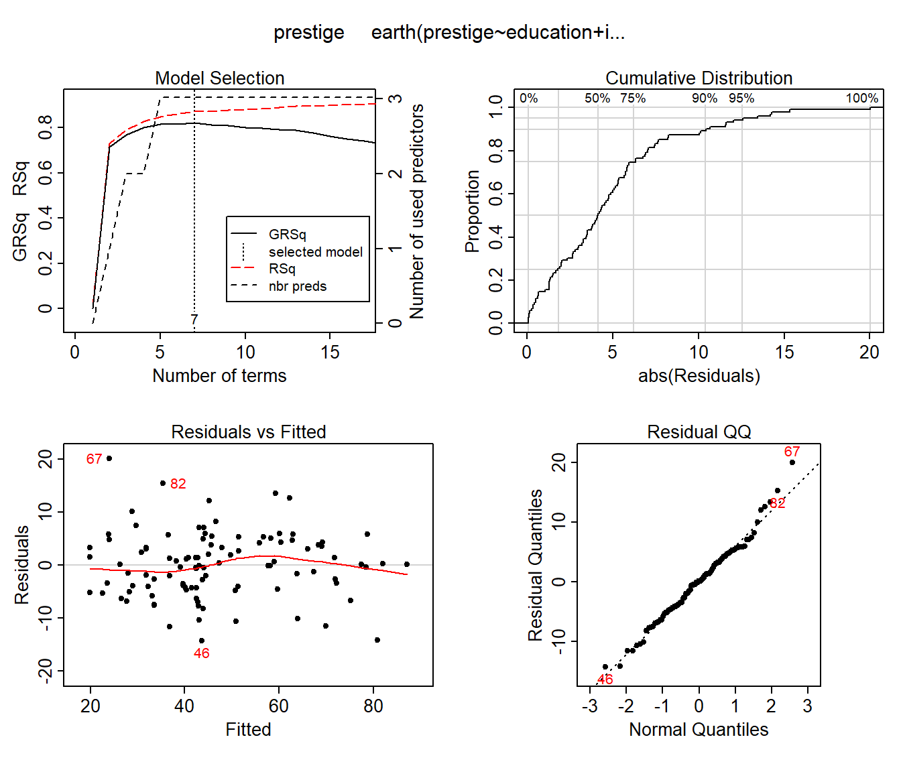

Para representar los efectos de las variables utiliza el paquete `plotmo` (válido también para la mayoría de los modelos tratados en este libro, incluyendo `mgcv::gam()`)


```r
plotmo(mars)
```

```
##  plotmo grid:    education income women
##                      10.54   5930  13.6
```

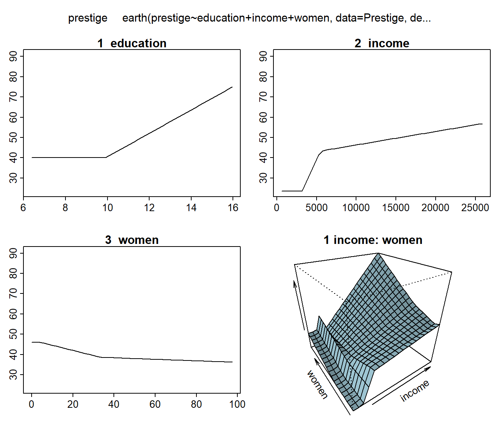

Podríamos obtener la importancia de las variables:


```r
varimp <- evimp(mars)
varimp
```

```
##           nsubsets   gcv    rss
## education        6 100.0  100.0
## income           5  36.0   40.3
## women            3  16.3   22.0
```

```r
plot(varimp)
```

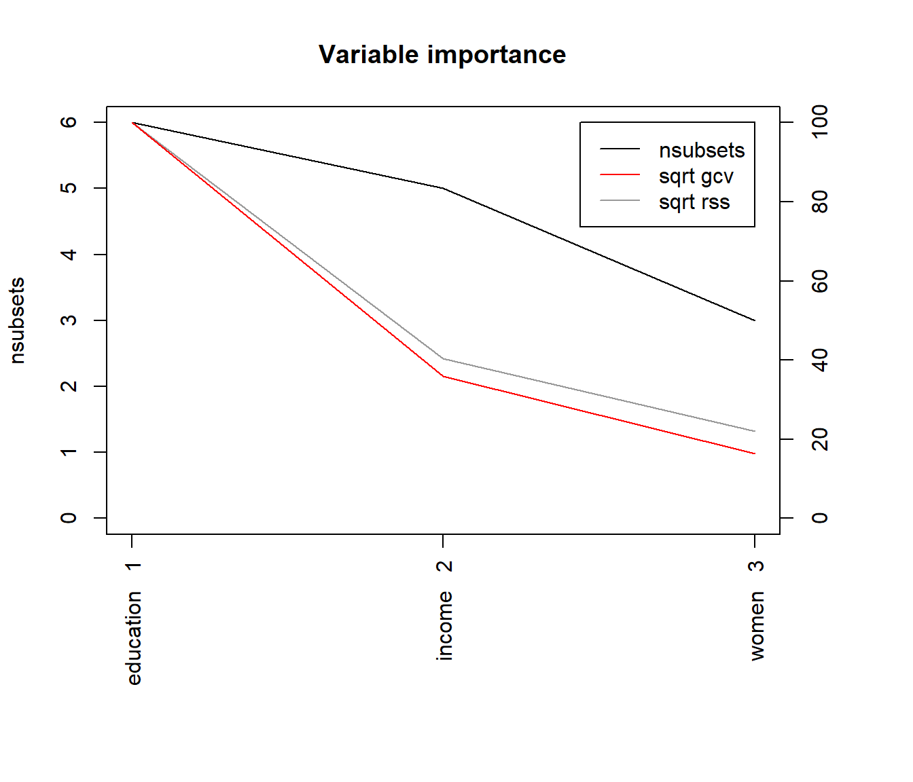

Siempre podríamos considerar este modelo de partida para seleccionar componentes de un modelo GAM más flexible:


```r
# library(mgcv)
gam <- gam(prestige ~ s(education) + s(income) + s(women), data = Prestige, select = TRUE)
summary(gam)
```

```
## 
## Family: gaussian 
## Link function: identity 
## 
## Formula:
## prestige ~ s(education) + s(income) + s(women)
## 
## Parametric coefficients:
##             Estimate Std. Error t value Pr(>|t|)    
## (Intercept)  46.8333     0.6461   72.49   <2e-16 ***
## ---
## Signif. codes:  0 '***' 0.001 '**' 0.01 '*' 0.05 '.' 0.1 ' ' 1
## 
## Approximate significance of smooth terms:
##                edf Ref.df     F  p-value    
## s(education) 2.349      9 9.926  < 2e-16 ***
## s(income)    6.289      9 7.420 7.44e-11 ***
## s(women)     1.964      9 1.309  0.00143 ** 
## ---
## Signif. codes:  0 '***' 0.001 '**' 0.01 '*' 0.05 '.' 0.1 ' ' 1
## 
## R-sq.(adj) =  0.856   Deviance explained = 87.1%
## GCV = 48.046  Scale est. = 42.58     n = 102
```

```r
gam2 <- gam(prestige ~ s(education) + s(income, women), data = Prestige)
summary(gam2)
```

```
## 
## Family: gaussian 
## Link function: identity 
## 
## Formula:
## prestige ~ s(education) + s(income, women)
## 
## Parametric coefficients:
##             Estimate Std. Error t value Pr(>|t|)    
## (Intercept)   46.833      0.679   68.97   <2e-16 ***
## ---
## Signif. codes:  0 '***' 0.001 '**' 0.01 '*' 0.05 '.' 0.1 ' ' 1
## 
## Approximate significance of smooth terms:
##                   edf Ref.df     F  p-value    
## s(education)    2.802  3.489 25.09 9.30e-14 ***
## s(income,women) 4.895  6.286 10.03 4.41e-09 ***
## ---
## Signif. codes:  0 '***' 0.001 '**' 0.01 '*' 0.05 '.' 0.1 ' ' 1
## 
## R-sq.(adj) =  0.841   Deviance explained = 85.3%
## GCV = 51.416  Scale est. = 47.032    n = 102
```

```r
anova(gam, gam2, test="F")
```

```
## Analysis of Deviance Table
## 
## Model 1: prestige ~ s(education) + s(income) + s(women)
## Model 2: prestige ~ s(education) + s(income, women)
##   Resid. Df Resid. Dev      Df Deviance      F  Pr(>F)   
## 1    88.325     3849.1                                   
## 2    91.225     4388.3 -2.9001  -539.16 4.3661 0.00705 **
## ---
## Signif. codes:  0 '***' 0.001 '**' 0.01 '*' 0.05 '.' 0.1 ' ' 1
```

```r
plotmo(gam2)
```

```
##  plotmo grid:    education income women
##                      10.54   5930  13.6
```

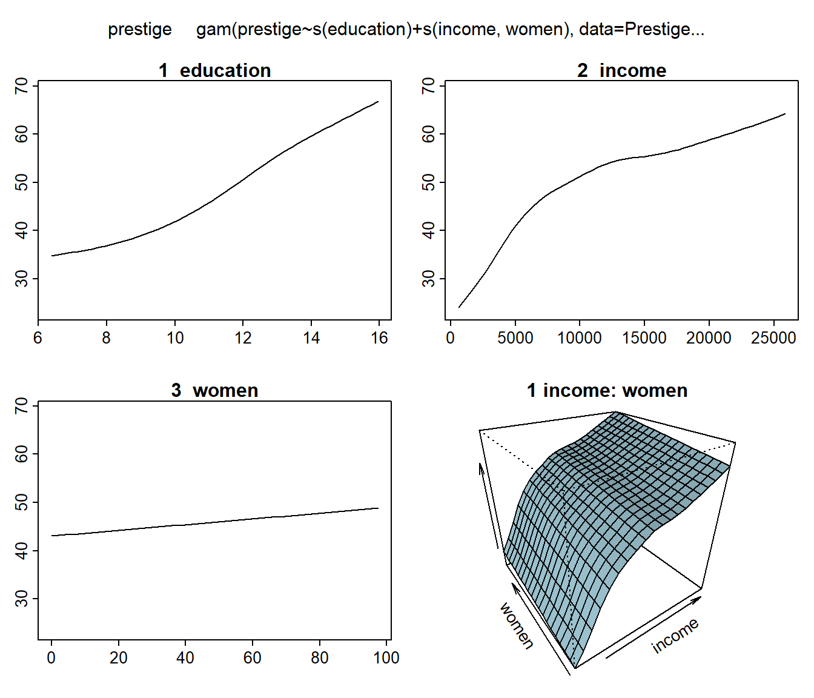

```r
plot(gam2, scheme = 2, select = 2)
```

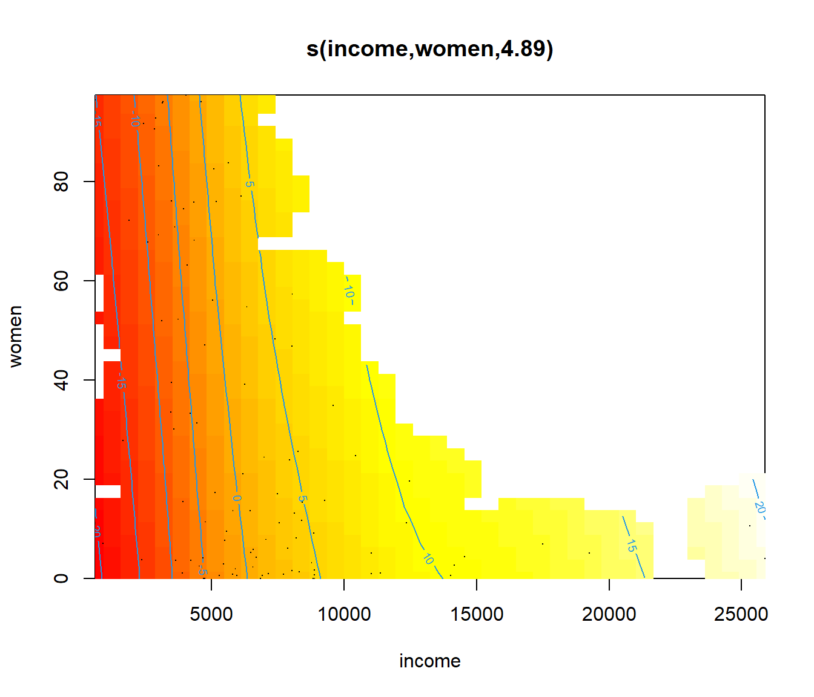


### MARS con el paquete `caret`

Emplearemos como ejemplo el conjunto de datos `earth::Ozone1`:


```r
# data(ozone1, package = "earth")
df <- ozone1  
set.seed(1)
nobs <- nrow(df)
itrain <- sample(nobs, 0.8 * nobs)
train <- df[itrain, ]
test <- df[-itrain, ]
```

`caret` implementa varios métodos basados en `earth`:


```r
library(caret)
# names(getModelInfo("[Ee]arth")) # 4 métodos
modelLookup("earth")
```

```
##   model parameter          label forReg forClass probModel
## 1 earth    nprune         #Terms   TRUE     TRUE      TRUE
## 2 earth    degree Product Degree   TRUE     TRUE      TRUE
```

Consideramos una rejilla de búsqueda personalizada:


```r
tuneGrid <- expand.grid(degree = 1:2, 
                       nprune = floor(seq(2, 20, len = 10)))
set.seed(1)
caret.mars <- train(O3 ~ ., data = train, method = "earth",
    trControl = trainControl(method = "cv", number = 10),
    tuneGrid = tuneGrid)
caret.mars
```

```
## Multivariate Adaptive Regression Spline 
## 
## 264 samples
##   9 predictor
## 
## No pre-processing
## Resampling: Cross-Validated (10 fold) 
## Summary of sample sizes: 238, 238, 238, 236, 237, 239, ... 
## Resampling results across tuning parameters:
## 
##   degree  nprune  RMSE      Rsquared   MAE     
##   1        2      4.842924  0.6366661  3.803870
##   1        4      4.558953  0.6834467  3.488040
##   1        6      4.345781  0.7142046  3.413213
##   1        8      4.256592  0.7295113  3.220256
##   1       10      4.158604  0.7436812  3.181941
##   1       12      4.128416  0.7509562  3.142176
##   1       14      4.069714  0.7600561  3.061458
##   1       16      4.058769  0.7609245  3.058843
##   1       18      4.058769  0.7609245  3.058843
##   1       20      4.058769  0.7609245  3.058843
##   2        2      4.842924  0.6366661  3.803870
##   2        4      4.652783  0.6725979  3.540031
##   2        6      4.462122  0.7039134  3.394627
##   2        8      4.188539  0.7358147  3.209399
##   2       10      3.953353  0.7658754  2.988747
##   2       12      4.028546  0.7587781  3.040408
##   2       14      4.084860  0.7514781  3.076990
##   2       16      4.091340  0.7510666  3.081559
##   2       18      4.091340  0.7510666  3.081559
##   2       20      4.091340  0.7510666  3.081559
## 
## RMSE was used to select the optimal model using the smallest value.
## The final values used for the model were nprune = 10 and degree = 2.
```

```r
ggplot(caret.mars, highlight = TRUE)
```

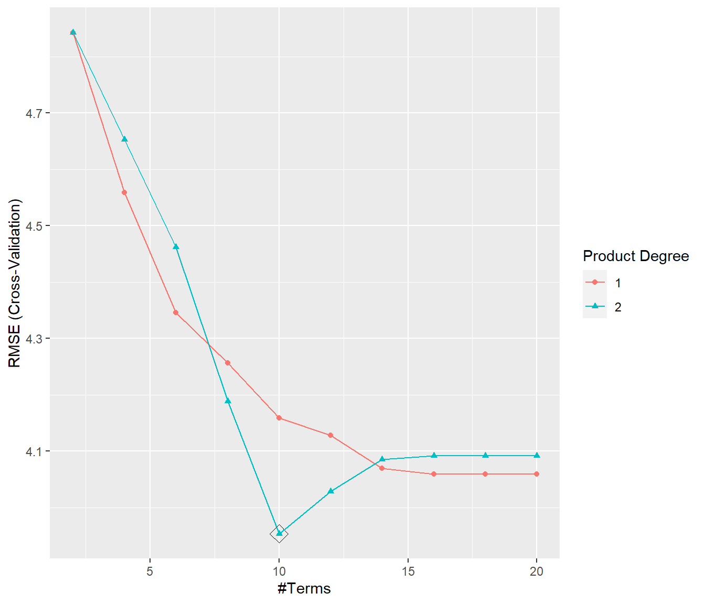

Podemos analizar el modelo final con las herramientas de `earth`:


```r
summary(caret.mars$finalModel)
```

```
## Call: earth(x=matrix[264,9], y=c(4,13,16,3,6,2...), keepxy=TRUE, degree=2,
##             nprune=10)
## 
##                             coefficients
## (Intercept)                   11.6481994
## h(dpg-15)                     -0.0743900
## h(ibt-110)                     0.1224848
## h(17-vis)                     -0.3363332
## h(vis-17)                     -0.0110360
## h(101-doy)                    -0.1041604
## h(doy-101)                    -0.0236813
## h(wind-3) * h(1046-ibh)       -0.0023406
## h(humidity-52) * h(15-dpg)    -0.0047940
## h(60-humidity) * h(ibt-110)   -0.0027632
## 
## Selected 10 of 21 terms, and 7 of 9 predictors
## Termination condition: Reached nk 21
## Importance: humidity, ibt, dpg, doy, wind, ibh, vis, temp-unused, ...
## Number of terms at each degree of interaction: 1 6 3
## GCV 13.84161    RSS 3032.585    GRSq 0.7846289    RSq 0.8199031
```

```r
# plotmo(caret.mars$finalModel, caption = 'ozone$O3 (caret "earth" method)')
plotmo(caret.mars$finalModel, degree2 = 0, caption = 'ozone$O3 (efectos principales)')
```

```
##  plotmo grid:    vh wind humidity temp    ibh dpg   ibt vis   doy
##                5770    5     64.5   62 2046.5  24 169.5 100 213.5
```


```r
plotmo(caret.mars$finalModel, degree1 = 0, caption = 'ozone$O3 (interacciones)')
```

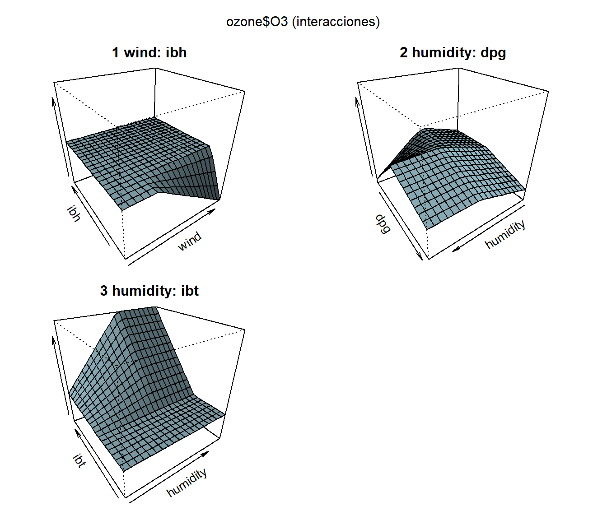

Finalmente medimos la precisión con el procedimiento habitual:


```r
pred <- predict(caret.mars, newdata = test)
accuracy(pred, test$O3)
```

```
##          me        rmse         mae         mpe        mape   r.squared 
##   0.4817913   4.0952444   3.0764376 -14.1288949  41.2602037   0.7408061
```


## Projection pursuit

**En preparación...**


