# Regresión no paramétrica {#reg-np}

<!-- Capítulo \@ref(reg-np) -->


<!-- 
---
title: "Regresión no paramétrica"
author: "Aprendizaje estadístico (UDC)"
date: "Máster en Técnicas Estadísticas"
bibliography: ["packages.bib", "aprendizaje_estadistico.bib"]
link-citations: yes
output: 
  bookdown::pdf_document2:
    keep_tex: yes
    toc: yes 
  bookdown::html_document2:
    pandoc_args: ["--number-offset", "5,0"]
    toc: yes
    toc_depth: 3
    toc_float:
      collapsed: no
      smooth_scroll: no    
    # mathjax: local            # copia local de MathJax
    # self_contained: false     # dependencias en ficheros externos
header-includes:
- \setcounter{section}{6}
---

bookdown::preview_chapter("07-regresion_np.Rmd")
knitr::purl("07-regresion_np.Rmd", documentation = 2)
knitr::spin("07-regresion_np.R",knit = FALSE)
-->

Bajo la denominación *regresión no paramétrica* se incluyen todos aquellos métodos que no presuponen ninguna forma concreta de la media condicional (*i.&nbsp;e.* no se hacen suposiciones paramétricas sobre el efecto de las variables explicativas):
$$Y=m\left( X_1, \ldots,  X_p \right) + \varepsilon$$
siendo $m$ una función "cualquiera" (se asume que es una función "suave" de los predictores).

La idea detrás de la mayoría de estos métodos consiste en ajustar localmente un modelo de regresión (este capítulo se podría haber titulado *modelos locales*): suponiendo que disponemos de "suficiente" información en un entorno de la posición de predicción (para lo cual el número de observaciones debe ser relativamente grande), el objetivo es predecir la respuesta a partir de lo que ocurre en las observaciones cercanas.

En este capítulo nos centraremos principalmente en el caso de regresión, aunque la mayoría de los métodos no paramétricos se pueden extender para el caso de clasificación. Para ello se podría, por ejemplo, considerar una función de enlace y realizar el ajuste localmente utilizando máxima verosimilitud.

Los métodos de regresión basados en árboles de decisión, bosques aleatorios, *bagging*, *boosting* y máquinas de soporte vectorial, vistos en capítulos anteriores, entrarían también dentro de la categoría de métodos no paramétricos.


## Regresión local {#reg-local}

Los métodos de *regresión local* incluyen: vecinos más próximos, regresión tipo núcleo y *loess* (o *lowess*).
También se podrían incluir los *splines* de regresión (*regression splines*), pero los trataremos en la siguiente sección, ya que también se pueden ver como una extensión de un modelo lineal global.

Con la mayoría de estos procedimientos no se obtiene una expresión cerrada del modelo ajustado y, en principio, es necesario disponer de la muestra de entrenamiento para poder realizar las predicciones. Por esta razón, en aprendizaje estadístico también se les denomina *métodos basados en memoria*.


### Vecinos más próximos {#reg-knn}

Uno de los métodos más conocidos de regresión local es el denominado *k-vecinos más cercanos* (*k-nearest neighbors*; KNN), que ya se empleó como ejemplo en la Sección \@ref(dimen-curse), dedicada a la maldición de la dimensionalidad. 
Aunque se trata de un método muy simple, en la práctica puede resultar efectivo en numerosas ocasiones. 
Se basa en la idea de que, localmente, la media condicional (la predicción óptima) es constante.
Concretamente, dados un entero $k$ (hiperparámetro) y un conjunto de entrenamiento $\mathcal{T}$, para obtener la predicción correspondiente a un vector de valores de las variables explicativas $\mathbf{x}$, el método de regresión KNN promedia las observaciones en un vecindario $\mathcal{N}_k(\mathbf{x}, \mathcal{T})$ formado por las $k$ observaciones más cercanas a $\mathbf{x}$: 
$$\hat{Y}(\mathbf{x}) = \hat{m}(\mathbf{x}) = \frac{1}{k} \sum_{i \in \mathcal{N}_k(\mathbf{x}, \mathcal{T})} Y_i$$ 
Se puede emplear la misma idea en el caso de clasificación: las frecuencias relativas en el vecindario serían las estimaciones de las probabilidades de las clases (lo que sería equivalente a considerar las variables indicadoras de las categorías) y, por lo general, la predicción se haría utilizando la moda (es decir, la clase más probable).

Para seleccionar el vecindario es necesario especificar una distancia, por ejemplo:
$$d(\mathbf{x}_0, \mathbf{x}_i) = \left( \sum_{j=1}^p \left| x_{j0} - x_{ji}  \right|^d  \right)^{\frac{1}{d}}$$
Normalmente, si los predictores son muméricos se considera la distancia euclídea ($d=2$) o la de Manhattan ($d=1$) (también existen distancias diseñadas para predictores categóricos).
En todos los casos se recomienda estandarizar previamente los predictores para que su escala no influya en el cálculo de las distancias.

Como ya se indicó previamente, este método está implementado en la función `knnreg()` (Sección \@ref(dimen-curse)) y en el método `"knn"` del paquete `caret` (Sección \@ref(caret)).
Como ejemplo adicional, emplearemos el conjunto de datos `MASS::mcycle`, que contiene mediciones de la aceleración de la cabeza en una simulación de un accidente de motocicleta, utilizado para probar cascos protectores. Consideraremos el conjunto de datos completo como si fuese la muestra de entrenamiento (ver Figura \@ref(fig:np-knnfit)):


``` r
data(mcycle, package = "MASS")
library(caret)
# Ajuste de los modelos
fit1 <- knnreg(accel ~ times, data = mcycle, k = 5) # 5% de los datos
fit2 <- knnreg(accel ~ times, data = mcycle, k = 10)
fit3 <- knnreg(accel ~ times, data = mcycle, k = 20)
# Representación
plot(accel ~ times, data = mcycle, col = 'darkgray') 
newx <- seq(1 , 60, len = 200)
newdata <- data.frame(times = newx)
lines(newx, predict(fit1, newdata), lty = 3)
lines(newx, predict(fit2, newdata), lty = 2)
lines(newx, predict(fit3, newdata))
legend("topright", legend = c("5-NN", "10-NN", "20-NN"), 
       lty = c(3, 2, 1), lwd = 1)
```

<div class="figure" style="text-align: center">
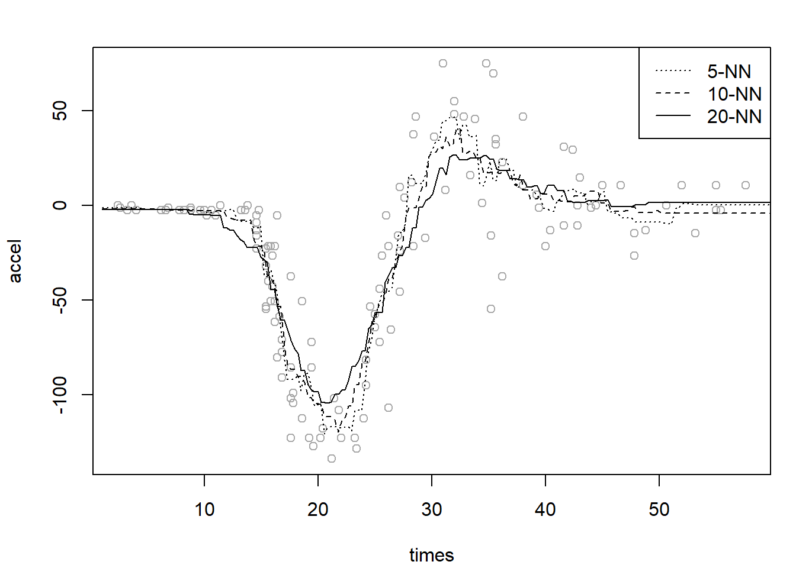
<p class="caption">(\#fig:np-knnfit)Predicciones con el método KNN y distintos vecindarios.</p>
</div>

El hiperparámetro $k$ (número de vecinos más próximos) determina la complejidad del modelo, de forma que valores más pequeños de $k$ se corresponden con modelos más complejos (en el caso extremo $k = 1$ se interpolarían las observaciones).
Este parámetro se puede seleccionar empleando alguno de los métodos descritos en la Sección \@ref(cv) (por ejemplo, mediante validación cruzada, como se mostró en la Sección \@ref(caret); ver Ejercicio \@ref(exr:knn-1)). 


El método de los vecinos más próximos también se puede utilizar, de forma análoga, para problemas de clasificación. 
En este caso obtendríamos estimaciones de las probabilidades de cada categoría:
$$\hat{p}_j(\mathbf{x}) = \frac{1}{k} \sum_{i \in \mathcal{N}_k(\mathbf{x}, \mathcal{T})} \mathcal I (y_i = j)$$ 
A partir de las cuales obtenemos la predicción de la respuesta categórica, como la categoría con mayor probabilidad estimada (ver Ejercicio \@ref(exr:knn-multinom)).


::: {.exercise #knn-1}

Repite el ajuste anterior, usando `knnreg()`, seleccionando el número de `k` vecinos mediante validación cruzada dejando uno fuera y empleando el mínimo error absoluto medio como criterio.
Se puede utilizar como referencia el código de la Sección \@ref(cv). 

:::


::: {.exercise #knn-multinom}

En la Sección \@ref(eval-class) se utilizó el conjunto de datos `iris` como ejemplo de un problema de clasificación multiclase, con el objetivo de clasificar tres especies de lirio (`Species`) a partir de las dimensiones de los sépalos y pétalos de sus flores.
Retomando ese ejemplo, realiza esta clasificación empleando el método `knn` de `caret`.
Considerando el 80&#8239;% de las observaciones como muestra de aprendizaje y el 20&#8239;% restante como muestra de test, selecciona el número de vecinos mediante validación cruzada con 10 grupos, empleando el criterio de un error estándar de Breiman.
Finalmente, evalúa la eficiencia de las predicciones en la muestra de test.

:::


### Regresión polinómica local {#reg-locpol}

La regresión polinómica local univariante consiste en ajustar, por mínimos cuadrados ponderados, un polinomio de grado $d$ para cada $x_0$:
$$\beta_0+\beta_{1}\left(x - x_0\right) + \cdots 
+ \beta_{d}\left( x-x_0\right)^{d}$$ 
con pesos
$$w_{i} = K_h(x - x_0) = \frac{1}{h}K\left(\frac{x-x_0}{h}\right)$$
donde $K$ es una función núcleo (habitualmente una función de densidad simétrica en torno a cero) y $h>0$ es un parámetro de suavizado, llamado ventana, que regula el tamaño del entorno que se usa para llevar a cabo el ajuste.
En la expresión anterior se está considerando una ventana global, la misma para todos puntos, pero también se puede emplear una ventana local, $h \equiv h(x_0)$.
Por ejemplo, el método KNN se puede considerar un caso particular, con ventana local, $d=0$ (se ajusta una constante) y núcleo $K$ uniforme, la función de densidad de una distribución $\mathcal{U}(-1, 1)$. 
Como resultado de los ajustes locales obtenemos la estimación en $x_0$: 
$$\hat{m}_{h}(x_0)=\hat{\beta}_0$$
y también podríamos obtener estimaciones de las derivadas 
$\widehat{m_{h}^{(r)}}(x_0) = r!\hat{\beta}_{r}$.

Por tanto, la estimación polinómica local de grado $d$, $\hat{m}_{h}(x)=\hat{\beta}_0$, se obtiene al minimizar:
$$\min_{\beta_0 ,\beta_1, \ldots, \beta_d} \sum_{i=1}^{n}\left\{ Y_{i} - \beta_0 
- \beta_1(x - X_i) - \ldots -\beta_d(x - X_i)^d \right\}^{2} K_{h}(x - X_i)$$ 

Explícitamente:
$$\hat{m}_{h}(x) = \mathbf{e}_{1}^{t} \left(
X_{x}^{t} {W}_{x} 
X_{x} \right)^{-1} X_{x}^{t} 
{W}_{x}\mathbf{Y} \equiv {s}_{x}^{t}\mathbf{Y}$$
donde $\mathbf{e}_{1} = \left( 1, \cdots, 0\right)^{t}$, $X_{x}$ 
es la matriz con $(1,x - X_i, \ldots, (x - X_i)^d)$ en la fila $i$,
$W_{x} = \mathtt{diag} \left( K_{h}(x_{1} - x), \ldots, K_{h}(x_{n} - x) \right)$
es la matriz de pesos, e $\mathbf{Y} = \left( Y_1, \cdots, Y_n\right)^{t}$ es el vector de observaciones de la respuesta.

Se puede pensar que la estimación anterior se obtiene aplicando un suavizado polinómico a 
$(X_i, Y_i)$:
$$\hat{\mathbf{Y}} = S\mathbf{Y}$$ 
siendo $S$ la matriz de suavizado con $\mathbf{s}_{X_{i}}^{t}$ en la fila $i$ (este tipo de métodos también se denominan *suavizadores lineales*).

En lo que respecta a la selección del grado $d$ del polinomio, lo más habitual es utilizar el estimador de Nadaraya-Watson ($d=0$) o el estimador lineal local ($d=1$).
Desde el punto de vista asintótico, ambos estimadores tienen un comportamiento similar^[Asintóticamente el estimador lineal local tiene un sesgo menor que el de Nadaraya-Watson (pero del mismo orden) y la misma varianza (p.&nbsp;ej. @fan1996).], pero en la práctica suele ser preferible el estimador lineal local, sobre todo porque se ve menos afectado por el denominado efecto frontera (Sección \@ref(dimen-curse)).

La ventana $h$ es el hiperparámetro de mayor importancia en la predicción y para su selección se suelen emplear métodos de validación cruzada (Sección \@ref(cv)) o tipo *plug-in* [@ruppert1995effective]. 
En este último caso, se reemplazan las funciones desconocidas que aparecen en la expresión de la ventana asintóticamente óptima por estimaciones (p.&nbsp;ej. función `dpill()` del paquete `KernSmooth`).
Así, usando el criterio de validación cruzada dejando uno fuera (LOOCV), se trataría de minimizar:
$$CV(h)=\frac{1}{n}\sum_{i=1}^n(y_i-\hat{m}_{-i}(x_i))^2$$
siendo $\hat{m}_{-i}(x_i)$ la predicción obtenida eliminando la observación $i$-ésima.
Al igual que en el caso de regresión lineal, este error también se puede obtener a partir del ajuste con todos los datos:
$$CV(h)=\frac{1}{n}\sum_{i=1}^n\left(\frac{y_i-\hat{m}(x_i)}{1 - S_{ii}}\right)^2$$
siendo $S_{ii}$ el elemento $i$-ésimo de la diagonal de la matriz de suavizado (esto en general es cierto para cualquier suavizador lineal).

Alternativamente, se podría emplear *validación cruzada generalizada* [@craven1978smoothing], sin más que sustituir $S_{ii}$ por su promedio:
$$GCV(h)=\frac{1}{n}\sum_{i=1}^n\left(\frac{y_i-\hat{m}(x_i)}{1 - \frac{1}{n}tr(S)}\right)^2$$
La traza de la matriz de suavizado, $tr(S)$, se conoce como el *número efectivo de parámetros* y, para aproximar los grados de libertad del error, se utiliza ($n - tr(S)$.

Aunque el paquete base de `R` incluye herramientas para la estimación tipo núcleo de la regresión (`ksmooth()`, `loess()`), se recomienda el uso del paquete `KernSmooth` [@R-KernSmooth]. 

Continuando con el ejemplo del conjunto de datos `MASS::mcycle`, emplearemos la función `locpoly()` del paquete `KernSmooth` para obtener estimaciones lineales locales^[La función `KernSmooth::locpoly()` también admite la estimación de derivadas.] con una ventana seleccionada mediante un método plug-in (ver Figura \@ref(fig:llr-fit)):


``` r
# data(mcycle, package = "MASS")
times <- mcycle$times
accel <- mcycle$accel  
library(KernSmooth)
h <- dpill(times, accel) # Método plug-in
fit <- locpoly(times, accel, bandwidth = h) # Estimación lineal local
plot(times, accel, col = 'darkgray')
lines(fit)
```

<div class="figure" style="text-align: center">

<p class="caption">(\#fig:llr-fit)Ajuste lineal local con ventana plug-in.</p>
</div>

Hay que tener en cuenta que el paquete `KernSmooth` no implementa los métodos `predict()` y `residuals()`. 
El resultado del ajuste es una rejilla con las predicciones y podríamos emplear interpolación para calcular predicciones en otras posiciones:


``` r
pred <- approx(fit, xout = times)$y 
resid <- accel - pred 
```

Tampoco calcula medidas de bondad de ajuste, aunque podríamos calcular medidas de la precisión de las predicciones de la forma habitual (en este caso de la muestra de entrenamiento):


``` r
accuracy(pred, accel)
```

```
##          me        rmse         mae         mpe        mape   r.squared 
## -2.7124e-01  2.1400e+01  1.5659e+01 -2.4608e+10  7.5592e+10  8.0239e-01
```

La regresión polinómica local multivariante es análoga a la univariante, aunque en este caso habría que considerar una matriz de ventanas simétrica $H$. También hay extensiones para el caso de predictores categóricos (nominales o ordinales) y para el caso de distribuciones de la respuesta distintas de la normal (máxima verosimilitud local).

Otros paquetes de `R` incluyen más funcionalidades (`sm`, `locfit`, [`npsp`](https://rubenfcasal.github.io/npsp)...), pero hoy en día el paquete [`np`](https://github.com/JeffreyRacine/R-Package-np) [@R-np] es el que se podría considerar más completo.


### Regresión polinómica local robusta

Se han desarrollado variantes robustas del ajuste polinómico local tipo núcleo.
Estos métodos surgieron en el caso bivariante ($p=1$), por lo que también se denominan *suavizado de diagramas de dispersión* (*scatterplot smoothing*; p.&nbsp;ej. la función `lowess()` del paquete base de `R`, acrónimo de *locally weighted scatterplot smoothing*).
Posteriormente se extendieron al caso multivariante (p.&nbsp;ej. la función `loess()`).
Son métodos muy empleados en análisis descriptivo (no supervisado) y normalmente se emplean ventanas locales tipo vecinos más cercanos (por ejemplo a través de un parámetro `span` que determina la proporción de observaciones empleadas en el ajuste).

Como ejemplo continuaremos con el conjunto de datos `MASS::mcycle` y emplearemos la función `loess()` para realizar un ajuste robusto. 
Será necesario establecer `family = "symmetric"` para emplear M-estimadores, por defecto con 4 iteraciones, en lugar de mínimos cuadrados ponderados. 
Previamente, seleccionaremos el parámetro `span` por validación cruzada (LOOCV), pero empleando como criterio de error la mediana de los errores en valor absoluto (*median absolute deviation*, MAD)^[En este caso hay dependencia entre las observaciones y los criterios habituales, como validación cruzada, tienden a seleccionar ventanas pequeñas, *i.&nbsp;e.* a infrasuavizar.] (ver Figura \@ref(fig:loess-cv)).


``` r
# Función que calcula las predicciones LOOCV
cv.loess <- function(formula, datos, span, ...) {
  n <- nrow(datos)
  cv.pred <- numeric(n)
  for (i in 1:n) {
    modelo <- loess(formula, datos[-i, ], span = span, 
                    control = loess.control(surface = "direct"), ...)
    # loess.control(surface = "direct") permite extrapolaciones
    cv.pred[i] <- predict(modelo, newdata = datos[i, ])
  }
  return(cv.pred)
}
# Búsqueda valor óptimo
ventanas <- seq(0.1, 0.5, len = 10)
np <- length(ventanas)
cv.error <- numeric(np)
for(p in 1:np){
  cv.pred <- cv.loess(accel ~ times, mcycle, ventanas[p], 
                      family = "symmetric")
  # cv.error[p] <- mean((cv.pred - mcycle$accel)^2)
  cv.error[p] <- median(abs(cv.pred - mcycle$accel))
}
imin <- which.min(cv.error)
span.cv <- ventanas[imin]
# Representación
plot(ventanas, cv.error)
points(span.cv, cv.error[imin], pch = 16)
```

<div class="figure" style="text-align: center">

<p class="caption">(\#fig:loess-cv)Error de predicción de validación cruzada (mediana de los errores absolutos) del ajuste LOWESS dependiendo del parámetro de suavizado.</p>
</div>

Empleamos el parámetro de suavizado seleccionado para ajustar el modelo final (ver Figura \@ref(fig:loess-fit)):


``` r
# Ajuste con todos los datos
plot(accel ~ times, data = mcycle, col = 'darkgray')
fit <- loess(accel ~ times, mcycle, span = span.cv, family = "symmetric")
lines(mcycle$times, predict(fit))
```

<div class="figure" style="text-align: center">

<p class="caption">(\#fig:loess-fit)Ajuste polinómico local robusto (LOWESS), con el parámetro de suavizado seleccionado mediante validación cruzada.</p>
</div>


## Splines {#splines}

Un enfoque alternativo a los métodos de regresión local de la sección anterior consiste en trocear los datos en intervalos: se fijan unos puntos de corte $z_i$, denominados nudos (*knots*), con $i = 1, \ldots, k$, y se ajusta un polinomio en cada segmento, lo que se conoce como regresión segmentada (*piecewise regression*; ver Figura \@ref(fig:rsegmentada-fit)).
Un inconveniente de este método es que da lugar a discontinuidades en los puntos de corte, aunque pueden añadirse restricciones adicionales de continuidad (o incluso de diferenciabilidad) para evitarlo [p.&nbsp;ej. paquete [`segmented`](https://CRAN.R-project.org/package=segmented), @R-segmented].

<div class="figure" style="text-align: center">
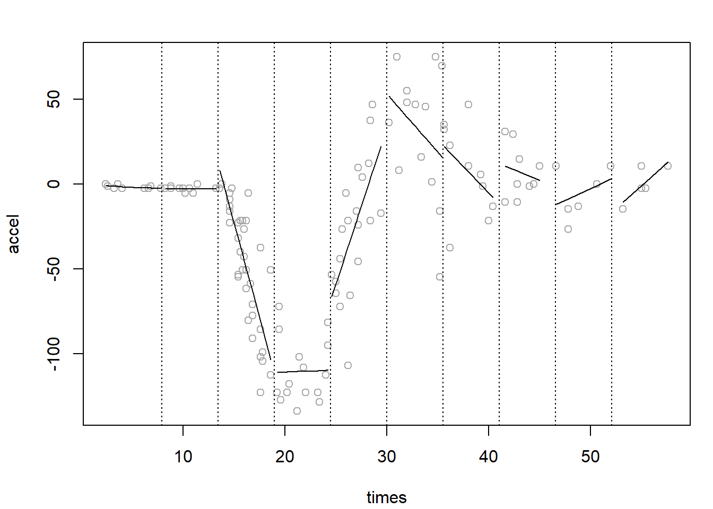
<p class="caption">(\#fig:rsegmentada-fit)Estimación mediante regresión segmentada.</p>
</div>


### Splines de regresión {#reg-splines}

Cuando en cada intervalo se ajustan polinomios de orden $d$ y se incluyen restricciones de forma que las derivadas sean continuas hasta el orden $d-1$, se obtienen los denominados *splines de regresión* (*regression splines*).
Puede verse que este tipo de ajustes equivalen a transformar la variable predictora $X$, considerando por ejemplo la *base de potencias truncadas* (*truncated power basis*):
$$1, x, \ldots, x^d, (x-z_1)_+^d,\ldots,(x-z_k)_+^d$$
siendo $(x - z)_+ = \max(0, x - z)$, y posteriormente realizar un ajuste lineal:
$$m(x) = \beta_0 + \beta_1 b_1(x) +  \beta_2 b_2(x) + \ldots  + \beta_{k+d} b_{k+d}(x)$$

Típicamente se seleccionan polinomios de grado $d=3$, lo que se conoce como splines cúbicos, y nodos equiespaciados.
Además, se podrían emplear otras bases equivalentes. 
Por ejemplo, para evitar posibles problemas computacionales con la base anterior, se suele emplear la denominada base $B$-*spline* [@de1978practical], implementada en la función `bs()` del paquete `splines` (ver Figura \@ref(fig:spline-d012)):


``` r
nknots <- 9 # nodos internos; 10 intervalos
knots <- seq(min(times), max(times), len = nknots + 2)[-c(1, nknots + 2)]
library(splines)
fit1 <- lm(accel ~ bs(times, knots = knots, degree = 1))
fit2 <- lm(accel ~ bs(times, knots = knots, degree = 2))
fit3 <- lm(accel ~ bs(times, knots = knots)) # degree = 3
# Representar
plot(times, accel, col = 'darkgray')
newx <- seq(min(times), max(times), len = 200)
newdata <- data.frame(times = newx)
lines(newx, predict(fit1, newdata), lty = 3)
lines(newx, predict(fit2, newdata), lty = 2)
lines(newx, predict(fit3, newdata))
abline(v = knots, lty = 3, col = 'darkgray')
leyenda <- c("d=1 (df=11)", "d=2 (df=12)", "d=3 (df=13)")
legend("topright", legend = leyenda, lty = c(3, 2, 1))
```

<div class="figure" style="text-align: center">

<p class="caption">(\#fig:spline-d012)Ajustes mediante splines de regresión (de grados 1, 2 y 3).</p>
</div>

El grado del polinomio y, sobre todo, el número de nodos, determinarán la flexibilidad del modelo. 
El número de parámetros, $k+d+1$, en el ajuste lineal (los grados de libertad) se puede utilizar como una medida de la complejidad (en la función `bs()` se puede especificar `df` en lugar de `knots`, y estos se generarán a partir de los cuantiles). 

<!-- 
knots <- quantile(times, 1:nknots/(nknots + 1))
bs(times, df = nknots + degree + intercept)
-->

Como se comentó previamente, al aumentar el grado de un modelo polinómico se incrementa la variabilidad de las predicciones, especialmente en la frontera.
Para tratar de evitar este problema se suelen emplear los *splines naturales*, que son splines de regresión con restricciones adicionales de forma que el ajuste sea lineal en los intervalos extremos, lo que en general produce estimaciones más estables en la frontera y mejores extrapolaciones.
Estas restricciones reducen la complejidad (los grados de libertad del modelo), y al igual que en el caso de considerar únicamente las restricciones de continuidad y diferenciabilidad, resultan equivalentes a considerar una nueva base en un ajuste sin restricciones.
Por ejemplo, se puede emplear la función `splines::ns()` para ajustar un spline natural (cúbico por defecto; ver Figura \@ref(fig:spline-ns-bs)): 

(ref:spline-ns-bs) Ajuste mediante splines naturales y $B$-splines."}


``` r
plot(times, accel, col = 'darkgray')
fit4 <- lm(accel ~ ns(times, knots = knots))
lines(newx, predict(fit4, newdata))
lines(newx, predict(fit3, newdata), lty = 2)
abline(v = knots, lty = 3, col = 'darkgray')
leyenda <- c("ns (d=3, df=11)", "bs (d=3, df=13)")
legend("topright", legend = leyenda, lty = c(1, 2))
```

<div class="figure" style="text-align: center">
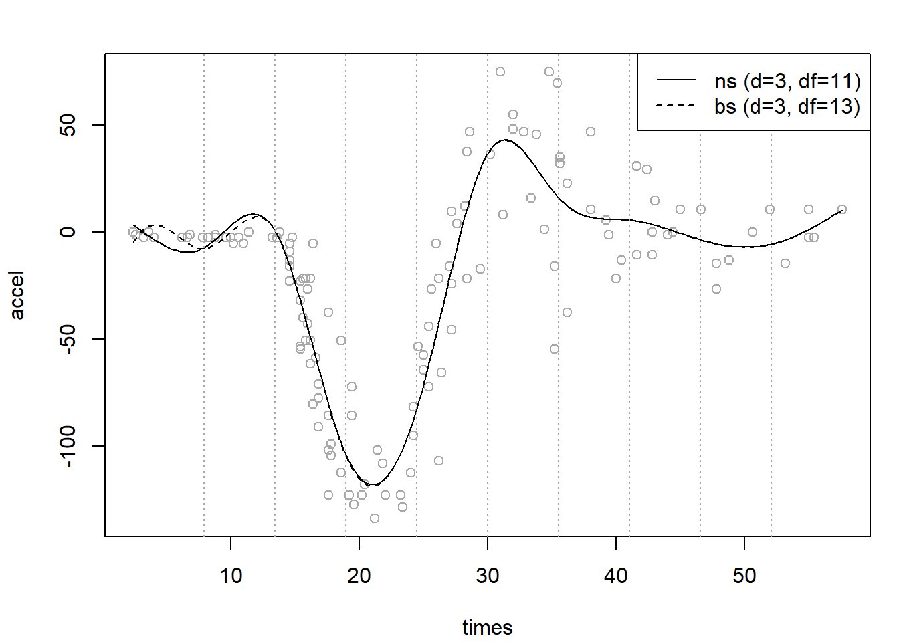
<p class="caption">(\#fig:spline-ns-bs)Ajuste mediante splines naturales (ns) y $B$-splines (bs).</p>
</div>

La dificultad principal es la selección de los nodos $z_i$. Si se consideran equiespaciados (o se emplea otro criterio, como los cuantiles), se puede seleccionar su número (equivalentemente, los grados de libertad) empleando validación cruzada.
Sin embargo, es preferible utilizar más nodos donde aparentemente hay más variaciones en la función de regresión, y menos donde es más estable; esta es la idea de la regresión spline adaptativa, descrita en la Sección \@ref(mars).
Otra alternativa son los splines penalizados, descritos al final de esta sección.


### Splines de suavizado

Los *splines de suavizado* (*smoothing splines*) se obtienen como la función $s(x)$ suave (dos veces diferenciable) que minimiza la suma de cuadrados residual más una penalización que mide su rugosidad:
$$\sum_{i=1}^{n} (y_i - s(x_i))^2  + \lambda \int s^{\prime\prime}(x)^2 dx$$
siendo $0 \leq \lambda < \infty$ el hiperparámetro de suavizado.

Puede verse que la solución a este problema, en el caso univariante, es un spline natural cúbico con nodos en $x_1, \ldots, x_n$ y restricciones en los coeficientes determinadas por el valor de $\lambda$ (es una versión regularizada de un spline natural cúbico).
Por ejemplo, si $\lambda = 0$ se interpolarán las observaciones, y cuando $\lambda \rightarrow \infty$ el ajuste tenderá a una recta (con segunda derivada nula).
En el caso multivariante, $p> 1$, la solución da lugar a los denominados *thin plate splines*[^splines-1].

[^splines-1]: Están relacionados con las funciones radiales. También hay versiones con un número reducido de nodos denominados *low-rank thin plate regression splines*, empleados en el paquete `mgcv`.

Al igual que en el caso de la regresión polinómica local (Sección \@ref(reg-locpol)), estos métodos son suavizadores lineales:
$$\hat{\mathbf{Y}} = S_{\lambda}\mathbf{Y}$$
y para seleccionar el parámetro de suavizado $\lambda$ podemos emplear los criterios de validación cruzada (dejando uno fuera), minimizando:
$$CV(\lambda)=\frac{1}{n}\sum_{i=1}^n\left(\frac{y_i-\hat{s}_{\lambda}(x_i)}{1 - \{ S_{\lambda}\}_{ii}}\right)^2$$
siendo $\{ S_{\lambda}\}_{ii}$ el elemento $i$-ésimo de la diagonal de la matriz de suavizado; 
o validación cruzada generalizada (GCV), minimizando:
$$GCV(\lambda)=\frac{1}{n}\sum_{i=1}^n\left(\frac{y_i-\hat{s}_{\lambda}(x_i)}{1 - \frac{1}{n}tr(S_{\lambda})}\right)^2$$

Análogamente, el número efectivo de parámetros o grados de libertad^[Esto también permitiría generalizar los criterios AIC o BIC.] $df_{\lambda}=tr(S_{\lambda})$ sería una medida de la complejidad del modelo equivalente a $\lambda$ (muchas implementaciones permiten seleccionar la complejidad empleando $df$).

Este método de suavizado está implementado en la función `smooth.spline()` del paquete base. 
Por defecto emplea GCV para seleccionar el parámetro de suavizado, aunque también admite CV y se puede especificar `lambda` o `df` (ver Figura \@ref(fig:spline-smooth)). 
Además de predicciones, el correspondiente método `predict()` también permite obtener estimaciones de las derivadas.


``` r
sspline.gcv <- smooth.spline(times, accel)
sspline.cv <- smooth.spline(times, accel, cv = TRUE)
plot(times, accel, col = 'darkgray')
lines(sspline.gcv)
lines(sspline.cv, lty = 2)
```

<div class="figure" style="text-align: center">

<p class="caption">(\#fig:spline-smooth)Ajuste mediante splines de suavizado, empleando GCV (línea contínua) y CV (línea discontínua) para seleccionar el parámetro de suavizado.</p>
</div>

Cuando el número de observaciones es muy grande, y por tanto el número de nodos, pueden aparecer problemas computacionales al emplear estos métodos.


### Splines penalizados

Los *splines penalizados* (*penalized splines*) combinan las dos aproximaciones anteriores.
Incluyen una penalización que depende de la base considerada, y el número de nodos puede ser mucho menor que el número de observaciones (son un tipo de *low-rank smoothers*). De esta forma, se obtienen modelos spline con mejores propiedades, con un menor efecto frontera y en los que se evitan problemas en la selección de los nodos.
Entre los más utilizados se encuentran los $P$-*splines* [@eilers1996flexible], que emplean una base $B$-spline con una penalización simple basada en los cuadrados de diferencias de coeficientes consecutivos $(\beta_{i+1} - \beta_i)^2$.

Asimismo, un modelo spline penalizado se puede representar como un modelo lineal mixto, lo que permite emplear herramientas desarrolladas para este tipo de modelos; por ejemplo, las implementadas en el paquete `nlme` [@R-nlme], del que depende `mgcv` [@wood2017generalized], que por defecto emplea splines penalizados.
Para más detalles, se recomiendan las secciones 5.2 y 5.3 de @wood2017generalized.

<!-- 
?mgcv::adaptive.smooth 
Wand, M.P. (2003). Smoothing and Mixed Models. *Computational Statistics*, 18(2), 223–249
-->

## Modelos aditivos {#reg-gam}

En los modelos aditivos se supone que:
$$Y= \beta_{0} + f_1(X_1) + f_2(X_2) + \ldots + f_p(X_p)  + \varepsilon$$
siendo $f_{i},$ $i=1,...,p,$ funciones cualesquiera.
De esta forma se consigue mucha mayor flexibilidad que con los modelos lineales, pero manteniendo la interpretabilidad de los efectos de los predictores. 
Adicionalmente, se puede considerar una función de enlace, obteniéndose los denominados *modelos aditivos generalizados* (GAM). Para más detalles sobre estos modelos, ver @hastie1990generalized o @wood2017generalized.

Los modelos lineales (análogamente los modelos lineales generalizados) son un caso particular, considerando $f_{i}(x) = \beta_{i}x$.
Se pueden utilizar cualesquiera de los métodos de suavizado descritos anteriormente para construir las componentes no paramétricas. Así, por ejemplo, si se emplean splines naturales de regresión, el ajuste se reduce al de un modelo lineal.
Se podrían considerar distintas aproximaciones para el modelado de cada componente (modelos semiparamétricos) y realizar el ajuste mediante *backfitting* (se ajusta cada componente de forma iterativa, empleando los residuos obtenidos al mantener las demás fijas).
Si en las componentes no paramétricas se emplean únicamente splines de regresión (con o sin penalización), se puede reformular el modelo como un GLM (regularizado si hay penalización) y ajustarlo fácilmente adaptando herramientas disponibles (*penalized re-weighted iterative least squares*, PIRLS).

De entre los numerosos paquetes de R que implementan estos modelos destacan: 

- `gam`: Admite splines de suavizado (univariantes, `s()`) y regresión polinómica local (multivariante, `lo()`), pero no dispone de un método para la selección automática de los parámetros de suavizado (se podría emplear un criterio por pasos para la selección de componentes).
Sigue la referencia @hastie1990generalized.

- `mgcv`: Admite una gran variedad de splines de regresión y splines penalizados (`s()`; por defecto emplea  *thin plate regression splines* penalizados multivariantes), con la opción de selección automática de los parámetros de suavizado mediante distintos criterios.
Además de que se podría emplear un método por pasos, permite la selección de componentes mediante regularización.
Al ser más completo que el anterior, sería el recomendado en la mayoría de los casos (ver `?mgcv::mgcv.package` para una introducción al paquete).
Sigue la referencia @wood2017generalized.

<!-- 
Entre las diferentes extensiones interesantes a los modelos generalizados, destacamos la que ofrece los modelos mixtos [ver @faraway2016extending, @zuur2009mixed], que cubren una amplia variedad de ajustes como la de efectos aleatorios, modelos multinivel o estructuras de correlaciones. Y dentro de los diferentes paquetes de R, la función `mgcv::gamm()` (que requiere usar el paquete `lme`) permite este tipo de ajustes. 
-->

La función [`gam()`](https://rdrr.io/pkg/mgcv/man/gam.html) del paquete [`mgcv`](https://CRAN.R-project.org/package=mgcv) permite ajustar modelos aditivos generalizados empleando suavizado mediante splines:


``` r
ajuste <- gam(formula, family = gaussian, data, ...)
```

También dispone de la función `bam()` para el ajuste de estos modelos a grandes conjuntos de datos, y de la función `gamm()` para el ajuste de modelos aditivos generalizados mixtos, incluyendo dependencia en los errores. 
El modelo se establece a partir de la `formula` empleando [`s()`](https://rdrr.io/pkg/mgcv/man/s.html) para especificar las componentes "suaves" (ver [`help(s)`](https://rdrr.io/pkg/mgcv/man/s.html) y Sección \@ref(mgcv-diagnosis)).

Algunas posibilidades de uso son las que siguen:

-   Modelo lineal[^reg-gam-1]:
    
    ``` r
    ajuste <- gam(y ~ x1 + x2 + x3)
    ```

-   Modelo (semiparamétrico) aditivo con efectos no paramétricos para `x1` y `x2`, y un efecto lineal para `x3`:
    
    ``` r
    ajuste <- gam(y ~ s(x1) + s(x2) + x3)
    ```

-   Modelo no aditivo (con interacción):
    
    ``` r
    ajuste <- gam(y ~ s(x1, x2))
    ```

-   Modelo (semiparamétrico) con distintas combinaciones :
    
    ``` r
    ajuste <- gam(y ~ s(x1, x2) + s(x3) + x4)
    ```

[^reg-gam-1]: No admite una fórmula del tipo `respuesta ~ .` (producirá un error). Habría que escribir la expresión explícita de la fórmula, por ejemplo con la ayuda de `reformulate()`.


En esta sección utilizaremos como ejemplo el conjunto de datos `Prestige` de la librería `carData`, considerando también el total de las observaciones (solo tiene 102) como si fuese la muestra de entrenamiento. 
Se tratará de explicar `prestige` (puntuación de ocupaciones obtenidas a partir de una encuesta) a partir de `income` (media de ingresos en la ocupación) y `education` (media de los años de educación).


``` r
library(mgcv)
data(Prestige, package = "carData")
modelo <- gam(prestige ~ s(income) + s(education), data = Prestige)
summary(modelo)
```

```
## 
## Family: gaussian 
## Link function: identity 
## 
## Formula:
## prestige ~ s(income) + s(education)
## 
## Parametric coefficients:
##             Estimate Std. Error t value Pr(>|t|)    
## (Intercept)   46.833      0.689      68   <2e-16 ***
## ---
## Signif. codes:  0 '***' 0.001 '**' 0.01 '*' 0.05 '.' 0.1 ' ' 1
## 
## Approximate significance of smooth terms:
##               edf Ref.df    F p-value    
## s(income)    3.12   3.88 14.6  <2e-16 ***
## s(education) 3.18   3.95 38.8  <2e-16 ***
## ---
## Signif. codes:  0 '***' 0.001 '**' 0.01 '*' 0.05 '.' 0.1 ' ' 1
## 
## R-sq.(adj) =  0.836   Deviance explained = 84.7%
## GCV = 52.143  Scale est. = 48.414    n = 102
```

<!-- 
coef(modelo)
El resultado es un modelo lineal en transformaciones de los predictores
-->

En este caso, el método [`plot()`](https://rdrr.io/pkg/mgcv/man/plot.gam.html) representa los efectos (parciales) estimados de cada predictor (ver Figura \@ref(fig:gam-eff)):

(ref:gam-eff) Estimaciones de los efectos parciales de `income` (izquierda) y `education` (derecha).


``` r
plot(modelo, shade = TRUE, pages = 1) # residuals = FALSE por defecto
```

<div class="figure" style="text-align: center">
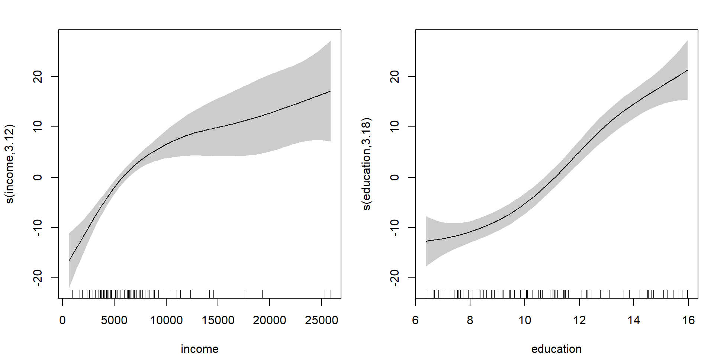
<p class="caption">(\#fig:gam-eff)(ref:gam-eff)</p>
</div>

Por defecto, se representa cada componente no paramétrica (salvo que se especifique `all.terms = TRUE`), incluyendo gráficos de contorno para el caso de componentes bivariantes (correspondientes a interacciones entre predictores).

Se dispone también de un método [`predict()`](https://rdrr.io/pkg/mgcv/man/predict.gam.html) para calcular las predicciones de la forma habitual: por defecto devuelve las correspondientes a las observaciones `modelo$fitted.values`, y para nuevos datos hay que emplear el argumento `newdata`.


### Superficies de predicción

En el caso bivariante, para representar las estimaciones (la superficie de predicción) obtenidas con el modelo se pueden utilizar las funciones [`persp()`](https://rdrr.io/r/graphics/persp.html) o versiones mejoradas como [`plot3D::persp3D()`](https://rdrr.io/pkg/plot3D/man/persp3D.html). 
Estas funciones requieren que los valores de entrada estén dispuestos en una rejilla bidimensional. 
Para generar esta rejilla se puede emplear la función `expand.grid(x,y)` que crea todas las combinaciones de los puntos dados en `x` e `y` (ver Figura \@ref(fig:rejilla-pred)):

(ref:rejilla-pred) Observaciones y rejilla de predicción (para los predictores `education` e `income`). 


``` r
inc <- with(Prestige, seq(min(income), max(income), len = 25))
ed <- with(Prestige, seq(min(education), max(education), len = 25))
newdata <- expand.grid(income = inc, education = ed)
# Representar
plot(income ~ education, Prestige, pch = 16)
abline(h = inc, v = ed, col = "grey")
```

<div class="figure" style="text-align: center">
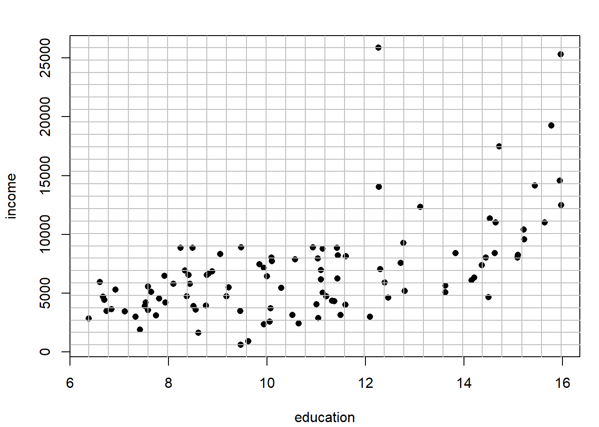
<p class="caption">(\#fig:rejilla-pred)(ref:rejilla-pred)</p>
</div>

A continuación, usamos estos valores para obtener la superficie de predicción, que en este caso representamos con la función [`plot3D::persp3D()`](https://rdrr.io/pkg/plot3D/man/persp3D.html) (ver Figura \@ref(fig:sup-pred)). Alternativamente, se podrían emplear las funciones `contour()`, `filled.contour()`, `plot3D::image2D()` o similares.


``` r
pred <- predict(modelo, newdata)
pred <- matrix(pred, nrow = 25)
plot3D::persp3D(inc, ed, pred, theta = -40, phi = 30, ticktype = "detailed",
                xlab = "Income", ylab = "Education", zlab = "Prestige")
```

<div class="figure" style="text-align: center">
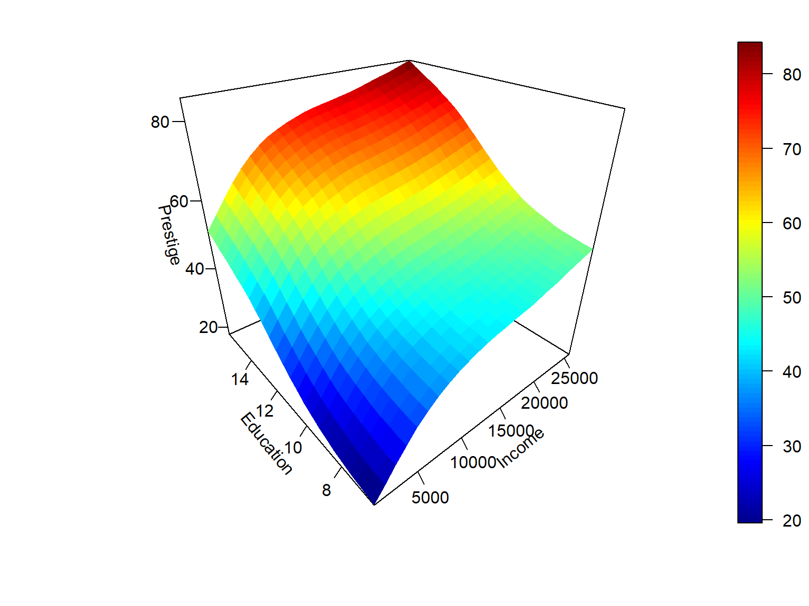
<p class="caption">(\#fig:sup-pred)Superficie de predicción obtenida con el modelo GAM.</p>
</div>


Otra posibilidad, quizás más cómoda, es utilizar el paquete [`modelr`](https://modelr.tidyverse.org), que emplea gráficos `ggplot2`, para trabajar con modelos y predicciones.


### Comparación y selección de modelos {#anova-gam}

Además de las medidas de bondad de ajuste, como el coeficiente de determinación ajustado, también se puede emplear la función `anova()` para la comparación de modelos (y seleccionar las componentes por pasos de forma interactiva).
Por ejemplo, viendo la representación de los efectos (Figura \@ref(fig:gam-eff) anterior) se podría pensar que el efecto de `education` podría ser lineal:


``` r
# plot(modelo)
modelo0 <- gam(prestige ~ s(income) + education, data = Prestige)
summary(modelo0)
```

```
## 
## Family: gaussian 
## Link function: identity 
## 
## Formula:
## prestige ~ s(income) + education
## 
## Parametric coefficients:
##             Estimate Std. Error t value Pr(>|t|)    
## (Intercept)    4.224      3.732    1.13     0.26    
## education      3.968      0.341   11.63   <2e-16 ***
## ---
## Signif. codes:  0 '***' 0.001 '**' 0.01 '*' 0.05 '.' 0.1 ' ' 1
## 
## Approximate significance of smooth terms:
##            edf Ref.df    F p-value    
## s(income) 3.58   4.44 13.6  <2e-16 ***
## ---
## Signif. codes:  0 '***' 0.001 '**' 0.01 '*' 0.05 '.' 0.1 ' ' 1
## 
## R-sq.(adj) =  0.825   Deviance explained = 83.3%
## GCV = 54.798  Scale est. = 51.8      n = 102
```

``` r
anova(modelo0, modelo, test="F")
```

```
## Analysis of Deviance Table
## 
## Model 1: prestige ~ s(income) + education
## Model 2: prestige ~ s(income) + s(education)
##   Resid. Df Resid. Dev   Df Deviance    F Pr(>F)  
## 1      95.6       4995                            
## 2      93.2       4585 2.39      410 3.54  0.026 *
## ---
## Signif. codes:  0 '***' 0.001 '**' 0.01 '*' 0.05 '.' 0.1 ' ' 1
```

En este caso aceptaríamos que el modelo original es significativamente mejor.

Alternativamente, podríamos pensar que hay interacción:


``` r
modelo2 <- gam(prestige ~ s(income, education), data = Prestige)
summary(modelo2)
```

```
## 
## Family: gaussian 
## Link function: identity 
## 
## Formula:
## prestige ~ s(income, education)
## 
## Parametric coefficients:
##             Estimate Std. Error t value Pr(>|t|)    
## (Intercept)   46.833      0.714    65.6   <2e-16 ***
## ---
## Signif. codes:  0 '***' 0.001 '**' 0.01 '*' 0.05 '.' 0.1 ' ' 1
## 
## Approximate significance of smooth terms:
##                      edf Ref.df    F p-value    
## s(income,education) 4.94    6.3 75.4  <2e-16 ***
## ---
## Signif. codes:  0 '***' 0.001 '**' 0.01 '*' 0.05 '.' 0.1 ' ' 1
## 
## R-sq.(adj) =  0.824   Deviance explained = 83.3%
## GCV = 55.188  Scale est. = 51.974    n = 102
```

En este caso, el coeficiente de determinación ajustado es menor y ya no tendría sentido realizar el contraste.

<!-- 
# plot(modelo2, se = FALSE)
# plot(modelo2, scheme = 2)

También podríamos emplear el criterio `AIC()` (o `BIC()`): 


``` r
AIC(modelo)
```

```
## [1] 694.22
```

``` r
AIC(modelo2)
```

```
## [1] 700.2
```
-->

Además, se pueden seleccionar componentes del modelo (mediante regularización) empleando el parámetro `select = TRUE`. 
Para más detalles, consultar la ayuda [`help(gam.selection)`](https://rdrr.io/pkg/mgcv/man/gam.selection.html) o ejecutar `example(gam.selection)`.


<!-- Sección \@ref(mgcv-diagnosis) -->

### Diagnosis del modelo {#mgcv-diagnosis}

La función [`gam.check()`](https://rdrr.io/pkg/mgcv/man/gam.check.html) realiza una diagnosis descriptiva y gráfica del modelo ajustado (ver Figura \@ref(fig:gam-gof)):

(ref:gam-gof) Gráficas de diagnóstico del modelo aditivo ajustado.

<!-- fig.dim = c(9, 9) -->


``` r
gam.check(modelo)
```

<div class="figure" style="text-align: center">

<p class="caption">(\#fig:gam-gof)(ref:gam-gof)</p>
</div>

```
## 
## Method: GCV   Optimizer: magic
## Smoothing parameter selection converged after 4 iterations.
## The RMS GCV score gradient at convergence was 9.7839e-05 .
## The Hessian was positive definite.
## Model rank =  19 / 19 
## 
## Basis dimension (k) checking results. Low p-value (k-index<1) may
## indicate that k is too low, especially if edf is close to k'.
## 
##                k'  edf k-index p-value
## s(income)    9.00 3.12    0.98    0.40
## s(education) 9.00 3.18    1.03    0.54
```

Lo ideal sería observar normalidad en los dos gráficos de la izquierda, falta de patrón en el superior derecho, y ajuste a una recta en el inferior derecho. En este caso parece que el modelo se comporta adecuadamente.
Como se deduce del resultado anterior, podría ser recomendable modificar la dimensión `k` de la base utilizada para construir la componente no paramétrica. 
Este valor se puede interpretar como el grado máximo de libertad permitido en esa componente.
Normalmente no influye demasiado en el resultado, aunque puede influir en el tiempo de computación.

También se puede chequear la concurvidad (generalización de la colinealidad) entre las componentes del modelo, con la función [`concurvity()`](https://rdrr.io/pkg/mgcv/man/concurvity.html):


``` r
concurvity(modelo)
```

```
##                para s(income) s(education)
## worst    3.0612e-23   0.59315      0.59315
## observed 3.0612e-23   0.40654      0.43986
## estimate 3.0612e-23   0.36137      0.40523
```

Esta función devuelve tres medidas por componente, que tratan de medir la proporción de variación de esa componente que está contenida en el resto (similares al complementario de la tolerancia). 
Un valor próximo a 1 indicaría que puede haber problemas de concurvidad.


<!-- 
### GAM en `caret` 

El soporte de GAM es como poco deficiente... 
-->

También se pueden ajustar modelos GAM empleando `caret`.
Por ejemplo, con los métodos `"gam"` y `"gamLoess"`:


``` r
library(caret)
# names(getModelInfo("gam")) # 4 métodos
modelLookup("gam")
```

```
##   model parameter             label forReg forClass probModel
## 1   gam    select Feature Selection   TRUE     TRUE      TRUE
## 2   gam    method            Method   TRUE     TRUE      TRUE
```

``` r
modelLookup("gamLoess")
```

```
##      model parameter  label forReg forClass probModel
## 1 gamLoess      span   Span   TRUE     TRUE      TRUE
## 2 gamLoess    degree Degree   TRUE     TRUE      TRUE
```

::: {.exercise #adaptive-smooth}

Continuando con los datos de `MASS:mcycle`, emplea `mgcv::gam()` para ajustar un spline penalizado para predecir `accel` a partir de `times` con las opciones por defecto y representa el ajuste. Compara el ajuste con el obtenido empleando un spline penalizado adaptativo (`bs="ad"`; ver `?adaptive.smooth`).

:::

::: {.exercise #gam-airquality}

Empleando el conjunto de datos `airquality`, crea una muestra de entrenamiento y otra de test, y busca un modelo aditivo que resulte adecuado para explicar `sqrt(Ozone)` a partir de `Temp`, `Wind` y `Solar.R`.
¿Es preferible suponer que hay una interacción entre `Temp` y `Wind`?

:::

<!-- 
PENDIENTE: 
Ejercicio clasificación
Ejercicio multiclase
-->


## Regresión spline adaptativa multivariante {#mars}

La regresión spline adaptativa multivariante, en inglés *multivariate adaptive regression splines* [MARS, @friedman1991multivariate], es un procedimiento adaptativo para problemas de regresión que puede verse como una generalización tanto de la regresión lineal por pasos (*stepwise linear regression*) como de los árboles de decisión CART. 

El modelo MARS es un spline multivariante lineal:  
$$m(\mathbf{x}) = \beta_0 + \sum_{m=1}^M \beta_m h_m(\mathbf{x})$$
(es un modelo lineal en transformaciones $h_m(\mathbf{x})$ de los predictores originales), donde las bases $h_m(\mathbf{x})$ se construyen de forma adaptativa empleando funciones *bisagra* (*hinge functions*)
$$ h(x) = (x)_+ = \left\{ \begin{array}{ll}
  x & \mbox{si } x > 0 \\
  0 & \mbox{si } x \leq 0
  \end{array}
  \right.$$
y considerando como posibles nodos los valores observados de los predictores
(en el caso univariante se emplean las bases de potencias truncadas con $d=1$ descritas en la Sección \@ref(reg-splines), pero incluyendo también su versión simetrizada).

Vamos a empezar explicando el modelo MARS aditivo (sin interacciones), que funciona de forma muy parecida a los árboles de decisión CART, y después lo extenderemos al caso con interacciones. 
Asumimos que todas las variables predictoras son numéricas. El proceso de construcción del modelo es un proceso iterativo hacia delante (*forward*) que empieza con el modelo
$$\hat m(\mathbf{x}) = \hat \beta_0 $$
donde $\hat \beta_0$ es la media de todas las respuestas, para a continuación considerar todos los puntos de corte (*knots*) posibles $x_{ji}$ con $i = 1, 2, \ldots, n$, $j = 1, 2, \ldots, p$, es decir, todas las observaciones de todas las variables predictoras de la muestra de entrenamiento. 
Para cada punto de corte $x_{ji}$ (combinación de variable y observación) se consideran dos bases:
$$ \begin{aligned}
h_1(\mathbf{x}) = h(x_j - x_{ji}) \\
h_2(\mathbf{x}) = h(x_{ji} - x_j)
\end{aligned}$$
y se construye el nuevo modelo 
$$\hat m(\mathbf{x}) = \hat \beta_0 + \hat \beta_1 h_1(\mathbf{x}) + \hat \beta_2 h_2(\mathbf{x})$$
La estimación de los parámetros $\beta_0, \beta_1, \beta_2$ se realiza de la forma estándar en regresión lineal, minimizando $\mbox{RSS}$. De este modo se construyen muchos modelos alternativos y entre ellos se selecciona aquel que tenga un menor error de entrenamiento. En la siguiente iteración se conservan $h_1(\mathbf{x})$ y $h_2(\mathbf{x})$ y se añade una pareja de términos nuevos siguiendo el mismo procedimiento. Y así sucesivamente, añadiendo de cada vez dos nuevos términos. Este procedimiento va creando un modelo lineal segmentado (piecewise) donde cada nuevo término modeliza una porción aislada de los datos originales.

El *tamaño* de cada modelo es el número términos (funciones $h_m$) que este incorpora. El proceso iterativo se para cuando se alcanza un modelo de tamaño $M$, que se consigue después de incorporar $M/2$ cortes. Este modelo depende de $M+1$ parámetros $\beta_m$ con $m=0,1,\ldots,M$. El objetivo es alcanzar un modelo lo suficientemente grande para que sobreajuste los datos, para a continuación proceder a su poda en un proceso de eliminación de variables hacia atrás (*backward deletion*) en el que se van eliminando las variables de una en una (no por parejas, como en la construcción). En cada paso de poda se elimina el término que produce el menor incremento en el error. Así, para cada tamaño $\lambda = 0,1,\ldots, M$ se obtiene el mejor modelo estimado $\hat{m}_{\lambda}$. 

La selección *óptima* del valor del hiperparámetro $\lambda$ puede realizarse por los procedimientos habituales tipo validación cruzada. Una alternativa mucho más rápida es utilizar validación cruzada generalizada (GCV), que es una aproximación de la validación cruzada *leave-one-out*, mediante la fórmula
$$\mbox{GCV} (\lambda) = \frac{\mbox{RSS}}{(1-M(\lambda)/n)^2}$$
donde $M(\lambda)$ es el número de parámetros *efectivos* del modelo, que depende del número de términos más el número de puntos de corte utilizados penalizado por un factor (2 en el caso aditivo que estamos explicando, 3 cuando hay interacciones). 

Hemos descrito un caso particular de MARS: el modelo aditivo. El modelo general solo se diferencia del caso aditivo en que se permiten interacciones, es decir, multiplicaciones entre las variables $h_m(\mathbf{x})$. 
Para ello, en cada iteración durante la fase de construcción del modelo, además de considerar todos los puntos de corte, también se consideran todas las combinaciones con los términos incorporados previamente al modelo, denominados términos padre. 
De este modo, si resulta seleccionado un término padre $h_l(\mathbf{x})$ (incluyendo $h_0(\mathbf{x}) = 1$) y un punto de corte $x_{ji}$, después de analizar todas las posibilidades, al modelo anterior se le agrega
$$\hat \beta_{m+1} h_l(\mathbf{x}) h(x_j - x_{ji}) + \hat \beta_{m+2} h_l(\mathbf{x}) h(x_{ji} - x_j)$$
Es importante destacar que en cada paso se vuelven a estimar todos los parámetros $\beta_i$.

Al igual que $\lambda$, también el grado de interacción máxima permitida se considera un hiperparámetro del problema, aunque lo habitual es trabajar con grado 1 (modelo aditivo) o interacción de grado 2. Una restricción adicional que se impone al modelo es que en cada producto no puede aparecer más de una vez la misma variable $X_j$.

Aunque el procedimiento de construcción del modelo realiza búsquedas exhaustivas, y en consecuencia puede parecer computacionalmente intratable, en la práctica se realiza de forma razonablemente rápida, al igual que ocurría en CART. 
Una de las principales ventajas de MARS es que realiza una selección automática de las variables predictoras. 
Aunque inicialmente pueda haber muchos predictores, y este método es adecuado para problemas de alta dimensión, en el modelo final van a aparecer muchos menos (pueden aparecer más de una vez). 
Además, si se utiliza un modelo aditivo su interpretación es directa, e incluso permitiendo interacciones de grado 2 el modelo puede ser interpretado. 
Otra ventaja es que no es necesario realizar un preprocesado de los datos, ni filtrando variables ni transformando los datos. 
Que haya predictores con correlaciones altas no va a afectar a la construcción del modelo (normalmente seleccionará el primero), aunque sí puede dificultar su interpretación. 
Aunque hemos supuesto al principio de la explicación que los predictores son numéricos, se pueden incorporar variables predictoras cualitativas siguiendo los procedimientos estándar. 
Por último, se puede realizar una cuantificación de la importancia de las variables de forma similar a como se hace en CART.

En conclusión, MARS utiliza splines lineales con una selección automática de los puntos de corte mediante un algoritmo avaricioso, similar al empleado en los árboles CART, tratando de añadir más puntos de corte donde aparentemente hay más variaciones en la función de regresión y menos puntos donde esta es más estable.


### MARS con el paquete `earth`

Actualmente el paquete de referencia para MARS es [`earth`](http://www.milbo.users.sonic.net/earth) [*Enhanced Adaptive Regression Through Hinges*, @R-earth]^[Desarrollado a partir de la función `mda::mars()` de T. Hastie y R. Tibshirani. Utiliza este nombre porque MARS está registrado para un uso comercial por [Salford Systems](https://www.salford-systems.com).].

La función principal es [`earth()`](https://rdrr.io/pkg/earth/man/earth.html) y se suelen considerar los siguientes argumentos:


``` r
earth(formula, data, glm = NULL, degree = 1, ...) 
```
* `formula` y `data` (opcional): permiten especificar la respuesta y las variables predictoras de la forma habitual (p.&nbsp;ej. `respuesta ~ .`; también admite matrices). Admite respuestas multidimensionales (ajustará un modelo para cada componente) y categóricas (las convierte en multivariantes); también predictores categóricos, aunque no permite datos faltantes.

* `glm`: lista con los parámetros del ajuste GLM (p.&nbsp;ej. `glm = list(family = binomial)`).

* `degree`: grado máximo de interacción; por defecto 1 (modelo aditivo).

Otros parámetros que pueden ser de interés (afectan a la complejidad del modelo en el crecimiento, a la selección del modelo final o al tiempo de computación; para más detalles ver `help(earth)`):

* `nk`: número máximo de términos en el crecimiento del modelo (dimensión $M$ de la base); por defecto `min(200, max(20, 2 * ncol(x))) + 1` (puede ser demasiado pequeña si muchos de los predictores influyen en la respuesta). 

* `thresh`: umbral de parada en el crecimiento (se interpretaría como `cp` en los árboles CART); por defecto 0.001 (si se establece a 0 la única condición de parada será alcanzar el valor máximo de términos `nk`).

* `fast.k`: número máximo de términos padre considerados en cada paso durante el crecimiento; por defecto 20, si se establece a 0 no habrá limitación.

* `linpreds`: índice de variables que se considerarán con efecto lineal.

* `nprune`: número máximo de términos (incluida la intersección) en el modelo final (después de la poda); por defecto no hay límite (se podrían incluir todos los creados durante el crecimiento).

* `pmethod`: método empleado para la poda; por defecto `"backward"`. Otras opciones son: `"forward"`, `"seqrep"`, `"exhaustive"` (emplea los métodos de selección implementados en el paquete `leaps`), `"cv"` (validación cruzada, empleando `nflod`) y `"none"` para no realizar poda.

* `nfold`: número de grupos de validación cruzada; por defecto 0 (no se hace validación cruzada).

* `varmod.method`: permite seleccionar un método para estimar las varianzas y, por ejemplo, poder realizar contrastes o construir intervalos de confianza (para más detalles ver `?varmod` o la *vignette* *Variance models in earth*). 

Utilizaremos como ejemplo inicial los datos de `MASS:mcycle`:


``` r
# data(mcycle, package = "MASS")
library(earth)
mars <- earth(accel ~ times, data = mcycle)
summary(mars)
```

```
## Call: earth(formula=accel~times, data=mcycle)
## 
##               coefficients
## (Intercept)       -90.9930
## h(19.4-times)       8.0726
## h(times-19.4)       9.2500
## h(times-31.2)     -10.2365
## 
## Selected 4 of 6 terms, and 1 of 1 predictors
## Termination condition: RSq changed by less than 0.001 at 6 terms
## Importance: times
## Number of terms at each degree of interaction: 1 3 (additive model)
## GCV 1119.8    RSS 133670    GRSq 0.52403    RSq 0.56632
```

Por defecto, el método \texttt{plot()} representa un resumen de los errores de validación en la selección del modelo, la distribución empírica y el gráfico QQ de los residuos, y los residuos frente a las predicciones (ver Figura \@ref(fig:earth-fit-plot)):

(ref:earth-fit-plot) Resultados de validación del modelo MARS univariante (empleando la función `earth()` con parámetros por defecto y `MASS:mcycle`).


``` r
plot(mars)
```

<div class="figure" style="text-align: center">
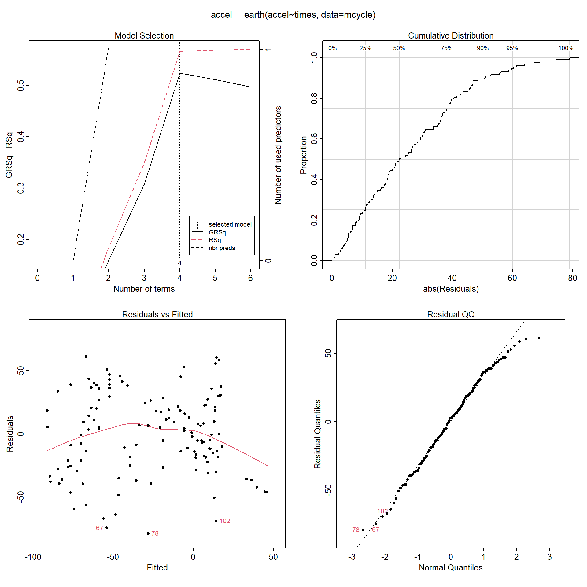
<p class="caption">(\#fig:earth-fit-plot)(ref:earth-fit-plot)</p>
</div>

Si representamos el ajuste obtenido (ver Figura \@ref(fig:earth-fit)), vemos que con las opciones por defecto no es especialmente bueno, aunque puede ser suficiente para un análisis preliminar: 

(ref:earth-fit) Ajuste del modelo MARS univariante (obtenido con la función `earth()` con parámetros por defecto) para predecir `accel` en función de `times`.


``` r
plot(accel ~ times, data = mcycle, col = 'darkgray')
lines(mcycle$times, predict(mars))
```

<div class="figure" style="text-align: center">
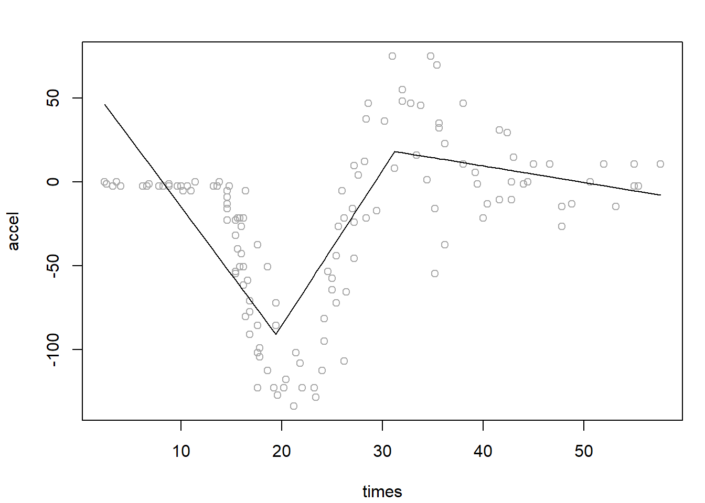
<p class="caption">(\#fig:earth-fit)(ref:earth-fit)</p>
</div>

Para mejorar el ajuste, podríamos forzar la complejidad del modelo en el crecimiento (eliminando el umbral de parada y estableciendo `minspan = 1` para que todas las observaciones sean potenciales nodos; ver Figura \@ref(fig:earth-fit2)): 

(ref:earth-fit2) Ajuste del modelo MARS univariante (con la función `earth()` con parámetros `minspan = 1` y `thresh = 0`).


``` r
mars2 <- earth(accel ~ times, data = mcycle, minspan = 1, thresh = 0)
summary(mars2)
```

```
## Call: earth(formula=accel~times, data=mcycle, minspan=1, thresh=0)
## 
##               coefficients
## (Intercept)        -6.2744
## h(times-14.6)     -25.3331
## h(times-19.2)      32.9793
## h(times-25.4)     153.6992
## h(times-25.6)    -145.7474
## h(times-32)       -30.0411
## h(times-35.2)      13.7239
## 
## Selected 7 of 12 terms, and 1 of 1 predictors
## Termination condition: Reached nk 21
## Importance: times
## Number of terms at each degree of interaction: 1 6 (additive model)
## GCV 623.52    RSS 67509    GRSq 0.73498    RSq 0.78097
```

``` r
plot(accel ~ times, data = mcycle, col = 'darkgray')
lines(mcycle$times, predict(mars2))
```

<div class="figure" style="text-align: center">
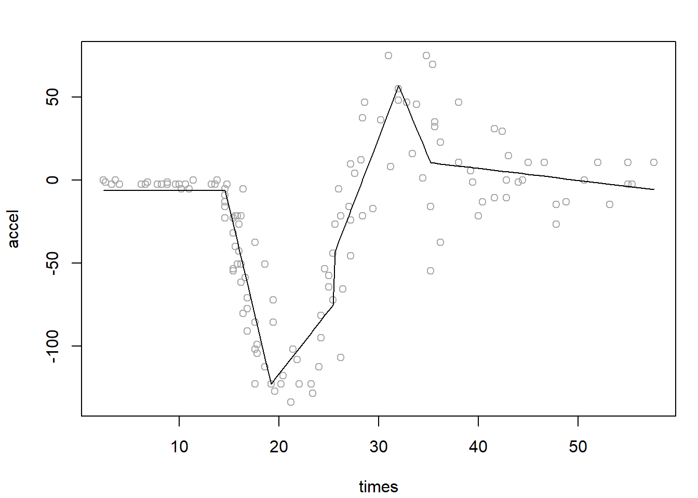
<p class="caption">(\#fig:earth-fit2)(ref:earth-fit2)</p>
</div>

Veamos a continuación un segundo ejemplo, utilizando los datos de `carData::Prestige`:

<!-- 
data(Prestige, package = "carData") 
library(earth)
-->


``` r
mars <- earth(prestige ~ education + income + women, data = Prestige,
              degree = 2, nk = 40)
summary(mars)
```

```
## Call: earth(formula=prestige~education+income+women, data=Prestige, degree=2,
##             nk=40)
## 
##                                coefficients
## (Intercept)                        19.98452
## h(education-9.93)                   5.76833
## h(income-3161)                      0.00853
## h(income-5795)                     -0.00802
## h(women-33.57)                      0.21544
## h(income-5299) * h(women-4.14)     -0.00052
## h(income-5795) * h(women-4.28)      0.00054
## 
## Selected 7 of 31 terms, and 3 of 3 predictors
## Termination condition: Reached nk 40
## Importance: education, income, women
## Number of terms at each degree of interaction: 1 4 2
## GCV 53.087    RSS 3849.4    GRSq 0.82241    RSq 0.87124
```

<!--
plot(mars)
# Resultados de validación del ajuste del modelo MARS multivariante (para `carData::Prestige`)
-->


Para representar los efectos de las variables, `earth` utiliza las herramientas del paquete [`plotmo`](https://CRAN.R-project.org/package=plotmo) (del mismo autor; válido también para la mayoría de los modelos tratados en este libro, incluyendo `mgcv::gam()`; ver Figura \@ref(fig:earth-eff)):

(ref:earth-eff) Efectos parciales de las componentes del modelo MARS ajustado.


``` r
plotmo(mars)
```

```
##  plotmo grid:    education income women
##                      10.54   5930  13.6
```

<div class="figure" style="text-align: center">

<p class="caption">(\#fig:earth-eff)(ref:earth-eff)</p>
</div>

También podemos obtener la importancia de las variables mediante la función [`evimp()`](https://rdrr.io/pkg/earth/man/evimp.html) y representarla gráficamente utilizando el método [`plot.evimp()`](https://rdrr.io/pkg/earth/man/plot.evimp.html); ver Figura \@ref(fig:evimp-plot):


``` r
varimp <- evimp(mars)
varimp
```

```
##           nsubsets   gcv    rss
## education        6 100.0  100.0
## income           5  36.0   40.3
## women            3  16.3   22.0
```

``` r
plot(varimp)
```

<div class="figure" style="text-align: center">

<p class="caption">(\#fig:evimp-plot)Importancia de los predictores incluidos en el modelo MARS.</p>
</div>

Para finalizar, queremos destacar que se puede tener en cuenta este modelo como punto de partida para ajustar un modelo GAM más flexible (como se mostró en la Sección \@ref(reg-gam)).
En este caso, el ajuste GAM equivalente al modelo MARS anterior sería el siguiente:


``` r
fit.gam <- gam(prestige ~ s(education) + s(income, women), data = Prestige)
summary(fit.gam)
```

```
## 
## Family: gaussian 
## Link function: identity 
## 
## Formula:
## prestige ~ s(education) + s(income, women)
## 
## Parametric coefficients:
##             Estimate Std. Error t value Pr(>|t|)    
## (Intercept)   46.833      0.679      69   <2e-16 ***
## ---
## Signif. codes:  0 '***' 0.001 '**' 0.01 '*' 0.05 '.' 0.1 ' ' 1
## 
## Approximate significance of smooth terms:
##                  edf Ref.df    F p-value    
## s(education)    2.80   3.49 25.1  <2e-16 ***
## s(income,women) 4.89   6.29 10.0  <2e-16 ***
## ---
## Signif. codes:  0 '***' 0.001 '**' 0.01 '*' 0.05 '.' 0.1 ' ' 1
## 
## R-sq.(adj) =  0.841   Deviance explained = 85.3%
## GCV = 51.416  Scale est. = 47.032    n = 102
```

Las estimaciones de los efectos pueden variar considerablemente entre ambos modelos, ya que el modelo GAM es mucho más flexible, como se muestra en la Figura \@ref(fig:earth-mgcv-plotmo). 
En esta gráfica se representan los efectos principales de los predictores y el efecto de la interacción entre `income` y `women`, que difieren considerablemente de los correspondiente al modelo MARS mostrados en la Figura \@ref(fig:earth-eff).

(ref:earth-mgcv-plotmo) Efectos parciales de las componentes del modelo GAM con interacción.


``` r
plotmo(fit.gam)
```

```
##  plotmo grid:    education income women
##                      10.54   5930  13.6
```

<div class="figure" style="text-align: center">
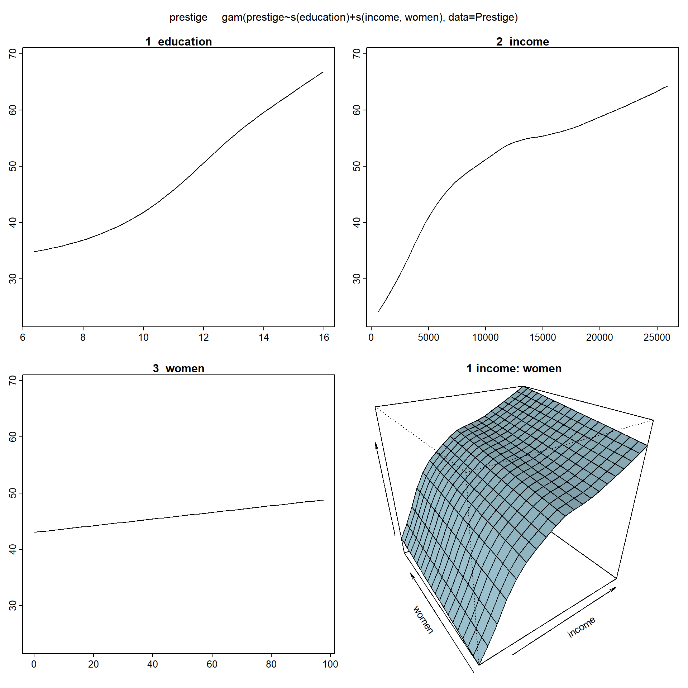
<p class="caption">(\#fig:earth-mgcv-plotmo)(ref:earth-mgcv-plotmo)</p>
</div>

En este caso concreto, la representación del efecto de la interacción puede dar lugar a confusión.
Realmente, no hay observaciones con ingresos altos y un porcentaje elevado de mujeres, y se está realizando una extrapolación en esta zona.
Esto se puede ver claramente en la Figura \@ref(fig:earth-mgcv-plot), donde se representa el efecto parcial de la interacción empleando las herramientas del paquete `mgcv`:

(ref:earth-mgcv-plot) Efecto parcial de la interacción `income:women`.


``` r
plot(fit.gam, scheme = 2, select = 2)
```

<div class="figure" style="text-align: center">
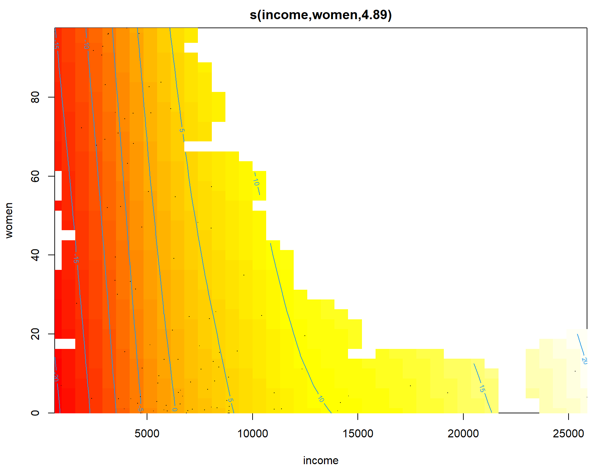
<p class="caption">(\#fig:earth-mgcv-plot)(ref:earth-mgcv-plot)</p>
</div>

Lo anterior nos podría hacer sospechar que el efecto de la interacción no es significativo.
Además, si ajustamos el modelo sin interacción obtenemos un coeficiente de determinación ajustado mejor:


``` r
fit.gam2 <- gam(prestige ~ s(education) + s(income) + s(women), 
                data = Prestige)
summary(fit.gam2)
```

```
## 
## Family: gaussian 
## Link function: identity 
## 
## Formula:
## prestige ~ s(education) + s(income) + s(women)
## 
## Parametric coefficients:
##             Estimate Std. Error t value Pr(>|t|)    
## (Intercept)   46.833      0.656    71.3   <2e-16 ***
## ---
## Signif. codes:  0 '***' 0.001 '**' 0.01 '*' 0.05 '.' 0.1 ' ' 1
## 
## Approximate significance of smooth terms:
##               edf Ref.df     F p-value    
## s(education) 2.81   3.50 26.39  <2e-16 ***
## s(income)    3.53   4.40 11.72  <2e-16 ***
## s(women)     2.21   2.74  3.71   0.022 *  
## ---
## Signif. codes:  0 '***' 0.001 '**' 0.01 '*' 0.05 '.' 0.1 ' ' 1
## 
## R-sq.(adj) =  0.852   Deviance explained = 86.4%
## GCV = 48.484  Scale est. = 43.941    n = 102
```

El procedimiento clásico sería realizar un contraste de hipótesis, como se mostró en la Sección \@ref(anova-gam):

``` r
anova(fit.gam2, fit.gam, test = "F")
```

```
## Analysis of Deviance Table
## 
## Model 1: prestige ~ s(education) + s(income) + s(women)
## Model 2: prestige ~ s(education) + s(income, women)
##   Resid. Df Resid. Dev     Df Deviance    F Pr(>F)   
## 1      90.4       4062                               
## 2      91.2       4388 -0.865     -326 8.59 0.0061 **
## ---
## Signif. codes:  0 '***' 0.001 '**' 0.01 '*' 0.05 '.' 0.1 ' ' 1
```
Este resultado nos haría pensar que el efecto de la interacción es significativo. 
Sin embargo, si nos fijamos en los resultados intermedios de la tabla, la diferencia entre los grados de libertad residuales de ambos modelo es negativa. 
Algo que en principio no debería ocurrir, ya que el modelo completo (con interacción) debería tener menos grados de libertad residuales que el modelo reducido (sin interacción).
Esto es debido a que en el ajuste de un modelo GAM, por defecto, los grados de libertad de las componentes se seleccionan automáticamente y, en este caso concreto, la complejidad del modelo ajustado sin interacción resultó ser mayor (como se puede observar al comparar la columna `edf` del sumario de ambos modelos).
Resumiendo, el modelo sin interacción no sería una versión reducida del modelo con interacción y no deberíamos emplear el contraste anterior.
En cualquier caso, la recomendación en aprendizaje estadístico es emplear métodos de remuestreo, en lugar de contrastes de hipótesis, para seleccionar el modelo. 

::: {.exercise #earth-mgcv-res} 

Siguiendo con el ejemplo anterior de los datos `Prestige`, compara los errores de validación cruzada dejando uno fuera (LOOCV) de ambos modelos, con y sin interacción entre `income` y `women`, para decidir cuál sería preferible.

:::


### MARS con el paquete `caret`

En esta sección, emplearemos como ejemplo el conjunto de datos `earth::Ozone1` y seguiremos el procedimiento habitual en aprendizaje estadístico:


``` r
# data(ozone1, package = "earth")
df <- ozone1  
set.seed(1)
nobs <- nrow(df)
itrain <- sample(nobs, 0.8 * nobs)
train <- df[itrain, ]
test <- df[-itrain, ]
```

De los varios métodos basados en `earth` que implementa `caret`, emplearemos el algoritmo original:


``` r
library(caret)
# names(getModelInfo("[Ee]arth")) # 4 métodos
modelLookup("earth")
```

```
##   model parameter          label forReg forClass probModel
## 1 earth    nprune         #Terms   TRUE     TRUE      TRUE
## 2 earth    degree Product Degree   TRUE     TRUE      TRUE
```

Para la selección de los hiperparámetros óptimos, consideramos una rejilla de búsqueda personalizada (ver Figura \@ref(fig:earth-caret)):

(ref:earth-caret) Errores RMSE de validación cruzada de los modelos MARS en función del numero de términos `nprune` y del orden máximo de interacción `degree`, resaltando la combinación óptima.


``` r
tuneGrid <- expand.grid(degree = 1:2, nprune = floor(seq(2, 20, len = 10)))
set.seed(1)
caret.mars <- train(O3 ~ ., data = train, method = "earth",
    trControl = trainControl(method = "cv", number = 10), tuneGrid = tuneGrid)
caret.mars
```

```
## Multivariate Adaptive Regression Spline 
## 
## 264 samples
##   9 predictor
## 
## No pre-processing
## Resampling: Cross-Validated (10 fold) 
## Summary of sample sizes: 238, 238, 238, 236, 237, 239, ... 
## Resampling results across tuning parameters:
## 
##   degree  nprune  RMSE    Rsquared  MAE   
##   1        2      4.8429  0.63667   3.8039
##   1        4      4.5590  0.68345   3.4880
##   1        6      4.3458  0.71420   3.4132
##   1        8      4.2566  0.72951   3.2203
##   1       10      4.1586  0.74368   3.1819
##   1       12      4.1284  0.75096   3.1422
##   1       14      4.0697  0.76006   3.0615
##   1       16      4.0588  0.76092   3.0588
##   1       18      4.0588  0.76092   3.0588
##   1       20      4.0588  0.76092   3.0588
##   2        2      4.8429  0.63667   3.8039
##   2        4      4.6528  0.67260   3.5400
##  [ reached getOption("max.print") -- omitted 8 rows ]
## 
## RMSE was used to select the optimal model using the smallest value.
## The final values used for the model were nprune = 10 and degree = 2.
```

``` r
ggplot(caret.mars, highlight = TRUE)
```

<div class="figure" style="text-align: center">

<p class="caption">(\#fig:earth-caret)(ref:earth-caret)</p>
</div>

<!-- 
nk = 40 
-->

El modelo final contiene 10 términos con interacciones. 
Podemos analizarlo con las herramientas de `earth`:


``` r
summary(caret.mars$finalModel)
```

```
## Call: earth(x=matrix[264,9], y=c(4,13,16,3,6,2...), keepxy=TRUE, degree=2,
##             nprune=10)
## 
##                             coefficients
## (Intercept)                     11.64820
## h(dpg-15)                       -0.07439
## h(ibt-110)                       0.12248
## h(17-vis)                       -0.33633
## h(vis-17)                       -0.01104
## h(101-doy)                      -0.10416
## h(doy-101)                      -0.02368
## h(wind-3) * h(1046-ibh)         -0.00234
## h(humidity-52) * h(15-dpg)      -0.00479
## h(60-humidity) * h(ibt-110)     -0.00276
## 
## Selected 10 of 21 terms, and 7 of 9 predictors (nprune=10)
## Termination condition: Reached nk 21
## Importance: humidity, ibt, dpg, doy, wind, ibh, vis, temp-unused, ...
## Number of terms at each degree of interaction: 1 6 3
## GCV 13.842    RSS 3032.6    GRSq 0.78463    RSq 0.8199
```

Representamos los efectos parciales de las componentes, separando los efectos principales (Figura \@ref(fig:earth-caret-plotmo1)) de las interacciones (Figura \@ref(fig:earth-caret-plotmo2)): 

(ref:earth-caret-plotmo1) Efectos parciales principales del modelo MARS ajustado con `caret`.


``` r
# plotmo(caret.mars$finalModel)
plotmo(caret.mars$finalModel, degree2 = 0, caption = "")
```

```
##  plotmo grid:    vh wind humidity temp    ibh dpg   ibt vis   doy
##                5770    5     64.5   62 2046.5  24 169.5 100 213.5
```

<div class="figure" style="text-align: center">
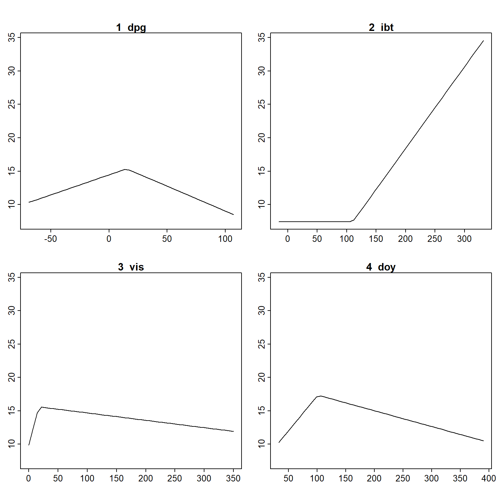
<p class="caption">(\#fig:earth-caret-plotmo1)(ref:earth-caret-plotmo1)</p>
</div>

(ref:earth-caret-plotmo2) Efectos parciales principales de las interacciones del modelo MARS ajustado con `caret`.


``` r
plotmo(caret.mars$finalModel, degree1 = 0, caption = "")
```

<div class="figure" style="text-align: center">
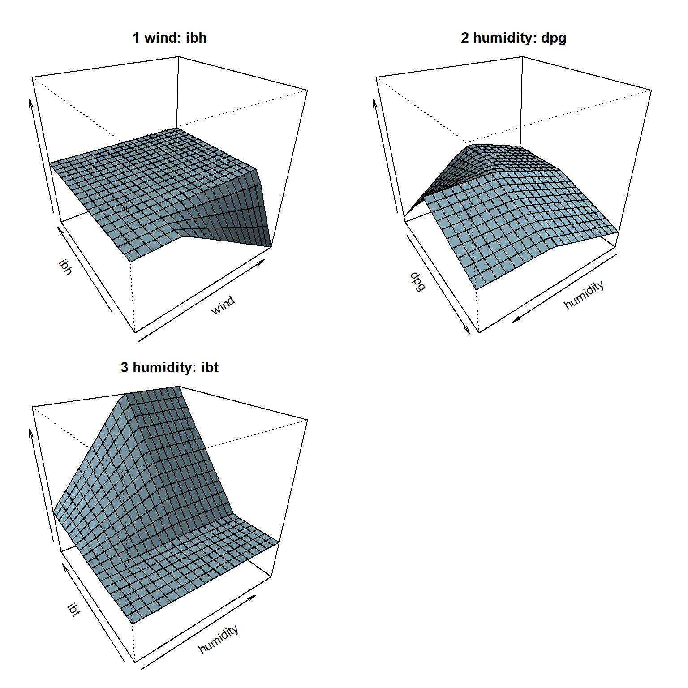
<p class="caption">(\#fig:earth-caret-plotmo2)(ref:earth-caret-plotmo2)</p>
</div>

Finalmente, evaluamos la precisión de las predicciones en la muestra de test con el procedimiento habitual:


``` r
pred <- predict(caret.mars, newdata = test)
accuracy(pred, test$O3)
```

```
##        me      rmse       mae       mpe      mape r.squared 
##   0.48179   4.09524   3.07644 -14.12889  41.26020   0.74081
```


::: {.exercise #bodyfat-mars}

Continuando con el conjunto de datos [`mpae::bodyfat`](https://rubenfcasal.github.io/mpae/reference/bodyfat.html) empleado en capítulos anteriores, particiona los datos y ajusta un modelo para predecir el porcentaje de grasa corporal (`bodyfat`), mediante regresión spline adaptativa multivariante (MARS) con el método `"earth"` del paquete `caret`:

a) Utiliza validación cruzada con 10 grupos para seleccionar los valores 
   "óptimos" de los hiperparámetros considerando `degree = 1:2` y 
   `nprune = 1:6`, y fija `nk = 60`.
   
b) Estudia el efecto de los predictores incluidos en el modelo final y 
   obtén medidas de su importancia.
   
c) Evalúa las predicciones en la muestra de test (genera el correspondiente 
   gráfico y obtén medidas de error).
    
:::


::: {.exercise #bodyfat-mgcv}

Vuelve a ajustar el modelo aditivo no paramétrico del ejercicio anterior, con la misma partición, pero empleando la función `gam()` del paquete `mcgv`:

a) Incluye los efectos no lineales de los predictores seleccionados por 
   el método MARS obtenido en el ejercicio anterior.
   
b) Representa los efectos de los predictores (incluyendo los residuos añadiendo 
   los argumentos `residuals = TRUE` y `pch = 1`) y estudia si sería razonable 
   asumir que el de alguno de ellos es lineal o simplificar el modelo de alguna forma.
   
c) Ajusta también el modelo `bodyfat ~ s(abdomen) + s(weight)`.  

d) Evalúa las predicciones en la muestra de test y compara los resultados 
   con los obtenidos en el ejercicio anterior.

:::


::: {.exercise #bfan-mars-mgcv}

Repite los ejercicios \@ref(exr:bodyfat-mars) y \@ref(exr:bodyfat-mgcv) anteriores, pero ahora utilizando el conjunto de datos [`mpae::bfan`](https://rubenfcasal.github.io/mpae/reference/bfan.html) y considerando como respuesta el nivel de grasa corporal (`bfan`). 
Recuerda que en el ajuste aditivo logístico `mgcv::gam()` habrá que incluir `family = binomial`, y `type = "response"` en el correspondiente método `predict()` para obtener estimaciones de las probabilidades.

:::


## Projection pursuit {#pursuit}

*Projection pursuit* [@friedman1974projection] es una técnica de análisis exploratorio de datos multivariantes que busca proyecciones lineales de los datos en espacios de dimensión baja, siguiendo una idea originalmente propuesta en @kruskal1969toward.
Inicialmente se presentó como una técnica gráfica y por ese motivo buscaba proyecciones de dimensión 1 o 2 (proyecciones en rectas o planos), resultando que las direcciones interesantes son aquellas con distribución no normal. 
La motivación es que cuando se realizan transformaciones lineales lo habitual es que el resultado tenga la apariencia de una distribución normal (por el teorema central del límite), lo cual oculta las singularidades de los datos originales. 
Se supone que los datos son una trasformación lineal de componentes no gaussianas (variables latentes) y la idea es deshacer esta transformación mediante la optimización de una función objetivo, que en este contexto recibe el nombre de *projection index*.
Aunque con orígenes distintos, *projection pursuit* es muy similar a *independent component analysis* [@comon1994independent], una técnica de reducción de la dimensión que, en lugar de buscar como es habitual componentes incorreladas (ortogonales), busca componentes independientes y con distribución no normal [ver por ejemplo la documentación del paquete [`fastICA`](https://CRAN.R-project.org/package=fastICA), @R-fastICA].

Hay extensiones de *projection pursuit* para regresión, clasificación, estimación de la función de densidad, etc.


### Regresión por projection pursuit {#ppr}

En el método original de *projection pursuit regression* [PPR, @friedman1981projection] se considera el siguiente modelo semiparamétrico
$$m(\mathbf{x}) = \sum_{m=1}^M g_m (\alpha_{1m}x_1 + \alpha_{2m}x_2 + \ldots + \alpha_{pm}x_p)$$
siendo $\boldsymbol{\alpha}_m = (\alpha_{1m}, \alpha_{2m}, \ldots, \alpha_{pm})$ vectores de parámetros (desconocidos) de módulo unitario y $g_m$ funciones suaves (desconocidas), denominadas funciones *ridge*.

Con esta aproximación se obtiene un modelo muy general que evita los problemas de la maldición de la dimensionalidad.
De hecho, se trata de un *aproximador universal*: con $M$ suficientemente grande y eligiendo adecuadamente las componentes se podría aproximar cualquier función continua.
Sin embargo, el modelo resultante puede ser muy difícil de interpretar, salvo en el caso de $M=1$, que se corresponde con el denominado *single index model* empleado habitualmente en econometría, pero que solo es algo más general que el modelo de regresión lineal múltiple.

El ajuste se este tipo de modelos es en principio un problema muy complejo. 
Hay que estimar las funciones univariantes $g_m$ (utilizando un método de suavizado) y los parámetros $\alpha_{im}$, utilizando como criterio de error $\mbox{RSS}$. 
En la práctica, se resuelve utilizando un proceso iterativo en el que se van fijando sucesivamente los valores de los parámetros y las funciones *ridge* (si son estimadas empleando un método que también proporcione estimaciones de su derivada, las actualizaciones de los parámetros se pueden obtener por mínimos cuadrados ponderados).

También se han desarrollado extensiones del método original para el caso de respuesta multivariante:
$$m_i(\mathbf{x}) = \beta_{i0} + \sum_{m=1}^M \beta_{im} g_m (\alpha_{1m}x_1 + \alpha_{2m}x_2 + \ldots + \alpha_{pm}x_p)$$
reescalando las funciones *rigde* de forma que tengan media cero y varianza unidad sobre las proyecciones de las observaciones.

Este procedimiento de regresión está muy relacionado con las redes de neuronas artificiales que han sido objeto de mayor estudio y desarrollo en los últimos años. 
Estos métodos se tratarán en el Capítulo \@ref(neural-nets).


### Implementación en R

El método PPR (con respuesta multivariante) está implementado en la función `ppr()` del paquete base[^nota-pursuit-1] de R, y es también la empleada por el método `"ppr"` de `caret`:

[^nota-pursuit-1]: Basada en la función `ppreg()` de S-PLUS e implementado en R por B.D. Ripley, inicialmente para el paquete `MASS`.


``` r
ppr(formula, data, nterms, max.terms = nterms, optlevel = 2,
    sm.method = c("supsmu", "spline", "gcvspline"),
    bass = 0, span = 0, df = 5, gcvpen = 1, ...)
```

Esta función va añadiendo términos *ridge* hasta un máximo de `max.terms` y posteriormente emplea un método hacia atrás para seleccionar `nterms` (el argumento `optlevel` controla cómo se vuelven a reajustar los términos en cada iteración).
Por defecto, emplea el *super suavizador* de Friedman (función `supsmu()`, con parámetros `bass` y `span`), aunque también admite splines (función `smooth.spline()`, fijando los grados de libertad con `df` o seleccionándolos mediante GCV).
Para más detalles, ver `help(ppr)`.

A continuación, retomamos el ejemplo del conjunto de datos `earth::Ozone1`.
En primer lugar ajustamos un modelo PPR con dos términos [incrementando el suavizado por defecto de `supsmu()` siguiendo la recomendación de @MASS]:


``` r
ppreg <- ppr(O3 ~ ., nterms = 2, data = train, bass = 2)
```

Si realizamos un resumen del resultado, se muestran las estimaciones de los coeficientes $\alpha_{jm}$ de las proyecciones lineales y de los coeficientes $\beta_{im}$ de las componentes rigde, que podrían interpretarse como una medida de su importancia.
En este caso, la primera componente no paramétrica es la que tiene mayor peso en la predicción.

<!-- 
las estimaciones de los coeficientes permiten interpretarlas como variables latentes 
-->

``` r
summary(ppreg)
```

```
## Call:
## ppr(formula = O3 ~ ., data = train, nterms = 2, bass = 2)
## 
## Goodness of fit:
## 2 terms 
##  4033.7 
## 
## Projection direction vectors ('alpha'):
##          term 1     term 2    
## vh       -0.0166178  0.0474171
## wind     -0.3178679 -0.5442661
## humidity  0.2384546 -0.7864837
## temp      0.8920518 -0.0125634
## ibh      -0.0017072 -0.0017942
## dpg       0.0334769  0.2859562
## ibt       0.2055363  0.0269849
## vis      -0.0262552 -0.0141736
## doy      -0.0448190 -0.0104052
## 
## Coefficients of ridge terms ('beta'):
## term 1 term 2 
## 6.7904 1.5312
```

Podemos representar las funciones rigde con método `plot()` (ver Figura \@ref(fig:ppr-plot)):

``` r
plot(ppreg)
```

(ref:ppr-plot) Estimaciones de las funciones *ridge* del ajuste PPR.  

<div class="figure" style="text-align: center">

<p class="caption">(\#fig:ppr-plot)(ref:ppr-plot)</p>
</div>

En este caso, se estimaría que la primera componente lineal tiene aproximadamente un efecto cuadrático positivo, con un incremento en la pendiente a partir de un valor en torno a $-30$, y la segunda un efecto cuadrático con un cambio de pendiente de positivo a negativo en torno a 225.

Por último evaluamos las predicciones en la muestra de test:


``` r
pred <- predict(ppreg, newdata = test)
obs <- test$O3
accuracy(pred, obs)
```

```
##        me      rmse       mae       mpe      mape r.squared 
##   0.48198   3.23301   2.59415  -6.12031  34.87285   0.83846
```

<!-- 
pred.plot(pred, obs, main = "Observado frente a predicciones",
     xlab = "Predicción", ylab = "Observado")
-->

Empleamos también el método `"ppr"` de `caret` para seleccionar automáticamente el número de términos:


``` r
library(caret)
modelLookup("ppr")
```

```
##   model parameter   label forReg forClass probModel
## 1   ppr    nterms # Terms   TRUE    FALSE     FALSE
```

``` r
set.seed(1)
caret.ppr <- train(O3 ~ ., data = train, method = "ppr", 
                   trControl = trainControl(method = "cv", number = 10))
caret.ppr
```

```
## Projection Pursuit Regression 
## 
## 264 samples
##   9 predictor
## 
## No pre-processing
## Resampling: Cross-Validated (10 fold) 
## Summary of sample sizes: 238, 238, 238, 236, 237, 239, ... 
## Resampling results across tuning parameters:
## 
##   nterms  RMSE    Rsquared  MAE   
##   1       4.3660  0.70690   3.3067
##   2       4.4793  0.69147   3.4549
##   3       4.6249  0.66441   3.5689
## 
## RMSE was used to select the optimal model using the smallest value.
## The final value used for the model was nterms = 1.
```

<!-- 
ppr-caret, out.width="70%", fig.cap='(ref:ppr-caret)'

(ver Figura \@ref(fig:ppr-caret))

(ref:ppr-caret) Errores RMSE de validación cruzada de los modelos PPR en función del numero de términos `nterms`, resaltando el valor óptimo.

bass = 2,
ggplot(caret.ppr, highlight = TRUE)
# varImp(caret.ppr) # emplea una medida genérica de importancia
-->

En este caso, se selecciona un único término *ridge*.
Podríamos analizar el modelo final ajustado de forma análoga (ver Figura \@ref(fig:ppr-caret-plot)):

(ref:ppr-caret-plot) Estimación de la función *ridge* del ajuste PPR (con selección óptima del número de componentes).  


``` r
summary(caret.ppr$finalModel)
```

```
## Call:
## ppr(x = as.matrix(x), y = y, nterms = param$nterms)
## 
## Goodness of fit:
## 1 terms 
##  4436.7 
## 
## Projection direction vectors ('alpha'):
##         vh       wind   humidity       temp        ibh        dpg        ibt 
## -0.0160915 -0.1678913  0.3517739  0.9073015 -0.0018289  0.0269015  0.1480212 
##        vis        doy 
## -0.0264704 -0.0357039 
## 
## Coefficients of ridge terms ('beta'):
## term 1 
##  6.854
```

``` r
plot(caret.ppr$finalModel) 
```

<div class="figure" style="text-align: center">

<p class="caption">(\#fig:ppr-caret-plot)(ref:ppr-caret-plot)</p>
</div>

Si estudiamos las predicciones en la muestra de test, la proporción de variabilidad explicada es similar a la obtenida anteriormente con dos componentes *ridge*:


``` r
pred <- predict(caret.ppr, newdata = test)
accuracy(pred, obs)
```

```
##        me      rmse       mae       mpe      mape r.squared 
##   0.31359   3.36529   2.70616 -10.75327  33.83336   0.82497
```


Para ajustar un modelo *single index* también se podría emplear la función [`npindex()`](https://rdrr.io/pkg/np/man/np.singleindex.html) del paquete  [`np`](https://github.com/JeffreyRacine/R-Package-np) [que implementa el método de @ichimura1993, considerando un estimador local constante], aunque en este caso ni el tiempo de computación ni el resultado es satisfactorio[^np-npindexbw-1]:


``` r
library(np)
formula <- O3 ~ vh + wind + humidity + temp + ibh + dpg + ibt + vis + doy
bw <- npindexbw(formula, data = train, optim.method = "BFGS", nmulti = 1) 
```

<!-- 
# Por defecto nmulti = 5 
summary(bw) 
-->

[^np-npindexbw-1]: No admite una fórmula del tipo `respuesta ~ .`, al intentar ejecutar `npindexbw(O3 ~ ., data = train)` se produciría un error. Para solventarlo tendríamos que escribir la expresión explícita de la fórmula, por ejemplo con la ayuda de `reformulate(setdiff(colnames(train), "O3"), response = "O3")`. Aparte de esto, el valor por defecto de `nmulti = 5`, número de reinicios con punto de partida aleatorio del algoritmo de optimización, puede producir que el tiempo de computación sea excesivo. 
Otro inconveniente es que los resultados de texto contienen caracteres inválidos para compilar en LaTeX y pueden aparecer errores al generar informes.


``` r
sindex <- npindex(bws = bw, gradients = TRUE)
summary(sindex)
```

```
## 
## Single Index Model
## Regression Data: 264 training points, in 9 variable(s)
## 
##       vh  wind humidity  temp     ibh    dpg    ibt      vis     doy
## Beta:  1 10.85   6.2642 8.856 0.09266 4.0038 5.6625 -0.66145 -1.1185
## Bandwidth: 13.797
## Kernel Regression Estimator: Local-Constant
## 
## Residual standard error: 3.2614
## R-squared: 0.83391
## 
## Continuous Kernel Type: Second-Order Gaussian
## No. Continuous Explanatory Vars.: 1
```

Al representar la función *ridge* se observa que, aparentemente, la ventana seleccionada produce un infrasuavizado (sobreajuste; ver Figura \@ref(fig:npindex-plot)):

(ref:npindex-plot) Estimación de la función *ridge* del modelo *single index* ajustado.


``` r
plot(bw)
```

<div class="figure" style="text-align: center">
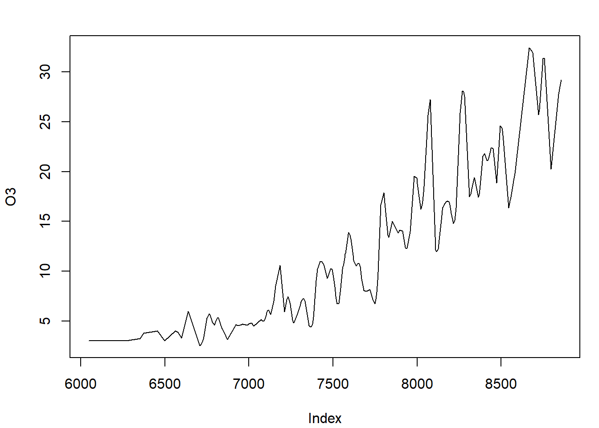
<p class="caption">(\#fig:npindex-plot)(ref:npindex-plot)</p>
</div>

Si analizamos la eficiencia de las predicciones en la muestra de test, la proporción de variabilidad explicada es mucho menor que la del modelo ajustado con la función `ppr()`: 


``` r
pred <- predict(sindex, newdata = test)
accuracy(pred, obs)
```

```
##        me      rmse       mae       mpe      mape r.squared 
##   0.35026   4.77239   3.63679  -8.82255  38.24191   0.64801
```

::: {.exercise #bodyfat-ppr}

Continuando con los ejercicios \@ref(exr:bodyfat-mars) y \@ref(exr:bodyfat-mgcv) anteriores, con los datos de grasa corporal [`mpae::bodyfat`](https://rubenfcasal.github.io/mpae/reference/bodyfat.html), ajusta un modelo de regresión por *projection pursuit* empleando el método `"ppr"` de `caret`, seleccionando el número de términos *ridge* `nterms = 1:2` y fijando el suavizado máximo `bass = 10`.
Obtén los coeficientes del modelo, representa las funciones *ridge* y evalúa las predicciones en la muestra de test (gráfico y medidas de error). 
Comparar los resultados con los obtenidos en los ejercicios anteriores.

:::


