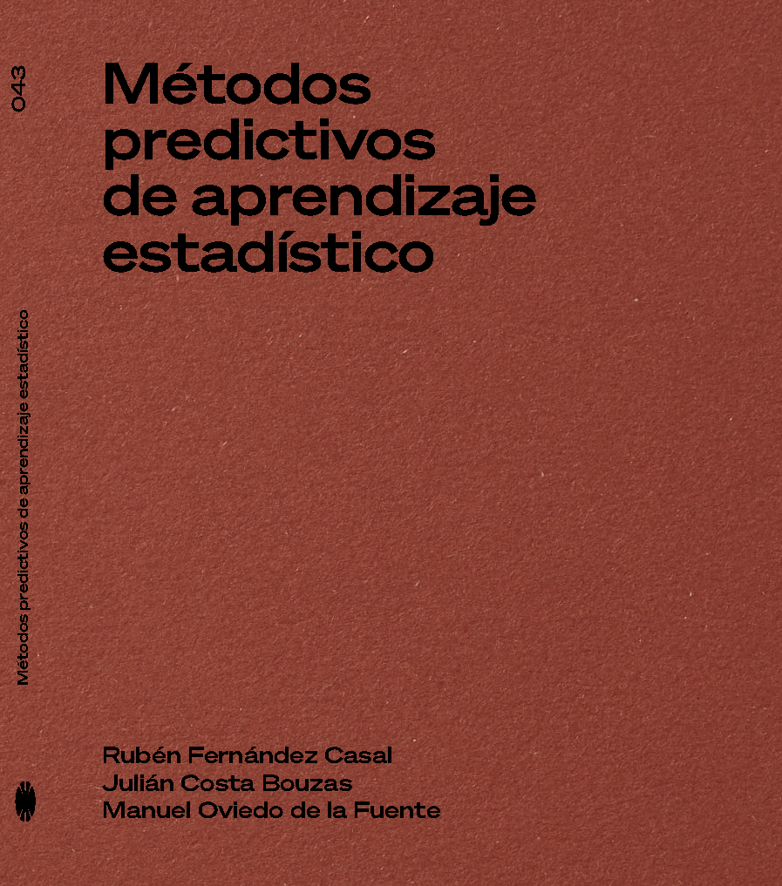

--- 
title: "Métodos predictivos de aprendizaje estadístico"
author: 
  - "Rubén Fernández Casal (ruben.fcasal@udc.es)"
  - "Julián Costa Bouzas (julian.costa@udc.es)"
  - "Manuel Oviedo de la Fuente (manuel.oviedo@udc.es)"
date: "Edición: Septiembre de 2024. Impresión: `r Sys.Date()`"
site: bookdown::bookdown_site
output: bookdown::gitbook
documentclass: book
lang: es
bibliography: "aprendizaje.bib"
biblio-style: apalike-es
link-citations: yes
fontsize: 10pt
nocite: |
  @spinoza1667ethics, @lauro1996computational
github-repo: rubenfcasal/book_mpae
description: "Métodos predictivos de aprendizaje estadístico con R."
---

# Bienvenida {-}


```{r, echo=FALSE, fig.align = "right", out.width="40%", out.extra='style="display: table; float: right;   padding-left: 30px; padding-bottom: 10px;"'}
 
``` 
Bienvenido a la versión *online* del libro "Métodos predictivos de aprendizaje estadístico" editado por el [Servicio de Publicaciones de la UDC](https://www.udc.es/en/publicacions/).

Puede adquirir una copia impresa a través de su librería habitual^[La comunidad universitaria de la UDC puede comprarlo con un descuento adicional a través del Servicio de Reprografía de la UDC].
Este libro también está disponible en acceso abierto, de forma gratuita, en formato [pdf](https://rubenfcasal.github.io/aprendizaje_estadistico/book_mpae.pdf). 

***NOTA: El libro aún está en la última etapa del proceso de publicación. Confiamos en que estará disponible próximamente.***

Para citar el libro o esta web en publicaciones puede emplear:

* Fernández-Casal R., Costa J. y Oviedo M. (2024). *Métodos predictivos de aprendizaje estadístico*. Servizo de Publicacións. Universidade da Coruña. ISBN 978-84-9749-888-3.

o en formato BibTeX:

```
@Book{,
  title = {Métodos predictivos de aprendizaje estadístico},
  author = {R. Fernández-Casal and J. Costa and M. Oviedo},
  publisher = {Servizo de Publicacións. Universidade da Coruña},
  year = {2024},
  note = {ISBN: 978-84-9749-888-3},
  doi = {10.17979/spudc.9788497498883},
  url = {https://rubenfcasal.github.io/aprendizaje_estadistico/},
}
```  

Esta página web está bajo una licencia de [Creative Commons: Reconocimiento - No Comercial - Sin Obra Derivada - 4.0 Internacional](https://creativecommons.org/licenses/by-nc-nd/4.0/deed.es_ES).

```{r, echo=FALSE, fig.align = "left", out.width="10%"}
knitr::include_graphics("images/by-nc-nd-88x31.png") 
# 
``` 

Este libro ha sido escrito en [R-Markdown](http://rmarkdown.rstudio.com) empleando el paquete [`bookdown`](https://bookdown.org/yihui/bookdown/) y está disponible en el repositorio Github: [rubenfcasal/book_mpae](https://github.com/rubenfcasal/book_mpae). 


# Prólogo {-}

\markboth{Prólogo}{}

```{r global-options, out.pad = FALSE, include=FALSE}
source("_global_options.R")

citepkg <- function(x, url = paste0("https://CRAN.R-project.org/package=", x))
   paste0("[`", x, "`](", url, ")")
citepkgs <- function(pkgs) paste(sapply(pkgs, citepkg), collapse = ", ")
```


En los últimos años, la ciencia de datos está experimentando una creciente importancia y popularidad, tanto en el ámbito académico como empresarial. 
Se trata de una disciplina que integra herramientas estadísticas e informáticas para la toma de decisiones, a partir del análisis de datos. 
Especialmente importante es el modelado predictivo de datos, que permite analizar conjuntos complejos de datos para aprender de ellos y realizar predicciones, empleando métodos de regresión y clasificación.

Este es un libro de análisis computacional de datos utilizando el lenguaje de programación y entorno estadístico `R`, escrito con el objetivo de introducir las técnicas más importantes del aprendizaje estadístico para el modelado predictivo. 
El enfoque es eminentemente práctico, presentando la teoría necesaria para describir los métodos, pero prestando especial énfasis en el código, al considerar que este puede ayudar a entender mejor el funcionamiento de los métodos, además de resultar imprescindible en la resolución de problemas reales.

El presente libro está destinado a lectores con distintos perfiles. 
Puede resultar de utilidad tanto a alumnos de los últimos cursos de grados, y de másteres, con un fuerte componente tecnológico, como a profesionales del sector de la ciencia de datos. 
Se asume que el lector posee los conocimientos que se adquieren en una primera asignatura de estadística de un grado universitario. 
En concreto, nociones de probabilidad, incluyendo el teorema de Bayes y variables aleatorias, simulación [ver p.&nbsp;ej. @abad2001introduccion; @dalpiaz2022applied; y [Sección 1.3](https://rubenfcasal.github.io/simbook/rrng.html) de @fernandez2023simbook], y los métodos clásicos de análisis de datos (estadística descriptiva e inferencia). 
Es especialmente importante que el lector esté familiarizado con la regresión simple, lineal y polinómica, y sería deseable, aunque no imprescindible, que disponga de nociones básicas de regresión múltiple.

Este libro se desarrolló inicialmente como apuntes de la asignatura de [Aprendizaje Estadístico](http://eamo.usc.es/pub/mte/index.php?option=com_content&view=article&id=2202&idm=47&a%C3%B1o=2023) del [Máster en Técnicas Estadísticas (MTE)](http://eio.usc.es/pub/mte), organizado conjuntamente por las tres universidades gallegas ([Universidade da Coruña](https://www.udc.gal), [Universidade de Santiago de Compostela](https://www.usc.gal) y [Universidade de Vigo](https://www.uvigo.gal)).


## El lenguaje de programación R {-}

En este libro se asume también que se dispone de conocimientos básicos de [`R`](https://www.r-project.org) [@rcore2023], un lenguaje de programación interpretado y un entorno estadístico desarrollado específicamente para el análisis de datos. 
Esta herramienta puede ser de gran utilidad a lo largo de todo el proceso de generación de conocimiento a partir de datos, como se explica en la introducción del Capítulo \@ref(intro-AE). 
En cualquier caso, el objetivo es que el libro resulte de utilidad aunque el lector emplee algún otro lenguaje [como Python, @van1995python] o herramienta (como [Microsoft Power BI](https://powerbi.microsoft.com)). 

Para una introducción a la programación en [`R`](https://www.r-project.org) se puede consultar el libro @fernandez2022intror. 
Adicionalmente, en el post [*https://rubenfcasal.github.io/post/ayuda-y-recursos-para-el-aprendizaje-de-r*](https://rubenfcasal.github.io/post/ayuda-y-recursos-para-el-aprendizaje-de-r) se proporcionan enlaces a recursos adicionales, incluyendo bibliografía y cursos.
En primer lugar es necesario tener instalado [`R`](https://www.r-project.org), para ello se recomienda seguir los pasos descritos en el post [*https://rubenfcasal.github.io/post/instalacion-de-r*](https://rubenfcasal.github.io/post/instalacion-de-r).
Para el desarrollo de código e informes se sugiere emplear *RStudio Desktop*, que se puede instalar y configurar siguiendo las indicaciones proporcionadas en el post [*https://rubenfcasal.github.io/post/instalacion-de-rstudio*](https://rubenfcasal.github.io/post/instalacion-de-rstudio).

Este libro tiene asociado el paquete de R `r cite_github(mpae)` [*Métodos Predictivos de Aprendizaje Estadístico*, @R-mpae], que incluye funciones y conjuntos de datos utilizados a lo largo del texto.
Este paquete está disponible en CRAN y puede instalarse ejecutando el siguiente código[^instalacion-1]:

```{r eval=FALSE}
install.packages("mpae")
```

[^instalacion-1]: Alternativamente, se puede instalar la versión en desarrollo disponible en el repositorio [rubenfcasal/mpae](https://github.com/rubenfcasal/mpae) de GitHub.
Por ejemplo, el comando `remotes::install_github("rubenfcasal/mpae", INSTALL_opts = "--with-keep.source")` instala el paquete incluyendo los comentarios en el código y opcionalmente las dependencias. 

Sin embargo, para poder ejecutar todos los ejemplos mostrados en el libro, es necesario instalar también los siguientes paquetes:
`r citepkgs(c("caret", "gbm", "car", "leaps", "MASS", "RcmdrMisc", "lmtest", "glmnet", "mgcv", "np", "NeuralNetTools", "pdp", "vivid", "plot3D", "AppliedPredictiveModeling", "ISLR"))`.
Para ello, en lugar del código anterior, bastaría con ejecutar:

```{r eval=FALSE}
install.packages("mpae", dependencies = TRUE)
```


## Organización {-}

En el Capítulo \@ref(intro-AE) se pretende dar una visión general, cubriendo todas las etapas del proceso e introduciendo los conceptos básicos y la notación. 
El Capítulo \@ref(clasicos) es una revisión de los métodos clásicos de regresión y clasificación, desde el punto de vista del aprendizaje estadístico. 
Los lectores que ya dispongan de conocimientos previos pueden centrarse en las diferencias con la aproximación tradicional.
Si se tienen dudas sobre alguno de los conceptos utilizados, se puede revisar alguna de las referencias introductorias que se citan en el texto.
Este capítulo se centra principalmente en regresión lineal múltiple, aunque también se introducen, de forma más superficial, los principales métodos tradicionales de clasificación.

El resto del libro presenta dos partes diferenciadas.
Se decidió comenzar por los conceptos que pueden resultar novedosos para un estudiante de estadística, al estar más relacionados con el campo informático: métodos basados en árboles (capítulos \@ref(trees), Árboles de decisión, y \@ref(bagging-boosting), Bagging y boosting) y Máquinas de soporte vectorial (Capítulo \@ref(svm)).
En la práctica, estos métodos se usan principalmente para clasificación supervisada.

La segunda parte, capítulos \@ref(ext-glm) (Métodos de regularización y reducción de la dimensión), \@ref(reg-np) (Regresión no paramétrica) y \@ref(neural-nets) (Redes neuronales), se centra principalmente en regresión, aunque este tipo de métodos también se usan para problemas de clasificación.
Realmente, a lo largo de todo el libro se van intercalando conceptos de regresión y de clasificación.

Por supuesto, se podría cambiar el orden de los contenidos para adaptarlos a distintos perfiles de lectores[^organizacion-1].
Por ejemplo, los contenidos del Capítulo \@ref(ext-glm) se podrían tratar justo después del Capítulo \@ref(clasicos), aunque nosotros no los consideramos métodos clásicos (de momento), principalmente porque no son muy conocidos en algunos campos.

[^organizacion-1]: Un lector podría preferir saltarse el Capítulo \@ref(clasicos) y verlo inmediatamente antes del Capítulo \@ref(ext-glm), tal vez comenzando por la Sección \@ref(generadores) (Capítulo \@ref(intro-AE) - Capítulo \@ref(trees) - Capítulo \@ref(bagging-boosting) - Capítulo \@ref(svm) - Sección \@ref(generadores) - Sección \@ref(rlm) - Sección \@ref(reg-glm) - Capítulo \@ref(ext-glm) - Capítulo \@ref(reg-np) - Capítulo \@ref(neural-nets); esta es la ordenación que se siguió en las primeras versiones de este libro).
Alternativamente, podría pasar de la Sección \@ref(rlm) directamente al Capítulo \@ref(ext-glm) y dejar para el final la parte de clasificación (Capítulo \@ref(intro-AE) - Sección \@ref(rlm) - Capítulo \@ref(ext-glm) - Capítulo \@ref(reg-np) - Capítulo \@ref(neural-nets) - Sección \@ref(reg-glm) - Sección \@ref(generadores) - Capítulo \@ref(trees) - Capítulo \@ref(bagging-boosting) - Capítulo \@ref(svm)).


```{r include=FALSE}
# Create .nojekyll file in the /docs folder
file.create('docs/.nojekyll')
```


